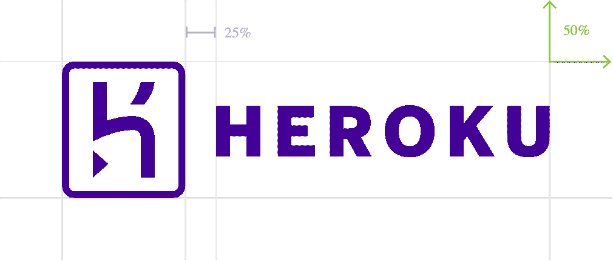

# 在 GitHub Pull 请求上创建 Heroku 应用程序

> 原文：<https://javascript.plainenglish.io/create-heroku-app-on-github-pull-request-8ace90281632?source=collection_archive---------13----------------------->

## 关于如何使用 GitHub 操作在 GitHub pull request (PR)上创建 Heroku 应用程序的指南。



[Heroku logo](https://brand.heroku.com/)

本文讲述了如何在 GitHub pull request (PR)打开时创建 Heroku 应用程序。

# 问题

由于一个[事件](https://status.heroku.com/incidents/2413)导致 Heroku 撤销了他们的 GitHub 集成，我需要一种替代方法来创建[评审应用](https://devcenter.heroku.com/articles/github-integration-review-apps)，而不必通过 CLI 手动[部署它们。](https://remarkablemark.org/blog/2022/04/18/heroku-git-deploy-branch/)

# 解决办法

我创建了一个 [GitHub Actions](https://github.com/features/actions) 工作流，它在 PR 打开时创建一个 Heroku 应用程序。

首先，创建工作流文件:

```
mkdir -p .github/workflows/
touch .github/workflows/heroku-pull-request.yml
```

工作流将在[拉动请求](https://docs.github.com/en/actions/using-workflows/events-that-trigger-workflows#pull_request)时触发:

默认情况下，`pull_request`事件由以下活动类型触发:

*   开的
*   同时发生
*   重新开始

要用类似于`closed`的类型触发工作流，您需要添加它:

创建一个作业并将 Heroku 应用程序名设置为一个[环境变量](https://docs.github.com/en/actions/learn-github-actions/environment-variables):

`github.event.number`是公关号。

对于第一个作业步骤，[在 source (PR)分支签出](https://github.com/actions/checkout)存储库:

登录到 [Heroku](https://github.com/marketplace/actions/deploy-to-heroku) 以便您可以使用 CLI 执行操作:

在您的存储库密码中设置 [Heroku API 密钥](https://remarkablemark.org/blog/2021/06/21/heroku-api-key/)。

如果 PR 打开，创建一个 Heroku 应用程序:

要在团队下创建一个 Heroku app，设置`--team`参数。

或者，您可以将应用程序添加到现有的 Heroku pipeline:

用您的管道名称替换`my-pipeline`。

或者，您可以从另一个 Heroku 应用程序复制环境变量(配置变量):

将`my-development-app`替换为您的其他 Heroku 应用名称。

将 [Heroku 遥控器](https://devcenter.heroku.com/articles/git#for-an-existing-app)添加到存储库中:

这就创建了一个名为`heroku`的 Git remote。

将本地存储库分支推送到 Heroku remote 以部署应用程序:

或者，你可以用`[main](https://devcenter.heroku.com/changelog-items/1829)`代替`master`。

或者，您可以在部署应用程序后添加公关评论:

如果你的 PR 关闭了，那就销毁 Heroku app:

# 工作流程

以下是完整的 GitHub 操作工作流程:

[*本文原载于《remarkablemark.org》2022 年 4 月 23 日。*](https://b.remarkabl.org/3xZJrMe)

*更多内容看* [***说白了。报名参加我们的***](https://plainenglish.io/) **[***免费周报***](http://newsletter.plainenglish.io/) *。关注我们关于*[***Twitter***](https://twitter.com/inPlainEngHQ)*和*[***LinkedIn***](https://www.linkedin.com/company/inplainenglish/)*。加入我们的* [***社区***](https://discord.gg/GtDtUAvyhW) *。***