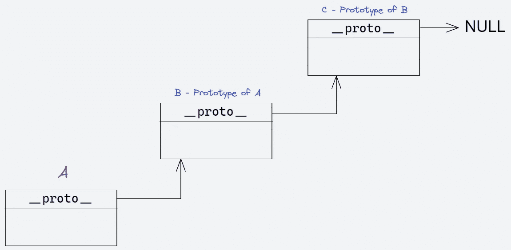
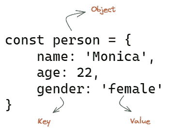
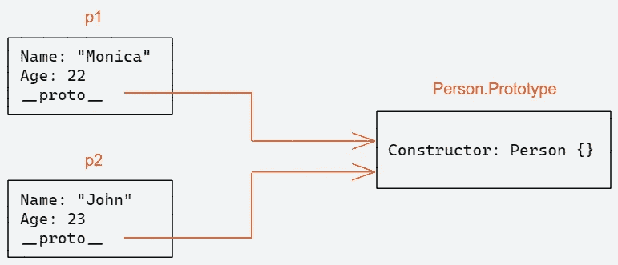

# 创建 JavaScript 对象:你应该知道的 5 种方法

> 原文：<https://javascript.plainenglish.io/create-javascript-objects-4-ways-you-should-know-77e1fbdfd7d3?source=collection_archive---------7----------------------->


JavaScript 是一种基于对象的语言。除了这六种类型——字符串、数字、布尔、bigint、符号、未定义和 null——JavaScript 中的一切都是对象。是的，甚至构造函数、函数和数组都是对象。

本文试图展示创建 JavaScript 对象的不同方法。

# 开始之前

为了理解下面讨论的一些方法，有必要理解属性和方法是如何从一个对象传递到另一个对象的。



Prototype Chain

JavaScript 是一种基于原型的语言。这意味着每当我们创建一个对象时，JavaScript 都会向该对象添加一个内部属性，称为其原型。原型本身是一个对象，所以原型会有自己的原型，这就是所谓的原型链。

重要的是要记住，函数也是对象，这意味着所有函数都具有原型属性。

JavaScript 使用一种叫做“差异继承”的继承模型。这意味着方法不会从父对象复制到子对象。相反，孩子的原型链接回他们父母的原型。

因此，每当您试图访问对象的属性时:

1.  它首先检查对象本身的属性。
2.  如果在那里找不到，就在原型中搜索属性。
3.  如果它也不能到达那里，则搜索原型的原型，依此类推，直到找到属性，或者到达链的末端，在这种情况下返回`undefined`。

## 1.对象文字



创建对象最简单的方法是使用**对象文字**。我们在大括号中定义了一组属性，用逗号分隔。下面是一个例子。

```
const person = {
    name: 'Monica',
    age: 22,
    gender: 'female'
}
```

可以把 JavaScript 对象想象成一个列表项，其中每一项都存储为一个键值对。密钥必须始终是一个字符串，并且是唯一的。该值可以是原始数据类型、函数甚至是对象。

下面是另一个以 value 为对象的例子。

```
const person = {
    name: 'Monica',
    age: 22,
    gender: 'female',
    address: {
      city: 'Mumbai',
      country: 'India'
    }
}
```

简写属性的引入使得对象的创建更加简洁。当变量和对象的键名相同时，在创建对象时可以省略键名。

这意味着，下面的代码

```
const name = 'Monica'

const person = {
    name: name,
    age: 22,
    gender: 'female'
}
```

现在可以看起来像这样。

```
const name = 'Monica'

const person = {
    name,
    age: 22,
    gender: 'female'
}
```

## 2.构造函数

如果我们必须创建许多`person`对象会怎么样？因此，为了摆脱手动向每个对象添加属性，我们可以使用用户定义的函数。

首先，我们需要创建一个函数，并使用`new`关键字来创建对象。

```
function Person(name, age) {
  this.name = name;
  this.age = age;
}

const p1 = new Person('Monica', 22);
const p2 = new Person('John', 23);
```



`new`关键字通过以下步骤创建对象:

a.创建一个空白 JavaScript 对象。
b .向链接到构造函数的原型对象的新对象添加原型属性。
c .绑定新创建的对象作为`this`上下文。
d .如果函数没有返回对象，则返回`this`。

正如所见，构造函数只是一个常规函数。当实例用`new`关键字调用它时，它就变成了一个构造函数。

## 3.班级

JavaScript 不支持类继承，只支持原型继承。类只是构造函数的语法糖。

由于其他编程语言使用类，JavaScript 中的类语法使得开发人员在语言之间切换更加简单。

为了定义一个类，我们使用`class`关键字，后跟类名。类的主体包含在花括号中。

```
class People {
  //body of the class
}
```

JavaScript 中的类有一个特殊的函数叫做`constructor`，基本上就是我们刚刚看到的构造函数。它帮助我们设置对象字段的初始值。一个类中只能有一个`constructor`。

```
class People {
  constructor(name){
      this.name = name;
  }
}
```

第`this.name = name`行创建一个名称字段，并给它分配一个初始值。

`this`关键字用于访问构造函数和方法中的字段。

现在我们可以使用`new`关键字创建一个 Person 对象。

```
const people = new People('John');
```

这里需要注意的重要一点是，与函数声明不同，类声明是不被提升的。

## 4.对象.创建

当我们想要从其他现有对象创建对象时，这种模式非常方便。

它帮助你用指定的原型创建一个新的对象。您可以指定第二个参数来为对象添加原型所缺少的新属性:

```
const newObject = Object.create(prototype, newProperties)
```

假设我们有一个由`comapany` object 表示的组织。

```
const comapany = {org_name: 'ABC Corp.'};
```

我们想为这家公司创造员工。

```
const employee = Object.create(comapny, { name: { value: 'John' } });

console.log(employee.company); 
// { org_name: 'ABC Corp.' }

console.log(employee.name); 
// "John"
```

## 5.对象.分配

当我们需要通过从多个对象复制属性来创建对象时，这很方便。

`Object.assign()`执行浅层复制；也就是说，它只复制属性，不复制原型方法。

`object.assign`可以带任意数量的参数。第一个参数是它将创建并返回的对象。其余的参数是其属性将被复制到新对象的对象。

假设，我们有如下两个对象:

```
const comapany = {org_name: 'ABC Corp.'};
const car = {model: 'Nissan'}
```

我们希望创建一个在 ADC 公司工作并驾驶日产汽车的员工。

```
const employee = Object.assign({}, comapany, car);
```

# 最后的想法

使用对象文字语法可以很容易地构建对象。

JavaScript 还提供了使用原型对象共享公共行为来创建面向对象对象的方法。

耶，你已经走到尽头了。希望你今天的概念有点清楚了。敬请关注更多此类帖子。

***如果你喜欢这个，请看看我的其他*** [***作品***](https://tahajiru.start.page/) ***。***

*更多内容看* [***说白了就是***](https://plainenglish.io/) *。报名参加我们的* [***免费周报***](http://newsletter.plainenglish.io/) *。关注我们关于* [***推特***](https://twitter.com/inPlainEngHQ) ， [***领英***](https://www.linkedin.com/company/inplainenglish/) ***，***[***YouTube***](https://www.youtube.com/channel/UCtipWUghju290NWcn8jhyAw)***，*** *和*[****不和【T63**** *对成长黑客感兴趣？检查出*](https://discord.gg/GtDtUAvyhW) [***电路***](https://circuit.ooo/) ***。***