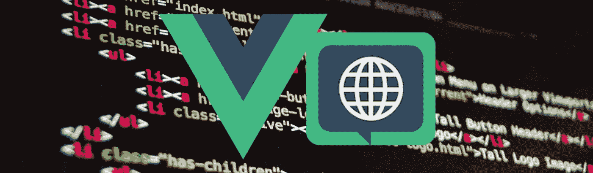
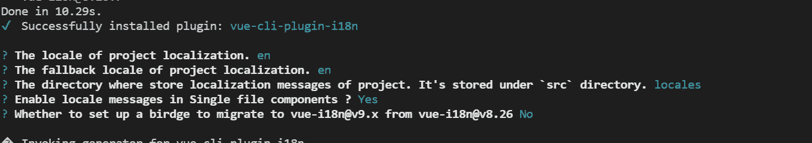

# 使用 Vue.js 2 + Vue 18n 创建多语言 Web 应用程序

> 原文：<https://javascript.plainenglish.io/create-multilingual-web-app-using-vuejs-2-vue-18n-f18eaf47b2a0?source=collection_archive---------8----------------------->

## 通过一个非常简单的例子，了解如何使用 Vue.js 创建多语言 web 应用程序。



创建一个同时支持多种语言的多语言网站非常重要，这样可以提高应用程序的受欢迎程度，使其更易于访问。

在本教程中，我们将了解如何通过一个简单的单页应用程序(由 16 位人物给出的人物测试结果)在 VueJS 应用程序中集成 vue-i18n 插件，该应用程序使用三种不同的语言:英语、阿拉伯语和法语。

## 我们将使用什么？

*   VueJS : 一个非常流行的用于创建 web 应用程序的 JavaScript 框架。
*   [Vuetify :](https://vuetifyjs.com/en/) 一个 UI 库，拥有手工制作的精美素材组件，我用这个库让我们的例子更加用户友好。
*   [Vue-18n:](https://kazupon.github.io/vue-i18n/)Vue js 的官方国际化插件。
*   Vue 2 的组合 API 插件:一种新的编写 Vue 组件的方式，它允许特性被逻辑地组合在一起，而不是必须按功能组织你的单个文件组件。
*   Vuedemi: 是一个开发中的工具，它允许你为 Vue 2 & 3 编写通用的 Vue 库
*   [Vueuse :](https://github.com/vueuse/vueuse) 是 Vue 2 & 3 的基本 Vue 合成工具的集合。

## 待办事项

本文组织如下:

1.  创建项目并安装依赖项。
2.  设置 vue-i18n 插件。
3.  创建翻译应用程序的逻辑。

# 1.创建项目并安装依赖项

第一步是创建一个 VueJS 应用程序，并添加我们需要的所有插件和库，以达到我们的目标。

```
# 1 - Create VueJS app using vue-cli
$ vue create my-personality
# 2 - Add Vuetify library
$ vue add vuetify
# 3 - Add plugins
$ yarn add @vue/composition-api vue-demi  @vueuse/core
```

# 2.设置 vue-i18n 插件

第二步是安装和配置 vue-i18n 插件。

```
$ yarn vue-i18n
```

您将被要求提供一些信息(请看下图):

*   项目的默认语言，
*   后退的语言，
*   /locales 目录位于何处，
*   您是否希望在单个组件中启用翻译。



之后，一些文件会自动添加，如:

*   *src/i18n.js* :其中 vue-i18n 插件配置在 src/main.js 中使用，
*   *src/locales* 目录:我们将在其中添加我们的 locales 文件，每个 locale 都将存储在一个单独的 JSON 文件中，
*   。env 文件:用于声明环境变量，在我们的例子中有两个基本变量:

```
VUE_APP_I18N_LOCALE=en
VUE_APP_I18N_FALLBACK_LOCALE=en
```

# 3.创建翻译应用程序的逻辑

现在我们的项目已经配置好了，是时候讨论如何告诉我们的应用程序使用哪种语言环境，以及应用程序的文本方向是什么(要么像拉丁语言那样从左到右，要么像阿拉伯语那样从右到左)。

首先，我们创建一个新的 JavaScript 文件*“composables/loacle . js”*，它将公开所选择的地区语言。

在上面的代码中，我们使用了:

*   ***toRefs :*** 它接受一个变量值，并返回一个可反应的可变 ref 对象，该对象有一个指向变量值的属性`.value`。
*   ***usePreferredLanguages:***返回反应式[导航语言](https://developer.mozilla.org/en-US/docs/Web/API/NavigatorLanguage/languages)，为我们提供用户首选语言的信息。
*   ***useStorage :*** 这给了我们一个很好的方法在用户浏览器的本地存储器中创建一个反应条目。

现在，我们可以把我们想要翻译的文本放在“ *locales* ”目录文件中。每个文件将具有相同的结构，但根据匹配的语言公开不同的值。

之后，翻译就容易了，我们只需使用 ***i18n*** 翻译方法 ***$t*** 直接在我们的 vue 组件的模板中。

而对于选择语言的切换，我们只是使用 ***locale.js*** 文件暴露的值来更新 ***i18n*** 插件的当前区域设置。为此，我们可以创建一个负责切换语言和文本方向的特殊组件。

仅此而已，我们的应用程序现在有三种不同的语言版本！！！

感谢您的阅读，更多细节您可以查看该项目的 GitHub 资源库:

[](https://github.com/SihemBouhenniche/i18n-vue-app-example) [## GitHub-SihemBouhenniche/i18n-vue-app-Example:如何在 vuejs 中设置 vue-i18n 插件的示例…

### 重要的是要创建一个多语言网站，同时支持多种语言，以增加…

github.com](https://github.com/SihemBouhenniche/i18n-vue-app-example) 

*更多内容请看*[***plain English . io***](https://plainenglish.io/)*。报名参加我们的* [***免费周报***](http://newsletter.plainenglish.io/) *。关注我们关于*[***Twitter***](https://twitter.com/inPlainEngHQ)[***LinkedIn***](https://www.linkedin.com/company/inplainenglish/)*[***YouTube***](https://www.youtube.com/channel/UCtipWUghju290NWcn8jhyAw)*[***不和***](https://discord.gg/GtDtUAvyhW) *。对增长黑客感兴趣？检查* [***电路***](https://circuit.ooo/) *。***