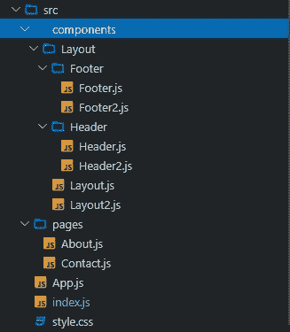
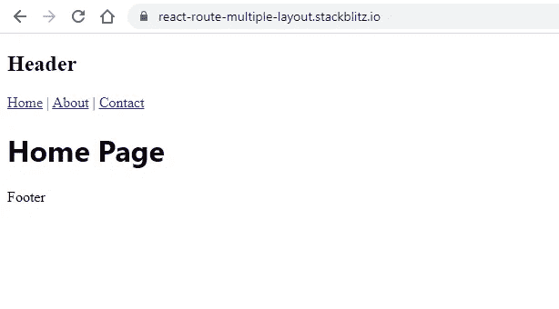

# 使用 React Router 创建多个布局组件

> 原文：<https://javascript.plainenglish.io/create-multiple-layouts-components-with-react-router-46b57ad5a455?source=collection_archive---------2----------------------->

## 关于如何创建具有页眉、页脚和内容部分的多个布局组件的指南。


Photo by [Hal Gatewood](https://unsplash.com/@halacious?utm_source=medium&utm_medium=referral) on [Unsplash](https://unsplash.com?utm_source=medium&utm_medium=referral)

在之前的博客中，我们[创建了自己的 React 布局组件](/create-your-own-layout-component-in-react-5d48f0433d9)，带有页眉和页脚。在这篇博客中，我们将创建多个布局组件。

遵循“[在 React](/create-your-own-layout-component-in-react-5d48f0433d9) ”博客中创建自己的布局组件，并使用布局组件完成 React 安装。

## 反应路由器

[React 路由器](https://github.com/remix-run/react-router)是用于 [React](https://reactjs.org/) JavaScript 库的轻量级全功能路由库。

`[create-react-app](https://create-react-app.dev/)`没有提供页面路由。使用以下 npm 命令安装 React 路由器:

```
npm install react-router-dom@6
```

# 创建多个布局组件

现在复制页眉、页脚和布局组件，并创建页眉 2、页脚 2 和布局 2 组件。确保在复制的 layout2 中更改相应的类名。



`src/components/Layout/Layout2.js`

```
import React from "react"
import Header2 from "./Header/Header2"
import Footer2 from "./Footer/Footer2"
class Layout2 extends React.Component {
  render(){
    return (
      <>
        <Header2 />
        <main>{this.props.children}</main>
        <Footer2 />
      </>
    )
  }
}
export default Layout2;
```

# 创建多个页面

使用以下代码创建“关于”和“联系人”页面组件:

`src/components/pages/About.js`

```
import React from 'react';
import Layout2 from '../components/Layout/Layout2';
class About extends React.Component {
  render() {
    return (
      <>
        <Layout2>
          <h1>
            About Page
          </h1>
        </Layout2>
      </>
    );
  }
}
export default About;
```

`src/components/pages/Contact.js`

```
import React from 'react';
import Layout2 from '../components/Layout/Layout2';
class Contact extends React.Component {
  render() {
    return (
      <>
        <Layout2>
          <h1>
            Contact Page
          </h1>
        </Layout2>
      </>
    );
  }
}
export default Contact;
```

打开`src/index.js`文件，从 react-router-dom 导入 BrowserRouter、Routes 和 Route。

```
import React, { StrictMode } from 'react';
import { createRoot } from 'react-dom/client';
import { BrowserRouter, Routes, Route } from "react-router-dom";
import App from './App';
import About from './pages/About';
import Contact from './pages/Contact';
const rootElement = document.getElementById('root');
const root = createRoot(rootElement);
root.render(
  <React.StrictMode>
    <BrowserRouter>
      <Routes>
        <Route path="/" element={<App/>} exact />
        <Route path="/about" element={<About/>} />
        <Route path="/contact" element={<Contact/>} />
      </Routes>
    </BrowserRouter>
  </React.StrictMode>
);
```

# 创建菜单链接

我们需要在 header 组件中添加页面链接。打开 Header 和 Header2 组件并添加链接。

`src/components/Layout/Header/Header.js`

```
import React from "react";
import { Link } from "react-router-dom";
class Header extends React.Component {
  render() {
    return(
      <header>
        <h2>Header</h2>
        <Link to="/">Home</Link> | <Link to="/about">About</Link> | <Link to="/contact">Contact</Link>
      </header>
    );
  }
}
export default Header;
```

`src/components/Layout/Header/Header2.js`

```
import React from "react";
import { Link } from "react-router-dom";
class Header2 extends React.Component {
  render() {
    return(
      <header>
        <h2>Header2</h2>
        <Link to="/">Home</Link> | <Link to="/about">About</Link> | <Link to="/contact">Contact</Link>
      </header>
    );
  }
}
export default Header2;
```

## 输出



## 堆栈式应用

该示例代码可在[https://github.com/balajidharma/react-route-multiple-layout](https://github.com/balajidharma/react-route-multiple-layout)获得。

*更多内容请看*[***plain English . io***](https://plainenglish.io/)*。报名参加我们的* [***免费周报***](http://newsletter.plainenglish.io/) *。关注我们关于*[***Twitter***](https://twitter.com/inPlainEngHQ)*和*[***LinkedIn***](https://www.linkedin.com/company/inplainenglish/)*。查看我们的* [***社区不和谐***](https://discord.gg/GtDtUAvyhW) *加入我们的* [***人才集体***](https://inplainenglish.pallet.com/talent/welcome) *。*