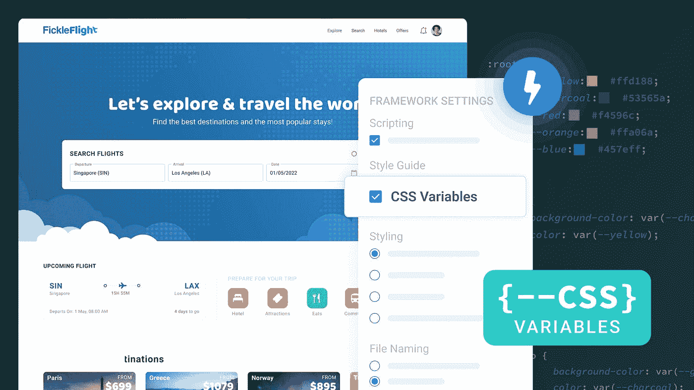

# 使用 CSS 变量创建像素完美、可扩展的设计

> 原文：<https://javascript.plainenglish.io/create-pixel-perfect-scalable-designs-using-css-variables-b2747c45f16c?source=collection_archive---------2----------------------->

## 一个全面的博客，涵盖所有你需要知道的 CSS 变量。



变量可以被认为是一种存储和重用值的手段。使用变量的核心优势是可重用性——使开发人员能够重用相同的值&如果有意义地命名，变量可以增强代码的可读性。

我们也可以在 CSS 中使用这些变量，称为 CSS 变量——这些是开发人员声明的简单变量，用于在整个页面中全局或局部重用特定的 CSS 属性。语法非常简单:指定属性，*，比如— heading-size: 30px* ，然后通过 var()方法使用它。

许多 web 开发人员甚至使用 CSS 预处理器 [SASS](https://sass-lang.com/) ，它作为 CSS &的扩展提供了更高级的属性。我们可以在 SASS 中指定变量，以及常规 CSS 中没有的各种附加功能。方法是相同的，但是我们使用`$`符号而不是两个连字符来保存变量值。

然而，由于 SASS 是一个预处理器，SASS 变量在编译时会变成普通的 CSS。因此，SASS 变量不存在于生成的代码中，因此，您不能在浏览器中访问它们。与 SASS 相比，这使得在原生 CSS 中使用变量更有利于开发。

另一方面，多亏了 JavaScript，我们可以在浏览器内部访问 CSS 变量并修改它们的值。

为了正确理解 CSS 变量的好处，我们先来看看在使用它们之前是什么样子的。

# 声明不带变量的 CSS 属性

更具体地说，我们可以在不声明 CSS 变量的情况下声明 CSS 属性。

例如在`index.html` :-

```
.home-page{  background-color: #2C2C2C; }
```

同样的，我们必须在内部定义`about.html`或者`project.html`文件。

```
.about-page{  background-color: #2C2C2C; }
```

在不同的页面上复制相同的代码是一种不好的做法，而且还可能导致意外的错误。

所有这些问题都可以通过使用 CSS 变量解决。

# 为什么使用 CSS 变量

现代应用程序往往有几个页面和屏幕，构建起来很复杂，因此在开始实际开发之前，有必要创建设计和原型。这些设计需要有统一的颜色、字体和风格来传达品牌身份&主题。

当我们必须定义这些属性时，它变得越来越具有挑战性。因此，我们可以简单地通过建立一个依赖于页面的具有不同名称的变量来防止错误。

首先，为每个 CSS 属性使用 CSS 变量是没有意义的——您只需要将那些计划在应用程序中重用的属性转换为变量。

具体是什么时候？假设您为多个页面或部分指定了相同的背景或文本颜色。如果您使用相同的 CSS 属性，例如几个部分的背景颜色，在这种情况下采用 CSS 变量是一个明智的决定。这有助于在多个页面上建立相同的设计语言。

# 如何声明这些变量

我们已经讨论过 CSS 变量是具有唯一名称和值的自定义 CSS 属性。

它的语法如下:var( —名称，值)

1.  —名称:变量名必须以两个破折号(—名称)开头。
2.  值:它是可选的。

现在让我们讨论创建 CSS 变量的两种方法:

1.  全局变量:这些变量可能在整个文档中被访问/使用；我们只需要在根选择器中定义它们。
2.  局部变量:另一方面，局部变量只能在声明它们的选择器中使用。

让我们用最简单的例子来解释。在 body 标签中，我们指定了两个标签。

```
<body> 
<h1>Locofy</h1> 
<p>One of the best no-code platform.</p> 
</body>
```

现在让我们全局定义 CSS 变量。

```
/* Defining global variables  */ 
:root { 
--bg-color: blue; 
--text-color: white; 
}
```

现在让我们将 CSS 变量设置为特定的 HTML 标签。

```
body { 
background-color: var(--bg-color);
} 
h1 { 
color: var(--text-color); 
}
```

完整的代码如下所示:

# 用 JavaScript 改变 CSS 变量

您也可以使用 JavaScript 动态更新 CSS 变量，比如改变按钮颜色或在输入字段周围显示红色边框来表示一些错误。

让我们以一个简单的网站页面为例，当按下按钮时，文本大小会增加。

**HTML**

```
<p>The below button will change my font size.</p> 
<button type="button" onclick="getFontSize()">Get font size</button> <button type="button" onclick="setFontSize()">Set font size</button>
```

这里我们定义了一个段落标签。接下来，我们定义了两个按钮:一个用来获取字体大小，另一个用来改变字体大小。

**CSS**

```
:root { 
--font-size: 30px; 
} 
p { 
font-size: var(--font-size); 
}
```

现在，让我们在根选择器中定义一个全局变量。之后，我们将 p 标签的字体大小设置为。

现在是时候在 javascript 的帮助下改变字体大小了。

**JavaScript**

```
var getProperties = document.querySelector(':root'); function getFontSize() { 
var value = getComputedStyle(getProperties); 
alert("Font size is: "+ value.getPropertyValue('--font-size'));
} function setFontSize() { 
getProperties.style.setProperty('--font-size', '60px'); 
}
```

这里，我们定义了一个名为 getProperties 的变量，它将保存根选择器中存储的所有变量。

后来，我们定义了两个函数:一个显示当前字体大小，另一个设置新的字体大小。

就是这样——段落标签的字体大小会从 30px 增加到 60px。

# CSS 变量可以用在哪里？

通过一个例子，我们了解了 CSS 变量以及如何用 JavaScript 修改 CSS 变量。

现在是时候把它放到你的项目中了。

所有的顶级框架，比如 [React](https://reactjs.org/) ，[Angular](https://angular.io/)&[Vue](https://vuejs.org/)都支持 CSS 变量开箱即用。就像我们在这篇文章中看到的一样简单。

CSS 变量允许构建者重用他们的属性，并为他们的项目创建一个统一的、可扩展的设计系统。

然而，从您的设计文件到使用 CSS 变量的高质量代码不仅耗时，而且对开发人员来说也有点挑战，因为他们可能不完全了解哪些属性应该转换为变量。

这就是 [Locofy.ai](https://locofy.ai) 可以大有帮助的地方。使用 Figma 的 Locofy.ai 插件，你不仅可以将你的设计导出到 React、React Native、HTML-CSS、Gatsby & Next.js 中的生产就绪代码，而且该插件还可以[生成 CSS 变量](https://guide.locofy.ai/enabling-css-variables-for-your-code-export)。

Locofy.ai 引用你的 [Figma Styles](https://help.figma.com/hc/en-us/articles/360039238753-Styles-in-Figma) 生成 CSS 变量。此外，它检测常用的重用变量，例如字体和填充，&也将它们转换成 CSS 变量。

希望你喜欢。

就这样——谢谢。

[*如果你喜欢看这样的故事，并想帮助我成为一名作家，考虑成为一名中等成员*](https://nitinfab.medium.com/membership) *。每月花费 5 美元，你可以无限制地访问媒体内容。如果你通过我的链接注册，我会得到一点佣金。*

*原载于*[*https://blog . locofy . ai*](https://blog.locofy.ai/create-pixel-perfect-scalable-designs-using-css-variables)*。*

*更多内容请看*[***plain English . io***](https://plainenglish.io/)*。报名参加我们的* [***免费周报***](http://newsletter.plainenglish.io/) *。关注我们关于*[***Twitter***](https://twitter.com/inPlainEngHQ)[***LinkedIn***](https://www.linkedin.com/company/inplainenglish/)*[***YouTube***](https://www.youtube.com/channel/UCtipWUghju290NWcn8jhyAw)*[***不和***](https://discord.gg/GtDtUAvyhW) *。对增长黑客感兴趣？检查* [***电路***](https://circuit.ooo/) *。***