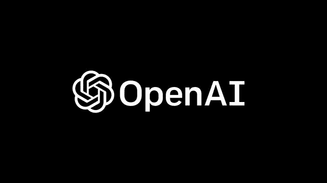
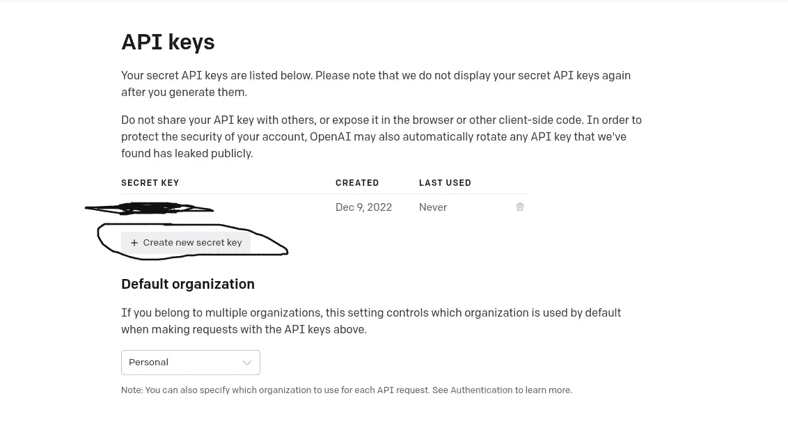

# 使用 OpenAI GPT 和 Nodejs 创建问答

> 原文：<https://javascript.plainenglish.io/create-q-a-with-openai-gpt-and-nodejs-853f69371f9?source=collection_archive---------3----------------------->



source image : [https://media.suara.com/pictures/653x366/2022/12/10/85239-openai.jpg](https://media.suara.com/pictures/653x366/2022/12/10/85239-openai.jpg)

**简介** —这次我将分享一个关于如何使用 openai gpt 问答模型使用答案的教程，自从这个 openai 的趋势出现以来，我就一直很好奇想尝试它，并且在尝试之后哇很神奇，相当容易掌握和理解。

你可以去这个网站注册，在这里【https://chat.openai.com/auth/login 获得使用 openai 的 api 密匙，然后你可以在这里[https://beta.openai.com/account/api-keys](https://beta.openai.com/account/api-keys)获得 api 密匙



generate key

然后编写这样的代码和文件名 **index.js** ，记住在 apiKey 中用 *apiKey* 改变你在 open API dashboard 中生成的值并添加这个包[https://www.npmjs.com/package/openai](https://www.npmjs.com/package/openai)或者你可以使用 axios 或 node fetch 直接命中 API。

openai example index.js

然后运行 terminal node index.js 中的代码*你的文本问题*示例:

```
 node index.js how to create nodejs application
```

demo

感谢您的阅读！

## 更多内容请访问 [PlainEnglish.io](https://plainenglish.io/) 。

报名参加我们的 [**免费每周简讯**](http://newsletter.plainenglish.io/) 。关注我们关于 [**推特**](https://twitter.com/inPlainEngHQ)[**LinkedIn**](https://www.linkedin.com/company/inplainenglish/)**[**YouTube**](https://www.youtube.com/channel/UCtipWUghju290NWcn8jhyAw)**，以及** [**不和**](https://discord.gg/GtDtUAvyhW) **。****

## **想用内容来扩展你的科技创业吗？检查[电路](https://circuit.ooo/?utm=publication-post-cta)。**

**我们提供免费的专家建议和定制解决方案，帮助您建立对您的技术产品或服务的认知和采用。**