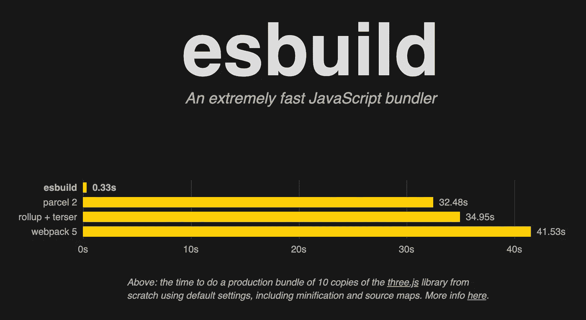
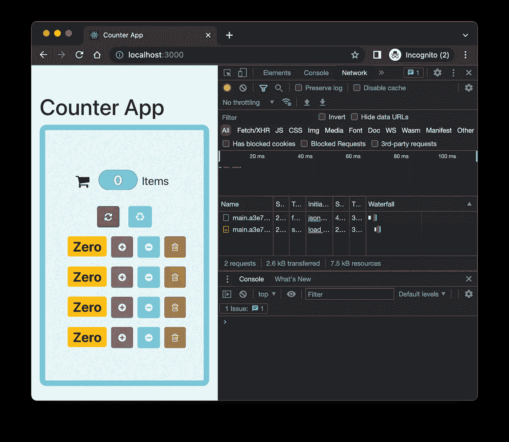
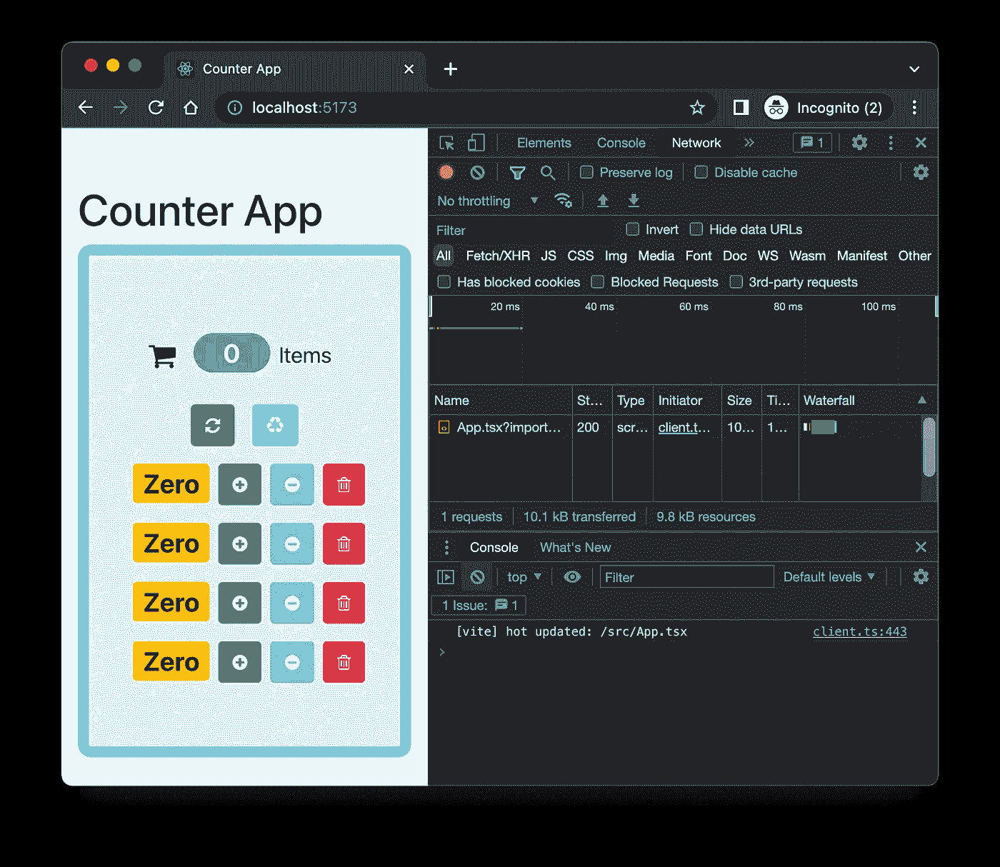

# 创建 React 应用程序(CRA)与 Vite:将您的 CRA 项目迁移到 Vite 并比较结果

> 原文：<https://javascript.plainenglish.io/create-react-app-cra-vs-vite-migrate-your-cra-project-to-vite-compare-the-result-2a193b849e45?source=collection_archive---------1----------------------->

## 将您的 CRA 项目迁移到 Vite，进行基准测试，并比较这两个项目。


# 介绍

Create React App 是官方支持创建单页 React 应用程序的方式。它提供了许多现成的特性，是开始学习 React 的最佳方式。对于一个有经验的 React 开发人员来说，创建 React App 始终是构建 POC 项目或测试一些想法的良好开端。

## 创建 React 应用

然而，我们注意到，当项目规模扩大时，构建时间会急剧增加。尤其是在开发期间，即使我们更改了标签，也可能需要几秒钟才能反映出来，这会影响开发体验。

## 轻快地

Vite(法语单词“quick ”)是下一代构建工具，旨在为前端现代 web 应用程序提供快速环境。支持 React，Vue.js，甚至 Vanilla.js 等多种前端框架 [Vite 3.0](https://vitejs.dev/blog/announcing-vite3.html) 已于近日发布。在这个故事中，我们将选择一个从 Create React App 开始的项目，并将其迁移到 Vite 项目。然后，我们将进行基准测试，并对两个项目进行比较。

# 为什么 Vite 更快

显而易见，Vite 比 Create React App 更快，但是是什么原因让 Vite 比 Create React App 更快呢？

## JavaScript bundler

Vite 正在使用 esbuild 来构建您的源代码，而不是在 Create React App 中使用的 webpack。从[官方网站](https://esbuild.github.io/)来看，esbuild 在生产捆绑包中比 webpack 5 快 100 倍左右。



**Figure 1** JavaScript bundler build time

## 浏览器本地 ES 模块

Vite 利用浏览器自带的 ES (ECMAScript)模块链接到 JavaScript 文件(也支持 TypeScript 文件)，这意味着每次文件更改后都不需要整个包。

## 依赖的大小

创建 React 应用程序有更多的依赖项。通过对比新鲜的脚手架应用，Create React App 花费 **338M，**

```
# du -sh my-create-react-app
338M my-create-react-app
```

而与 Vite 反应只需要 **110M** 。它大约有三分之一大。

```
# du -sh my-vite-react-app
110M my--vite-react-app
```

# 准备创建 React 应用程序项目

我们从 [React 官网](https://reactjs.org/community/examples.html)上摘一个例子项目。计数器应用程序导入了 bootstrap、font-awesome、popper.js 和一些流行的包，这将是这个故事的一个不错的选择。

应用程序被转换成 TypeScript 并提交到这个 Github 库。如果你感兴趣，请随时查看。

# 迁移到 Vite 项目

在 Create React App 项目准备好之后，让我们将它迁移到一个 Vite 项目，这样我们就可以进行试验和比较。

## 安装 Vite 包

首先，我们为 Vite 添加包:

```
# yarn add -D vite vite-plugin-svgr vite-preset-react
```

正如我们所知，从 react 的第 17 版开始，我们不再需要从 React 导入 React，JSX 会自动转换，而无需使用***React . createelement***。然而，Vite 的情况并非如此。`vite-preset-react`包帮助自动将 React 注入组件。

包`vite-plugin-svgr`允许用户直接导入 SVG 文件作为 React 组件。

## 添加配置文件

接下来，我们需要在项目根目录下有一个配置文件`vite.config.ts`，并在配置文件中导入 Vite 插件。

./vite.config.ts

## 在 package.json 中添加脚本

然后，我们需要更改`package.json`中的脚本进行开发、构建和预览构建。Vite 使用`vite`命令来完成这些任务。

./package.json

与创建 React 应用程序一样，我们使用`yarn start`进行开发，使用`yarn build`捆绑项目。不过，`yarn serve`预览一下建成。

## 移动并更新 index.html

Vite 不需要`index.html`在公共文件夹里。我们将`index.html`从公共文件夹移到项目根目录。然后，从`index.html`文件中删除所有`%PUBLIC_URL%`引用。

./index.html

此外，我们为项目条目添加了一个`type="module"`脚本。

## 删除不必要的包

迁移的最后一步，删除不必要的包。因为我们不打算将页面部署为 Github 页面，所以删除`react-scripts`和`gh-pages`。

```
# yarn remove react-scripts gh-pages
```

# 比较

两个项目做好之后就该对比了。我们将比较包安装、开发服务器行为、项目构建时间和项目的包大小。

## 安装软件包

检查完源代码后，我们通常做的第一件事是通过 yarn install 安装包。让我们测量一下 CRA 和维特项目的时间。

```
**create-react-app** # time yarn install
yarn install v1.22.19
[1/4] 🔍  Resolving packages...
[2/4] 🚚  Fetching packages...
[3/4] 🔗  Linking dependencies...
[4/4] 🔨  Building fresh packages...
✨  Done in 13.09s.
yarn install  4.83s user 10.85s system 115% cpu 13.610 total
```

CRA 项目用了**13.09 秒**安装，而维特项目用了**2.46 秒**安装，差异非常显著。

```
**vite-app** # time yarn install
yarn install v1.22.19
[1/4] 🔍  Resolving packages...
[2/4] 🚚  Fetching packages...
[3/4] 🔗  Linking dependencies...
[4/4] 🔨  Building fresh packages...
✨  Done in 2.46s.
yarn install  0.69s user 1.45s system 83% cpu 2.552 total
```

这个结果是意料之中的，因为我们之前已经检查过依赖关系的大小，它相差大约 3 倍。

## 开发服务器

现在，我们运行`yarn start`来启动两个项目的开发服务器。监视 network 选项卡，看看当我们更改`./src/App.tsx`时，热重装行为是什么。



**Figure 2** Network tab of Create React App hot reload

正如我们可以看到的，当我们在 CRA 项目中更改一个文件时，源代码将被再次捆绑并发送到浏览器。



**Figure 3** Network tab of Vite hot reload

但是，Vite 传递的是经过编辑的文件，而不是捆绑源代码。这就是本机 Ecma 脚本模块(ESM)的神奇之处。Vite 将源代码转换成 ESM，让浏览器完成剩下的工作。它使 HMR 更新始终快速，无论你的应用程序的大小！

## 生产构建

生产构建时间是另一个值得衡量的话题。

```
**create-react-app** # time yarn build
yarn run v1.22.19
$ react-scripts build
Creating an optimized production build...
Compiled successfully.File sizes after gzip:47.58 kB (+12 B)  build/static/js/main.aed87607.js
  30.58 kB          build/static/css/main.fe44959a.css
  1.79 kB           build/static/js/787.07a4bd42.chunk.jsThe project was built assuming it is hosted at ./.
You can control this with the homepage field in your package.json.The build folder is ready to be deployed.Find out more about deployment here:[https://cra.link/deployment](https://cra.link/deployment)✨  Done in 24.91s.
yarn build  13.71s user 2.07s system 62% cpu 25.315 total
```

CRA 用了**24.91 秒**，而 Vite 只用了**4.32 秒**，这是意料之中的，因为 CRA 使用 webpack 捆绑，而 Vite 使用 esbuild。

```
**vite-app** # time yarn build
yarn run v1.22.19
$ tsc && vite build
vite v3.0.8 building for production...
✓ 40 modules transformed.
dist/assets/fontawesome-webfont.7bfcab6d.eot     161.86 KiB
dist/assets/fontawesome-webfont.2adefcbc.woff2   75.35 KiB
dist/assets/fontawesome-webfont.ba0c59de.woff    95.73 KiB
dist/assets/fontawesome-webfont.aa58f33f.ttf     161.67 KiB
dist/assets/fontawesome-webfont.ad615792.svg     433.96 KiB
dist/index.html                                  1.31 KiB
dist/assets/web-vitals.67dce932.js               4.21 KiB / gzip: 1.64 KiB
dist/assets/index.8fe2a8c9.css                   188.35 KiB / gzip: 30.68 KiB
dist/assets/index.601902bd.js                    142.94 KiB / gzip: 46.23 KiB
✨  Done in 4.32s.
yarn build  3.48s user 0.26s system 84% cpu 4.422 total
```

# 结论

总的来说，从 Create React App 到 Vite 的迁移非常顺利。
从上面的对比结果来看，Vite 确实速度很快，提供了令人敬畏的开发体验。这对开发和生产都有好处。试试 Vite，你会发现不同！

请随意查看以下 Github 库的源代码:

创建 React 应用:

 [## GitHub-rockyliyanlok/counter-app-ts:react 示例项目 counter-app 的类型脚本版本

### react 示例项目的类型脚本版本 counter-app-GitHub-rockyliyanlok/counter-app-ts:类型脚本版本…

github.com](https://github.com/rockyliyanlok/counter-app-ts) 

邀请:

 [## GitHub-rockyliyanlok/counter-app-vite

### 通过在 GitHub 上创建帐户，为 rockyliyanlok/counter-app-vite 开发做出贡献。

github.com](https://github.com/rockyliyanlok/counter-app-vite) 

这两个项目都部署在 Vercel 上:

[创建 React 应用](https://counter-app-cra.vercel.app/):

 [## 计数器应用程序

### 编辑描述

counter-app-cra.vercel.app](https://counter-app-cra.vercel.app/) 

邀请:

 [## 计数器应用程序

### 编辑描述

counter-app-vite-eta . vercel . app](https://counter-app-vite-eta.vercel.app/) 

编码快乐！💻

*更多内容请看*[***plain English . io***](https://plainenglish.io/)*。报名参加我们的* [***免费周报***](http://newsletter.plainenglish.io/) *。关注我们关于*[***Twitter***](https://twitter.com/inPlainEngHQ)[***LinkedIn***](https://www.linkedin.com/company/inplainenglish/)*[***YouTube***](https://www.youtube.com/channel/UCtipWUghju290NWcn8jhyAw)*[***不和***](https://discord.gg/GtDtUAvyhW) *。***