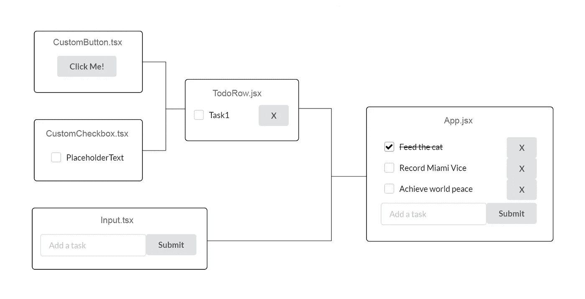
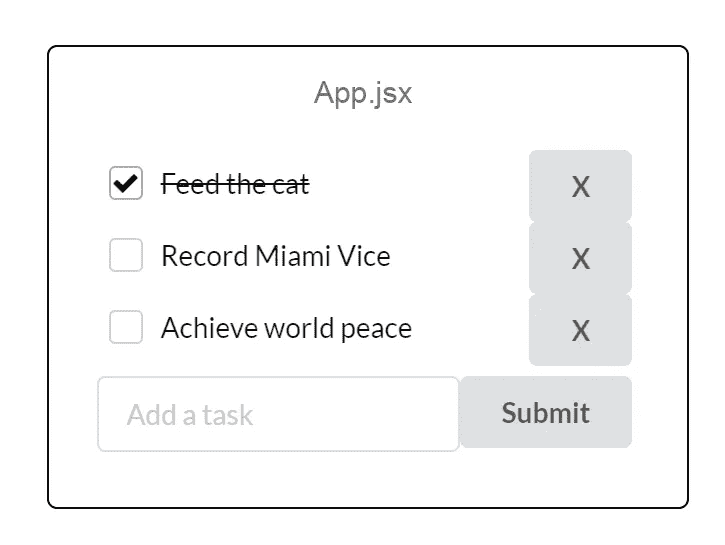

# 以正确的方式创建可重用的 React 组件

> 原文：<https://javascript.plainenglish.io/create-reusable-react-components-the-right-way-c9b42578a187?source=collection_archive---------0----------------------->

## 关于如何在应用程序之间共享和重用 React.js 组件的实用指南



快速问题:您刚刚为公司时事通讯构建了世界上最酷的表单域，您的下一个任务是帮助另一个团队使用 React 组件，该组件与您刚刚完成的组件没有太大的*差异*。现在，如何跨应用程序和团队多次重用组件呢？

“这是什么问题？”你嘲笑我。“我已经编码好了；我要做的就是从回购中复制粘贴。容易。”

太好了！但是你也要复制粘贴(*和*修复重大变更)所有需要的依赖、配置和条件样式吗？更糟糕的是，如果你在五个不同的回购中有一百个*组件——所有这些组件都有不同的更新管道需要跟踪，那会怎么样？*

一个解决方案是单体库:多个组件作为一个包发布，一个超集“核心”库作为依赖。问题是:巨石柱不可伸缩。包中的每个组件都被一起版本化；你不能混搭。

我们将关注的第二种方法是 [Bit](https://bit.cloud/) ，这是一个开源工具链，它提供了一种更简单的*、*可扩展的方式来共享和重用组件，无论您的用例是什么。

# 原子设计和你

想象一下。如果您可以只拿起您的组件，将它们单独存放在某个存储库中，然后如果您或其他人在下一个项目中需要它们——砰。你是 webdev 的主厨，毫不费力地从 repo 中挑选组件作为你最新作品的配料。


“Definitely going to need that [**Checkbox**](https://bit.cloud/teambit/design/inputs/selectors/checkbox-item) and the styled [**Button**](https://bit.cloud/bit/evangelist/elements/button). That [**BaseTheme**](https://bit.cloud/teambit/design/themes/base-theme) looks scrumptious, too. Ooh. A minimalistic [**Tag Cloud**](https://bit.cloud/teambit/blog/ui/posts/post-tags)? Yes please.”

比特让我们做*只是*那样，像这样:

*   从逻辑上识别单个组件(或者将它们分解，直到我们得到尽可能小的单元，比如一个定制的按钮组件)，
*   使它们独立于您现有的库或应用程序的上下文，
*   然后将它们构建、测试、版本化，并作为单一包发布到 Bit 上，它为我们管理依赖关系。

这是[组件驱动的开发，做得对](https://bit.cloud/blog/how-to-build-a-composable-blog-l1jkl9f4)——因为这些组件变得真正*可重用，能够独立导入、更新，并用于组成任何项目——所有这些都只需要一个简单的`npm install`！*

# *入门指南*

*让我们看一个实际的例子。因此，我们有了这个我们之前创建的简单输入组件，我们希望共享它，并在其他项目中重用它。*

**

*让我们来看看如何做到这一点。*

## *步骤 1:安装并运行 Bit*

*首先，我们要安装 Bit，然后在我们的项目目录中初始化一个 Bit [工作空间](https://bit.dev/docs/workspace/workspace-overview)。*

```
*npx @teambit/bvm installbit init*
```

*这个开发服务器允许您在一个地方构建、导入、预览、修改组件以及管理它们的依赖关系。这是进行组件驱动开发的一种直观、可视化的方式。*

## *步骤 2:用 Bit 创建组件*

*这是我们干重活的地方。*

*`bit create`命令创建组件目录。*

```
*bit create react input --scope exampleUser.exampleScope*
```

*你会注意到我们在`bit create`后面添加了单词`react`。这告诉 Bit 创建一个 React 组件。我们还可以选择其他的[模板](https://bit.dev/docs/getting-started/composing/creating-components)，比如 Node.js、MDX、React Hooks 等等。您可以通过运行`bit templates`命令了解更多信息。*

*让我们快速解释一下`scope`的论点。一点[范围](https://bit.dev/docs/scope/scope-overview)基本上就是你的知识库。当您在 [bit.cloud](https://bit.cloud/) 上创建一个远程作用域时，它充当一个排序的名称空间，允许您导出和存储与其他用户/组织创建的组件同名的组件，而不会产生冲突，并使导入更加合理。*

> **💡您也可以将您的* `*workspace.jsonc*` *文件中的* `*defaultScope*` *属性设置为* `*[your bit username].[your scope name]*` *，将* `*bit create*` *命令简化为* `bit create react input`*

*在`bit create`之后，您将看到以下输出:*

```
*1 component(s) were created**my-scope/input** location: my-scope/input
env:      teambit.react/react (set by template)*
```

*恭喜你！我们已经创建了第一个组件。*

*除了为输入组件创建的文件之外，还创建了一些其他文件。我们的输入目录现在看起来像这样:*

```
*index.ts // root file
input.docs.mdx  // documentation
input.tsx // component
input.composition.tsx // compositions
input.spec.tsx // tests*
```

*下一步是将输入代码添加到 input.tsx 文件中。我们不会花太多时间在这里，你很可能已经看到了如何创建一个输入字段。*

*让我们想象一下我们的输入组件是这样的:*

```
*export const Input = () => {
  return <input className={styles.input} {...rest} />
};*
```

*您可以就此打住(如果您这样做了，请跳到第 4 步)，但是拥有一个没有预览、文档或测试的可共享和可重用的组件对任何人来说都不会太有用，对吗？*

*所以让我们现在着手解决这个问题。*

## *第三步:添加指甲油*

## ***作文***

*组合是最少的代码，可以让任何想使用它们的人直观地预览您的组件:开发人员、测试人员、设计团队成员或项目经理。*

*现在，我们可以安装所有的依赖项并启动工作区 UI 来查看我们新独立的组件的运行情况。*

*`bit install && bit compile && bit start`*

*组合允许在不同的变化中模拟组件。这些可以用于测试、可视化和可发现性。*

## ***文档***

*下一个，医生们。Bit components 的文档是以令人敬畏的 [MDX](https://mdxjs.com/) 格式编写的，这种格式**允许 JSX 在标记**中嵌入视觉丰富、信息丰富的文档。*

*`**input.docs.mdx**`*

```
*---
description: An input element with a built-in button.labels: ["input", "submit form"]
---import { Input } from "./input";### Modify the text on the button'''js live<Input buttonText="Go" />'''*
```

## ***测试***

*最后，没有适当的测试，好的组件设计就什么都不是。当您使用`bit create`时，它会自动创建一个`*.spec.*`文件。然而，Bit 也会将`*.test.*`识别为一个测试文件。*

*使用以下工具运行测试:*

*`bit test`*

```
*PASS src/components/input/input.spec.tsx
  ✓ Renders the input (67 ms)
  ✓ Renders the button (19 ms)
  ✓ Renders the button text (12 ms)

Test Suites: 1 passed, 1 total
Tests: 3 passed, 3 total
Snapshots: 0 total
Time: 5.549 s
Ran all test suites.
test has been completed in 13.718 seconds.*
```

## ***第四步:版本和发布！***

*我们在最后冲刺阶段。最后一步是用初始版本号标记组件，并将其上传到存储库。*

*`bit tag -m “my first version”`*

*[标签](https://bit.dev/docs/components/tags)是快照。当组件被标记时，除了锁定源文件的当前状态之外，它还将经历一个构建过程。然后组件将被编译成可分发的格式，打包成一个`.tar`文件。*

*一旦组件被标记，我们就可以发布了！*

```
*bit loginbit export*
```

*打包的组件将被导出到您之前定义的远程范围，可以立即导入并在任何 React 项目中使用。*

## *步骤 5:导入您的位组件*

*第一步是使用您选择的包管理器，用您的用户名、密码和电子邮件(或基于令牌的身份验证，如用 GitHub 连接)登录到 Bit。*

*`npm login --registry=https://node.bit.dev --scope=@bit`*

*然后，只需将`cd`放入您想要使用导入组件的项目目录，并从 Bit 库中安装您想要的组件，就像您对任何其他库一样。*

```
*npm i @exampleUser/exampleScope.input*
```

*组件(及其版本)现在被列为`package.json`中的一个依赖项，可以在 React 项目中的任何地方使用，只需一个简单的常规导入语句。*

**

*The final result: Our Input component, imported, integrated, and used seamlessly in a simple Todo app.*

## *摘要*

*就这些了！现在，您已经掌握了将项目中紧密耦合的组件分离成独立组件所需的所有知识，这些组件可以被存储，然后用于**组合** *任何东西*，*任何地方*，在*任何上下文*。*

*这是原子设计的关键，使用像 Bit 这样的东西来独立构建、测试和共享真正可重用的组件，这些组件可以是原子或分子，确保每个人都可以使用它们来构建无限扩展的 webapps。*