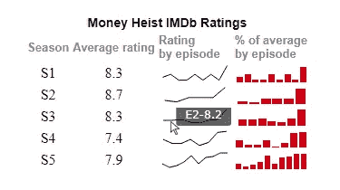
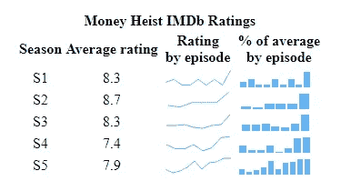
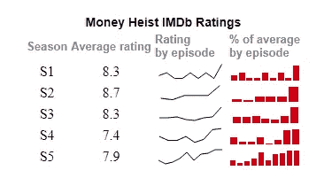

# 用 JavaScript 创建迷你图

> 原文：<https://javascript.plainenglish.io/create-sparkline-charts-with-javascript-ecb183e43b58?source=collection_archive---------16----------------------->


Creating JS sparklines to visualize Money Heist’s ratings on IMDb.

**迷你图是由著名统计学家和数据可视化先驱** [**【爱德华·塔夫特】**](https://en.wikipedia.org/wiki/Edward_Tufte) **推出的优雅微型图表。这些微小的图表没有任何轴，占用最小的空间，旨在代表大图，显示与文本和表格单元格一致的趋势。**

> 如果您想了解构建迷你图的简单方法，这是正确的地方！

在本文中，我将向您展示如何使用 JavaScript 快速创建很酷的迷你图。随着 OTT 内容统治娱乐世界的这些日子，让我们愉快地学习并看看当今最受欢迎的节目之一的 IMDb 收视率— [*【金钱大劫案】*](https://www.imdb.com/title/tt6468322/) (西班牙原文为*)。*

*事不宜迟，一起来踏上这场知识盗窃之旅吧！*

# *要构建的 JS 迷你图*

*在本教程中，我们将创建两个不同系列的基于 JavaScript 的迷你图。*

*迷你图将显示《金钱大劫案》五季中每一季的 IMDb 收视率如何变化。*

*柱形迷你图将显示每集的收视率与该季的平均收视率相比如何，以百分比表示:如果前者等于后者，则前者的值为 100%，如果大于或小于平均值，则分别为更大或更小的值。*

*查看我们的 JS 迷你图的外观，并继续阅读，一步一步地深入这个数据可视化开发过程！*

**

*有人可能会认为这里有窍门，你需要知道很多关于编码的知识，但这实际上相对容易，最终的 JavaScript 代码将是精简的 40 多行普通 JS。*

# *创建 JavaScript 迷你图*

*一个可爱的 JS 迷你图只需要简单的四个步骤就可以创建出来。那不是很完美吗？*

1.  *制作一个 HTML 页面。*
2.  *添加要使用的脚本文件。*
3.  *连接数据。*
4.  *编写 JavaScript 图表代码。*

# *1.制作一个 HTML 页面*

*首先，我们需要一个带有`<table>`元素的基本 HTML 页面，它将保存所有数据值和迷你图。为了在后面的代码中引用该表，我们将为它提供一个 ID 参数。例如，“TB-季节”*

*然后，让我们添加表格标题，以显示整个表格的标题和每列的标题。长文本将被分成两行，这样整个基于迷你图的数据可视化项目看起来更整洁。*

*最后，当然，我们还需要定义表体。这是我们的数据值和迷你图本身将呈现的地方。*

```
*<html><head>
  <title>JavaScript Sparkline Chart</title>
  <style type="text/css">      
    html,
    body {
      width: 100%;
      margin:0;
      padding: 0;
    }
    tr { 
      overflow: hidden;
      height: 14px;
      white-space: nowrap;
    }
    td {
      text-align: center; 
      vertical-align: middle;
    }
    .chart {
      height: 20px;
      width: 80px;
    }
  </style>
</head>
  <body>
    <table id="tb-seasons">
      <thead>
        <tr>
          <th id="tg-head" colspan="4">Money Heist IMDb Ratings</th>
        </tr>  
        <tr>
          <th id="tg-head">Season</th>
          <th id="tg-head">Average rating</th>
          <th id="tg-head">Rating<br>by episode</th>
          <th id="tg-head">% of average<br>by episode</th>
        </tr>    
      </thead>
      <tbody>
      </tbody>
    </table>
  </body>
</html>*
```

*如您所见，在第一步中，我们还指定了表体、每行和每个单元格的样式。在本例中，图表的高度只有 20 个像素，宽度只有 80 个像素。这样做是为了展示迷你图不占用太多空间就能工作，并充分说明它们是作为表格中的缩微图而设计的。*

# *2.添加要使用的脚本文件*

*接下来，我们需要引用创建迷你图可视化所需的所有脚本。*

*有许多 JavaScript 图表库。然而，并不是所有的都支持迷你图。在这里，我们将使用一个做， [AnyChart。](https://www.anychart.com)它是轻量级的，灵活的，对初学者来说是个不错的选择，因为有很多[例子](https://www.anychart.com/products/anychart/gallery/)和详细的[文档](https://docs.anychart.com)。*

*让我们从 [AnyChart CDN](https://cdn.anychart.com) 添加必要的脚本文件。为了使用这个 JS 库构建迷你图以实现数据可视化，我们需要三个特定的脚本:核心模块[、](https://docs.anychart.com/Quick_Start/Modules#core)[迷你图模块](https://docs.anychart.com/Quick_Start/Modules#sparkline)和[数据适配器](https://docs.anychart.com/Working_with_Data/Data_Adapter/Overview#modules)模块。因此，我们将把它们都包含在第一步中创建的 HTML 页面的`<head>`部分中。*

```
*<html>
  <head>
    <title>JavaScript Sparkline Chart</title>
    <script src="https://cdn.anychart.com/releases/8.11.0/js/anychart-core.min.js"></script>
    <script src="https://cdn.anychart.com/releases/8.11.0/js/anychart-sparkline.min.js"></script>
    <script src="https://cdn.anychart.com/releases/8.11.0/js/anychart-data-adapter.min.js"></script>
    <style type="text/css">
      // The HTML body and table styles.
    </style>
  </head>
  <body>  
 ***// The table to hold the data values and the charts.***    <script>
 ***// All the code for the JS sparkline chart will come here.***    </script>
  </body>
</html>*
```

# *3.连接数据*

*我已经从 [IMDb 网站](https://www.imdb.com/title/tt6468322/episodes/?ref_=tt_ov_epl)获取了*金钱抢劫*的评分数据，并按照我们迷你图要求的格式创建了 [JSON 文件](https://gist.githubusercontent.com/shacheeswadia/21ddfa122938e676bf9e7911e1417d9a/raw/d28d7a22b968bb39d755285d28ce949b31276628/sparklineChartData.json)。然后，我们将使用`data.loadJsonFile`函数连接该数据集。*

*现在一切都准备好了，让我们通过编写一点 JavaScript 图表代码来立即制作预想的交互式迷你图！*

# *4.编写 JavaScript 图表代码*

*迷你图在表中呈现。因此，创建包含迷你图的表格需要为表格的每一行添加数据。这可能不像制作一个单独的[条形图](https://www.anychart.com/blog/2017/10/25/javascript-bar-chart-tutorial/)或[线图](https://www.anychart.com/blog/2021/07/28/line-chart-js/)那么简单。但是我们会检查每一行代码，所以不要担心，因为你会看到创建一个交互式 JS 迷你图真的离火箭科学很远。*

*让我们从添加一个封装代码的函数开始，以确保在执行任何代码之前页面是完全加载的。然后我们将添加数据文件。*

*添加数据后要做的第一件事是创建一个函数来迭代数据，并调用另一个函数为每个季节创建一行。*

```
*function (data) {
 ***// go through the data
  // and add each season's info and charts to the table***  Object.entries(data).forEach(([key, value]) => createSeason(key, data)); 
}*
```

*接下来，让我们定义刚才调用的新函数。*

*首先，让我们获得一个表体的链接，我们希望使用第一步中分配的 ID 在其中添加行。接下来，我们将添加一个新行，并将其高度设置为 30px。在这一行中，我们将插入单元格来保存季度编号、该季度的平均评分和迷你图。后者将使用另一个函数并基于迷你图类型、折线图或柱形图来生成。*

```
*function createSeason(season, data){ ***// get a table link***  var tbodyRef = document.getElementById('tb-seasons').getElementsByTagName('tbody')[0];

 ***// insert a row at the end of the table***  var newRow = tbodyRef.insertRow();
  newRow.setAttribute('height', '30px');

 ***// append a season name text node to a cell***  newRow.insertCell().appendChild(document.createTextNode(season));

 ***// append a season rating cell*** newRow.insertCell().appendChild(
    document.createTextNode(data[season].avg)
  );

 ***// create a line sparkline chart showing ratings***  var lineDiv = createSparkline(data[season], 'episodeRatings', 'line');

 ***// append it***  newRow.insertCell().appendChild(lineDiv); 

 ***// create a column sparkline chart showing percentages***  var columnDiv = createSparkline(data[season], 'percentOfAvg', 'column');

 ***// append it***  newRow.insertCell().appendChild(columnDiv);}*
```

*最后要做的是定义函数，该函数将使用所需的系列类型构建迷你图。*

```
****// create sparkline of a given type, color, and from a given field*** function createSparkline(data, field, type){ var sparkline = anychart.sparkline(data[field]);
  sparkline.seriesType(type);

 **// create a div for the sparklines and assign a css class name**  var chartDiv = document.createElement('div');
  chartDiv.setAttribute('class', 'chart');  

  sparkline.container(chartDiv);
  sparkline.draw();

  return chartDiv;}*
```

*Tada —漂亮且实用的交互式 JS 迷你图制作完成了！难道不是比预期的更容易吗？*

**

*我们可以立即注意到《T4 金钱大劫案》每一季收视率不断上升的趋势，而且最后一集总是收视率最高。这是迷你图的最大优势之一。*

*这种基于 JavaScript 迷你图的数据可视化的交互式版本及其完整代码可以在 [AnyChart Playground](https://playground.anychart.com/H7MFdFPA/) 上找到。接下来，我们将定制图形，使它们看起来更好。*

# *自定义迷你图*

*与 AnyChart JS 库一样，使用带有现成可用的迷你图类型数据可视化的 JavaScript 图表库的一个巨大优势是，可以轻松地创建一个基本版本以及大量定制图表的选项。我们将立即改进迷你图的外观。*

# *修改调色板*

*提升图表的一个非常简单有效的方法是使用与我们所表示的数据相匹配的颜色。由于我们的数据是关于电视连续剧*金钱大劫案*，我们可以简单地使用任何*金钱大劫案*海报中常见的红色和黑色。*

*让我们用黑色来描绘折线图，用红色来描绘柱形图。可以通过为前者设置笔触颜色，为后者设置填充颜色来实现。*

*我们将简单地向两个迷你图构建函数添加颜色参数，并在调用它们时传递颜色值。*

```
****// create a line sparkline chart showing ratings*** var lineDiv = createSparkline(data[season], 'episodeRatings', 'line', '#040102');***// create a column sparkline chart showing percentages*** var columnDiv = createSparkline(data[season], 'percentOfAvg', 'column', '#cf0011');…sparkline.fill(color).stroke(color);*
```

# *改进标题*

*为了使我们的视觉更有吸引力，我们可以推动一些风格的变化。先说题目。我们将为第一行提供一个类，并为该类配置样式设置。*

```
*<tr class="main-heading">
  <th id="tg-head" colspan="4">Money Heist IMDb Ratings</th>
</tr>….main-heading {
  font-family: sans-serif;
  font-size: 14px;
}*
```

*同样，让我们为列标题添加一些定制样式。*

```
*<tr class="col-headings">
  <th id="tg-head">Season</th>
  <th id="tg-head">Average rating</th>
  <th id="tg-head">Rating<br>by episode</th>
  <th id="tg-head">% of average<br>by episode</th>
</tr>….col-headings {
  font-family: sans-serif;
  font-size: 13px;
  color: #7c868e;
  font-weight: 300;
  text-align: left;
}*
```

*下面先睹为快，看看这些简单的修改让迷你图看起来有多惊艳。你可以在这里看一下代码为[的交互版。](https://playground.anychart.com/NPEIKjaL/)*

**

# *更改工具提示*

*工具提示应该总是增加一些价值，在需要的时候帮助显示更多的信息。在我们的迷你图中，默认的工具提示显示 X 和 Y 值，这不是很有见地。让我们显示剧集编号和每个数据点的值——在线闪烁图中显示剧集评级，在柱形图中显示百分比。*

*就像我们对颜色所做的一样，我们将工具提示参数添加到函数中，并根据迷你图系列的类型传递自定义工具提示文本。*

```
*sparkline.tooltip().format(function() {
  var x = (this.x) + 1;
  return "E" + x + "-" + this.value + tooltipPostfix;
});*
```

*就是这样！视觉上吸引人且信息丰富的迷你图已经准备好了！*

**

*在 [AnyChart 游乐场](https://playground.anychart.com/zRncTQkj/)查看最终的交互式 JS 迷你图，在那里你还可以继续改进它，添加一些其他数据，等等。为了以防万一，下面还有完整的代码。*

```
*<html><head>
  <title>JavaScript Sparkline Chart</title>
  <script src="https://cdn.anychart.com/releases/8.11.0/js/anychart-core.min.js"></script>
  <script src="https://cdn.anychart.com/releases/8.11.0/js/anychart-sparkline.min.js"></script>
  <script src="https://cdn.anychart.com/releases/8.11.0/js/anychart-data-adapter.min.js"></script> <table id="tb-seasons">
    <thead>
      <tr class="main-heading">
        <th id="tg-head" colspan="4">Money Heist IMDb Ratings</th>
      </tr>
      <tr class="col-headings">
        <th id="tg-head">Season</th>
        <th id="tg-head">Average rating</th>
        <th id="tg-head">Rating<br>by episode</th>
        <th id="tg-head">% of average<br>by episode</th>
      </tr>
    </thead>
    <tbody>
    </tbody>
  </table> <style type="text/css">
    html,
    body {
      width: 100%;
      margin: 0;
      padding: 0;
    } tr {
      overflow: hidden;
      height: 14px;
      white-space: nowrap;
    } td {
      text-align: center;
      vertical-align: middle;
    } .chart {
      height: 20px;
      width: 80px;
    } .main-heading {
      font-family: sans-serif;
      font-size: 14px;
    } .col-headings {
      font-family: sans-serif;
      font-size: 13px;
      color: #7c868e;
      font-weight: 300;
      text-align: left;
    }
  </style>
</head><body> <div id="container"></div> <script>
    anychart.onDocumentReady(function () {      anychart.data.loadJsonFile('https://gist.githubusercontent.com/shacheeswadia/21ddfa122938e676bf9e7911e1417d9a/raw/d28d7a22b968bb39d755285d28ce949b31276628/sparklineChartData.json',
        function (data) {
        ***// go through the data
        // and add each season's info and charts to the table***        Object.entries(data).forEach(([key, value]) => createSeason(key, data));
        }
      );
    }); function createSeason(season, data) {
 ***// get a table link***      var tbodyRef = document.getElementById('tb-seasons').getElementsByTagName('tbody')[0];
 ***// insert a row at the end of the table***      var newRow = tbodyRef.insertRow();
      newRow.setAttribute('height', '30px');
 ***// append a season name text node to a cell***      newRow.insertCell().appendChild(document.createTextNode
(season));
 ***// append a season rating cell***      newRow.insertCell().appendChild(document.createTextNode
(data[season].avg));
 ***// create a line sparkline chart showing ratings***      var lineDiv = createSparkline(data[season], 'episodeRatings', 'line', '#040102', 'Rating', '');
 ***// append it***      newRow.insertCell().appendChild(lineDiv);
 ***// create a column sparkline chart showing percentages***      var columnDiv = createSparkline(data[season], 'percentOfAvg', 'column', '#cf0011', 'Percent of average', '%');
 ***// append it***      newRow.insertCell().appendChild(columnDiv);
    } ***// create sparkline of a given type, color,
    // and from a given field***    function createSparkline(data, field, type, color, tooltipText, tooltipPostfix) {
      var sparkline = anychart.sparkline(data[field]);
      sparkline.seriesType(type);
      sparkline.fill(color).stroke(color);
      sparkline.tooltip().format(function () {
        var x = (this.x) + 1;
        return "E" + x + "-" + this.value + tooltipPostfix;
      });
 ***// create a div for the sparklines and assign a css class name***      var chartDiv = document.createElement('div');
      chartDiv.setAttribute('class', 'chart');
      sparkline.container(chartDiv);
      sparkline.draw();
      return chartDiv;
    }
  </script></body></html>*
```

# *结论*

*你会发现用 JavaScript 构建优雅的迷你图非常有趣和简单。要了解其他可能性，请不要犹豫，看看 AnyChart 图库中的[迷你图表文档](https://docs.anychart.com/Basic_Charts/Sparkline_Chart)和[示例](https://www.anychart.com/products/anychart/gallery/Sparkline_Charts/)。*

*那么，让我们都动动脑筋，不要去策划银行抢劫，而是去创造一些可爱的视觉图表，这种图表和许多其他类型的图表！*

****我们要感谢自由数据可视化专家 Shachee Swadia 作为客座博文创建了这个令人惊叹的 JavaScript 迷你图教程。****

****要了解有关迷你图的更多信息，请访问*** [***图表目录***](https://www.anychart.com/chartopedia/chart-type/sparkline-chart) ***。****

****我们还有很多其他的*** [***JS 图表教程***](https://www.anychart.com/blog/category/javascript-chart-tutorials/) ***以防你有兴趣。****

****想出了一个同样牛逼的客座博文？我们渴望*** [***收到您的***](https://www.anychart.com/support/) ***！****

**原载于 2022 年 1 月 13 日 https://www.anychart.com**[*。*](https://www.anychart.com/blog/2022/01/13/sparklines-javascript/)**

***更多内容请看*[***plain English . io***](http://plainenglish.io/)*。报名参加我们的* [***免费周报***](http://newsletter.plainenglish.io/) *。在我们的* [***社区获得独家写作机会和建议***](https://discord.gg/GtDtUAvyhW) *。***