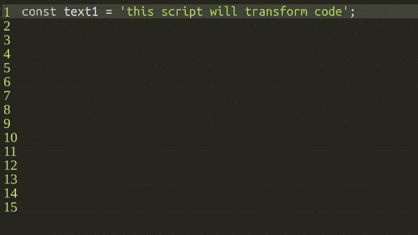
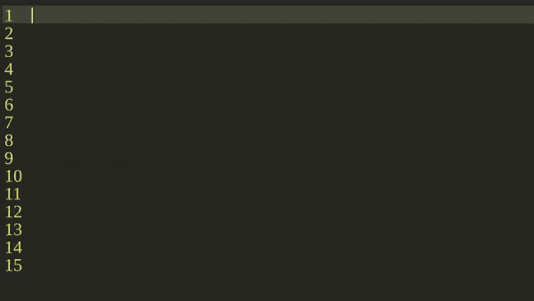

# 使用 Node.js 脚本从代码片段创建视频

> 原文：<https://javascript.plainenglish.io/create-videos-from-code-snippets-with-this-node-js-script-35ccc88dec1c?source=collection_archive---------14----------------------->

当我在制作我的游戏 Devlog 视频时，我想知道是否有什么方法可以自动将我的代码片段转换成视频，以便我可以将它们添加到我的 Devlog 中，但我找不到任何解决方案，所以我放弃了这个想法。

几周前，我在玩 [AST](https://en.wikipedia.org/wiki/Abstract_syntax_tree) 和用`Babel`通过`Node.js`渲染`React`的时候，突然想到用木偶师打开一个无头浏览器，并用我的代码片段记录一个页面。

目标是让结果看起来像下面的 GIF。

# 让我们开始编码吧

我将首先使用`node`创建一个通过终端运行的`script.js`。

我的代码将使用`ES Modules`，所以我将安装 [esm](https://www.npmjs.com/package/esm) ，这样我就可以像`node -r esm src/script.js my_file.js`一样运行我的脚本。

对于`generateVideo`功能，我将按照[木偶师的快速启动示例](https://github.com/puppeteer/puppeteer/blob/v13.0.1/docs/api.md#class-puppeteer)打开一个无头浏览器，然后用[木偶师屏幕记录器](https://github.com/prasanaworld/puppeteer-screen-recorder#example)开始记录。

这将打开一个无头浏览器标签，设置 HTML 为`
Hello World
`并制作一个 1 秒钟的视频。这不是我想要的，但我会实现的。

# 呈现 React 组件

现在我将创建一个函数，该函数接收代码片段作为参数，然后使用 [Prism.js](https://prismjs.com/) 以 HTML 格式呈现漂亮的语法高亮代码。

使用`Prism.highlight`,我可以传递一个代码字符串，并获得一个带有语法高亮代码的 HTML，以及将`React`组件呈现为一个 HTML 字符串的`renderToStaticMarkup`。我这里不需要`React`，但是由于整个创意是从`React`和`Babel`开始的，所以我保留了下来。

除了`code`，`generateHtml`函数还接收`currentLine`和`totalLines`作为参数。`currentLine`将用于高亮显示当前代码行，而`totalLines`将显示左边的行号。

# 反应组分

`CodeHighlighter`的基本实现我将简单地返回一个`code`标签，并将`dangerouslySetInnerHTML`设置为 Prism.js HTML。

上面的代码仍然缺少行荧光笔和行号，为此我将使用`totalLines`变量创建行号，使用`currentLine`创建一个全角的`div`并用`margin-top` CSS 属性移动它。在 GitHub 上查看这个`React`组件[的完整代码。](https://github.com/blopa/code-video-creator/blob/fc6836c497d5dd0a13a00f1f779fd2d482ebc611/src/CodeHighlighter.jsx)

现在，在脚本中，我可以获得语法高亮显示的 HTML 字符串，并将其设置为无头浏览器 HTML。

# 逐行显示代码

现在，我将所有代码转储到`React`组件中，但理想情况下，代码应该逐行显示，为此，我将遍历`lines`数组，然后逐行添加到一个新数组中，并将其传递给`generateHtml`函数。

这是可行的，但问题是如果代码太长，那么浏览器需要向下滚动以跟随新行，为此我需要使用循环`index`变量来跟踪当前行，并使用木偶师的`page.evaluate()`使用页面的`window`对象向下滚动页面。

# 结论

你可以在我的 GitHub repo 的 git hash[d 595 cf 30 CEC 13021 FB 857 f 9 ACB 83 a 853 e 26610d 7](https://github.com/blopa/code-video-creator/tree/d595cf30cec13021fb857f9acb83a853e26610d7)中访问这篇博文的完整代码。

该项目从这段代码开始，但现在已经有所增长，repo 的`main`分支中的当前代码对每个字母都有打字效果，这使它变得更好。在 [code-video-creator](https://github.com/blopa/code-video-creator/) 项目页面上，你可以自由地钻研代码。

我希望这对你有所启发，如果你有任何问题，请留下评论。下一集再见！

*原载于*[*https://pablo . gg*](https://pablo.gg/en/blog/coding/create-videos-from-code-snippets-with-this-nodejs-script/)

*更多内容请看*[*plain English . io*](http://plainenglish.io/)*。报名参加我们的* [*免费周报*](http://newsletter.plainenglish.io/) *。在我们的* [*社区获得独家写作机会和建议*](https://discord.gg/GtDtUAvyhW) *。*