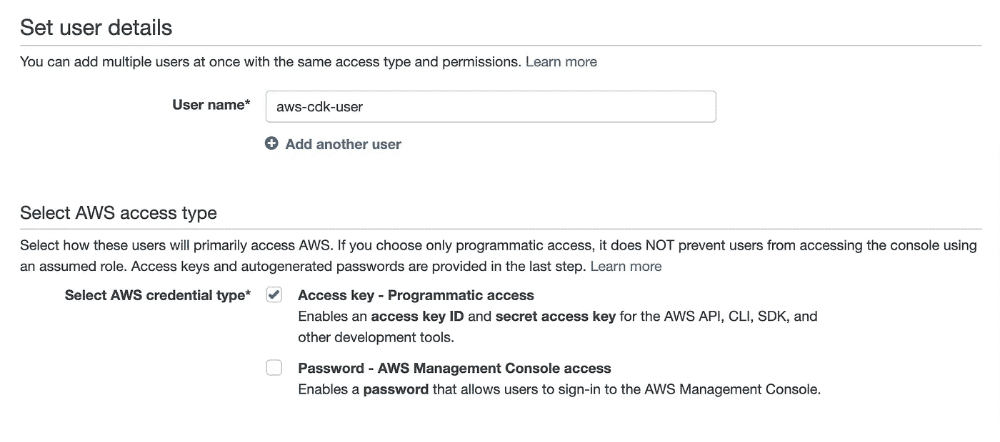
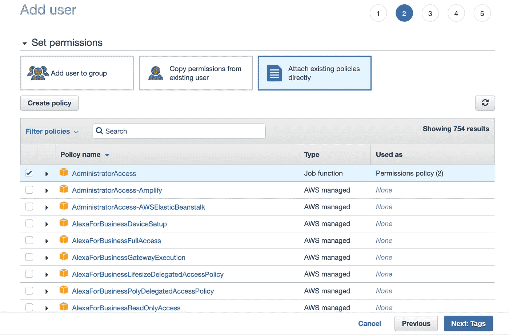
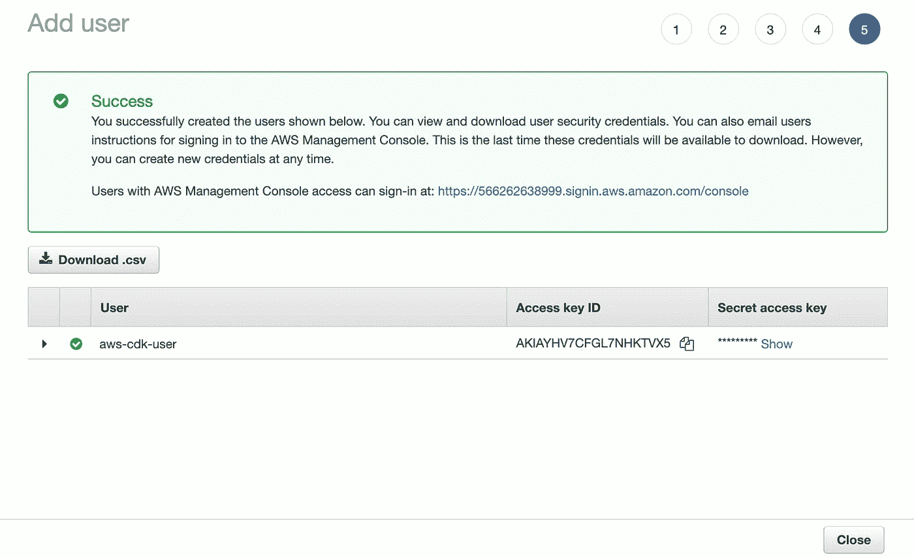
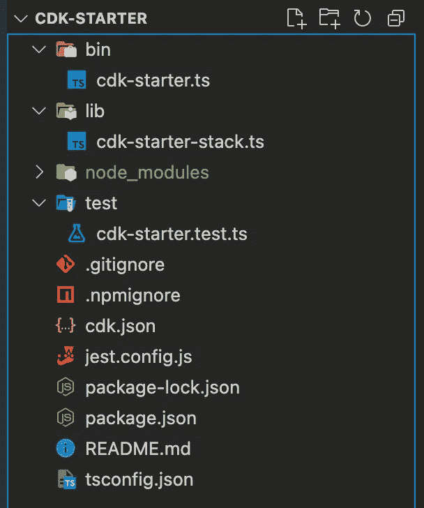
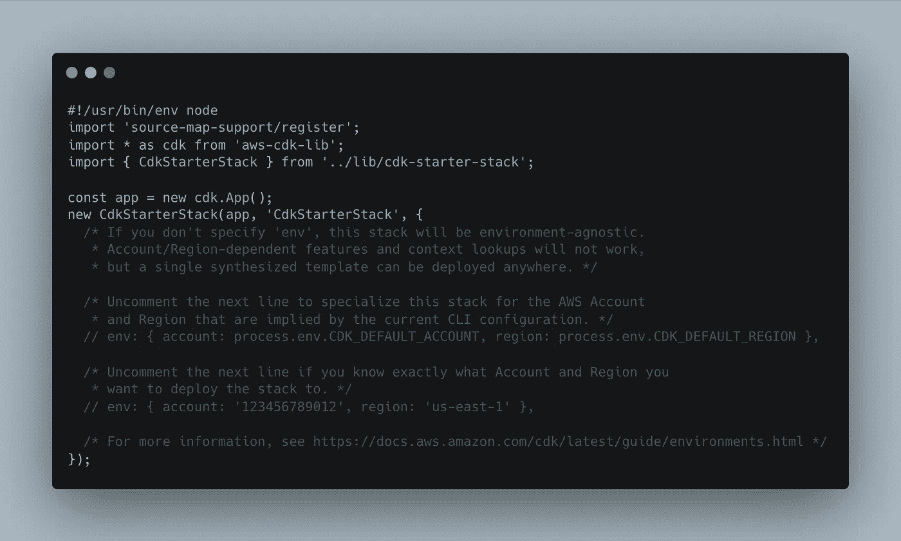
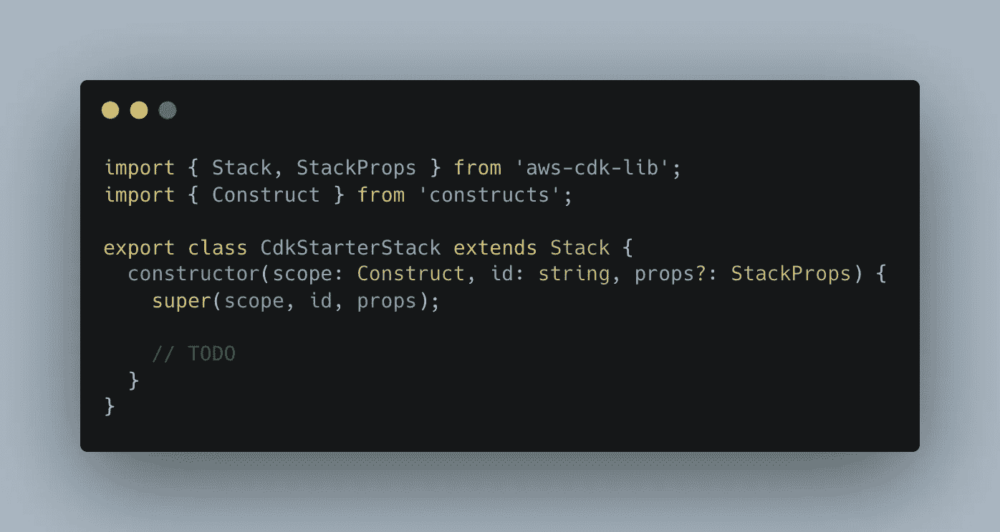
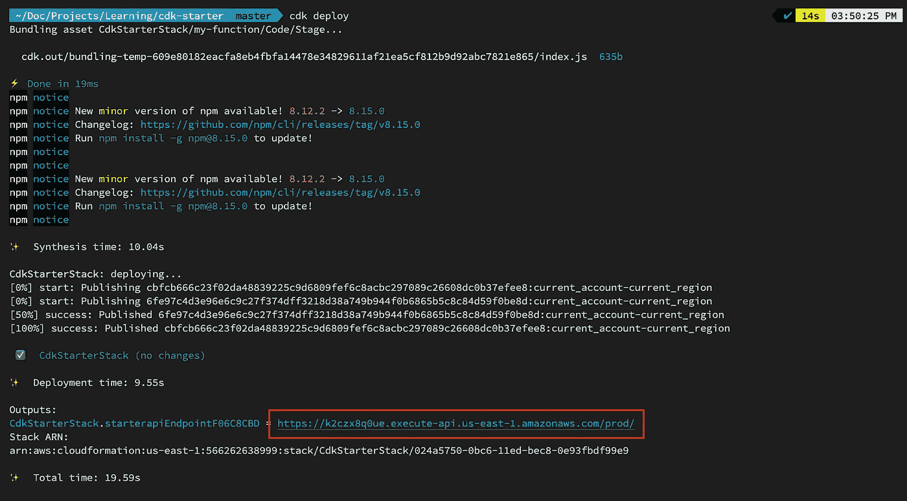
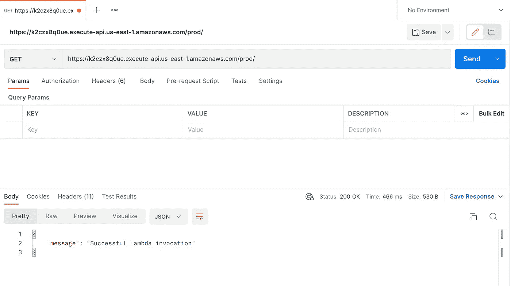

# 在 TypeScript 中创建您的第一个 AWS CDK 项目

> 原文：<https://javascript.plainenglish.io/create-your-first-aws-cdk-project-in-typescript-1dde17e59e62?source=collection_archive---------3----------------------->

## 关于如何用 TypeScript 创建你的第一个 AWS CDK 项目的教程


Photo by [lucas Favre](https://unsplash.com/@we_are_rising?utm_source=medium&utm_medium=referral) on [Unsplash](https://unsplash.com?utm_source=medium&utm_medium=referral)

在本文中，我们将在 TypeScript 中从头开始创建我们的第一个 AWS CDK 项目。因此，没有进一步的行动，让我们直接进入它。

## 先决条件

在开始我们的项目之前，我们需要在本地机器上安装一些依赖项。首先，我们需要在我们的电脑上安装[节点 JS](https://nodejs.org/en/download/) 。

接下来，我们需要在本地机器上安装 [AWS CLI](https://docs.aws.amazon.com/cli/latest/userguide/getting-started-install.html) 。我们还需要有一个 AWS 帐户。如果您没有 AWS 帐户，[免费创建一个 AWS 帐户](https://portal.aws.amazon.com/billing/signup)。

下一步也是最后一步是安装 AWS CDK 工具包。您可以通过在终端中键入以下命令来安装它:

```
npm install -g aws-cdk
```

## 配置管理用户

如果您还没有，我们的下一步是在 AWS 中创建一个管理用户。

要创建新的管理用户，请转到 AWS IAM 控制台并单击[添加用户](https://console.aws.amazon.com/iam/home?#/users$new)。

键入您的用户名，然后单击“编程访问”



点击“下一步”后，从“设置权限”选项卡中选择“直接附加现有策略”，并选择“管理员访问权限”



单击“下一步”按钮后，让我们跳过“标签”部分。继续点击“下一步”按钮，直到它显示“创建用户”现在，点击“创建用户”按钮。之后，它应该显示如下图所示:



现在，**暂时不要关闭这个页面**。在您的 PC 上，转到您的终端，键入以下命令:

```
aws configure
```

它应该询问访问密钥 ID、秘密访问密钥、区域名称和输出格式。从网站上粘贴访问密钥 ID 和秘密访问密钥。您可以选择任何区域名称，如`us-east-1`、`eu-west-1`，暂时将输出格式留空。

## 创建新项目

配置完所有设置后，就该创建一个新的 AWS CDK 项目了。让我们到您的终端，在我们的项目目录中，为我们的 CDK 项目创建一个新文件夹。我们可以使用下面的命令创建一个新文件夹，并将其移入该目录:

```
mkdir cdk-starter && cd cdk-starter
```

现在，键入以下命令创建一个新的 TypeScript CDK 项目:

```
cdk init app --language=typescript
```

## 项目结构

完成`cdk init`后，让我们进入代码编辑器，看看项目结构。它应该类似于下面的内容:



让我们细分每个文件及其代表的内容:

1.  `bin/cdk-starter.ts`:



cdk-starter.ts

这是您的应用程序的入口点。这里，我们从`lib/cdk-starter-stack.ts`文件中加载`CDKStarterStack`类的实例。

2.`lib/cdk-starter-stack.ts`:



cdk-starter-stack.ts

这是我们申请的主要文件。在这里，我们将集成 AWS 的所有基础设施。

现在，让我们在终端中执行以下命令，生成 YAML 文件中的所有基础设施代码:

```
cdk synth
```

您会看到一个名为`cdk.out`的新文件夹生成。

此外，当我们启动一个新的 CDK 项目时，我们只需要执行下面的命令一次。

```
cdk bootstrap
```

该命令将在我们的 AWS 帐户中创建 CDK 工具包。

## 让我们创建第一个λ函数

现在，让我们创建第一个λ函数。首先，让我们从终端中的以下命令安装`aws-lambda`:

```
npm install aws-lambda
npm install --save-dev @types/aws-lambda
```

我们将在 TypeScript 中创建我们的 Lambda 函数。因此，我们将需要另一个包，esbuild，将我们的 TypeScript 代码编译成 JavaScript。我们可以通过运行以下命令来安装此软件包:

```
npm install --save-dev esbuild
```

让我们在`src/lambda/handlers`文件夹中创建一个新的λ函数。我们将这个文件称为`index.ts`。我们把下面的代码粘贴到`index.ts`中:

让我们也改变`cdk-starter-stack.ts`文件来增加我们的λ函数:

我们刚刚将我们的 lambda 函数链接到 API 网关，以将这个 Lambda 函数调用到 API。

现在，让我们运行`cdk synth`来生成我们的基础设施文件，然后运行`cdk deploy`来将我们的应用程序部署到云中。

在成功地将我们的应用程序部署到云中之后，我们将在我们的终端中获得一个 URL。让我们通过点击终端来测试我们的应用程序，我们应该会看到来自 lambda 函数的消息:



## 结论

我们已经成功地用 TypeScript 创建了我们的第一个 AWS CDK 应用程序。这很简单也很有趣！

下一步是通过在代码中构建额外的基础设施和构建现实世界的解决方案来让我们的手变得更脏。

我希望你喜欢我的文章。祝你有愉快的一天！

## 参考

1.  [https://cdkworkshop.com/](https://cdkworkshop.com/)

*通过*[***Linkedin***](https://www.linkedin.com/in/ludehsar/)*或* [***与我联系，我的网站***](https://rashedul-alam.com/) *。*

*更多内容请看*[***plain English . io***](https://plainenglish.io/)*。报名参加我们的* [***免费周报***](http://newsletter.plainenglish.io/) *。关注我们关于*[***Twitter***](https://twitter.com/inPlainEngHQ)**和*[***LinkedIn***](https://www.linkedin.com/company/inplainenglish/)*。查看我们的* [***社区不和谐***](https://discord.gg/GtDtUAvyhW) *加入我们的* [***人才集体***](https://inplainenglish.pallet.com/talent/welcome) *。**