# 创建您的第一个 NPM 包并将其发布到 Gitlab 注册表中

> 原文：<https://javascript.plainenglish.io/create-your-first-npm-package-and-publish-it-into-gitlab-registry-94eec41e0770?source=collection_archive---------1----------------------->

## 如何创建您自己的 npm 包，其中包含并集合了一组您希望在多个项目中重用的方法


在使用 NodeJS 开发您的 web 应用程序时，您可能会注意到各种 NPM 包和库的存在，这使得开发过程更加容易。这些包帮助我们降低项目的复杂性，并允许我们毫无争议地重用开源方法。

因此，如果您曾经想知道如何创建自己的 npm 包，包括并组装一组您想要在多个项目中重用的方法，那么您就找对地方了！

# 待办事项列表

1.  创建国家预防机制包🎉
2.  设置单元测试(可选)✅
3.  设置文档生成(可选)📝
4.  创建/配置 Gitlab 存储库以发布 NPM 包🔧
5.  设置。gitlab-ci 管道👷
6.  推送和发布我们的 npm 包🚀！！
7.  如何在其他项目中安装我们的项目？➕

## 关于这个例子

我们将创建的包提供了一些关于计算最常见几何形状的表面积的基本数学运算:三角形、正方形、矩形和圆形。

# 🎉创建国家预防机制包

## 答。初始化项目

第一步是创建国家预防机制项目，并使其在本地运行。所以让我们首先创建一个名为`sb-geometry-plugin`的文件夹。然后，初始化它:

```
# Create package.json file
$ npm init
```

这将要求我们填写一些信息(见下图)

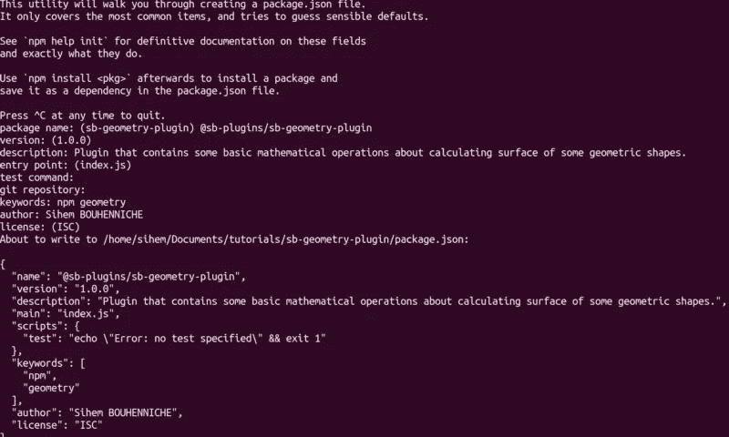

Initialize package

## b.安装开发依赖项

然后，我们应该安装一些必需的和可选的开发依赖项，这将有助于我们轻松地构建软件包。为此，我们需要:

*   `**webpack**`是一个模块捆绑器，`**webpack-cli**`是一个使用`webpack`的命令行工具。通过使用`webpack`,我们也应该在捆绑之前使用`babel-loader`将我们的 ES6 代码传输到 ES5。

```
$ npm i --save-dev webpack webpack-cli [@babel/core](http://twitter.com/babel/core) babel-loader
```

*   `**jest**`用于编写 jest 测试用例(可选)。

```
$ npm i --save-dev jest
```

*   `**prettier**`、`**eslint-plugin-prettier**`和`**eslint-config-prettier**`用于林挺和格式化我们的代码(可选)。

```
$ npm i --save-dev prettier eslint-plugin-prettier eslint-config-prettier
```

*   `**documentation**`用于自动生成文档(可选)。

```
$ npm i --save-dev documentation
```

## c.初始化 git 储存库

现在我们应该初始化我们的 git 存储库并添加*。gitignore 具有以下内容的*文件:

```
$ git init
$ git add *
$ git commit -am "Initialize project"
```

## d.开始编码

我们项目的初始结构如下图所示:

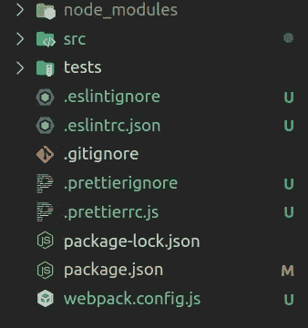

正如您在图片中看到的，我们的项目包含一堆文件和文件夹。现在让我们解释一下每一个的内容和用途。

*   这些文件是用来设置 beauty+ESLint 的。漂亮是用来自动格式化我们的代码，以加强自以为是的代码格式，ESLint 确保我们的代码风格保持良好的形式。

*   `**webpack.config.js**` : Webpack 配置文件，它定义了如何捆绑我们 JavaScript 代码并为生产做准备。

*   `**/src/methods**`:包含 3 个文件，每个文件导出一个特定几何形状面积的计算公式。

*   `**index.js**`:包的入口点，它导出我们的工具方法。

# ✅设置单元测试(可选)

我们将使用 Jest 框架来编写 3 个方法的单元测试。为此，让我们创建`/tests`文件夹，并开始编写我们的测试用例:

在运行测试之前，我们应该在`package.json`文件中配置单元测试:

```
...
"scripts" : { "test": "jest --coverage --passWithNoTests" // Run tests
},
"jest": { // jest configuration "verbose": true, "testEnvironment": "node"
}...
```

之后，我们可以运行我们的测试，并在`/coverage`中获得覆盖率报告:

```
$ npm run test
```

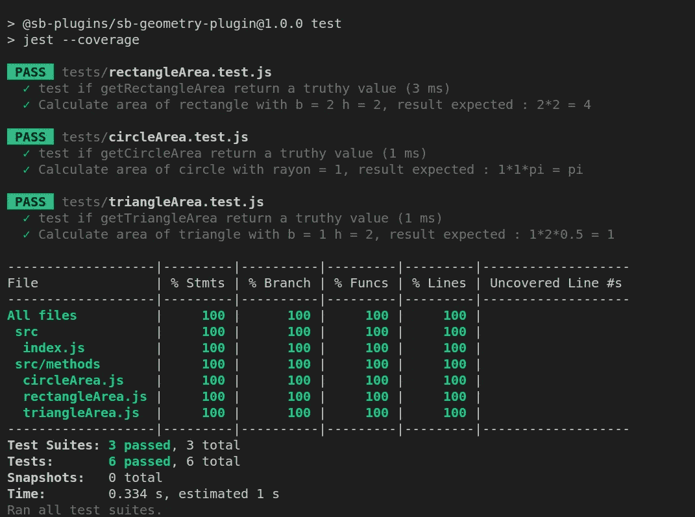

Output of running unit tests

# 📝设置文档生成(可选)

通过使用文档工具，我们可以从包含在代码中的 jsDoc 注释中自动生成代码文档。

因此，让我们给我们的`package.json`文件添加一些脚本:

```
.....
"scripts": { "docs:clean": "rimraf docs", **// Delete /docs folder** "docs:build": "npm run docs:clean && documentation build src/**           -f html -o docs", **// Build documentation** "clean": "rimraf dist", **// Delete /dist folder** "build": "npm run clean && webpack --mode production", **// Build project** "prepare": "npm run build && npm run docs:build", **// Prepare project for production** "test": "jest --coverage --passWithNoTests" **// Run tests**},.....
```

现在，我们只需运行相应的脚本，就可以轻松地测试、构建和生成项目文档。例如，为了构建包并为生产做准备，我们只需运行:

```
$ npm run prepare
```

这将生成两个文件夹:

*   **/dist** :代码的发行版本
*   **/docs :** 包含代码文档

# 🔧创建 Gitlab 存储库

首先，我们首先创建一个名为“sb-geometry-plugin”的空白 Gitlab 项目。


然后我们推出我们的代码。

```
$ git remote add origin [git@gitlab.com](mailto:git@gitlab.com):xxxxxxx/sb-geometry-plugin.git
$ git push --set-upstream origin master
```

# 👷设置。gitlab-ci 管道

现在，我们将使用 Gitlab CI/CD 工具来管理我们的工作流程。根据官方文档，GitLab CI/CD 是一个使用连续方法进行软件开发的工具。

通过使用 GitLab CI/CD，我们可以为构建和测试我们的项目定义一个管道，有关它如何工作的更多信息，您可以查看[官方文档。](https://docs.gitlab.com/ee/ci/introduction/index.html)

因此，让我们用以下内容创建一个名为`.gitlab-ci.yml` 的文件:

我们的管道包含 4 个阶段，每个阶段负责完成一项任务。

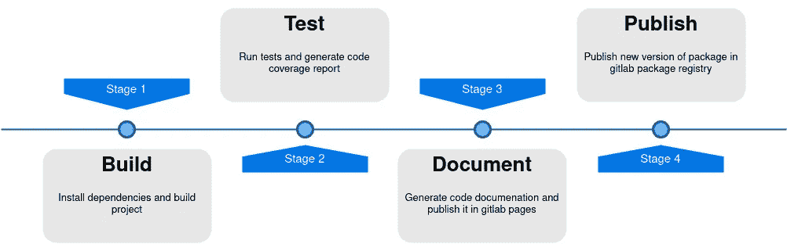

# 🚀推送并发布我们的 npm 包！！

如果你现在尝试直接推送我们的代码，你会看到 Gitlab 直接检测到我们的管道并开始运行它(请看下图)。

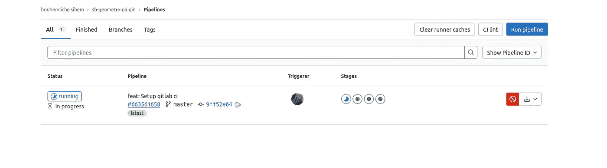

糟糕，当他试图发布一个新的包**时，我们的管道失败了😭。**但是为什么呢？？

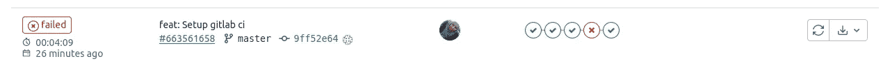

别慌，完全正常。事实上，我们的项目需要更多的配置来访问 Gitlab 注册表。

## a.语义释放

我们要做的第一件事是使用一个叫做 semantic-release 的伟大工具，这个工具帮助我们根据 Git 提交来管理何时发布新版本，更多信息请看[这个](https://docs.gitlab.com/ee/ci/examples/semantic-release.html)。

所以让我们安装它:

```
$ npm install semantic-release @semantic-release/git @semantic-release/gitlab @semantic-release/npm --save-dev
```

在安装了所需的包之后，我们需要使用一个名为`.releaserc.json`的配置文件来配置语义发布

然后，让我们通过以下方式更新我们的 package.json 文件:

1.  将项目重命名为:`@your_scope/project_name`
2.  将主文件更改为:`"main": "dist/index.js"`
3.  添加新脚本:`"semantic-release": "semantic-release"`
4.  添加 publishConfig 条目:

```
"publishConfig": {"@your_scope:registry": "https://gitlab.com/api/v4/projects/40114401/packages/npm/"},
```

## b.创造。npmrc 文件

> npm 从命令行、环境变量和`npmrc`文件中获取配置设置

要从外部注册表安装一个包(在我们的例子中是 Gitlab ),我们需要告诉 npm 应该从哪里安装我们的包。为此，我们创建了一个名为。npmrc 在我们项目的根中。

您会注意到:

*   我们的范围包是:`@sb-plugins`
*   我们指定我们的包在 gitlab 注册表中发布。
*   对于 project_id 你可以在项目的设置里找到(看下图)

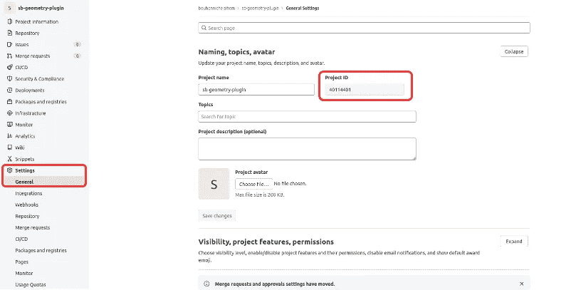

*   最后，你可能会被问及`CI_JOB_TOKEN`。答案是:

> 当管道作业即将运行时，GitLab 会生成一个唯一的令牌，并将其作为`[CI_JOB_TOKEN](https://docs.gitlab.com/ee/ci/variables/predefined_variables.html)` [预定义变量](https://docs.gitlab.com/ee/ci/variables/predefined_variables.html)注入。

## c.生成个人访问令牌

配置太多？我有一个好消息:这是最后一步😃

> 作为发布包的一部分，语义发布增加了`package.json`中的版本号。为了让 semantic-release 提交这个变更并将其推回 GitLab，管道需要一个名为`GITLAB_TOKEN`的定制 CI/CD 变量。

要创建这个变量，检查[这个](https://docs.gitlab.com/ee/ci/examples/semantic-release.html#set-up-cicd-variables)。

最后，提交你的修改，然后再推一次🥁🥁🥁.

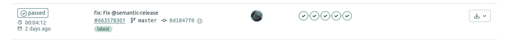

我们的管道成功了，如果您检查您的项目注册表，您会找到您的包:

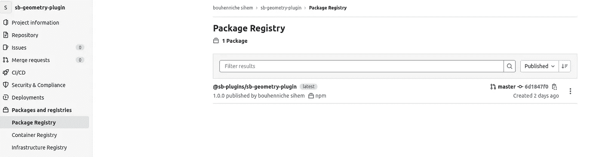

# ➕如何在其他项目中安装我们的软件包？

如果我们不能在其他项目中使用我们的包，我们所做的一切都没有意义。但是，怎么做呢？

如果您尝试使用 npm 直接安装它，将会出现以下错误:

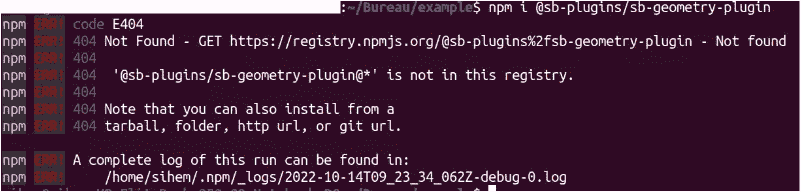

事实上，npm 在 npm 注册表中搜索我们的包，这就是为什么我们没有找到错误。

为了解决这个问题，我们应该告诉 npm 我们想从 gitlab 注册表安装这个包。因此，让我们创建 npm 配置文件。

现在尝试再次安装软件包:

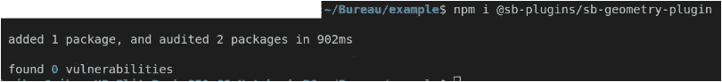

## ***加成*** 🎁

如果您想保持您的包的私密性:

*   将您的项目设为私有
*   使用您生成的个人访问令牌 GITLAB_TOKEN 将包安装到所需的项目中(只需取消。npmrc 文件)

感谢您的阅读，如果您有任何问题或意见，请不要犹豫，在下面留下您的评论。

*   链接到 Gitlab 项目:[https://gitlab.com/sihemBouh/sb-geometry-plugin](https://gitlab.com/sihemBouh/sb-geometry-plugin)
*   Gitlab 页面中生成文档的链接:[https://sihembouh.gitlab.io/sb-geometry-plugin/](https://sihembouh.gitlab.io/sb-geometry-plugin/)

*更多内容请看*[***plain English . io***](https://plainenglish.io/)*。报名参加我们的* [***免费周报***](http://newsletter.plainenglish.io/) *。关注我们关于*[***Twitter***](https://twitter.com/inPlainEngHQ)[***LinkedIn***](https://www.linkedin.com/company/inplainenglish/)*[***YouTube***](https://www.youtube.com/channel/UCtipWUghju290NWcn8jhyAw)*[***不和***](https://discord.gg/GtDtUAvyhW) *。对增长黑客感兴趣？检查* [***电路***](https://circuit.ooo/) *。***