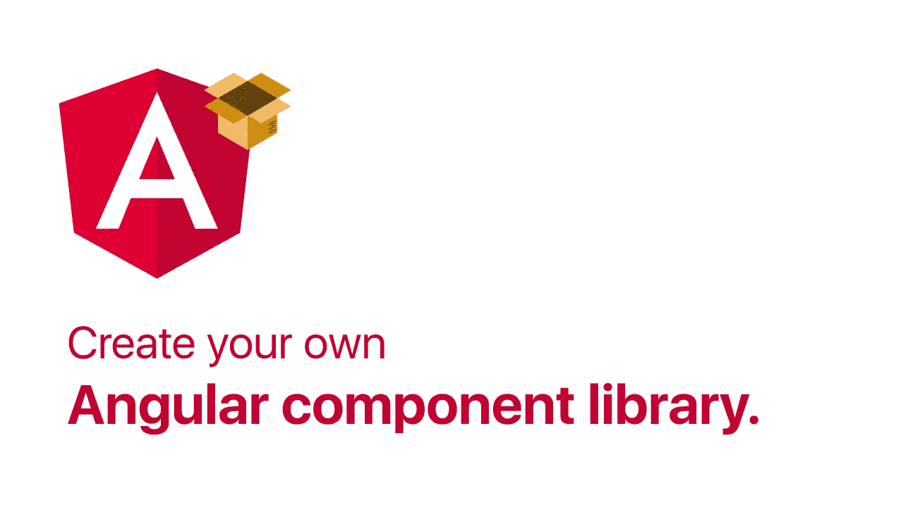
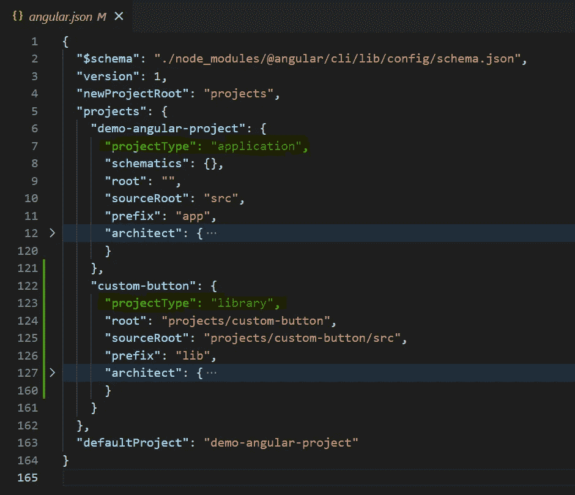
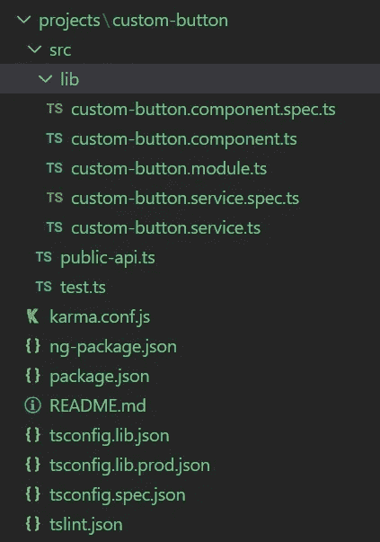
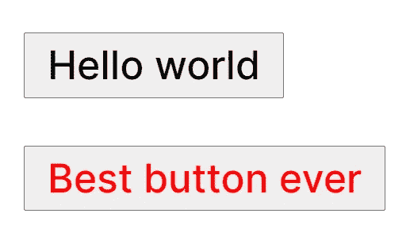
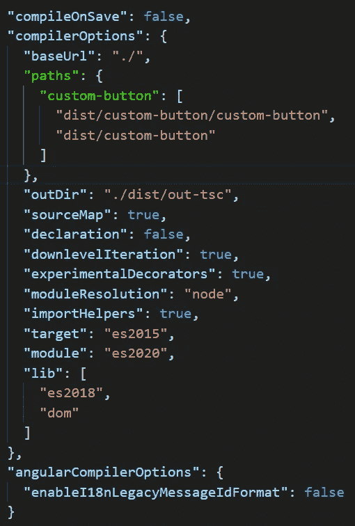
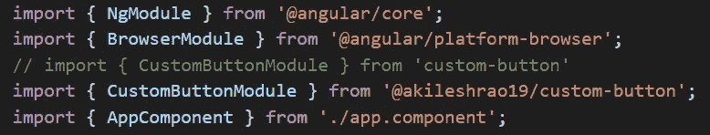
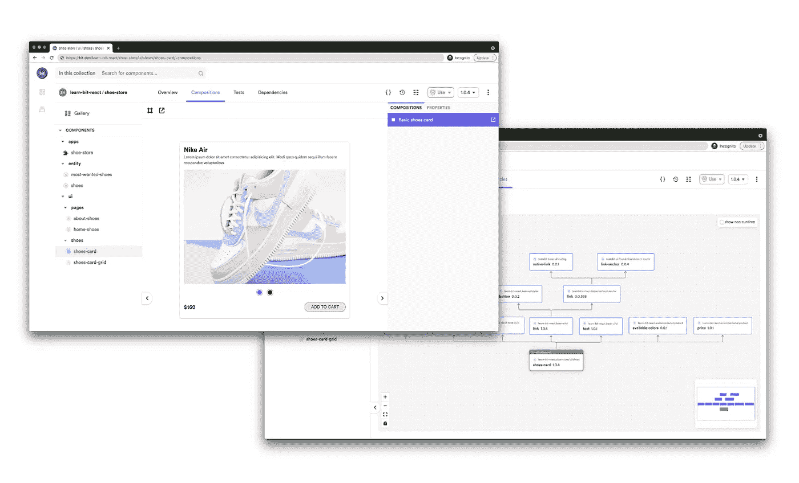

# 创建您自己的角度组件库

> 原文：<https://javascript.plainenglish.io/create-your-own-angular-component-library-e5f062b902a8?source=collection_archive---------2----------------------->



跨不同项目重用前端组件是一个只有少数开发人员才有的小技巧。它使你的代码更具可读性(如果做得正确的话),并且总体上保持了良好的组织性。当您重用组件时，您的应用程序看起来更加一致和连贯。谷歌在这方面做得很好，它创造了大量的材料设计组件，并在多个产品中重复使用。这篇博文将涵盖构建 Angular 组件库并将其发布到 npm 商店的基础知识。

我们将为这个例子创建一个按钮组件。它会有一些选项，用户可以动态添加，以创建自己的自定义按钮。

> Youtube 上也有这个的视频版本。

## 步骤 1:项目设置

我们要创建的第一个项目将是一个典型的角度应用。最终，当我们创建一个库时，我们将把它导入到这个应用程序中。这不是关键的一步，但是它会让你理解这两种项目类型(应用程序和库)之间的主要区别。

```
ng new demo-project 
```

安装完成后，您可以通过键入以下内容来添加库

```
ng generate library custom-button
```

之后，打开 angular.json 文件，你会在“**项目**”键中找到你的两个项目。在每个项目中，会有一个“ **projectType** ”键，它将被设置为“**库**”或“**应用**”。



angular.json file

您还会在根目录中找到一个新的“**项目**”文件夹。这个项目文件夹将包含您创建的所有组件。目前，它只有一个自定义按钮组件。如果你看看这个组件库的文件夹结构，它看起来非常类似于 angular 应用程序的文件夹结构。



Library folder structure

“**public-API . ts”**文件将成为您的库的入口点。在这里，您将导出您希望用户能够使用的所有文件。因此，安装您的库的用户可以访问从该文件导出的任何文件。

## 步骤 2:创建并测试我们的组件

在您的 custom-button.ts 文件中，复制以下代码。

```
import { Component, Input } from '@angular/core';@Component({
   selector: 'lib-custom-button',
   template: `**<button [style.color]='color'>{{body}}</button>**`,
   styles: []
})export class CustomButtonComponent {
   **@Input() color: string = "#000";
   @Input() body: string = "Hello world"** constructor() { }
}
```

这是一个非常简单的角度分量。我们在模板中有一个按钮，为它的颜色和文本定制输入属性。

现在要测试这个组件，我们需要先**构建**它。这将通过清理和优化您的代码来创建一个生产就绪的工件，然后您可以将它部署到任何平台上。因此，在您的终端中键入以下命令。

```
ng build custom-button --prod
```

一旦构建过程完成，您将在根目录中找到一个“ **dist** ”文件夹。这个 dist 文件夹包含所有项目的生产版本。因此，即使当您计划部署 angular 前端应用程序(而不是库)并为其创建一个构建时，它也会出现在同一个“dist”文件夹中。

现在我们已经准备好了这个构建，我们可以在我们的项目中使用它，就像我们使用任何其他第三方库一样。它基本上就像在节点模块文件夹中一样，尽管它不是。

要在 angular 应用程序中使用该按钮，您需要首先导入它。因此，在您的 app.module.ts 中，导入您的自定义按钮模块。

```
import { NgModule } from '@angular/core';
import { BrowserModule } from '@angular/platform-browser';
**import { CustomButtonModule } from 'custom-button'** import { AppComponent } from './app.component';@NgModule({
   declarations: [AppComponent],
   imports: [BrowserModule, **CustomButtonModule**],
   providers: [],
   bootstrap: [AppComponent]
})export class AppModule { }
```

现在你可以使用你的按钮组件了，所以在你的“【app.component.html】”文件里面，复制这几行。

```
<lib-custom-button></lib-custom-button>
<lib-custom-button color='**red**' body='**Cool button**'></lib-custom-button>
```

第一个按钮将具有我们在组件内部设置的默认值。第二个按钮将有一个红色和“酷按钮”作为其文本。



Cool buttons amr

现在，我们能够正常导入它而无需将其安装在我们的项目中的原因是，在我们的" **tsconfig.json** "文件中，有这个" **paths** "键，它基本上将导入重新映射到我们提供的位置。因此，它不是像通常那样在节点模块文件夹中查找，而是在我们提供的自定义位置中查找库，当您构建项目时，该自定义位置会自动设置为您的 dist 文件夹。



tsconfig.json file

这对于测试来说是完美的，因为如果这个特性不存在，您必须首先发布这个包，然后将它安装到您的应用程序中，只有这样您才能测试它。此后，每当您对这个库进行更改时，您都必须再次执行相同的步骤，以查看更改是否有效。绝对的噩梦！

现在，您只需要在进行更改后运行 build 命令，您的库就会出现在您的 dist 文件夹中，可以进行测试了。

**PRO 提示:**如果你在你的 build 命令末尾添加了一个“ **watch** ”标志，

```
ng build custom-button --prod --watch
```

甚至不用担心手动再做一遍。它会自动监听您所做的任何更改，同时为您重建项目。

## 第三步:将其发布到 NPM

既然我们已经测试了我们的生产版本，是时候将它推向 npm 商店了。在把它推向商店之前，你需要遵循几个步骤。所有这些步骤都已经在之前的博客文章中介绍过了，你可以在这里找到或者在这里找到[视频](https://www.youtube.com/watch?v=f0h-0d6Y_94&ab_channel=AkileshRao)。

1.  **创建并登录您的 npm 帐户。**
    [你需要先创建一个 npm 账户](https://www.npmjs.com/signup)。注册后，您需要在 VSCode 中登录您的 npm 帐户。因此，在您的终端中，键入“ **npm 登录**”。它会要求您提供注册帐户时填写的同一组凭据。一旦完成，你就可以进入下一步了。
2.  **给包添加一个作用域。** NPM 不允许两个包有相同甚至相似的名字。所以您需要在您的包中添加一个作用域，这将使您的包名唯一。在这种情况下，范围将是您的用户名。因此，在您的库(不是您的应用程序)中，打开 package.json 文件。文件内的名称键当前设置为**自定义按钮。**改为@“您-用户名”/自定义按钮。所以既然我的 npm 用户名是“akileshro 19”，那么我的包名就将是“@ akileshro 19/custom-button”。同样，这样做背后的原因在[之前的博文](https://www.youtube.com/watch?v=f0h-0d6Y_94&ab_channel=AkileshRao)中有详细解释。

完成这些步骤后，您就可以将它发布到商店了。你首先需要进入你的 dist 文件夹。一旦你到了那里

```
cd .\dist\custom-button\   //**WILL TAKE YOU INSIDE YOUR DIST FOLDER**
npm publish --access=public
```

(默认情况下，名称中带有范围的包是私有的，要发布私有包，您需要按月付费订阅。因此，我们将通过添加“ **access=public** ”标志来公开发布它。

如果你跟随并正确地做了每一件事，你会得到一个成功的回应，可能看起来像这样

```
+@YOUR-USERNAME/custom-button@0.0.1
```

你可以去 npm 的网站登录。在您的包部分，您将找到您新创建的库。

## 步骤 4:测试发布的库

现在，在 VSCode 中打开一个全新的终端，安装您的新包。所以对我来说，应该是，

```
npm install @akileshrao19/custom-button
```

你需要用你自己的库替换我的库名。一旦安装完毕，转到您的" **tsconfig.json** "文件并注释掉 paths 键。这将立即在您的" **app.module.ts** "文件中给出一个错误，因为现在 VSCode 无法找到您的库(如果您的 dist 文件夹中的项目与您安装的项目具有相同的名称和范围，您可能不会得到该错误。)



Replacing the older reference to the actual package inside node modules

现在像平常一样从 node_modules 导入包，并运行 Angular 应用程序。

```
ng serve
```

它应该和以前一样工作，但是现在您使用的是节点模块中的组件，而不是 dist 文件夹中的组件。

# 结论

至此，您已经成功地创建、测试并发布了一个角度组件到 npm 商店。这是一篇很长的帖子，对你们中的一些人来说，可能会有点困惑。如前所述，你可以随时[在这里](https://www.youtube.com/watch?v=Xs-L_QpG8OU&ab_channel=AkileshRao)观看这篇文章的视频版本。在视频中，我将带您完成相同的步骤，但您也可以看到我犯的错误以及如何避免它们。

前一篇文章更详细地介绍了 npm 相关的概念。[你可以在这里阅读](/create-and-publish-your-own-npm-module-216bffe82dc5)。

如果你有任何疑问或建议，你可以在评论中提出，或者通过下面提到的任何一个社交网站与我联系。干杯！

[YouTube](https://www.youtube.com/channel/UCaktnqx_IENyT5T2lJ3F09w)
[LinkedIn](https://www.linkedin.com/in/akilesh-rao-610357137/)
[Twitter](https://twitter.com/themangalorian)
[GitHub](https://github.com/AkileshRao)

# 用 Bit 创建自己的组件库！

与其构建单一的应用程序，不如先构建独立的组件，然后将它们组合成功能和应用程序。它使开发更快，并帮助团队构建更加一致和可伸缩的应用程序。

位为构建独立组件和编写应用程序提供了很好的开发体验。许多团队从通过独立组件构建他们的设计系统或微前端开始。
[试一试→](https://github.com/teambit/bit)

[](https://bit.dev)

An independently source-controlled and shared “card” component. On the right => its dependency graph, auto-generated by Bit.

## 进一步阅读

[](https://bit.cloud/blog/building-a-composable-ui-component-library--l33jy1vs) [## 构建可组合的 UI 组件库

### 如何构建组件库？React 组件库，包含可组合的组件。

比特云](https://bit.cloud/blog/building-a-composable-ui-component-library--l33jy1vs) 

*更多内容请看*[***plain English . io***](https://plainenglish.io/)*。报名参加我们的* [***免费周报***](http://newsletter.plainenglish.io/) *。关注我们关于*[***Twitter***](https://twitter.com/inPlainEngHQ)[***LinkedIn***](https://www.linkedin.com/company/inplainenglish/)*[***YouTube***](https://www.youtube.com/channel/UCtipWUghju290NWcn8jhyAw)***，以及****[***不和***](https://discord.gg/GtDtUAvyhW) *对成长黑客感兴趣？检查* [***电路***](https://circuit.ooo/) ***。*****