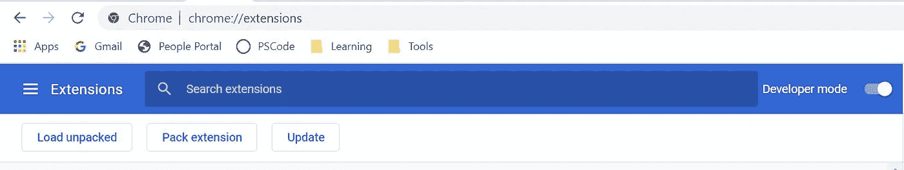
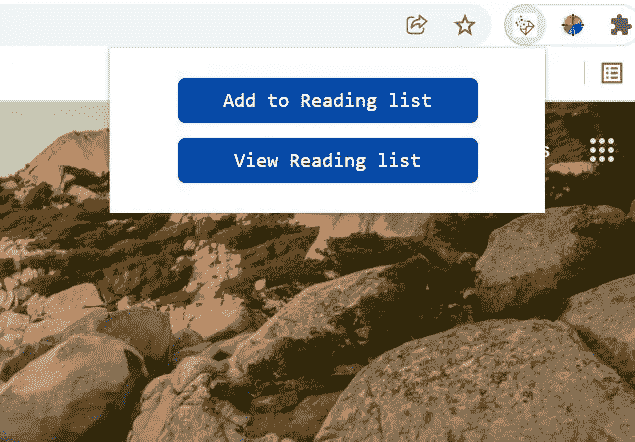
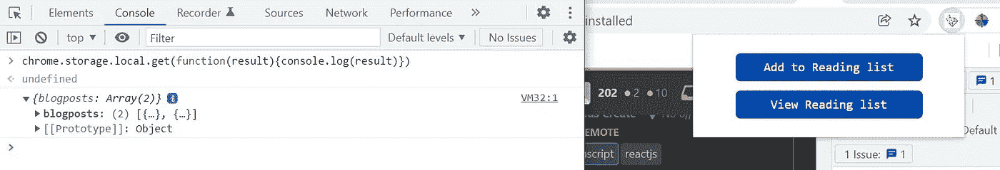
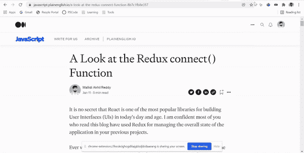

# 创建你自己的 Chrome 扩展

> 原文：<https://javascript.plainenglish.io/create-your-own-chrome-extension-bb4e93982eb5?source=collection_archive---------13----------------------->

## 如何使用 JavaScript 创建我们自己的 Chrome 扩展的指南。


Photo by [Mohammad Rahmani](https://unsplash.com/@afgprogrammer?utm_source=medium&utm_medium=referral) on [Unsplash](https://unsplash.com?utm_source=medium&utm_medium=referral)

在当今世界，我们依赖于许多 Chrome 扩展来使我们的生活更加轻松。但是你知道这些延伸是怎么做出来的吗？在这篇博客中，我们将探索创建我们自己的 Chrome 扩展的过程。


## **概念化**

每天阅读多个领域的多个博客或文章是很常见的。在保存各种领域的博客或文章的链接时，您是否遇到过任何困难，以便将来再次访问？我们正在构建的 Chrome 扩展将允许我们保存跨多个域的博客文章链接，并能够在需要时重新访问它们。

*让我们开始构建我们的 chrome 扩展吧*

***manifest . JSON****是我们需要创建的第一个文件。它是 chrome 扩展的入口点，就像 web 应用程序的 index.html 一样，它保存了与我们的 chrome 扩展 UI 相关的所有配置，所有东西都从它那里加载。*

因此，让我们在一个专用文件夹中创建一个 manifest.json 文件，在这个文件夹中，我们将与我们的扩展相关的代码分组。

```
BLOGPOSTSSAVE // Root Folder
    -> manifest.json // file
```

是时候用一些配置来堆叠这些文件了。根据我们的扩展需求，可以添加多种配置。您可以在这里 *获得所有可用配置的列表 [*。*](https://developer.chrome.com/docs/extensions/mv3/intro/mv3-overview/)*

我们现在要添加的内容如下

***名称*** *- >这是我们的扩展名，对用户可见。*

***描述*** *- >我们扩展的简短描述，我们希望在 Chrome 扩展商店中显示给用户。*

***版本*** *- >这表示我们扩展的版本。*

***manifest _ version****->这是 manifest.json 文件的版本，浏览器根据上述版本中定义的规则读取并呈现。*

我们将使用 manifest_version: 3，因为根据 Chrome 扩展文档，这是最新版本。

***图标*** *- >我们可以根据大小来指定图标的路径，这样浏览器就会在 Chrome 扩展商店中根据屏幕大小来渲染图标。*

***动作*** *- >我们可以指定我们的扩展运行时需要执行的动作列表。一些动作是默认弹出、默认图标等。*

***default _ popup****->我们可以指定当用户激活我们的扩展时，需要向用户显示为弹出窗口的 HTML 文件。*

***default _ icon****->我们可以根据大小来指定图标的路径，这样浏览器就会在地址栏附近的浏览器扩展工具栏中根据屏幕大小来渲染图标。*

*我已经将图标包含在资产文件夹中。你可以从 Github repo* [*这里*](https://github.com/itzzmeakhi/blog-posts-save/tree/main/assets) *下载。*

我们的 manifest.json 文件如下所示。

现在，我们将开始构建我们的 UI，创建 index.css 以及用于添加样式的 index.css 文件和用于为我们的扩展添加功能的 script.js 文件。

这个想法是创建两个按钮，一个用于添加链接，另一个是查看主视图保存的链接，另一个视图显示用户保存的所有链接。

要将我们的扩展添加到浏览器中，请转到 Chrome Extensions 选项卡，打开开发人员模式，单击 load unpacked，然后选择我们的代码所在目录的路径。



*注意:对于我们在代码中所做的每一个改变，都要反映在扩展中，我们需要点击 update 然后运行扩展。*

现在我们的扩展将会出现在 chrome 扩展图标中，在 URL 标签之后。这样你就可以把它钉住并使用它。我们扩展的外观和感觉如下。



好啊，我们已经创建了我们的第一个 chrome 扩展。感到兴奋吗？尽管如此，还有很多要补充的。它现在就像一个静态的 UI 应用程序，我们需要添加 JavaScript 才能使它具有功能:)

现在让我们开始构建添加到阅读列表的功能。为此，我们需要获得 add button 的 DOM 节点，并添加一个 click 事件侦听器来执行我们的 add 功能。

在深入研究代码之前，对于每个链接，我们需要获得当前的标签 URL、标题和 favicon 图像，以使保存的列表看起来更好，更容易访问，而不是直接保存链接。我们将把链接数据存储在本地存储器中。

因此，为了访问选项卡数据和存储，我们需要通过在 manifest.json 文件中添加权限来授予扩展权限。

我们将使用 chrome tabs API 获取当前标签数据，如下所示。

```
const queryOptions = { active: true, currentWindow: true };const [tab] = await chrome.tabs.query(queryOptions);const { title, url, favIconUrl } = tab;
```

我们可以使用 chrome storage API 从本地存储中读取数据，如下所示。

```
chrome.storage.local.get(['blogposts'], function (result) { console.log(result);});
```

并将数据添加到本地存储，如下所示。

```
chrome.storage.local.set({blogposts: [...postsAdded]}, () => {console.log('blog added');});
```

这样，我们将添加 addBlog 处理程序，并将 click 事件侦听器附加到 add button DOM 节点。

现在，当我们点击任何选项卡上的添加到阅读列表按钮时，它会被添加到本地存储。在普通仓库里是找不到的。要查看它，请单击 chrome extension，在弹出窗口中右键单击并检查，然后在控制台中键入以下代码。

```
chrome.storage.local.get(function(result){console.log(result)})
```

您将能够看到您保存的链接数据。现在，当我们点击“查看阅读列表”按钮时，让我们在扩展上显示它们。



以类似的方式，我们将获得视图阅读列表按钮、按钮容器和视图列表的 DOM 节点，这样按钮容器将被隐藏，博客列表将以 JavaScript 方式显示，当单击它时导航到另一个选项卡中的博客，当单击删除链接时将其从列表中删除。

我们的 chrome 扩展几乎完成了，现在让我们添加回选项并清除所有链接以及视图列表容器中附加的事件监听器。最终的 JavaScript 代码如下所示。

最终版本:



我们需要一个 Chrome 开发者账户，一次性收费 5 美元。任何有兴趣在 Chrome store 上发表文章的人，都可以在这里一步一步地完成这个过程。

就是这样！我们构建了自己的 Google Chrome 扩展。

[Github repo](https://github.com/itzzmeakhi/blog-posts-save) 中的最终代码。

它是一个开源软件，你可以通过添加任何额外的特性来为它做出贡献。

希望这是有用的
一个❤️将是可怕的😊

*更多内容看* [***说白了就是 io***](http://plainenglish.io/) *。报名参加我们的* [***免费周报***](http://newsletter.plainenglish.io/) *。在我们的* [***社区不和谐***](https://discord.gg/GtDtUAvyhW) *获得独家获取写作机会和建议。*