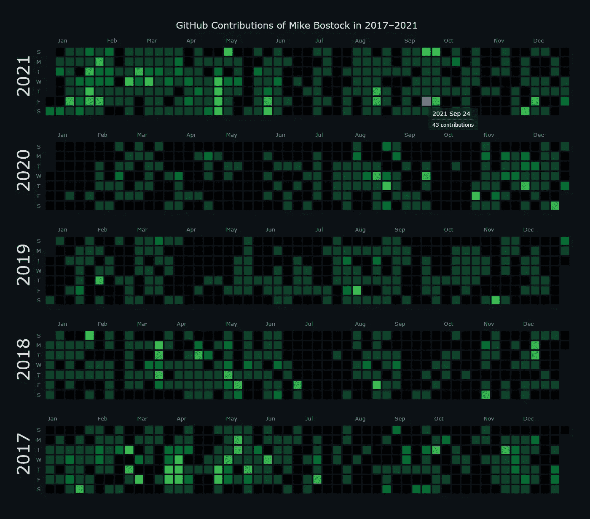

# 用 JavaScript 创建一个日历图表——可视化 Mike Bostock 在 GitHub 上的贡献

> 原文：<https://javascript.plainenglish.io/creating-a-calendar-chart-in-js-visualizing-mike-bostocks-contributions-on-github-638eab52bdb2?source=collection_archive---------12----------------------->


**日历图是一种用图形表示一段时间内活动的有效方式。它可以很好地显示一个数量如何随日、周、月和年而变化。如果您想学习使用 JavaScript 轻松构建时尚的交互式日历图表，欢迎来到我的分步教程！**

为了使本指南不仅具有教育性，而且具有娱乐性，我决定复制 [GitHub 的日历图](https://docs.github.com/en/account-and-profile/setting-up-and-managing-your-github-profile/managing-contribution-graphs-on-your-profile/viewing-contributions-on-your-profile#contributions-calendar)，并可视化 [Mike Bostock](https://en.wikipedia.org/wiki/Mike_Bostock) 的库贡献活动，Mike Bostock 是一位著名的计算机科学家，全球知名的开源 JavaScript 图表库 [D3.js](https://d3js.org/) 和交互式数据可视化开发平台 [Observable](https://observablehq.com/) 的创建者之一。所以，我们也会看到他在这方面的表现！

# 将创建的日历图表

在做任何事情之前，让我通过展示 Mike Bostock 的贡献的漂亮的基于 JavaScript 的日历图表让你兴奋起来，这个图表将在本教程中创建。请继续阅读，了解它是如何构建的！


# 基本交互式 JS 日历图表

交互式 JavaScript 日历图表看起来可能有点复杂。但是只要遵循这四个基本步骤，你就能很容易地建造一个。

1.  创建一个 HTML 页面。
2.  添加所需的 JS 文件。
3.  包括数据。
4.  添加一些 JavaScript 图表代码。

## 1.创建 HTML 页面

让我们从最基础的开始，创建一个 HTML 页面来呈现我们的 JS 日历图表。

在这个页面上，添加一个具有唯一 id 属性的`div`元素，以便在以后的代码中可以很容易地引用它。

对于图表的整页渲染，将`div`的宽度设置为 100%。当然，您可以根据自己的喜好进行更改。

```
<html>
  <head>
    <title>JavaScript Calendar Chart</title>
    <style type="text/css">      
      html, body, #container { 
        width: 100%; margin: 0; padding: 0; 
      } 
    </style>
  </head>
  <body>
    <div id="container"></div>
  </body>
</html>
```

## 2.包括所需的 JavaScript 文件

为 web 创建日历图形最快捷、最方便的方式是使用支持这种现成数据可视化的 JavaScript 图表库。

在本教程中，我们将使用 [AnyChart](https://www.anychart.com) 作为示例，可视化将按照其[日历图表文档](https://docs.anychart.com/Basic_Charts/Calendar_Chart)进行构建。这个库对于非商业用途是免费的，并且有许多不同图表类型和选项的例子。所以如果你是一个初学者，它仍然看起来很适合你开始。

在 HTML 页面的`<head>`部分包含所需的 JS 文件。这次就从 [CDN](https://cdn.anychart.com) 上取吧，不过如果你愿意也可以下载。

AnyChart 有一个固有的模块化系统。我们需要两个制图模块来创建一个日历图表:[核心](https://docs.anychart.com/Quick_Start/Modules#core)和[日历](https://docs.anychart.com/Quick_Start/Modules#calendar)。

```
<html>
  <head>
    <title>JavaScript Calendar Chart</title>
    <script src="https://cdn.anychart.com/releases/8.11.0/js/anychart-core.min.js"></script>
    <script src="https://cdn.anychart.com/releases/8.11.0/js/anychart-calendar.min.js"></script>
    <style type="text/css">      
      html, body, #container { 
        width: 100%; margin: 0; padding: 0; 
      } 
    </style>
  </head>
  <body>  
    <div id="container"></div>
    <script>
 ***// The JS calendar chart code goes here.***    </script>
  </body>
</html>
```

## 3.获取并添加数据

现在，让我们看看如何为我们的日历图表设置数据。

通过 [GitHub GraphQL API](https://github.com/mbostock) ，很容易检索任何 GitHub 用户的贡献数据——在我们的例子中，我们看到了 [Mike Bostock](https://github.com/mbostock) 。

我已经下载了它，并把它以适当的形式放在一个 JSON 数据文件[这里](https://gist.githubusercontent.com/shacheeswadia/56f3867eb6f8fcc4532e7ac458c8d9f7/raw/702f30b457cc1b573093c6977a69958fb741ede6/calendarData.json)。

为了直接加载这个文件，我们可以使用[数据适配器](https://docs.anychart.com/Quick_Start/Modules#data_adapter)。因此，它需要在我们的 HTML 页面的`<head>`部分与我们将用来创建日历图表的其他脚本一起被引用。

```
<script src="https://cdn.anychart.com/releases/8.11.0/js/anychart-data-adapter.min.js"></script>
```

我们现在已经做好了所有的准备，所以让我们进入 JS 编码部分。你不会相信仅仅几行字就能非常快速地创建一个实用的交互式日历图表！

## 4.添加 JS 图表代码

为了确保图表代码只在网页准备好的时候执行，我们必须将它包含在`anychart.onDocumentLoad()`函数中。

在内部，首先使用`data.loadJsonFile`函数加载 JSON 数据文件。

然后，用`data`参数创建一个函数，定义一个数据集变量来存储数据，映射数据，并将映射的数据传递给`calendar()`函数。

```
anychart.onDocumentReady(function() { ***// load the json file***  anychart.data.loadJsonFile(
'https://gist.githubusercontent.com/shacheeswadia/56f3867eb6f8fcc4532e7ac458c8d9f7/raw/702f30b457cc1b573093c6977a69958fb741ede6/calendarData.json', ***// create a function with the data parameter***    function(data) { ***// define a dataset variable to store the data***      var dataset = anychart.data.set(data);
 ***// map the data***      var mapping = dataset.mapAs({
        x: 'date',
        value: 'level'
      }); ***// pass the mapped data to the calendar function***      var chart = anychart.calendar(mapping); } );});
```

让我们根据日历图表的实际值动态地设置它的高度，这样当图表的高度大于页面的高度时就可以滚动了。

```
chart.listen('chartDraw', function() {       
  document.getElementById('container').style.height = chart.getActualHeight() + 'px';
});
```

最后，我们添加一个标题，让每个人都清楚可视化的内容，设置容器引用，并绘制结果图表。

```
chart.title("GitHub Contributions of Mike Bostock in 2017–2021");
chart.container('container');
chart.draw();
```

这就是我们创建基于 JavaScript 的交互式日历图表所需要做的一切！在 [AnyChart 游乐场](https://playground.anychart.com/lVYS0AHd/)查看这个初始版本。


你不认为这个日历图表看起来很酷吗？我们可以看到迈克·博斯托克每年都有大量的贡献，尤其是在 2017 年和 2021 年。在 2022 年这个新的一年，这是一个编码和创造更多的灵感！

# 高级交互式 JS 日历图表

准备好基本的交互式日历图表非常简单快捷。但这还不是全部。我们可以很容易地定制它来修改外观和感觉。

所以，让我们让这部分数据可视化更加优雅！

## 1.颜色定制

如果你看看 GitHub 上的贡献图，它用绿色阴影来表示一天中对存储库的贡献数量。我们可以尝试复制这种外观。

定义一个自定义色标，并将其设置为渲染这些颜色。颜色图例可以隐藏，因为颜色代表 GitHub 贡献中常用的颜色。另外，让我们让它看起来像在夜晚的主题，并添加一个黑暗的背景。

```
***// specify the color of the background*** chart.background('#0d1117');***// configure a custom color scale*** var customColorScale = anychart.scales.ordinalColor();
customColorScale.ranges([
  {equal: 1, color: '#0D4428'},
  {equal: 2, color: '#006D31'},
  {equal: 3, color: '#37AB4B'},
  {equal: 4, color: '#39D353'}
]);***// set the custom color scale*** chart.colorScale(customColorScale);***// hide the color legend*** chart.colorRange(false);
```

## 2.笔画、间距和其他美学变化

我们实际上可以做得更好，让我们的图表设计更类似于 GitHub 贡献日历图。

首先，去掉月份分隔线。

第二，调整日期块的间距和笔画，并改变没有数据的日期块的颜色，使其在视觉上与背景融合。

```
***// remove the stroke*** chart.months()
  .stroke(false)
  .noDataStroke(false);***// set the spacing and other options*** chart
  .days()
  .spacing(4)
  .stroke(false)
  .noDataStroke(false)
  .noDataFill('#161b22')
  .noDataHatchFill(false);
```

啊哈！这使得我们的 JS 日历图看起来就像 GitHub 的原始日历图一样！你可以在 [AnyChart Playground](https://playground.anychart.com/PnhpVbPj) 上找到交互式版本，以及完整的 HTML/CSS/JavaScript 代码。


## 3.标题和工具提示格式

让我们通过修改字体大小、粗细和颜色来使标题更加醒目。

```
var title = chart.title();
title.enabled(true);
title
  .text("GitHub Contributions of Mike Bostock in 2017–2021")
  .fontSize(22)
  .fontWeight(500)
  .fontColor("#dfdfdf")
  .padding(10);
```

默认工具提示显示标高，即定义颜色的值。但是为什么不显示贡献值呢:

```
chart.tooltip()
  .format('{%contributionCount} contributions');
```

## 4.配置年的顺序

我觉得把最近几年的数据显示的更高一些会更好。这不是问题，因为只需一行代码就可以非常简单地颠倒年份的顺序。

```
chart.years().inverted(true);
```

搞定了。看看这张令人惊叹的 JavaScript 日历图。交互式版本及其完整代码在 [AnyChart 游乐场](https://playground.anychart.com/1G3fgBR2)上。



## 5.最后一击

上面是樱桃。

经典的 GitHub 日历图表看起来棒极了。但是最后，我决定修改调色板，让它看起来超级时髦。

```
var customColorScale = anychart.scales.ordinalColor();
customColorScale.ranges([
  {equal: 1, color: '#400554'},
  {equal: 2, color: '#693699'},
  {equal: 3, color: '#7c40a9'},
  {equal: 4, color: '#9570dd'}
]);
```

看一眼下面这个教程的最终图表。然后随意查看 Mike Bostock 的 GitHub 贡献的交互式 JS 日历图 [AnyChart 游乐场](https://playground.anychart.com/8RQr8fEy/)并随意使用颜色！


# 结论

总结一下，我们刚刚看到了如何毫不费力地制作一个看似复杂的交互式 JavaScript 日历图表。继续创建您自己的这种或[不同的](https://docs.anychart.com/Quick_Start/Supported_Charts_Types)图表类型的数据可视化。请随时问我任何问题或提出建议。

随着新的一年开始，让我们承诺自己创造更多令人惊叹的可视化效果，让我们的 GitHub 贡献图看起来也很棒！

***【any Chart】感谢自由数据设计师***[***sha chee Swadia***](https://medium.com/u/9677c495a131?source=post_page-----638eab52bdb2--------------------------------)***为我们的博客创作了这个令人惊叹的 JavaScript 日历图表教程。***

***不要错过更酷的***[***JavaScript 制图教程***](https://www.anychart.com/blog/category/javascript-chart-tutorials/) ***。***

***如果您想贡献一篇客座博文，我们期待您的***[](https://www.anychart.com/support/)****。****

**最初发表于 2022 年 2 月 11 日*[***anychart.com***](https://www.anychart.com/blog/2022/02/11/calendar-chart-js/)*。**

**更多内容请看*[***plain English . io***](http://plainenglish.io/)*。报名参加我们的* [***免费周报***](http://newsletter.plainenglish.io/) *。在我们的* [***社区***](https://discord.gg/GtDtUAvyhW) *获得独家获得写作机会和建议。**