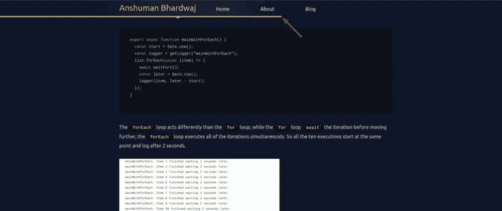

# 在 React 和 TailwindCSS 中创建读取进度条

> 原文：<https://javascript.plainenglish.io/creating-a-read-progress-bar-in-react-and-tailwindcss-34f84435ab79?source=collection_archive---------6----------------------->



最近，我在他的网站上读了一篇我最喜欢的作者的文章。我意识到他在顶部有一个阅读进度条，这有助于衡量还有多少文章需要阅读。

我认为这带来了良好的用户体验，我也应该把它添加到我个人网站上的文章中。所以，我就去做了。

# 故障

1.  找出用户**在这个页面上可以向下滚动**多少。
2.  找出用户**在页面上向下滚动了**多少。
3.  用后者除以前者得到比率。

瞧，这就是我们的滚动百分比，也就是“阅读进度”。

## 密码

```
import { useEffect, useState } from "react";

/**
 * React Hook to get the scroll percentage from the page, returns value from 0 to 100
 */
export function useReadingProgress() {
  const [completion, setCompletion] = useState(0);
  useEffect(() => {
    function updateScrollCompletion() {
      // see how much we have scrolled
      const currentProgress = window.scrollY;
      // see how much total scroll is available
      let scrollHeight = document.body.scrollHeight - window.innerHeight;
      if (scrollHeight) {
        setCompletion(
          Number((currentProgress / scrollHeight).toFixed(2)) * 100
        );
      }
    }
    // add scroll event listener
    window.addEventListener("scroll", updateScrollCompletion);

    // remove scroll event listener on umount
    return () => {
      window.removeEventListener("scroll", updateScrollCompletion);
    };
  }, []);
  return completion;
}
```

剩下的工作就是在 UI 上显示这些信息，为此，我在顶部的导航栏上显示一个进度条。

## 式样

我在我的网站上使用 TailwindCSS，用它制作进度条非常容易

```
export default function NavBar() {
  const completion = useReadingProgress();
  return (
    <nav className="sticky z-50 top-0 backdrop-blur-3xl py-2">
      <span
        id="progress-bar"
        style={{
          transform: `translateX(${completion - 100}%)`,
        }}
        className={`absolute bottom-0 w-full transition-transform duration-150 h-1 bg-yellow-400`}
      />
      {/* Rest of the NavBar */}
    </nav>
  );
}
```

我们使用`transform`和`translate` CSS 属性来制作进度条的 UI。

默认情况下，`#progress-bar`位于`NavBar`的底部，但是通过使用`translateX`，我们可以将它移动到 X 轴上。

因为我们做`translateX(${completion - 100}%)`

*   进度为 0%时，它在 X 轴上平移-100%，使其*消失*
*   进度为 100%时，它在 X 轴上平移 0%,完全显示

*暂时就这样了。希望这篇文章对你有帮助！如果您有任何反馈或问题，请随时在下面的评论中提出，我很乐意听到并解决它们。*

**

**原载于 2022 年 2 月 9 日*[*https://theanshuman . dev*](https://theanshuman.dev/articles/creating-a-read-progress-bar-in-react-and-tailwindcss-g1n)*。**

**更多内容看* [***说白了就是***](http://plainenglish.io/) *。报名参加我们的* [***免费每周简讯***](http://newsletter.plainenglish.io/) *。在我们的* [***社区***](https://discord.gg/GtDtUAvyhW) *获得独家获得写作机会和建议。**