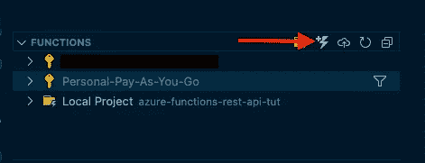

# 用 Azure 函数和 Node.js 创建 REST API

> 原文：<https://javascript.plainenglish.io/creating-a-rest-api-with-azure-functions-ee5ad3f61482?source=collection_archive---------0----------------------->

## 第 2 部分—获取、上传、删除


Azure Functions with Node.js

在本系列的第 1 部分中，我们设置了 API 并实现了 POST 请求。在本文中，我们将研究如何实现获取所有帖子的 GET 请求和另一个按 id 获取帖子的 GET 请求。我们还将实现一个更新帖子的 PUT 请求和一个设置删除帖子的 DELETE 请求。

# 获取所有帖子

要创建获取所有帖子的 GET 方法，请在 VS 代码中导航到 Azure 选项卡。由于我们已经在 Azure Functions 项目中，我们只需点击闪电图标。单击它之后，在命令面板中选择 HTTP trigger，将您的函数命名为 GetAllPosts，并将 Authorization 设置为 Anonymous。



Create New Function

## 函数. json

在 GetAllPosts 函数文件夹中，导航到 function.json 文件并删除方法数组中的“post”。这将只允许对函数的 GET 请求。

如果有成千上万的帖子，抓取表格中的每一个帖子将不会是高效的。因此，我们将指定一个路径，在那里我们可以传递带有博客名称的 URL 参数，这样我们就可以获取特定分区键下的所有内容。

```
"route": "GetAllPosts/{blog}"
```

添加这两个属性后，function.json 应该如下所示:

```
{
 "bindings": [
  {
   "authLevel": "anonymous",
   "type": "httpTrigger",
   "direction": "in",
   "name": "req",
   "methods": [
    "get"
   ],
   "route": "GetAllPosts/{blog}"
  },
  {
   "type": "http",
   "direction": "out",
   "name": "res"
  }
 ]
}
```

## 表格客户端

现在我们已经设置了绑定，让我们使用一个表客户机方法来获取特定博客的所有帖子。转到 services，table-service.js 并创建一个名为 *queryEntities 的新方法。*我们将向该方法传递一个表名和查询，使其通用化 *c.* 就像插入实体方法一样，我们将把一切都包装在承诺中，这样我们就可以使用 async/await。

然后我们将使用 SDK 来调用 *queryEntities* 方法。我们将向表服务方法传递 tableName、query、null(这是延续标记所在的位置)和以下选项，以更易读的格式返回数据:

```
{ *payloadFormat*:"application/json;odata=nometadata"}
```

最后，您的方法应该是这样的:

## 索引. js

现在回到 GetAllPosts 文件夹中的 index.js 文件。在这里，我们将在文件顶部导入 azure 和我们的 queryEntities 方法:

```
const *azure* = *require*("azure-storage");
const{ *queryEntities* }= *require*("../services/table-service");
```

接下来，让我们将整个方法包装在一个 try-catch 中。在 try 块中，我们将抓取 blog 并添加一个检查以确保它通过。之后，我们将使用 Azure Table Storage SDK 创建一个新的查询，然后调用 *queryEntities* 方法。如果我们得到了良好的响应，我们将在 *context.res* 的 body 属性中返回它们。在 catch 块中，我们将使用 *context.res* 返回一个状态 500 和一个错误消息。

GetAllPosts

# 区别详解

要为一篇博客文章创建 GET 方法，请在 VS 代码中点击 Azure 选项卡，然后点击 Functions 下的闪电图标。然后选择 HTTP trigger，将您的函数命名为 GetPost，并选择 Anonymous 作为授权级别。

## 函数. json

在 GetPost 文件夹中，打开 function.json 并删除方法数组中的“Post”。然后，在 bindings 数组中的第一个对象上添加此路由:

```
"route": "GetPost/{blog}/{id}"
```

完成所有这些后，您的文件应该如下所示:

```
{
 "bindings": [
  {
   "authLevel": "anonymous",
   "type": "httpTrigger",
   "direction": "in",
   "name": "req",
   "methods": [
    "get"
   ],
   "route": "GetPost/{blog}/{id}"
  },
  {
   "type": "http",
   "direction": "out",
   "name": "res"
  }
 ]
}
```

## 索引. js

接下来，打开 index.js。在文件中，我们将从表客户端导入 azure-storage 和 queryEntities 方法:

```
const *azure* = *require*("azure-storage");
const{ *queryEntities* }= *require*("../services/table-service");
```

然后，我们将把所有内容包装在一个 try-catch 中，并从绑定数据中获取 blog 和 id:

```
module*.*exports = *async* function (context, req) { 
 *try* {
  const{ *blog*, *id* }= *context.bindingData*; } *catch* (error) {
  *context.*res = {
   status: 500,
   body: *error.*message,
  };
 }
};
```

接下来，我们将检查 blog 和 id 是否被传递:

```
if (!blog || !id) {
 *context.*res = {
  status: 400,
  body: "Blog and Post ID are required",
 }; *return*;
}
```

然后，我们将使用 Azure storage SDK 创建一个查询，并调用我们的 queryEntities 方法。最后，我们返回结果。将所有这些放在一起，您的文件将如下所示:

GetPost — index.js

# 更新帖子

让我们像上一个方法一样创建我们的方法，方法是转到 Azure 选项卡并单击 Functions 旁边的闪电图标。然后选择 HTTP trigger，将您的函数命名为 UpdatePost，并选择 Anonymous 作为授权级别。

## 函数. json

在 function.json 中，删除方法数组中的所有内容，并替换为“put”。接下来，添加以下路线:

```
"route": "UpdatePost/{blog}/{id}"
```

您的文件应该如下所示:

```
{
 "bindings": [
  {
   "authLevel": "anonymous",
   "type": "httpTrigger",
   "direction": "in",
   "name": "req",
   "methods": [
    "put"
   ],
   "route": "UpdatePost/{blog}/{id}"
  },
  {
   "type": "http",
   "direction": "out",
   "name": "res"
  }
 ]
}
```

## 表格客户端

现在去餐桌客户端。在这里，我们将把更新写入表中。但是，首先，你应该知道，根据文档，我们可以用几种不同的方法来做到这一点:

> 有多种方法可用于更新现有实体:
> 
> `replaceEntity` -通过替换现有实体来更新它。
> 
> `mergeEntity` -通过将新的属性值合并到现有实体中来更新现有实体。
> 
> `insertOrReplaceEntity` -通过替换现有实体来更新它。如果实体不存在，将插入一个新实体。
> 
> `insertOrMergeEntity` -通过将新的属性值合并到现有实体中来更新现有实体。如果实体不存在，将插入一个新实体。

出于我们的目的，我们将使用`*mergeEntity*` 方法。

为此，我们将创建一个名为 updateEntity 的新方法，将所有内容包装在一个承诺中，使用 SDK 调用 mergeEntity，并解析或拒绝该承诺:

## 索引. js

在 index.js 文件的顶部，让我们导入刚刚创建的方法:

```
const{ *updateEntity* }= *require*("../services/table-service");
```

接下来，让我们将所有内容包装在一个 try-catch 中，在请求体上添加一些验证，创建我们的实体并调用 updateEntity 方法:

UpdatePost — index.js

# 删除帖子

现在你应该是专家了😉。因此，我们将轻松地处理这个问题:Azure Tab = > Functions = > Lightning Blot = > HTTP Trigger = > Delete Post = > Anonymous。

## 函数. json

将方法替换为“删除”并添加一条路线:

```
{
 "bindings": [
 {
  "authLevel": "anonymous",
  "type": "httpTrigger",
  "direction": "in",
  "name": "req",
  "methods": [
   "delete"
  ],
  "route": "DeletePost/{blog}/{id}"
  },
  {
   "type": "http",
   "direction": "out",
   "name": "res"
  }
 ]
}
```

## 表格客户端

添加以下方法并导出到表客户端:

deleteEntity

## 索引. js

将以下代码添加到 index.js 中以删除实体:

DeletePost — index.js

# 视频教程

Video Tutorial

# 结论

如你所见，用 Azure 函数和存储表编写 REST API 极其容易。如果你计划在你的下一个项目中使用它，请在下面的评论区告诉我们。下次再见，祝编码愉快！

*更多内容看* [*说白了。报名参加我们的*](http://plainenglish.io/) [*免费每周简讯*](http://newsletter.plainenglish.io/) *。在我们的* [*社区*](https://discord.gg/GtDtUAvyhW) *获得独家写作机会和建议。*