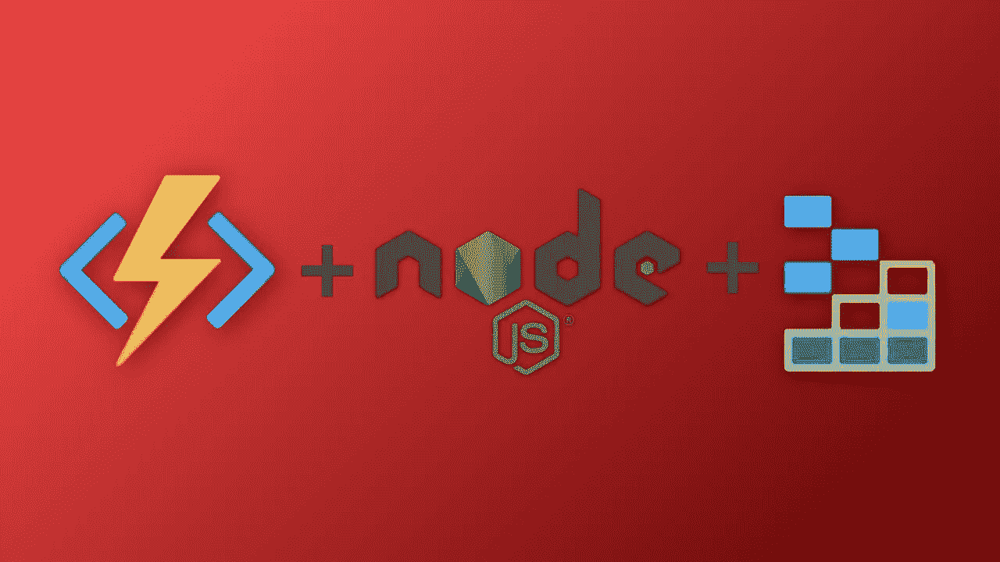
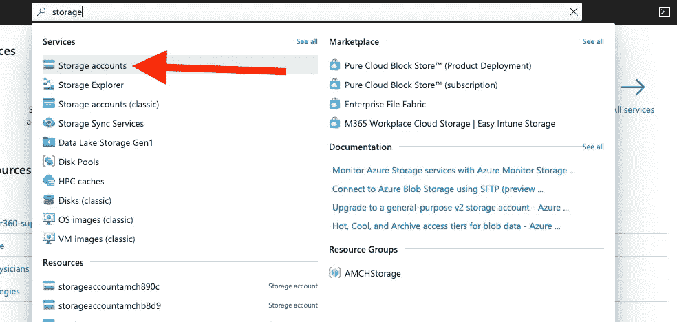
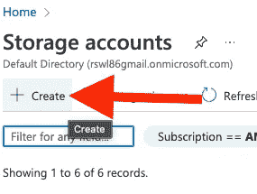
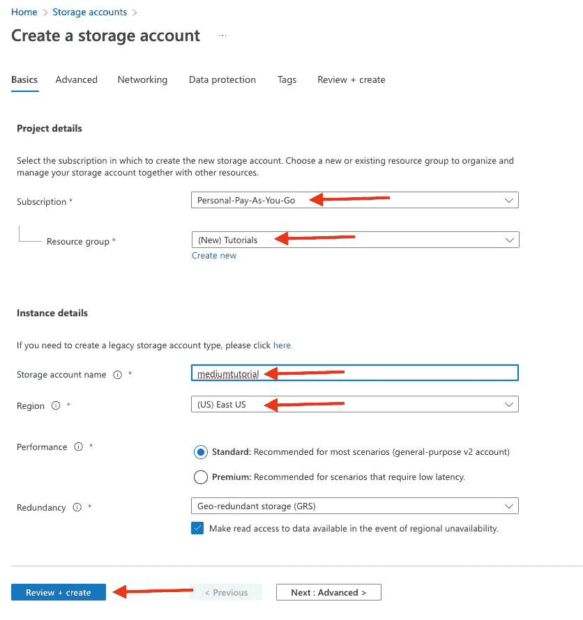
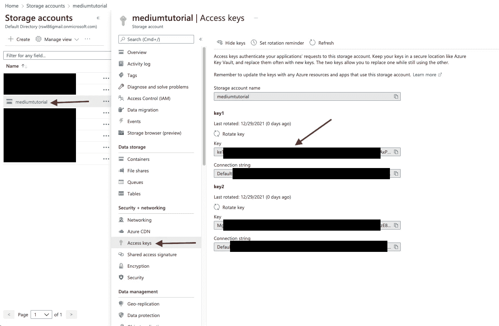
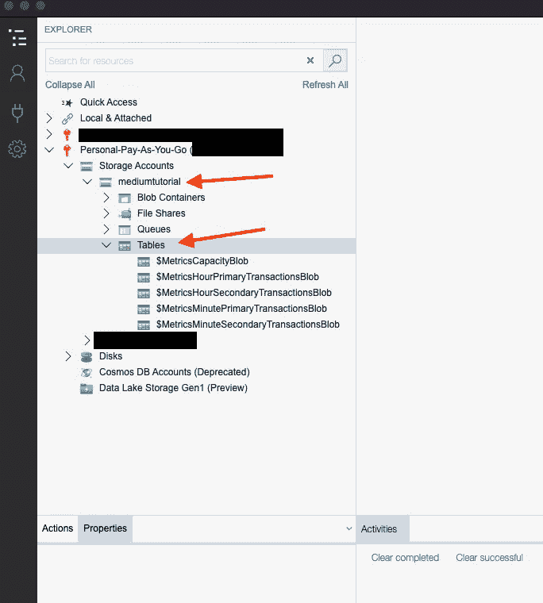
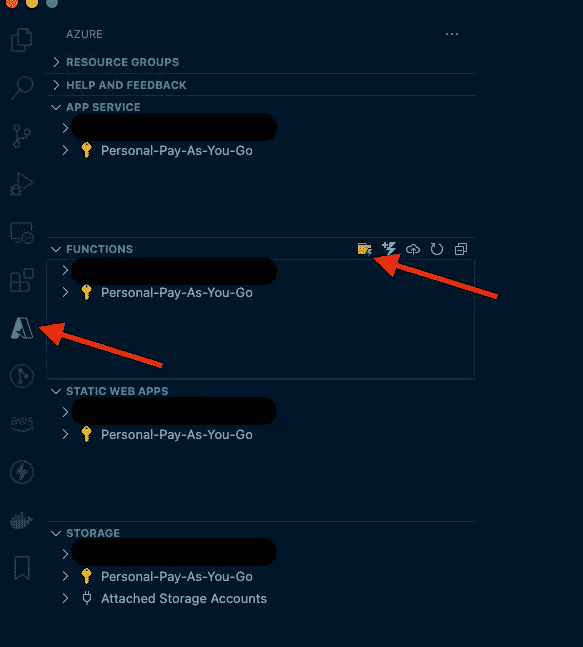
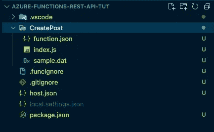

# 用 Azure 无服务器函数和 Node.js 创建 REST API

> 原文：<https://javascript.plainenglish.io/creating-a-rest-api-with-azure-serverless-functions-and-node-js-ce2f4dbe9b00?source=collection_archive---------9----------------------->

## 第 1 部分—设置和发布请求



在我的[上一篇文章](https://blog.devgenius.io/why-i-love-azure-serverless-functions-for-node-js-d03c5767eb62)中，我们看了一下为什么我喜欢为 [Node.js](https://nodejs.org/en/) 使用 [Azure 函数](https://azure.microsoft.com/en-us/services/functions/)。在本文中，我们将更进一步，为一个 [Azure 表存储](https://docs.microsoft.com/en-us/azure/storage/tables/table-storage-overview#:~:text=Azure%20Table%20storage%20is%20a,needs%20of%20your%20application%20evolve.)数据库上的 CRUD 操作创建一个 REST API。

# 入门指南

对于本教程，你需要一个 Azure 帐户。这在很大程度上是免费的，而且他们会给新用户 200 美元的积分。所以，去 https://azure.microsoft.com 注册一个账户吧。

我还将在 [VS 代码](https://code.visualstudio.com/)中使用 [Azure 扩展](https://code.visualstudio.com/docs/azure/extensions)。这使得直接从 VS 代码中创建诸如函数之类的基础设施变得简单。如果你不确定如何安装，请参考我的[上一篇文章](https://blog.devgenius.io/why-i-love-azure-serverless-functions-for-node-js-d03c5767eb62)。

除此之外，我还将使用 [Azure Storage Explorer](https://azure.microsoft.com/en-us/features/storage-explorer/) 。这个应用程序允许我们可视化我们的 Azure 存储。它将允许我们查看对 Azure 表存储数据库表的更改。

# 数据库ˌ资料库

如上所述，我们将把 Azure 表存储用于我们的数据库。这是一个使用键/值对的快速且廉价的 NoSQL 数据存储。为了获得极快的操作，它利用了分区和行键。

需要记住的一件重要事情是，分区和行键的组合必须是唯一的。您可以将分区键视为对相似记录进行分组的一种方式，将行键视为该记录的 id。通过仔细思考如何构造这两个键，我们可以从数据库中获得超快的读取。

## 入口

为了供应我们的数据库，我们需要创建一个存储帐户来保存我们的表。为此，请登录 Azure 门户，在顶部搜索存储并点击它。



Azure Storage

接下来，单击“创建”。



Storage Create

然后，您需要创建存储，方法是选择您的订阅、资源组(如果您没有资源组或想要新的资源组，请选择新的资源组)、存储帐户名、离您最近的地区，单击查看+创建，最后单击下一页底部的创建。



Creating New Storage Account

## 存取关键字

创建帐户后，我们需要获取访问密钥，以便从 Azure 函数连接到数据库表。要找到它，请返回“storage”选项卡，找到我们刚刚创建的存储帐户，单击它，然后导航到“Access Keys”。然后，复制第一个密钥并保存它以备后用。



Access Key

## Azure 存储浏览器

现在我们有了自己的存储帐户，我们可以在 [Azure Storage Explorer](https://azure.microsoft.com/en-us/features/storage-explorer/) 中打开它。首次启动时，系统会提示您登录 Azure 帐户。之后，您将在左侧导航中看到您的存储帐户。

点击账户，打开不同类型的储物空间。然后在那下面点击“表格”。在 tables 下，您会看到一些日志记录表。你可以忽略这些。



Azure Storage Tables

要创建新表，请右键单击“表”，然后单击“创建”。在这个演示中，我们将创建一个“帖子”表来存储用户的博客帖子。

# REST API

现在我们已经创建了数据库表，我们可以开始 REST API 了。为此，打开 VS 代码并导航到 Azure 扩展选项卡。在那下面，找到函数部分，点击带有闪电图标的文件夹。



Azure Functions

接下来，它将打开您的文件资源管理器，让您选择创建项目的位置。我将在桌面上创建一个名为“azure-functions-rest-api-tut”的文件夹。之后，系统会提示您回答以下问题:

1.  选择一种语言: **JavaScript**
2.  首先为你的项目选择一个模板函数: **HTTP 触发器**
3.  提供一个函数名: **CreatePost**
4.  授权级别:**匿名**
5.  选择您希望如何打开您的项目:**在当前窗口中打开**

## CreatePost 函数

现在项目创建完毕，有一个名为 CreatePost 的文件夹。在该文件夹中，您会发现代码所在的 *index.js* 文件和包含函数设置的 *function.json* 文件。



Project Layout

默认情况下，我们的函数允许 POST 和 GET 请求。对于 CreatePost 方法，我们只想允许 Post 请求。在 funciton.json 文件中，找到方法数组并删除“get”。您的文件应该如下所示:

function.json

## 餐桌服务

现在我们需要在表上编写 CRUD 操作的逻辑。为此，我们需要在项目中安装 Azure Storage SDK。要安装它，在 VS 代码中打开一个终端(Terminal => New Terminal)并运行以下命令:

```
npm i azure-storage
```

接下来，我们将在名为 services 的项目的根目录下创建一个名为的新文件夹。在该文件夹中，我们将添加一个名为 table-services.js 的文件。在该文件的顶部，我们将通过添加以下行来初始化 azure 存储:

```
var azure = require('azure-storage');
var tableSvc = azure.createTableService('myaccount', 'myaccesskey');
```

请确保用您的存储帐户名称替换“我的帐户”。因为我们不想将访问键签入到源代码控制中，所以请转到项目根目录中的 local.settings.json。在 Values 对象下，我们将添加一个名为“AZURE_STORAGE_ACCESS_KEY”的新属性，并将其值设置为我们的访问键:

```
{
 "IsEncrypted": false,
 "Values": {
 "AzureWebJobsStorage": "",
 "FUNCTIONS_WORKER_RUNTIME": "node",
 "AZURE_STORAGE_ACCESS_KEY": "your storage account access key"
 }
}
```

然后回到我们的文件，我们将改变我们的初始化方法来传递正确的值。

```
vartableSvc= *azure.createTableService*(
 "mediumtutorial",
 *process.env.AZURE_STORAGE_ACCESS_KEY* );
```

现在我们已经初始化了表服务，我们可以将文章插入到存储表中。为此，我们将创建一个名为 insertEntity 的新方法。该方法将表和实体的名称作为参数。

然后，我们将使用 SDK 来插入记录。为了返回新创建的记录，我们将设置选项 *echoContent: true* ，并从响应中剥离元数据，我们将设置*payload format:" application/JSON；odata=nometadata"*

因为 SDK 使用回调函数，而我想使用 async/await 功能，所以我将把调用包装在一个承诺中。

```
const *insertEntity* =(*tableName*, *entity*)=>{
 *return* new *Promise*((*resolve*, *reject*)=>{
 *tableSvc.insertEntity*(
  tableName,
  entity,
 { *echoContent*: *true*, *payloadFormat*: "application/json;odata=nometadata"},
  function(*error*, *result*, *response*){
   if(error){
    *reject*(error);
   }

   *resolve*(result);
  });
 });
};exports*.*insertEntity = insertEntity;
```

通过使这个方法通用化，我们可以在除了我们的博客文章端点之外的任何其他端点上使用它。

## 返回 CreatePost 函数

现在回到 CreatePost 文件夹，打开 index.js，删除除 context.res 对象之外的所有内容。在请求体中，我们将传递我们的博客帖子的详细信息，包括:用户博客的名称、标题和内容。我们将使用它们来创建要传递给表的实体。

我们还将添加一些验证，以确保我们有一个请求体，所有字段都被传递，并将所有内容包装在一个 try-catch 中。最后，您的文件应该如下所示:

# 视频教程

Video Tutorial

# 包裹

随着我们的 CreatePost 方法现在开始工作，这将结束本系列的第 1 部分。在[第 2 部分](https://diligentdev.medium.com/creating-a-rest-api-with-azure-functions-ee5ad3f61482)中，我们将致力于在 API 中添加 GET、PUT 和 DELETE 方法。所以，确保你订阅了博客，以便在文章发表时得到更多通知。下次再见，祝编码愉快！

*更多内容请看*[*plain English . io*](http://plainenglish.io/)*。报名参加我们的* [*免费周报*](http://newsletter.plainenglish.io/) *。在我们的* [*社区获得独家写作机会和建议*](https://discord.gg/GtDtUAvyhW) *。*