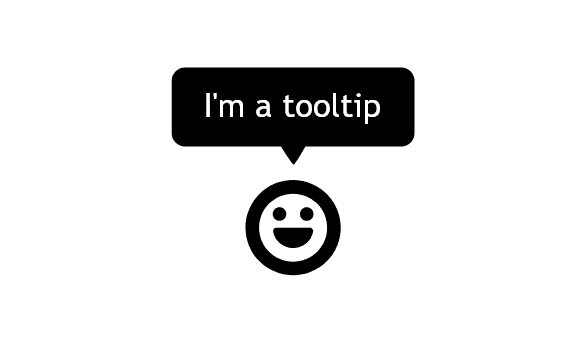
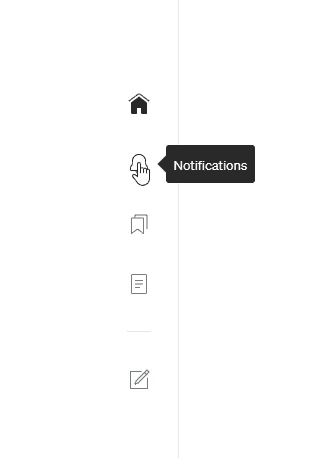
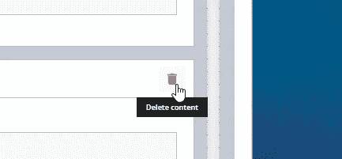

# 如何在 Angular 中创建工具提示指令

> 原文：<https://javascript.plainenglish.io/creating-a-tooltip-directive-in-angular-abfc607d52f3?source=collection_archive---------0----------------------->



工具提示是许多用户界面的重要组成部分。

在图标不能提供重要信息的地方，它们是保持界面整洁的好方法，但仍然可用。图标本身很少足以向新用户提供所有必要的功能信息。

除了已经建立的图标，比如保存图标，对于不熟悉你的界面的用户来说，描述一个按钮能做什么是很重要的。



Even Medium uses tooltips

有一段时间，我在逐个案例的基础上拼凑了不一致且混乱的工具提示实现方法。最终，我决定标准化我实现它们的方式，我创建了一个易于使用的 Angular 指令，它允许您快速地向元素添加工具提示。指令是处理工具提示的完美方式，因为它们允许我们将逻辑附加到任何元素上，而不管它的位置或样式。

## 要求

当用户将鼠标悬停在某个元素上一段时间后，工具提示会弹出文本。它应该至少保持足够长的时间让用户阅读，当用户不再停留在元素上时消失。

此外，它不应该影响页面的其余部分，无论是通过推送其他元素，还是通过修改父元素。最后，要易读、简洁。



This is what we’re going for.

## 造型

这是工具提示的 SCSS:

这里需要注意的是`pointer-events: none`，这意味着工具提示本身不会对点击或悬停事件做出反应。

这是必要的，这样工具提示就不会阻挡其他元素，尤其是它所附着的元素。

颜色、尺寸等。当然这取决于你，但是一般来说工具提示越简单越好。

## 代码

让我们从头开始。该指令有一个必需的输入，即工具提示文本本身，还有一个可选的输入，用于更改主机元素悬停和工具提示出现之间的延迟。我发现默认情况下 190 毫秒很好。构造函数接受一个`ElementRef`，这样我们就可以引用主机元素来定位工具提示。

接下来，我们有两个`HostListeners`，一个用于检测鼠标何时悬停在元素上，另一个用于检测鼠标何时离开。当鼠标进入元素时，我们将设置一个延迟来显示弹出窗口，并保留一个超时参考。如果鼠标在超时结束前离开元素，我们将清除超时，不显示弹出窗口。如果超时完成，那么我们调用`createTooltipPopup`。

函数`createTooltipPopup`为我们的 popup 元素创建 HTML，并为它分配一个类和位置。位置设置为主体元素的中间，比主体元素低 6px。由于工具提示有`position: fixed`，它不会扰乱页面上的其他元素。最后，我们添加了一个超时，在 5 秒钟后删除弹出窗口。或者，当鼠标离开宿主元素时，弹出窗口也被移除。

使用此指令，您可以简单地将工具提示附加到任何元素，例如:

```
<div *class=*"user-icon" *[tooltip]=*"'Sign In'"></div>
```

在您自己的 Angular 应用程序中随意实现这个指令，改变样式以满足您的需要。我希望这对您有所帮助；感谢您的阅读。

## 进一步阅读

[](/create-a-multi-page-job-application-form-using-angular-f0b1640f4195) [## 使用 Angular 创建多页工作申请表

### 一步一步的教程，以建立一个多页的工作申请表使用 Angular 和 SurveyJS，一个免费的，开源的…

javascript.plainenglish.io](/create-a-multi-page-job-application-form-using-angular-f0b1640f4195) [](https://plainenglish.io/blog/create-an-employee-satisfaction-survey-using-angular-and-store-results-in-a-mongodb-collection) [## 使用 Angular 创建员工满意度调查，并将结果存储在 MongoDB 集合中

### 一步一步的教程来建立一个员工满意度调查使用 Angular 和 SurveyJS，一个免费的，开源的…

简明英语. io](https://plainenglish.io/blog/create-an-employee-satisfaction-survey-using-angular-and-store-results-in-a-mongodb-collection) 

*更多内容看* [***说白了。报名参加我们的***](https://plainenglish.io/) **[***免费周报***](http://newsletter.plainenglish.io/) *。关注我们关于* [***推特***](https://twitter.com/inPlainEngHQ)[***LinkedIn***](https://www.linkedin.com/company/inplainenglish/)*[***YouTube***](https://www.youtube.com/channel/UCtipWUghju290NWcn8jhyAw)*[***不和***](https://discord.gg/GtDtUAvyhW) ***。*******

*****对缩放您的软件启动感兴趣*** *？检查* [***电路***](https://circuit.ooo/?utm=publication-post-cta) *。***