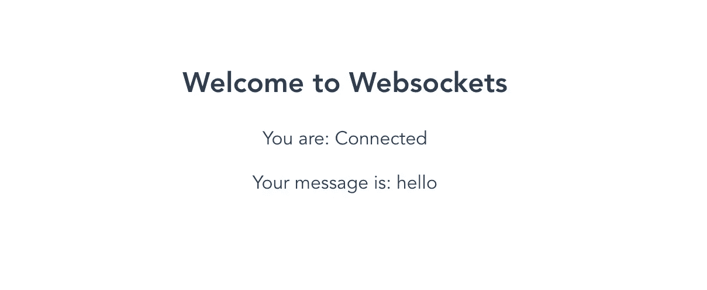

# 在 Vue.js 中创建一个 Websocket 服务器

> 原文：<https://javascript.plainenglish.io/creating-a-websocket-server-in-vue-js-acfe8df9ebb1?source=collection_archive---------14----------------------->


使用 websocket 服务器是加速应用程序的一个好方法。API 天生就有自己的 HTTP 开销，这意味着每次你调用一个 API 时，你都必须等待一会儿 HTTP 响应。

这基本上没问题，但是如果您的应用程序有很多对时间敏感的、频繁的服务器请求，这可能会成为一个问题。一个很好的例子是聊天应用程序，你需要立即看到对方在说什么。在这种情况下，API 仍然可以工作，但是它不是最佳的解决方案。

在本教程中，我们将介绍如何在 Vue 中设置一个 websocket 服务器。JS，使用 Node.js 和 Express 内置的 websocket 服务器。请继续阅读。我还在这里写了另一篇关于如何用 Express 和 JavaScript[创建 websocket 服务器的教程。](https://fjolt.com/article/javascript-websockets)

# 入门:创建您的 Vue 应用程序

像往常一样，使用 Vue CLI 启动 Vue 应用程序。例如，编写以下代码来生成一个名为“fjolt-app”的 Vue 应用程序:

```
vue create fjolt-app
```

如果这不起作用，请尝试通过 npm 安装 Vue CLI 工具。这个包可以在[这里](https://www.npmjs.com/package/@vue/cli)找到。

如果你是 Vue 的新手，你可以在你创建应用程序的目录下运行`npm run serve`来启动这个虚拟应用程序。

# 创建 websocket 服务器

下一步是创建一个 websocket 服务器。如前所述，[我在这里写了一篇关于如何做到这一点的深入教程。](https://fjolt.com/article/javascript-websockets)总之，您需要创建一个 index.js 文件。为了使事情更简单，我在 Vue 目录中创建了自己的文件，并将其命名为 index.mjs，这样我就可以立即使用 import 语句。

我的文件结构是这样的:

```
| - node_modules
| - package.lock.json
| - package.json
| - public
| - README.md
| - src
  | - App.vue < -- Our app!
  | - assets
  | - components
  | - main.js
| - index.mjs <-- Our websocket server
```

# 用 Javascript 创建我们的 websocket 服务器

接下来，让我们创建 websocket 索引文件。在`index.mjs`中，如果你感到懒惰，你可以使用下面的代码。不要忘记`npm i`你导入的所有模块。

```
**import** path **from** 'path'
    **import** { fileURLToPath } **from** 'url'

    **const** __filename = ***fileURLToPath***(**import**.meta.url);
    **const** __dirname = path.***dirname***(__filename);

    **import** express **from** 'express'
    **import** expressWs **from** 'express-ws'
    **import** http **from** 'http'

    // Our port
    **let** port = **3000**;

    // App and server
    **let** app = ***express***();
    **let** server = http.***createServer***(app).***listen***(port);    

    // Apply expressWs
    ***expressWs***(app, server);

    app.***use***(express.***static***(__dirname + '/views'));

    // Get the route / 
    app.***get***('/', (req, res) => {
        res.***status***(**200**).***send***("Welcome to our app");
    });

    // Get the /ws websocket route
    app.***ws***('/ws', **async** **function**(ws, req) {
        ws.***on***('message', **async** **function**(msg) {
            ***console***.***log***(msg);            
            ws.***send***(***JSON***.***stringify***({ "message" : "hello" }));
            // Start listening for messages
        });
    });
```

所以客户端会将数据发送到我们的 websocket 服务器。该数据将作为`msg`变量到达，如上面代码的底部所示。然后，我们可以获取消息数据，存储或处理它。有时，我们可能希望将它发送到数据库。其他时候，我们可能想把它发送给用户。

无论哪种方式，在`ws.on`中，我们都可以将消息发送回客户端。比方说，当收到一条消息时，我想向用户发回一个写着`{ "message" : "hello" }`的对象。为此，我会执行以下操作:

```
// Get the /ws websocket route
    app.***ws***('/ws', **async** **function**(ws, req) {
        ws.***on***('message', **async** **function**(msg) {
            // Let's put our message in JSON.stringify, and send it to the user who just sent the message
            ws.***send***(***JSON***.***stringify***({ "message" : "hello" }));
        });
    });
```

当我们对我们的 websocket 服务器满意时，我们可以在 index.mjs 所在的目录中，通过键入`node index.mjs`在终端中运行它。现在我们有了一个可以连接的活动 websocket。

简而言之，我们现在有了一种方法，可以在我们的服务器和用户之间建立直接的连接，基本上是即时的消息传递。现在我们已经解决了这个问题，我们需要能够从 Vue 发送和接收数据。接下来让我们来看看。

# 向 Vue.js 添加 websocket

打开 src 文件夹中的 App.vue。编辑 JavaScript，如下所示:

```
**export** **default** {
    name: 'App',
    ***data***() {
        **return** {
            socket: {},
            connectedStatus: 'Not connected!',
            message: 'No message yet!'
        }
    },
    **async** ***mounted***() {
        // Calculate the URL for the websocket. If you have a fixed URL, then you can remove all this and simply put in
        // ws://your-url-here.com or wss:// for secure websockets.
        **const** socketProtocol = (window.location.protocol === 'https:' ? 'wss:' : 'ws:')
        **const** port = ':3000';
        **const** echoSocketUrl = socketProtocol + '//' + window.location.hostname + port + '/ws'

        // Define socket and attach it to our data object
        **this**.socket = **await** **new** ***WebSocket***(echoSocketUrl);         // When it opens, console log that it has opened. and send a message to the server to let it know we exist
        **this**.socket.***onopen*** = () => {
            ***console***.***log***('Websocket connected.');
            **this**.connectedStatus = 'Connected';
            **this**.***sendMessage***(***JSON***.***stringify***({"message" : "Hello, server."}));
        } // When we receive a message from the server, we can capture it here in the onmessage event.
        **this**.socket.***onmessage*** = (event) => {
            // We can parse the data we know to be JSON, and then check it for data attributes
            **let** parsedMessage = ***JSON***.***parse***(event.data);
            // If those data attributes exist, we can then console log or show data to the user on their web page.
            ***console***.***log***(parsedMessage);
            **if**(**typeof** parsedMessage.message !== "undefined" && parsedMessage.message == "hello") {
                **this**.message = parsedMessage.message;
                ***console***.***log***('We have received a message from the server!')
            }
        }
    },
    methods: {
        ***waitForOpenConnection***: **function**() {
            // We use this to measure how many times we have tried to connect to the websocket server
            // If it fails, it throws an error.
            **return** **new** ***Promise***((resolve, reject) => {
                **const** maxNumberOfAttempts = **10**
                **const** intervalTime = **200**                **let** currentAttempt = **0**
                **const** interval = ***setInterval***(() => {
                    **if** (currentAttempt > maxNumberOfAttempts - **1**) {
                        ***clearInterval***(interval)
                        ***reject***(**new** ***Error***('Maximum number of attempts exceeded.'));
                    } **else** **if** (**this**.socket.readyState === **this**.socket.OPEN) {
                        ***clearInterval***(interval)
                        ***resolve***()
                    }
                    currentAttempt++
                }, intervalTime)
            })
        },
        ***sendMessage***: **async** **function**(message) {
            // We use a custom send message function, so that we can maintain reliable connection with the
            // websocket server.
            **if** (**this**.socket.readyState !== **this**.socket.OPEN) {
                **try** {
                    **await** **this**.***waitForOpenConnection***(**this**.socket)
                    **this**.socket.***send***(message)
                } **catch** (err) { ***console***.***error***(err) }
            } **else** {
                **this**.socket.***send***(message)
            }
        }
    }
}
```

# 如何创建 Vue.js websocket 服务器:细节

虽然行内有注释，但让我们更详细地看一下。我们首先创建两个方法:

*   sendMessage —这是一个使用`socket.send()`的自定义发送消息功能。唯一的区别是我们在发送之前测试了 websocket 服务器连接，省去了一点麻烦。
*   waitForOpenConnection —仅由 sendMessage 使用，它设置检查套接字连接的时间间隔，否则会引发错误。

# 将我们的套接字保存为数据

然后，我们在`mounted()`中使用下面几行创建一个新的 websocket 连接。这意味着当应用程序被安装到浏览器窗口中时(或者当它被加载时)，我们创建一个新的 websocket 连接，然后通过将`this.socket`设置为新的 websocket 服务器连接，将该连接附加到我们的`data()`。

```
**const** socketProtocol = (window.location.protocol === 'https:' ? 'wss:' : 'ws:')
**const** port = ':3000';
**const** echoSocketUrl = socketProtocol + '//' + window.location.hostname + port + '/ws'// Define socket and attach it to our data object
**this**.socket = **await** **new** ***WebSocket***(echoSocketUrl);
```

这样做的额外好处是，我们现在可以跨方法、观察器和所有其他类型的 Vue 功能引用我们的套接字。当我们的连接被创建时，我们添加两个事件。一个是检查套接字何时打开，另一个是中继消息。

```
// When it opens, console log that it has opened. and send a message to the server to let it know we exist
    **this**.socket.***onopen*** = () => {
        ***console***.***log***('Websocket connected.');
        **this**.connectedStatus = 'Connected';
        **this**.***sendMessage***(***JSON***.***stringify***({"message" : "Hello, server."}));
    } // When we receive a message from the server, we can capture it here in the onmessage event.
    **this**.socket.***onmessage*** = (event) => {
        // We can parse the data we know to be JSON, and then check it for data attributes
        **let** parsedMessage = ***JSON***.***parse***(event.data);
        // If those data attributes exist, we can then console log or show data to the user on their web page.
        ***console***.***log***(parsedMessage);
        **if**(**typeof** parsedMessage.message !== "undefined" && parsedMessage.message == "hello") {
            **this**.message = parsedMessage.message;
            ***console***.***log***('We have received a message from the server!')
        }
    }
```

websocket 创建者可能对`onmessage`函数最感兴趣，因为来自服务器的数据就是在这里被处理的。我们之前创建的消息将到达这个事件，我们可以在页面上显示它。其他数据也可以在这里处理。

因为我还创建了另外两个数据变量`message`和`connectedStatus`，所以我们可以在模板中使用它们来显示来自 websocket 服务器的响应:

```
<template>
    <h2>Welcome to Websockets</h2>
    <p>You are: {{ connectedStatus }}</p>
    <p>Your message is: {{ message }}</p>
</template>
```

## 我们的 websocket 服务器页面



# 结论

Vue 中的 Websocket 服务器实际上工作得相当优雅。在本教程中，我们已经涵盖了所有的基础知识。现在，您可以继续从 websocket 服务器向您的浏览器发送或接收数据。websockets 带来的效率意味着你的网站看起来会更快，如果你从 HTTP。

别忘了，在单独的终端窗口运行`npm run serve`和`node index.mjs`，这样你的 websocket 服务器和 Vue.js 应用都在运行。像往常一样，这里有一些有用的链接:

*   [制作 websocket 服务器的原始教程](https://fjolt.com/article/javascript-websockets)
*   [本教程的 git 回购](https://github.com/smpnjn/vuejs-web-socket-server)

*更多内容看* [***说白了就是***](http://plainenglish.io/) *。报名参加我们的* [***免费周报***](http://newsletter.plainenglish.io/) *。在我们的* [***社区获得独家访问写作机会和建议***](https://discord.gg/GtDtUAvyhW) *。*