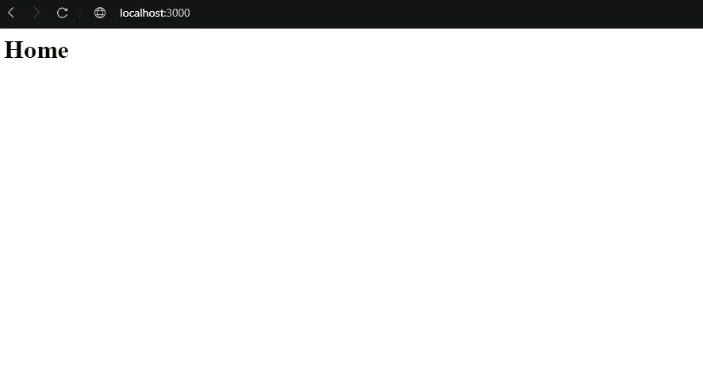
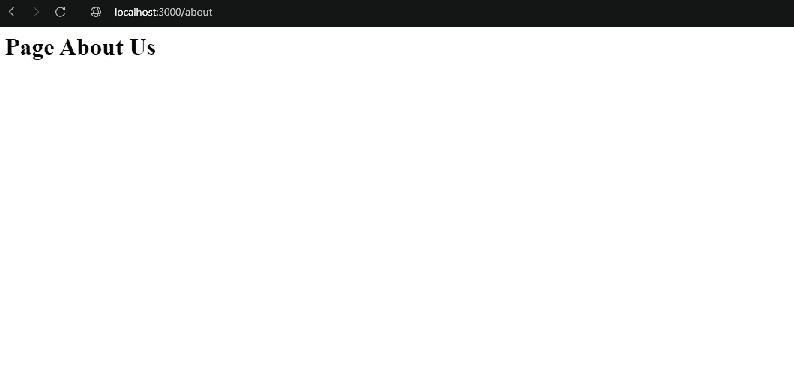

# 如何用 Node.js 创建 HTTP 服务器

> 原文：<https://javascript.plainenglish.io/creating-an-http-server-with-nodejs-d2392672957a?source=collection_archive---------18----------------------->

## 关于如何使用 Node.js API 创建 HTTP 服务器的指南。


Photo by Henrique Marques Fernandes

*   在我们创建服务器之前，需要安装 Node.js

[](https://nodejs.org/en/download/) [## 下载| Node.js

### Node.js 是基于 Chrome 的 V8 JavaScript 引擎构建的 JavaScript 运行时。

nodejs.org](https://nodejs.org/en/download/) 

安装完成后，我们开始用 Node.js 平台创建 HTTP 服务器。

```
**const http = require(‘http’)
const port = 3000
const ip = ‘localhost’**
```

我们开始声明 const HTTP，port 将是 3000，而 IP 表示正在使用的系统的位置，即用户的计算机。

```
**const server = http.createServer((req, res) => {
if (req.url == “/”) {
   res.end(‘<h1>Home</h1>’)
}****if (req.url == '/about') {****res.end('<h1>Page About Us</h1>')****}****if (req.url == '/contact') {****res.end('<h1>Page Contact</h1>')****}****})**
```

这部分是所有事情发生的地方，我们接收请求并发送响应，如函数参数“req”和“res”所示。在这之后，我们有了条件，开始请求我们的路线，然后我们将发送相应的所需路线作为回答。

```
**server.listen(port, ip, *()* => {
console.log(`Server: http://${ip}:${port}`)
})**
```

这里是我们“监听”服务器的函数，因此我们有一个 console.log，它将向我们显示服务器将要运行的 IP 和端口。

为此，我们需要编写这段代码，并在 project 的文件夹中打开终端。

```
**C:\Dev> cd C:\Dev\ServerJs****C:\Dev\ServerJs>**
```

在这之后，我们编写“node NameofFile.js”。

```
**C:\Dev\ServerJs> node Server.js**
```

然后，我们应该在浏览器中打开所需端口上的服务器。



Server running

这是服务器运行和改变我们的主要路线，这是关于我们路线的家。



现在你知道了。谢谢！

*更多内容请看*[***plain English . io***](https://plainenglish.io/)*。报名参加我们的* [***免费周报***](http://newsletter.plainenglish.io/) *。关注我们关于*[***Twitter***](https://twitter.com/inPlainEngHQ)*和*[***LinkedIn***](https://www.linkedin.com/company/inplainenglish/)*。加入我们的* [***社区不和谐***](https://discord.gg/GtDtUAvyhW) *。*