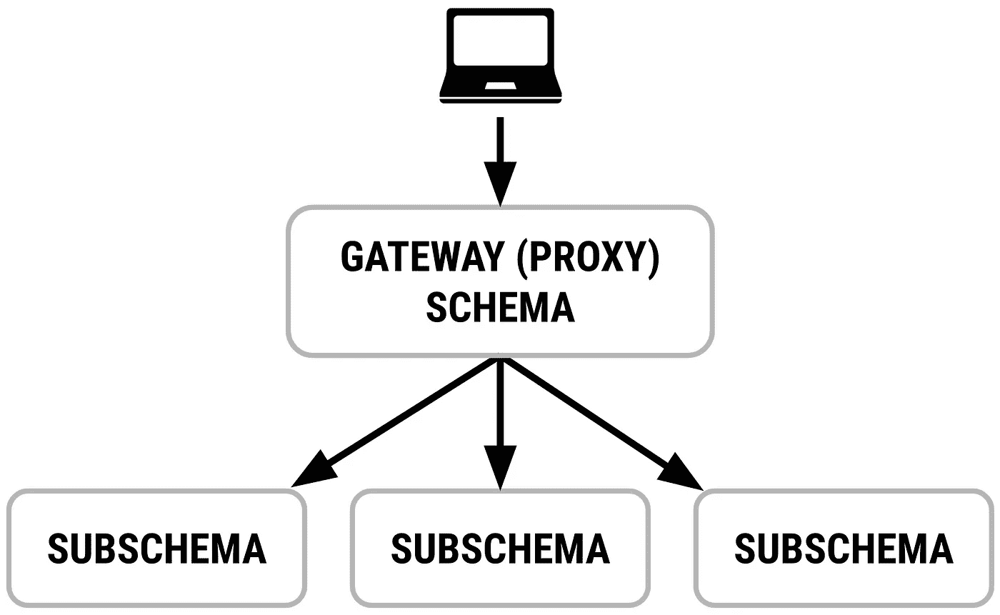
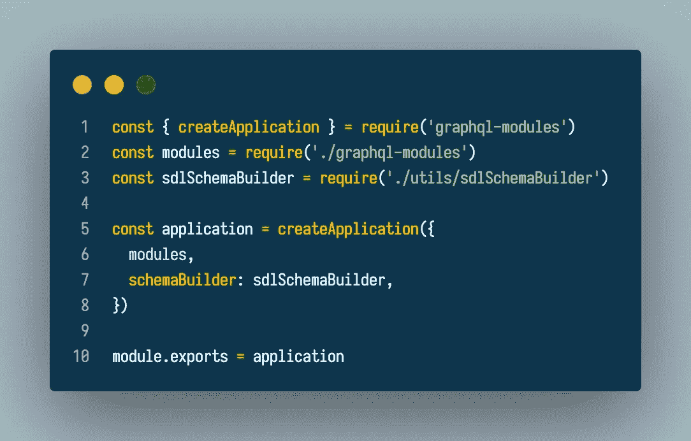
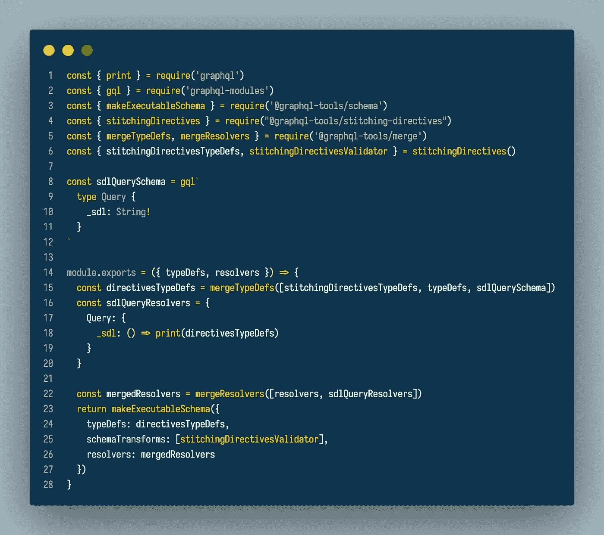

# 用 GraphQL 模块创建一个 SDL 字段用于模式拼接

> 原文：<https://javascript.plainenglish.io/creating-an-sdl-field-with-graphql-modules-for-schema-stitching-38e4f8e6c482?source=collection_archive---------8----------------------->

## 使用 GraphQL 模块创建 SDL 场的指南。

GraphQL 模块是一种以划分方式构建现代 GraphQL 应用程序的便捷方式。这个由公会创建的方便的库让开发人员以一种更容易测试和长期开发的方式分解他们的 GraphQL 模式。

进入 [GraphQL 模式拼接](https://www.graphql-tools.com/docs/schema-stitching/stitch-combining-schemas)，这是一种将子模式组合成大型“网关”模式供应用程序使用的便捷方式。用最简单的术语来说，它就像是 GraphQL 模式的 SQL 连接。



Image from GraphQL Tools Schema Stitching Docs

在模式拼接中组合模式的一种方法是使用带有指令的 SDL。通常，当试图找到有关 GraphQL 模式的更多细节时，使用自省来找出模式上所有可用的类型和变化。然而，对于指令，自省不起作用，因为指令将从输出中省略，网关将被迫创建自己的合并配置来组合子模式。创建那些合并配置可能很糟糕，而指令使它变得稍微容易一些。

SDL 字段的一个挑战是，它需要访问应用程序的整个模式，以便生成正确的字符串并附加模式拼接所需的指令。使用`createApplication`配置上的`schemaBuilder`选项，我们能够做一些神奇的✨让它工作。



下面的`sdlSchemaBuilder`能够从组合的 GraphQL 模块中获取解析器和 typedef，并添加所需的解析器、typedef 和模式转换器，以便出现模式指令。



sdlSchemaHelper for the schemaBuilder in a GraphQL module createApplication

```
const { print } = require('graphql')
const { gql } = require('graphql-modules')
const { makeExecutableSchema } = require('@graphql-tools/schema')
const { stitchingDirectives } 
       = require("@graphql-tools/stitching-directives")
const { mergeTypeDefs, 
        mergeResolvers 
      } = require('@graphql-tools/merge')
const { stitchingDirectivesTypeDefs, 
        stitchingDirectivesValidator
      } = stitchingDirectives()const sdlQuerySchema = gql`
   type Query {
      _sdl: String!
   }`module.exports = ({ typeDefs, resolvers }) => {
  const directivesTypeDefs = mergeTypeDefs([
     stitchingDirectivesTypeDefs,
     typeDefs,
     sdlQuerySchema 
  ]) const sdlQueryResolvers = {
    Query: {
      _sdl: () => print(directivesTypeDefs)
    }
  } const mergedResolvers = 
    mergeResolvers([resolvers,    sdlQueryResolvers]) return makeExecutableSchema({
    typeDefs: directivesTypeDefs,
    schemaTransforms: [stitchingDirectivesValidator],
    resolvers: mergedResolvers
  })}
```

通过使用`mergeResolvers` `mergeTypeDefs` `print`和`makeExecutableSchema`函数，我们能够将已经组合的应用程序的模式与附加的`_sdl`字段、`_sdl`解析器和应用程序的模式指令相结合，从而创建一个与指令兼容的 GraphQL 模块应用程序的模式拼接！这是一个口，但我希望这有所帮助！

编码快乐！

—帕特

*更多内容请看*[***plain English . io***](https://plainenglish.io/)*。报名参加我们的* [***免费周报***](http://newsletter.plainenglish.io/) *。关注我们关于*[***Twitter***](https://twitter.com/inPlainEngHQ)*和**[***LinkedIn***](https://www.linkedin.com/company/inplainenglish/)*。加入我们的* [***社区***](https://discord.gg/GtDtUAvyhW) *。**