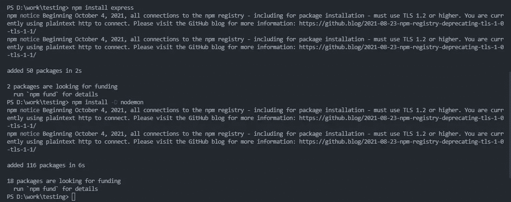

# 使用 Express | MERN 堆栈创建 API 端点第 3 部分

> 原文：<https://javascript.plainenglish.io/creating-api-endpoints-using-expressjs-mern-stack-part-3-f600e11be029?source=collection_archive---------12----------------------->

## 通过创建 API 端点开始使用 Express，并通过与其他 MERN 技术集成来扩展它的全部潜力。

Express 是 MERN 堆栈中使用的框架之一。在本文中，让我们看看如何通过创建 API 端点来开始使用 Express，然后通过与其他 MERN 技术集成来扩展它的全部潜力。

因为我们需要设置环境和端点，所以本文分为两个部分，在本文中，我们将设置工作环境。如果你不太了解 MERN 堆栈和 MongoDB，请阅读下面的文章:

[MERN 栈为什么变得流行？|我们来详细看看](https://www.mayhemcode.com/2022/01/why-mern-stack-is-becoming-popular-lets.html)

MongoDB 和 MERN: [如何在 MongoDB | MERN 栈中创建自由集群](https://www.mayhemcode.com/2022/01/how-to-create-free-cluster-in-mongodb.html)

# ExpressJS 入门:

正如标语所说， **Express 是 Node.js** 的一个快速、非个性化、极简的 web 框架。它完全是用 Javascript 编写的，是一种由 Node.js 维护的开源技术。让我们理解每个标语的含义，首先，由于我们直接构建 API 端点，没有任何中间件，网站的健壮性增加了，其次，像 Django 和其他 web 开发框架这样的最流行的框架是固执己见的，这意味着为了制作一个 web 应用程序，你需要遵循一个过程或方法，这样只有你才能开发它。

甚至作为一个框架 Express 允许用户以他们自己的方式开发应用程序，第三个极简主义者，因为它非常简单的理解事情是如何在 Express 中工作的，因为没有后台或隐藏的进程运行，一切都是由开发人员完成的。让我们通过制作自己的第一个“hello world！”来看看使用 Express 制作 web 服务器有多简单使用它的应用程序。

# 设置环境:

为此，您可以在任何 IDE 中工作，如 visual studio 代码、visual studio 或 sublime 文本(我建议您使用 IDE，而不是文本编辑器)。我们将使用 Visual studio 代码，因为大多数库和工具已经在那里可用，并且我们可以在 ide 中访问终端。

# 1.安装 Node.js 以便使用 Express

如果你还没有安装 Node.js，有很多关于如何安装的视频，浏览它们并安装 Node.js，或者你可以从给定的网站直接安装

稳定版: [Node.js |下载量](https://draft.blogger.com/u/1/blog/post/edit/3504568035593819778/8408547376718091818#)

建议**使用稳定版本**而不是最新版本，因为大多数库在稳定版本中运行良好，您可以使用以下命令来验证下载:

我们可以看到，我已经检查了另一个名为 NPM 的模块，它带有一个 node.js， **NPM 是一个包管理器**，通过它我们可以用简单的命令安装 javascript 库。这对于用 Javascript 和 Node.js 开发 web 项目非常有用

# 2.使用 NPM 初始化环境

您可以使用终端在所需的路径中使用命令**“NPM init”**来启动 web 应用程序项目的初始化，它会要求您提供规范，您可以保留默认值并继续

现在您可以看到有一个名为 **package.json** file 的新文件，它包含了您正在处理的项目的详细信息。这个文件实际上是应用程序中的重要文件之一。

# 什么是 Package.json 文件？

如果你开发过任何应用程序，你会知道有时我们可能需要一些库来运行，如果其他人想要运行应用程序，他们也需要安装库，Package.json 简化了这个问题。我们用一个简单的例子来理解这一点。

假设我们正在开发 Node.js 项目，那么我们可能会使用许多库或依赖项，我们现在可以使用 npm 安装它们，而安装依赖项时，NPM 会在 package.json 文件中添加它们的信息以及它们的版本号

现在假设我们想把我们的项目上传到 GitHub，或者有人想使用我们的应用程序，他们可以简单地获取项目的主要代码或文件，而不需要 node_modules 文件夹( **Node_modules** 是包管理器安装所有库和依赖项的文件夹)。另一个人可以简单地运行一个名为**“NPM install”**的命令，从这个命令中可以下载 package.json 文件中列出的所有包，这就是 package.json 文件在 Node.js 项目中如此重要的原因。

# 3.安装所需的依赖项:

在本次演示中，我们将使用 Express 和 **Nodemon** ，Nodemon 是开发人员使用的 web 服务器，当文件发生变化或文件再次保存时，它会重新加载服务器。

您可以使用 npm install 命令下载依赖项:

你可以看到，我在安装 nodemon 时使用了一个标签 **-D** ，因为它是开发者依赖的，并不用于生产，它只用于测试 web 应用程序。

# 4.创建入口点

在使用 npm init 时，我们还同意创建一个名为 index.js 的入口点文件。Index.js 文件是 web 服务器开始工作的主文件，就像根文件一样。在这里，我们可以使用 express 模块来创建 API 端点路由等。完成上述所有操作后，文件结构应该是这样的。

在下一篇文章中，我们将通过使用 routs 和 API 调用创建 Helloworld 程序来使用 Expressjs 框架。

*原载于 2022 年 1 月 30 日*[*【https://www.mayhemcode.com】*](https://www.mayhemcode.com/2022/01/creating-api-endpoints-using-expressjs.html)*。*

*更多内容看* [***说白了。报名参加我们的***](http://plainenglish.io/)***[***免费周报***](http://newsletter.plainenglish.io/) *。在我们的* [***社区不和谐***](https://discord.gg/GtDtUAvyhW) *获得独家获取写作机会和建议。****