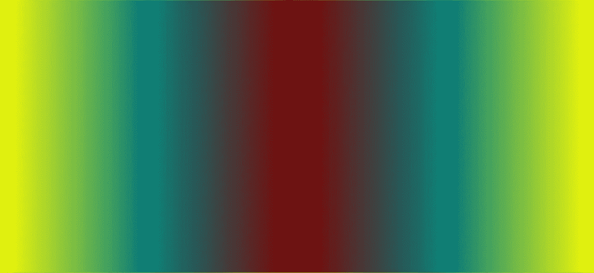
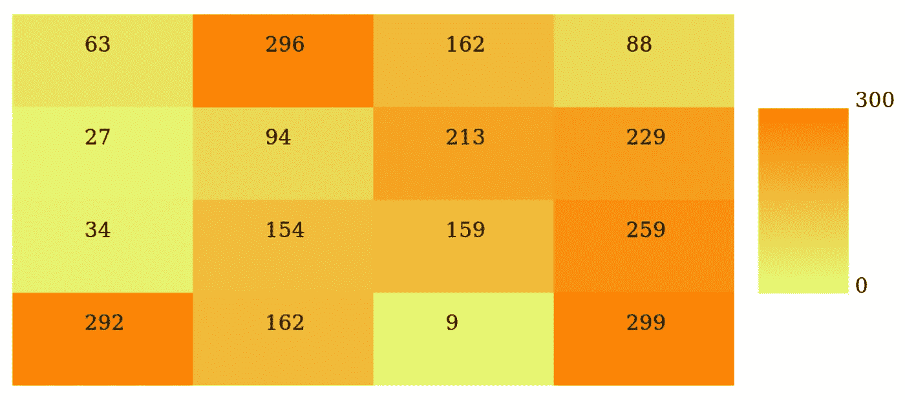

# 用普通 JavaScript 为热图创建颜色渐变

> 原文：<https://javascript.plainenglish.io/creating-color-gradients-for-heat-maps-with-vanilla-javascript-c8d62bdd648e?source=collection_archive---------4----------------------->

## 如何将平滑颜色渐变中的十六进制三元组分配给数值数组



Image by Author

在创建热图时，我们需要在给定的渐变中为它们所代表的数值分配特定的颜色。例如，如果我们想显示一个地区的平均温度，我们可以使用从蓝色(非常冷)到红色(非常热)的颜色渐变，并根据平均温度在地图上为从蓝色到红色的光谱分配特定的阴影。

本教程将介绍如何使用普通 JavaScript 将指定渐变中的颜色以十六进制三元组的形式分配给指定数值范围内的值数组，以及一个使用这种技术使用 HTML5 canvas 元素创建简单热图的示例。

**什么是十六进制三胞胎？**

[十六进制三元组](https://en.wikipedia.org/wiki/Web_colors#Hex_triplet)是将颜色表示为 RGB(红绿蓝)值的常见方式。对于六位数的十六进制三元组，前两个十六进制数字表示颜色的红色分量的强度，范围是从[基数-16](https://en.wikipedia.org/wiki/Hexadecimal) 中的`00`到`FF`(相当于[基数-10](https://en.wikipedia.org/wiki/Decimal) 中的`0`到`255`)。类似地，第三和第四个十六进制数字表示绿色分量的强度，第五和第六个数字表示蓝色分量的强度。这些十六进制三元组以`#`为前缀。

例如，红色的十六进制三联体是`#FF0000`，表示红色的最大强度，绿色和蓝色的最小强度。类似地，白色的十六进制三联体是`#FFFFFF`，表示红色、绿色和蓝色的全强度。

**数值到十六进制三元组映射过程概述**

值到十六进制三元组映射过程的主要思想是首先确定每个值落在最小值和最大值之间的范围内，然后确定对应的十六进制三元组落在表示最小值的颜色和表示最大值的颜色之间的范围内的等效点上。

例如，让我们假设我们正在可视化学生的考试成绩，从理论上讲，它的范围在`0`和`100`之间。我们将用白色代表得分`0`(我们的最小值)，黑色代表得分`100`(我们的最大值)。请注意，分配给最小值的颜色不需要“小于”分配给最大值的颜色(事实上，包含白色的所有三个 RGB 分量都大于对应的黑色 RGB 分量)，无论颜色的相对值如何，数学运算都会起作用。在这个例子中，如果一个学生获得了`80`，那么我们将需要选择一种颜色，这种颜色是从我们的最小颜色(白色)到最大颜色(黑色)的 80%,大概在深灰色范围的某个地方。

当我们处理十六进制三元组时，我们的目标颜色将由红色、绿色和蓝色十六进制值的组合来表示，每个值都是从我们的最小颜色(白色)到我们的最大颜色(黑色)的组件值的 80%。让我们考虑红色部分。在白色(`#FFFFFF`)中，这将是`FF`(基数为 10 的`255`)，而在黑色(`#000000`)中，这将是`00`(基数为 10 的`0`)。因此，我们的新红色分量可以通过取我们的最小和最大红色分量之差的 80%来计算，并将其添加到我们的最小分量，就像这样:`0.80*(0-255) + 255 = -204 + 255 = 51`。

因此，我们以 10 进制表示的红色部分是`51`，相当于十六进制的`33`。由于白色和黑色对于红色、绿色和蓝色都具有相同的值，因此绿色和蓝色分量也将是`33`。因此，与我们学生的分数`80`相对应的颜色将是`#333333`，一种深灰色。


#333333, Image by Author

出于我们的目的，我们将需要创建一组 JavaScript 函数来为所提供的任何输入值和最小/最大颜色执行这些计算。

**将十六进制三元组赋值**

我们将创建一个函数`assignColor()`，它接受代表最小值(`minCol`)的颜色的十六进制三元组、代表最大值(`maxCol`)的颜色的十六进制三元组、最小潜在值(`minVal`)、最大潜在值(`maxVal`)、代表要映射的值的数字数组(`vals`)以及我们的`vals`数组中的元素数量(`numVals`)作为输入。该函数应该返回一个十六进制三元组数组，表示与`vals`数组中等价索引处的值相对应的颜色(例如，输出数组中的第一个十六进制三元组是表示`vals`中第一个值的颜色)。

我们的职能将遵循以下基本步骤:

1.  使用`[substring()](https://developer.mozilla.org/en-US/docs/Web/JavaScript/Reference/Global_Objects/String/substring)`函数从我们的`minCol`和`maxCol`变量中解析出红色、绿色和蓝色成分，并使用`[parseInt()](https://developer.mozilla.org/en-US/docs/Web/JavaScript/Reference/Global_Objects/parseInt)`函数将它们从基数为 16 的数字字符串转换成基数为 10 的整数。
2.  确定潜在值的范围(即最大值和最小值之间的差值)以及我们颜色的红色、绿色和蓝色分量。
3.  对于`vals`中的每个值，计算相应的十六进制三元组，并将其附加到我们的输出数组`colors`。请注意，我们将在一个单独的函数`getRBGComponent()`中处理每个值的红色、绿色和蓝色分量的计算。
4.  最后，返回我们的输出数组，`colors`。

下面是该函数的一个示例实现:

```
function assignColor(minCol, maxCol, minVal, maxVal, vals, numVals) {
  var colors = [];
  var minR = parseInt(minCol.substring(1,3),16);
  var maxR = parseInt(maxCol.substring(1,3),16);
  var minG = parseInt(minCol.substring(3,5),16);
  var maxG = parseInt(maxCol.substring(3,5),16);
  var minB = parseInt(minCol.substring(5,7),16);
  var maxB = parseInt(maxCol.substring(5,7),16);
  var valsRange = maxVal - minVal;
  var rangeG = maxG - minG;
  var rangeR = maxR - minR;
  var rangeB = maxB - minB;

  for(var i = 0; i < numVals; i++) {
   colors[i] = '#' 
       + getRBGComponent(rangeR,minR,valsRange,minVal,vals[i]) 
       + getRBGComponent(rangeG,minG,valsRange,minVal,vals[i]) 
       + getRBGComponent(rangeB,minB,valsRange,minVal,vals[i]);
  }
  return colors;
 }
```

请注意，十六进制三元组是通过将一个`#`与对红色、绿色和蓝色组件的`getRBGComponent()`的函数调用结果连接起来而产生的。

**计算单个 RGB 十六进制组件**

我们的`getRBGComponent()`函数将把给定颜色分量的范围(即最大值和最小值之差)、该颜色分量的最小值(以 10 为基数)、潜在值范围、最小潜在值以及我们想要计算相应颜色的值作为输入。它将以两位十六进制字符串的形式返回红色、绿色或蓝色分量。请注意，我们不需要指定我们是对红色、绿色还是蓝色分量感兴趣，因为对所有三种颜色的计算都是一样的。

在我们的函数中，我们将首先需要计算`val`和最小潜在值之间的差，作为值范围的一部分(`(val-minVal)/valRange`)。注意，这个结果相当于我们在上面的示例计算中使用的`0.8`。

接下来，我们将这个值乘以颜色分量的范围，并将结果与颜色分量的最小值相加，这将给出我们的颜色分量值，为十进制格式。

然后，我们将使用`[Math.round()](https://developer.mozilla.org/en-US/docs/Web/JavaScript/Reference/Global_Objects/Math/round)`函数将这个十进制数转换成一个整数，然后使用`[toString()](https://developer.mozilla.org/en-US/docs/Web/JavaScript/Reference/Global_Objects/String/toString)`函数(指定我们希望以 16 进制输出)将这个整数转换成一个十六进制字符串。最后，我们将使用`[toUpperCase()](https://developer.mozilla.org/en-US/docs/Web/JavaScript/Reference/Global_Objects/String/toUpperCase)`确保标准的十六进制格式为大写字母，并使用`[padStart()](https://developer.mozilla.org/en-US/docs/Web/JavaScript/Reference/Global_Objects/String/padStart)`在十六进制值仅为一位数的情况下添加前导`0`。

下面是该函数的一个示例实现:

```
function getRBGComponent(colRange, minCol, valRange, minVal, val) {
  return Math.round(((val-minVal)/valRange)*colRange+minCol)
         .toString(16)
         .toUpperCase()
         .padStart(2,'0');
 }
```

**构建示例热图**

现在我们有了将十六进制三元组分配给数值的函数，我们可以使用它们来生成热图。在这个例子中，我们将使用 [HTML5 canvas 元素](https://developer.mozilla.org/en-US/docs/Web/API/HTMLCanvasElement)绘制一个 4x4 的网格，作为我们的热图。如果您不熟悉 canvas 元素，MDN 在这里有一个方便的教程[。](https://developer.mozilla.org/en-US/docs/Web/API/Canvas_API/Tutorial)

首先，我们将在 HTML 代码中定义 canvas 元素，然后初始化我们的`canvas`和`ctx`(上下文)JavaScript 变量。我们将使用这些来绘制我们的热图。

```
<canvas id="field" width="1400" height="720"></canvas><script>
 var canvas = document.getElementById("field");
 var ctx = canvas.getContext("2d");
```

我们将使用`[Math.random()](https://developer.mozilla.org/en-US/docs/Web/JavaScript/Reference/Global_Objects/Math/random)`函数在`0`和`300`之间生成一组 16 个随机值，并将它们加载到我们的输入数组`nums`。然后，我们可以调用我们的`assignColor()`函数，传入我们的最小颜色、最大颜色、最小潜在值、最大潜在值、值的数组，以及这个数组的长度。

对于最小和最大颜色，我们将使用 [Wistia 的色盲友好热图调色板](https://github.com/wistia/heatmap-palette)，从`#e4ff7a`延伸到`#fc7f00`。

```
var nums = [];
for(var i = 0; i < 16; i++) {
 nums[i] = Math.random()*300;
}
var cols = assignColor('#e4ff7a','#fc7f00',0,300,nums,16);
```

此时，我们已经在`cols`中保存了我们的十六进制三元组，在`nums`中保存了我们的值，所以我们已经准备好绘制我们的热图了。为此，我们将遍历 16 个值-十六进制三元组对，并将它们绘制成 4x4 网格。

因此，我们将循环遍历我们的索引值，并使用`[rect()](https://developer.mozilla.org/en-US/docs/Web/API/CanvasRenderingContext2D/rect)`方法绘制我们的 16 个网格单元，使用`[fillStyle](https://developer.mozilla.org/en-US/docs/Web/API/CanvasRenderingContext2D/fillStyle)`属性和我们对应的十六进制三元组为每个单元分配适当的颜色。为了验证颜色是否符合我们的预期，我们还将使用`[fillText()](https://developer.mozilla.org/en-US/docs/Web/API/CanvasRenderingContext2D/fillText)`方法绘制每个单元格的数值。

```
for(var i = 0; i < 16; i++) {
  ctx.beginPath();
  ctx.rect( //draw a rectangle representing this cell in heat map
   canvas.width/20+canvas.width/8*(i%4), //starting x
   canvas.height/20+canvas.height/8*(Math.trunc(i/4)), //starting y
   canvas.width/8, //width
   canvas.height/8); //height
  ctx.fillStyle = cols[i]; //color using corresponding hex triplets
  ctx.fill();
  ctx.closePath();
  // Print values
  ctx.font = "20px sarif";
  ctx.fillStyle = "#000000"; //black text
  ctx.fillText(Math.round(nums[i]).toString(10), //text to print
      canvas.width/10+canvas.width/8*(i%4), //starting x
      canvas.height/10+canvas.height/8*(Math.trunc(i/4))); //y
}
```

上面的代码将画出我们的网格，但是包含一个渐变键来帮助查看者识别颜色的含义会很有帮助。为此，我们将定义另一个函数`drawGradient()`，它将使用我们的`assignColor()`函数来绘制一个包含颜色全部渐变的矩形，从最小颜色扩展到最大颜色。`drawGradient()`将最小颜色、最大颜色、矩形起点的 x 值、矩形起点的 y 值、矩形的宽度和高度作为输入。

在函数中，我们将创建一个包含从`0`到`h`(我们矩形的高度)的值的`input`数组，并将该数组传递给我们的`assignColor()`函数。这将传回我们的`output`数组，该数组将包含最终矩形中每行像素的十六进制三元组，范围从最小颜色到最大颜色。

一旦`output`被定义，我们可以简单地从`0`循环到`h`，并使用来自`output`的相应十六进制三元组绘制一系列 1 像素高的矩形。当这些像素行相互堆叠时，它们将形成我们的渐变键。

```
function drawGradient(minCol, maxCol, x, y, w, h) {
  var input = []
  for(var i = 0; i < h; i++) { //an input val for each row of pixels
   input[i] = i;
  }
  var output = assignColor(minCol,maxCol,0,h,input,h);
  for(var i = 0; i < h; i++) { //draw each row of pixels
   ctx.beginPath();
   ctx.rect(x, y-i, w, 1);
   ctx.fillStyle = output[i];
   ctx.fill();
   ctx.closePath();
  }
}
```

一旦定义了这个函数，我们就可以调用它，传入我们的最小和最大颜色，以及指示矩形的位置和大小的参数。我们还将在矩形旁边写出最小值和最大值，以定义键的范围。

```
drawGradient('#e4ff7a','#fc7f00', //Wistia heat map palette
  canvas.width/15+canvas.width/8*4, //x for starting point
  canvas.height/20+canvas.height/8*3, //y for starting point
  canvas.width/16, //width
  canvas.height/4); //height
ctx.font = "20px sarif";
ctx.fillStyle = "#000000"; //Black text
ctx.fillText("0", canvas.width/7.5+canvas.width/8*4,
    canvas.height/20+canvas.height/8*3); //write the min value
ctx.fillText("300", canvas.width/7.5+canvas.width/8*4,
    canvas.height/20+canvas.height/8); //write the max value
```

现在，我们都准备好了。我们可以关闭脚本，在浏览器中加载该页面，并生成如下所示的热图:



Image by Author

**结论**

虽然有现成的工具和库可以在渐变中分配颜色并为我们生成热图，但希望我们如何使用普通 JavaScript 构建简单的颜色分配器的这一演练将有助于我们了解如何使用颜色渐变和十六进制三元组，并且如果您想要构建更独特或复杂的自定义图形，可以作为一个起点。编码快乐！

**资源**

[](https://developer.mozilla.org/en-US/docs/Web/API/HTMLCanvasElement) [## html canvaselement-Web API | MDN

### HTMLCanvasElement 接口提供属性和方法，用于操作的布局和表示…

developer.mozilla.org](https://developer.mozilla.org/en-US/docs/Web/API/HTMLCanvasElement) [](https://developer.mozilla.org/en-US/docs/Web/API/Canvas_API/Tutorial) [## 画布教程-Web API | MDN

### 本教程描述了如何使用元素来绘制 2D 图形，从基础开始。提供的示例…

developer.mozilla.org](https://developer.mozilla.org/en-US/docs/Web/API/Canvas_API/Tutorial) [](https://github.com/wistia/heatmap-palette) [## GitHub - wistia/heatmap-palette:一个色盲友好的 heatmap 调色板

### 这种色盲友好的热图调色板依赖于绿色到红色的光谱，这通常意味着强度或…

github.com](https://github.com/wistia/heatmap-palette) 

*更多内容看* [***说白了。报名参加我们的***](https://plainenglish.io/) **[***免费周报***](http://newsletter.plainenglish.io/) *。关注我们关于* [***推特***](https://twitter.com/inPlainEngHQ)[***LinkedIn***](https://www.linkedin.com/company/inplainenglish/)*[***YouTube***](https://www.youtube.com/channel/UCtipWUghju290NWcn8jhyAw)*[***不和***](https://discord.gg/GtDtUAvyhW) *。对增长黑客感兴趣？检查* [***电路***](https://circuit.ooo/) *。*****