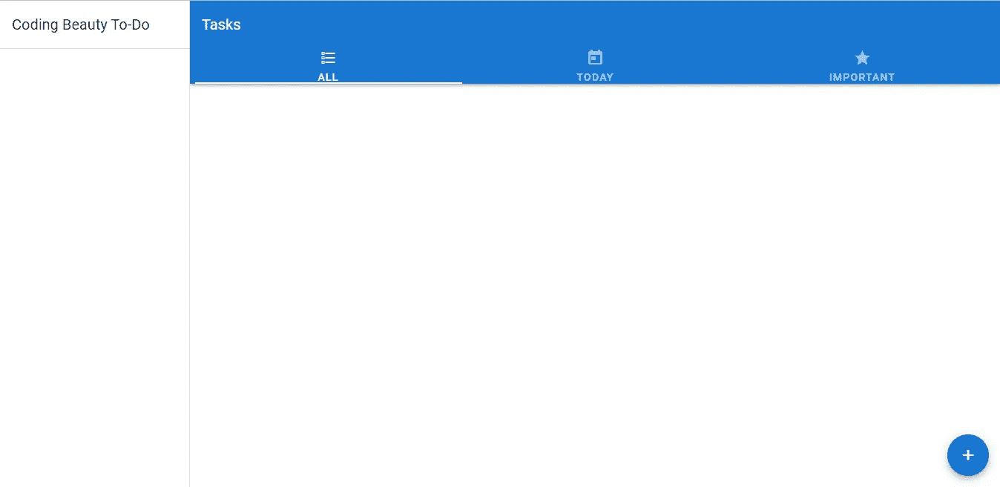
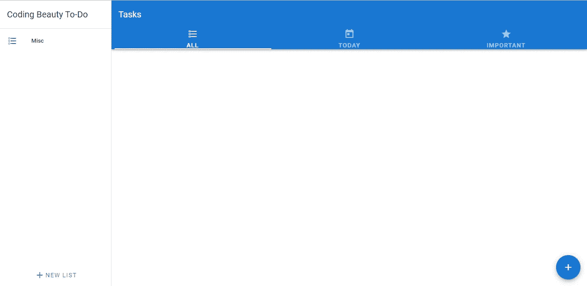
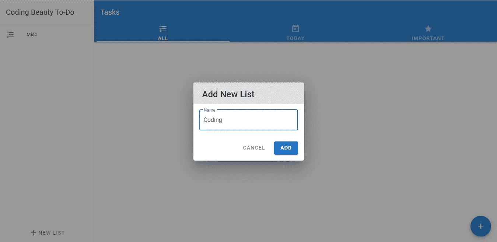
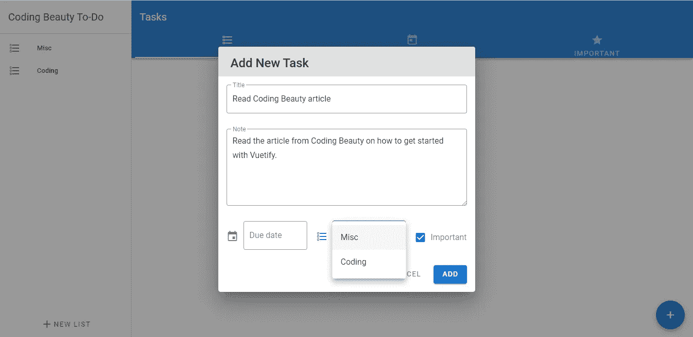
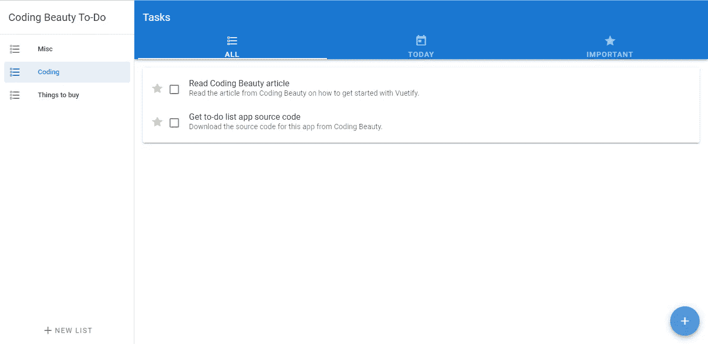

# 使用导航抽屉创建自定义列表| Vuetify 待办事项列表应用教程

> 原文：<https://javascript.plainenglish.io/creating-custom-lists-with-navigation-drawers-vuetify-to-do-list-app-tutorial-c64c92b645f6?source=collection_archive---------5----------------------->

## 使用户能够创建自定义列表，并从应用程序的导航抽屉中选择它们


欢迎回到这个有见地的教程系列的另一集。在过去的几天里，我们一直在构建一个非常好看的待办事项应用程序，并且已经取得了很大的进展。我们已经了解了很多关于 Vuetify JS 的知识，这是一个流行的材料设计框架，我们一直用它来设计我们的应用程序。在我们的[上一集](/grouping-tasks-tabs-vuetify-to-do-list-app-tutorial-e52633c13e67?source=your_stories_page----------------------------------------)中，我们能够使用某些 Vuetify 组件来创建选项卡，以便对我们的任务进行分组。今天，我们将使用用户定义的列表来添加进一步排序任务的功能。

刚开始使用 Vuetify？看看这篇[文章](https://codingbeautydev.com/blog/getting-started-with-vuetify/)。

# 使用 Vuetify 创建导航抽屉

我们开始用 Vuetify 中的`v-navigation-drawer`组件创建一个空的导航抽屉。设置`app`属性表明抽屉是应用程序布局的一部分，并动态调整`v-main`组件的内容大小以适应导航抽屉。

```
**src/App.js**<template>
  <v-app>
    <v-card>
      <v-app-bar color="primary" elevation="3" dark rounded="0" app>
        <v-toolbar-title>Tasks</v-toolbar-title>
        <template v-slot:extension>
          <v-tabs v-model="tab" fixed-tabs icons-and-text>
            <v-tabs-slider color="white"></v-tabs-slider>
            <v-tab>
              All
              <v-icon> mdi-format-list-checkbox </v-icon>
            </v-tab>
            <v-tab>
              Today
              <v-icon> mdi-calendar-today </v-icon>
            </v-tab>
            <v-tab>
              Important
              <v-icon> mdi-star </v-icon>
            </v-tab>
          </v-tabs>
        </template>
      </v-app-bar>
    </v-card>
 **<v-navigation-drawer app> </v-navigation-drawer>**    **<v-main>**
      <v-tabs-items v-model="tab">
        ...
      </v-tabs-items>
    **</v-main>**
```


An empty navigation drawer, at the left of the screen.

# 添加导航抽屉标题

我们将用`v-toolbar`组件在导航抽屉上显示一个标题。正如你所记得的，在这个系列的第一集中，我们曾经使用这个组件为我们的应用程序创建工具栏。

```
**src/App.js**<template>
  <v-app>
    ...
    <v-navigation-drawer app>
 **<v-toolbar flat
        ><v-toolbar-title>Coding Beauty To-Do</v-toolbar-title></v-toolbar
      >
      <v-divider></v-divider>**
    </v-navigation-drawer>
    ...
```



# 显示默认列表

现在让我们显示一个默认列表，我们将它命名为“Misc”(杂项)。我们将使用在[创建任务列表](/create-a-beautiful-to-do-list-app-in-vuetify-displaying-the-list-of-tasks-lists-margins-cc0fde2ed2c1)时首次使用的`v-list`组件。将`nav`支柱设置在`v-list`上，减小了其中包含的`v-list-item`组件的宽度。

```
**src/App.js**<template>
  <v-app>
    ...
    <v-navigation-drawer app>
      <v-toolbar flat
        ><v-toolbar-title>Coding Beauty To-Do</v-toolbar-title></v-toolbar
      >
      <v-divider></v-divider>
 **<v-list dense nav>
        <v-list-item link>
          <v-list-item-icon
            ><v-icon>mdi-format-list-checkbox</v-icon></v-list-item-icon
          >
          <v-list-item-title>Misc</v-list-item-title>
        </v-list-item>
      </v-list>**
    </v-navigation-drawer>
    ...
```

用户添加的所有自定义列表将以这种方式显示:


# 获取这个应用程序的完整源代码

在此注册[获得这个伟大应用的最新源代码！](https://mailchi.mp/e784cee7e19a/todo-list-app-source-code)

# 添加按钮以创建新列表

为了允许用户开始创建新列表，我们将在导航抽屉上添加一个按钮。我们将按钮放入`v-navigation-drawer`组件的`append`槽中，将其放在抽屉底部:

```
**src/App.js**<template>
  <v-app>
    ...
    <v-navigation-drawer app>
      <v-toolbar flat
        ><v-toolbar-title>Coding Beauty To-Do</v-toolbar-title></v-toolbar
      >
      <v-divider></v-divider>
      <v-list dense nav>
        <v-list-item link>
          <v-list-item-icon
            ><v-icon>mdi-format-list-checkbox</v-icon></v-list-item-icon
          >
          <v-list-item-title>Misc</v-list-item-title>
        </v-list-item>
      </v-list>
 **<template v-slot:append>
        <div class="pa-2">
          <v-btn style="width: 100%" plain>
            <v-icon>mdi-plus</v-icon>
            New list
          </v-btn>
        </div>
      </template>**
    </v-navigation-drawer>
    ...
```



Adding the button (at the bottom left of the screen) for adding new lists

# 显示用于添加新列表的对话框

我们将显示一个对话框，用于获取添加新任务的输入，我们将用一个新的定制组件`new-list-dialog`来完成这个任务。当您打开应用程序的源代码时，您将看到如何创建该组件的详细信息。

```
**src/App.js**<template>
  <v-app>
    ...
    <v-navigation-drawer app>
      ...
    </v-navigation-drawer>
    <v-main>
      ...
    </v-main>
    <v-btn
      fab
      fixed
      right
      bottom
      color="primary"
      @click="showNewTaskDialog = true"
    >
      <v-icon>mdi-plus</v-icon>
    </v-btn>
 **<new-task-dialog v-model="showNewTaskDialog" v-on:add-task="addNewTask" />
    <new-list-dialog v-model="showNewListDialog" />**
  </v-app>
</template><script>
import { v4 } from 'uuid';
import taskList from './components/task-list.vue';
**import NewTaskDialog from './components/new-task-dialog.vue';
import NewListDialog from './components/new-list-dialog.vue';**export default {
  components: { taskList, **NewTaskDialog, NewListDialog** },
  name: 'App',
  data: () => ({
    tasks: [],
    showNewTaskDialog: false,
    **showNewListDialog: false,**
    tab: null,
  }),
  ...
};
</script>
...
```

如果您一直关注之前的教程，您还会注意到我们之前为[添加新任务](/create-a-beautiful-to-do-list-app-with-vuetify-adding-new-tasks-63839dc462c8)创建的对话框已经被重构为一个定制的`new-task-dialog`组件。



# 在导航抽屉中显示新列表

让我们创建一个新的`list`数组来存储我们的自定义列表。每当用户使用`new-list-dialog`成功添加一个新列表时，我们将更新这个数组，并且我们将使用`v-for`指令在导航抽屉中显示它的所有元素:

```
**src/App.js**<template>
  <v-app>
    ...
    <v-navigation-drawer app>
      ...
      <v-list dense nav>
 **<v-list-item link v-for="(list, index) in lists" :key="index">
          <v-list-item-icon
            ><v-icon>mdi-format-list-checkbox</v-icon></v-list-item-icon
          >
          <v-list-item-title>{{ list }}</v-list-item-title>
        </v-list-item>**
      </v-list>
      ...
    </v-navigation-drawer>
    ...
    <new-list-dialog v-model="showNewListDialog" **v-on:add-list="addNewList"** />
  </v-app>
</template><script>
...export default {
  ...
  data: () => ({
    tasks: [],
    showNewTaskDialog: false,
    showNewListDialog: false,
    tab: null,
 **   lists: ['Misc'],**
  }),
  methods: {
    ...
    deleteTask(id) {
      this.tasks = this.tasks.filter((task) => task.id !== id);
    },
 **addNewList(list) {
      this.lists.push(list);
    },**
  },
  ...
};
</script>
...
```


Now we can create custom lists!

# 启用为新任务设置列表

现在，我们可以向应用程序添加新的自定义列表，让我们向新任务对话框添加输入，以允许用户指定应该添加新任务的列表。为此，我们需要通过`new-task-dialog`上的一个新的`listNames`道具向对话框提供应用程序中所有现有的列表:

```
**src/App.js**<template>
  <v-app>
    ...
    <new-task-dialog
      v-model="showNewTaskDialog"
      v-on:add-task="addNewTask"
      **:listNames="lists"**
    />
    ...
  </v-app>
</template>
...
```

我们将在新任务对话框中创建一个下拉列表，其中包含来自 Vuetify 的`v-select`组件。我们将通过将`listNames`数组传递给它的`items`属性来让它显示所有的列表名称:

```
**src/components/new-task-dialog.vue**<template>
  <v-dialog v-model="showDialog" width="500">
    <v-card>
      ...
      <v-form
        class="mx-4 mt-4 pb-4"
        ref="form"
        @submit.prevent="handleSubmit"
        lazy-validation
      >
        ...
        <div class="d-flex">
          <v-menu
            v-model="showDatePicker"
            :close-on-content-click="false"
            transition="scale-transition"
            min-width="290"
            top
            offset-y
          >
            ...
          </v-menu>
 **<v-select
            :items="listNames"
            v-model="newTask.list"
            class="ml-4"
            outlined
            prepend-icon="mdi-format-list-checkbox"
            placeholder="Misc"
          />**
          <v-checkbox
            v-model="newTask.isImportant"
            class="ml-4"
            label="Important"
          ></v-checkbox>
        </div>
        ...
      </v-form>
    </v-card>
  </v-dialog>
</template><script>
export default {
  ...
  **props: ['value', 'listNames'],**
  data() {
    return {
      ...
      newTask: {
        title: '',
        note: '',
        date: '',
        isImportant: false,
 **list: '',**
      },
    };
  },
  methods: {
    ...
    handleSubmit() {
      if (this.$refs.form.validate()) {
        this.showDialog = false;
 **this.$emit('add-task', {
          ...this.newTask,
          list: this.newTask.list || 'Misc',
        });**
        this.$refs.form.reset();
      }
    },
  },
  ...
};
</script>
```



The new task dialog now has a dropdown list for setting the list of a new task.

# 在各自的列表中显示任务

最后，我们将允许用户通过在导航抽屉中选择某个特定列表来检查添加到该列表中的所有任务。为了使列表项可选，我们将把为每个列表显示的`v-list-item`包装在`v-list-item-group`组件中:

```
<template>
  <v-app>
    ...
    <v-navigation-drawer app>
      ...
      <v-list dense nav>
 **<v-list-item-group
          v-model="selectedListIndex"
          mandatory
          color="primary"
        >**
          <v-list-item link v-for="(list, index) in lists" :key="index">
            <v-list-item-icon
              ><v-icon>mdi-format-list-checkbox</v-icon></v-list-item-icon
            >
            <v-list-item-title>{{ list }}</v-list-item-title>
          </v-list-item>
        **</v-list-item-group>**
      </v-list>
      ...
    </v-navigation-drawer>
    <v-main>
      <v-tabs-items v-model="tab">
        <v-tab-item>
          **<task-list :list="tasksInList" v-on:delete="deleteTask"></task-list>**
        </v-tab-item>
        <v-tab-item>
          <task-list :list="tasksDueToday" v-on:delete="deleteTask"></task-list>
        </v-tab-item>
        <v-tab-item>
          <task-list
            :list="importantTasks"
            v-on:delete="deleteTask"
          ></task-list>
        </v-tab-item>
      </v-tabs-items>
    </v-main>
    ...
  </v-app>
</template><script>
...
export default {
  ...
  data: () => ({
    tasks: [],
    showNewTaskDialog: false,
    showNewListDialog: false,
    tab: null,
    lists: ['Misc'],
    **selectedListIndex: 0,**
  }),
  ...
  computed: {
 **tasksInList() {
      return this.tasks.filter(
        (task) => task.list === this.lists[this.selectedListIndex]
      );
    },**
    tasksDueToday() {
      const todayISOString = new Date().toISOString().substr(0, 10);
      **return this.tasksInList.filter((task) => task.date === todayISOString);**
    },
    importantTasks() {
 **return this.tasksInList.filter((task) => task.isImportant);**
    },
  },
};
</script>
...
```

现在，我们可以在应用程序中看到仅属于特定列表的所有任务:



# 我们完了！

我们终于结束了这个激动人心的系列教程。希望你现在对如何在 Vue JS 中使用这个令人惊叹的 UI 库有了更广泛、更实用的了解。我们已经了解了 Vuetify 提供的相当多的组件和类。我们已经看到了它使多少设计工作变得不必要，以及它让你可以轻松地创建看起来很有吸引力的 web 应用程序，就像这个。

请记住，您可以通过在此注册[获得该应用的完整源代码。](https://mailchi.mp/e784cee7e19a/todo-list-app-source-code)

[注册](http://eepurl.com/hRfyJL)订阅我们的每周简讯，了解我们最新的精彩内容！