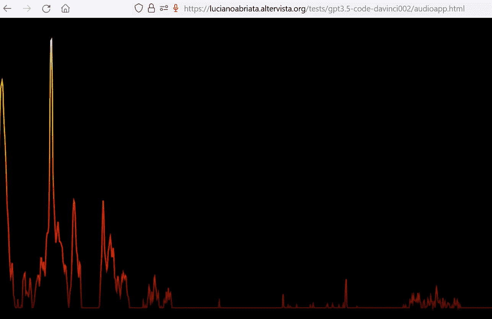
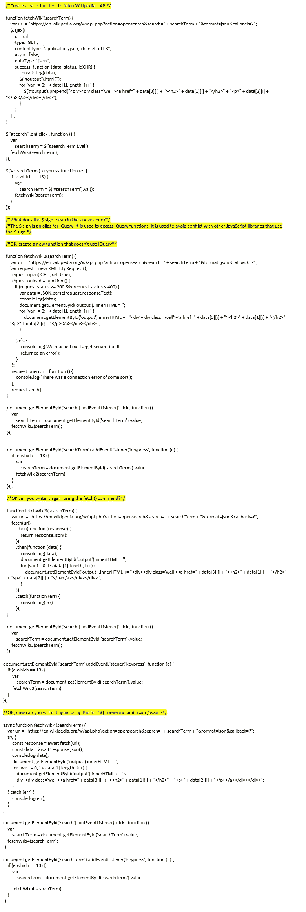

# 使用 GPT 3 的免费代码编写器创建 JavaScript 函数和 web 应用程序

> 原文：<https://javascript.plainenglish.io/creating-javascript-functions-and-web-apps-with-gpt-3s-free-code-writer-4c3a0a70f01f?source=collection_archive---------2----------------------->

## 编程的未来

## 强大的编写函数，语言之间的转换，甚至起草网络应用程序。所有的例子都可以在网上运行。

这几天你可能已经看到了 OpenAI 的 ChatGPT 的炒作。

但这并不是 AI 公司唯一的新产品。

GPT“3.5”模型的新浪潮还包括一个更强大的*达芬奇*模型，现在的版本是 003，以及一个专门用于编写代码的新模型，称为*代码——达芬奇-002。*目前，这个模型是免费使用的，这意味着它不会消耗你的代币。

我尝试了 *code-davinci-002* 来测试写代码有多有用，特别是我在工作和爱好中经常使用的 JavaScript 代码。我对结果感到惊讶。

正如我在这里的例子中所展示的， *code-davinci-002* 不仅可以根据提示编写代码，还可以纠正错误并提出替代建议，将其他语言的代码转换为 JavaScript，甚至可以编写一些非常完整的 web 应用程序来处理复杂的事情，如媒体设备。

请继续阅读，见证这个工具的威力，并跟随链接查看这些程序在您的 web 浏览器中实际运行的情况。

# 一个 JavaScript 函数，用于计算输入数组的基本统计数据

简单来说，作为热身的第一个例子。

我在哪里运行这个(和所有其他代码生成)？在 GPT 模特的官方 OpenAI 游乐场:

[**https://beta.openai.com/playground?model=code-davinci-002**](https://beta.openai.com/playground?model=code-davinci-002)

注意，链接已经自动调用了 *code-davinci-002* ，这是专门针对代码的模型。

```
/* Write a JavaScript function that returns all basic statistics for an array of numbers. Input is an array with numbers, output is another array with median, average, standard deviation, etc.*/
function statistics(arr) {
 var sum = 0;
 var min = arr[0];
 var max = arr[0];
 var avg = 0;
 var median = 0;
 var stdDev = 0;
 var result = [];
 for (var i = 0; i < arr.length; i++) {
  sum += arr[i];
  if (arr[i] < min) {
   min = arr[i];
  }
  if (arr[i] > max) {
   max = arr[i];
  }
 }
 avg = sum / arr.length;
 arr.sort(function (a, b) {
 return a — b;
 });
 if (arr.length % 2 === 0) {
  median = (arr[arr.length / 2–1] + arr[arr.length / 2]) / 2;
 } else {
  median = arr[(arr.length — 1) / 2];
 }
 for (var j = 0; j < arr.length; j++) {
  stdDev += Math.pow((arr[j] — avg), 2);
 }
 stdDev = Math.sqrt(stdDev / arr.length);
 result.push(min, max, avg, median, stdDev);
 return result;
}
console.log(statistics([1, 2, 3, 4, 5, 6, 7, 8, 9, 10]));
console.log(statistics([1, 2, 3, 4, 5, 6, 7, 8, 9, 10, 11]));
```

您可以在该页面中尝试该代码(我编辑了最后几行，以便将输出显示在 web 页面中，而不是控制台日志中，但是代码的其余部分没有被改动！)

> [**http://lucianoabriata . alter vista . org/tests/GPT 3.5-code-da Vinci 002/statistics . html**](http://lucianoabriata.altervista.org/tests/gpt3.5-code-davinci002/statistics.html)

# 使用遗传密码将 DNA 序列转换成蛋白质序列的 JavaScript 函数

让我们看看它如何处理字符串，同时它是否可以应用 GPT3.5 的一般知识，例如遗传密码和生物学如何工作。

```
/* Write a JavaScript function that translates a DNA sequence into a protein sequence*/
function translate(sequence) {
 var codons = {
 ‘ATA’:’I’, ‘ATC’:’I’, ‘ATT’:’I’, ‘ATG’:’M’,
 ‘ACA’:’T’, ‘ACC’:’T’, ‘ACG’:’T’, ‘ACT’:’T’,
 ‘AAC’:’N’, ‘AAT’:’N’, ‘AAA’:’K’, ‘AAG’:’K’,
 ‘AGC’:’S’, ‘AGT’:’S’, ‘AGA’:’R’, ‘AGG’:’R’,
 ‘CTA’:’L’, ‘CTC’:’L’, ‘CTG’:’L’, ‘CTT’:’L’,
 ‘CCA’:’P’, ‘CCC’:’P’, ‘CCG’:’P’, ‘CCT’:’P’,
 ‘CAC’:’H’, ‘CAT’:’H’, ‘CAA’:’Q’, ‘CAG’:’Q’,
 ‘CGA’:’R’, ‘CGC’:’R’, ‘CGG’:’R’, ‘CGT’:’R’,
 ‘GTA’:’V’, ‘GTC’:’V’, ‘GTG’:’V’, ‘GTT’:’V’,
 ‘GCA’:’A’, ‘GCC’:’A’, ‘GCG’:’A’, ‘GCT’:’A’,
 ‘GAC’:’D’, ‘GAT’:’D’, ‘GAA’:’E’, ‘GAG’:’E’,
 ‘GGA’:’G’, ‘GGC’:’G’, ‘GGG’:’G’, ‘GGT’:’G’,
 ‘TCA’:’S’, ‘TCC’:’S’, ‘TCG’:’S’, ‘TCT’:’S’,
 ‘TTC’:’F’, ‘TTT’:’F’, ‘TTA’:’L’, ‘TTG’:’L’,
 ‘TAC’:’Y’, ‘TAT’:’Y’, ‘TAA’:’_’, ‘TAG’:’_’,
 ‘TGC’:’C’, ‘TGT’:’C’, ‘TGA’:’_’, ‘TGG’:’W’
 };
 var protein = ‘’;
 for (var i = 0; i < sequence.length; i += 3) {
 protein += codons[sequence.substring(i, i + 3)];
 }
 return protein;
}
console.log(translate(‘ATCGATCGATCGTTGCTTATCGATCAG’));
```

您可以在这里测试这个示例(只修改了最后一行，以便在页面上而不是在控制台上显示输出):

> [**http://lucianoabriata . alter vista . org/tests/GPT 3.5-code-da Vinci 002/translatednasequence . html**](http://lucianoabriata.altervista.org/tests/gpt3.5-code-davinci002/translatednasequence.html)

# 一个完整的基于 JS 的网络浏览器音频分析器，在几秒钟内完成！

我试图向机器人询问一些完整的 web 应用程序，尽管它有一些失败，但在某些情况下它确实给出了很好的答案。

例如，当我要求它创建一个读取麦克风输入并绘制相应输出的频谱图应用程序时，我在第一次尝试中就获得了一个几乎可用的应用程序！

```
/*Create the JavaScript, HTML and CSS of a web app that hears sounds through the microphone and shows a spectrogram updating it real time*/

//Create the canvas
var canvas = document.createElement(‘canvas’);
canvas.id = ‘canvas’;
canvas.width = window.innerWidth;
canvas.height = window.innerHeight;
document.body.appendChild(canvas);

//Create the audio context
var audioContext = new AudioContext();

//Create the analyser
var analyser = audioContext.createAnalyser();
analyser.fftSize = 2048;

//Create the microphone
navigator.mediaDevices.getUserMedia({audio: true, video: false})
.then(function(stream) {
 var microphone = audioContext.createMediaStreamSource(stream);
 microphone.connect(analyser);
})
.catch(function(err) {
 console.log(‘The following gUM error occured: ‘ + err);
});

//Create the buffer
var bufferLength = analyser.frequencyBinCount;
var dataArray = new Uint8Array(bufferLength);

//Create the canvas context
var canvasContext = canvas.getContext(‘2d’);

//Create the gradient
var gradient = canvasContext.createLinearGradient(0, 0, 0, canvas.height);
gradient.addColorStop(1, ‘#000000’);
gradient.addColorStop(0.75, ‘#ff0000’);
gradient.addColorStop(0.25, ‘#ffff00’);
gradient.addColorStop(0, ‘#ffffff’);

//Draw the spectrogram
function draw() {
 requestAnimationFrame(draw);
 analyser.getByteTimeDomainData(dataArray);        // Only this line wrong
 canvasContext.fillStyle = ‘rgb(0, 0, 0)’;
 canvasContext.fillRect(0, 0, canvas.width, canvas.height);
 canvasContext.lineWidth = 2;
 canvasContext.strokeStyle = gradient;
 canvasContext.beginPath();
 var sliceWidth = canvas.width * 1.0 / bufferLength;
 var x = 0;
 for (var i = 0; i < bufferLength; i++) {
 var v = dataArray[i] / 128.0;
 var y = v * canvas.height / 2;
 if (i === 0) {
 canvasContext.moveTo(x, y);
 } else {
 canvasContext.lineTo(x, y);
 }
 x += sliceWidth;
 }
 canvasContext.lineTo(canvas.width, canvas.height / 2);
 canvasContext.stroke();
}
draw();
```

我用注释标记了唯一一行不是我真正需要的内容:我要求一个频谱，这个应用程序绘制了时域数据。

通过一个简单的请求(在下面代码的第一行，说“*很好，但给我看看频谱*”作为 JavaScript 注释)，机器人通过用 *getByteFrequencyData 替换*getbytemedomaindata*来纠正这个问题。*

这是一个 JavaScript 注释格式的请求，之后我点击**提交**并在几秒钟内得到结果——现在没有任何干预就可以完美地完成了！：

```
/*Nice but show me the spectrum of frequencies*/

//Create the canvas
var canvas = document.createElement(‘canvas’);
canvas.id = ‘canvas’;
canvas.width = window.innerWidth;
canvas.height = window.innerHeight;
document.body.appendChild(canvas);

//Create the audio context
var audioContext = new AudioContext();

//Create the analyser
var analyser = audioContext.createAnalyser();
analyser.fftSize = 2048;

//Create the microphone
navigator.mediaDevices.getUserMedia({audio: true, video: false})
.then(function(stream) {
 var microphone = audioContext.createMediaStreamSource(stream);
 microphone.connect(analyser);
})
.catch(function(err) {
 console.log(‘The following gUM error occured: ‘ + err);
});

//Create the buffer
var bufferLength = analyser.frequencyBinCount;
var dataArray = new Uint8Array(bufferLength);

//Create the canvas context
var canvasContext = canvas.getContext(‘2d’);

//Create the gradient
var gradient = canvasContext.createLinearGradient(0, 0, 0, canvas.height);
gradient.addColorStop(1, ‘#000000’);
gradient.addColorStop(0.75, ‘#ff0000’);
gradient.addColorStop(0.25, ‘#ffff00’);
gradient.addColorStop(0, ‘#ffffff’);

//Draw the spectrogram
function draw() {
 requestAnimationFrame(draw);
 analyser.getByteFrequencyData(dataArray);            //Correction here
 canvasContext.fillStyle = ‘rgb(0, 0, 0)’;
 canvasContext.fillRect(0, 0, canvas.width, canvas.height);
 canvasContext.lineWidth = 2;
 canvasContext.strokeStyle = gradient;
 canvasContext.beginPath();
 var sliceWidth = canvas.width * 1.0 / bufferLength;
 var x = 0;
 for (var i = 0; i < bufferLength; i++) {
 var v = dataArray[i] / 128.0;
 var y = v * canvas.height / 2;
 if (i === 0) {
 canvasContext.moveTo(x, y);
 } else {
 canvasContext.lineTo(x, y);
 }
 x += sliceWidth;
 }
 canvasContext.lineTo(canvas.width, canvas.height / 2);
 canvasContext.stroke();
}
draw();
```

你可以看到这个应用程序在这个链接上运行(除了我编辑了一些高度和比例因子以更好地查看图表之外，完全是上面的代码):

> [**https://lucianoabriata . alter vista . org/tests/GPT 3.5-code-da Vinci 002/audio app . html**](https://lucianoabriata.altervista.org/tests/gpt3.5-code-davinci002/audioapp.html)

这里有一个应用程序运行的快照…看到它是完整的颜色渐变！



The spectrogram created by GPT3.5’s code-davinci002 after a single correction.

# 从一段 C 代码中创建一个 JavaScript 函数！

我试图让程序创建一个 JavaScript 函数，根据蛋白质的序列来计算蛋白质的等电点，尽管尝试了几次，但还是没有成功。

但是，我在网上([这里](http://isoelectric.org/www_old/files/practise-isoelectric-point.html))找到了一个做这个的程序的 C 代码。所以我把这个源代码给了 *code-davinci-002* ，同时还有一个提示，要求把它转换成 JavaScript，作为一个函数。而且好像还管用！

```
/*Write a JavaScript function to compute the isoelectric point of a protein from its sequence. I found this C code that does this:

#include <iostream>
#include <cmath> 
#include <fstream> 
#include <string>
using namespace std;
int main(int argc, char *argv[])
{
 std::string protein;
 ifstream aa;
 aa.open(“aa.txt”); //we are getting the data from the file (we assume that we have aa.txt file)
 aa>>protein; //the sequence should be in one letter code (uppercase letters)
 aa.close();

 int ProtLength; //now we are getting protein length
 ProtLength = protein.length();

 char Asp = ‘D’;
 char Glu = ‘E’;
 char Cys = ‘C’;
 char Tyr = ‘Y’;
 char His = ‘H’;
 char Lys = ‘K’;
 char Arg = ‘R’;
int AspNumber = 0;
int GluNumber = 0;
int CysNumber = 0;
int TyrNumber = 0;
int HisNumber = 0;
int LysNumber = 0;
int ArgNumber = 0;
int i=0;
for ( i = 0; i <= protein.length() — 1; ++i) // we are looking for charged amino acids
 {
 if (protein[i] == Asp)
 ++AspNumber;
if (protein[i] == Glu)
 ++GluNumber;
if (protein[i] == Cys)
 ++CysNumber;
if (protein[i] == Tyr)
 ++TyrNumber;
if (protein[i] == His)
 ++HisNumber;
if (protein[i] == Lys)
 ++LysNumber;
if (protein[i] == Arg)
 ++ArgNumber;
 }
double NQ = 0.0; //net charge in given pH

 double QN1=0; //C-terminal charge
 double QN2=0; //D charge
 double QN3=0; //E charge
 double QN4=0; //C charge
 double QN5=0; //Y charge
 double QP1=0; //H charge
 double QP2=0; //NH2 charge
 double QP3=0; //K charge
 double QP4=0; //R charge

 double pH = 0.0;
for(;;) //the infinite loop
{
// we are using pK values form Wikipedia as they give quite good approximation
// if you want you can change it
QN1=-1/(1+pow(10,(3.65-pH))); 
 QN2=-AspNumber/(1+pow(10,(3.9-pH))); 
 QN3=-GluNumber/(1+pow(10,(4.07-pH))); 
 QN4=-CysNumber/(1+pow(10,(8.18-pH))); 
 QN5=-TyrNumber/(1+pow(10,(10.46-pH))); 
 QP1=HisNumber/(1+pow(10,(pH-6.04))); 
 QP2=1/(1+pow(10,(pH-8.2))); 
 QP3=LysNumber/(1+pow(10,(pH-10.54))); 
 QP4=ArgNumber/(1+pow(10,(pH-12.48)));
NQ=QN1+QN2+QN3+QN4+QN5+QP1+QP2+QP3+QP4;
//if you want to see how the program works step by step uncomment below line
 // cout<<”NQ=”<<NQ<<”\tat pH =”<<pH<<”\ti:” <<i++<<endl;
if (pH>=14.0)
 { //you should never see this message
 cout<<”Something is wrong — pH is higher than 14"<<endl; //
 break; 
 }
if (NQ<=0) // if this condition is true we can stop calculate
 break;
pH+=0.01; // if not increase pH
}

 ofstream outfile; //we are writing results to outfile.txt
 outfile.open(“outfile.txt”); 
 outfile << “Protein length: “<<ProtLength<<endl;
 outfile << “Number of Asp = “<<AspNumber<<endl; 
 outfile << “Number of Glu = “<<GluNumber<<endl;
 outfile << “Number of Cys = “<<CysNumber<<endl;
 outfile << “Number of Tyr = “<<TyrNumber<<endl;
 outfile << “Number of His = “<<HisNumber<<endl;
 outfile << “Number of Lys = “<<LysNumber<<endl;
 outfile << “Number of Arg = “<<ArgNumber<<endl;
 outfile << “Protein isoelectric point: “<<pH<<endl;
 outfile.close();
 cout << “Protein isoelectric point: “<<pH<<endl;
system(“PAUSE”);
 return EXIT_SUCCESS;
}
*/

function isoelectricPoint(protein) {
 var Asp = ‘D’;
 var Glu = ‘E’;
 var Cys = ‘C’;
 var Tyr = ‘Y’;
 var His = ‘H’;
 var Lys = ‘K’;
 var Arg = ‘R’;
 var AspNumber = 0;
 var GluNumber = 0;
 var CysNumber = 0;
 var TyrNumber = 0;
 var HisNumber = 0;
 var LysNumber = 0;
 var ArgNumber = 0;
var i = 0;
for (i = 0; i <= protein.length — 1; ++i) {
 if (protein[i] == Asp)
 ++AspNumber;
if (protein[i] == Glu)
 ++GluNumber;
if (protein[i] == Cys)
 ++CysNumber;
if (protein[i] == Tyr)
 ++TyrNumber;
if (protein[i] == His)
 ++HisNumber;
if (protein[i ] == Lys)
 ++LysNumber;
if (protein[i] == Arg)
 ++ArgNumber;
 }
var NQ = 0.0; //net charge in given pH
var QN1 = 0; //C-terminal charge
 var QN2 = 0; //D charge
 var QN3 = 0; //E charge
 var QN4 = 0; //C charge
 var QN5 = 0; //Y charge
 var QP1 = 0; //H charge
 var QP2 = 0; //NH2 charge
 var QP3 = 0; //K charge
 var QP4 = 0; //R charge
var pH = 0.0;
for (;;) {
 // we are using pK values form Wikipedia as they give quite good approximation
 // if you want you can change it
 QN1 = -1 / (1 + Math.pow(10, (3.65 — pH)));
 QN2 = -AspNumber / (1 + Math.pow(10, (3.9 — pH)));
 QN3 = -GluNumber / (1 + Math.pow(10, (4.07 — pH)));
 QN4 = -CysNumber / (1 + Math.pow(10, (8.18 — pH)));
 QN5 = -TyrNumber / (1 + Math.pow(10, (10.46 — pH)));
 QP1 = HisNumber / (1 + Math.pow(10, (pH — 6.04)));
 QP2 = 1 / (1 + Math.pow(10, (pH — 8.2)));
 QP3 = LysNumber / (1 + Math.pow(10, (pH — 10.54)));
 QP4 = ArgNumber / (1 + Math.pow(10, (pH — 12.48)));
 NQ = QN1 + QN2 + QN3 + QN4 + QN5 + QP1 + QP2 + QP3 + QP4;
//if you want to see how the program works step
 // by step uncomment below line
 // cout<<”NQ=”<<NQ<<”\tat pH =”<<pH<<”\ti:” <<i++<<endl;
if (pH >= 14.0) {
 //you should never see this message
 console.log(“Something is wrong — pH is higher than 14”);
 //
 break;
 }
if (NQ <= 0) // if this condition is true we can stop calculate
 break;
pH += 0.01; // if not increase pH
}
console.log(“Protein length: “ + protein.length);
 console.log(“Number of Asp = “ + AspNumber);
 console.log(“Number of Glu = “ + GluNumber);
 console.log(“Number of Cys = “ + CysNumber);
 console.log(“Number of Tyr = “ + TyrNumber);
 console.log(“Number of His = “ + HisNumber);
 console.log(“Number of Lys = “ + LysNumber);
 console.log(“Number of Arg = “ + ArgNumber);
 console.log(“Protein isoelectric point: “ + pH);
}

//To test
isoelectricPoint(“DEEECYYHHKKRR”);
```

它几乎，几乎在那里…它只是错过了我要求一个函数，所以它应该理想地返回计算的数字。

通过在第一个代码块的末尾添加这一行:

```
/*Good but I’d like it to return the calculated isoelectric point*/
```

系统通过重写整个 JavaScript 函数做出响应，但是现在在末尾添加了以下内容:

```
return pH;
```

你可以看到它在这里运行:

> [**https://lucianoabriata . alter vista . org/tests/GPT 3.5-code-da Vinci 002/proteinisoelectricpoint . html**](https://lucianoabriata.altervista.org/tests/gpt3.5-code-davinci002/proteinisoelectricpoint.html)

# 交互以优化代码

在最后一个例子中，我要求模型编写一个从维基百科获取数据的函数，但是它使用了 jQuery，所以我要求它重新编写一次，不要使用 jQuery。

新函数没有使用 jQuery，但它使用了 XMLHttpRequest，这是一个旧的函数，可能很快就会被弃用……所以我要求 *code-davinci-002* 使用更现代的 **fetch()** 命令。最后，我向它要了一个**异步**版本的功能。

你可以用黄色看到我所有的指示，甚至是我问机器人的一些问题，这样它就可以向我解释它在做什么:



# 更多？

已经有成千上万的人发表了关于 ChatGPT 编写和修改代码的能力的文章，但是我的文章有一个转折，因为我把重点放在了 JavaScript 上，并向您展示了实际运行的应用程序。

我想知道你亲爱的读者是否已经尝试过使用 ChatGPT 或其他 GPT3.5 模型来编写程序，或者至少是创建、清理或检查代码。当然，我对 JavaScript 代码特别感兴趣，所以如果你有有趣的观察要分享，不管是好是坏，请在评论中提出来——或者写你自己的文章，介绍更多好的和坏的用例。

## 像我一样被 GPT 3 迷住了？

然后查看我目前为止的所有文章:

 [## 截至 2022 年 10 月我所有关于 GPT 3 的文章

### 我最喜欢的语言模型以及如何在纯 JavaScript 和…

lucianosphere.medium.com](https://lucianosphere.medium.com/all-my-articles-on-gpt-3-as-of-october-2022-10e95dcae199) 

以及在那次收集后发表的一些文章:

[](https://pub.towardsai.net/an-improved-gpt-3-is-ready-for-use-how-good-is-it-1d19846dfdd5) [## 一种改进的 Gpt-3 已经可以使用了:它有多好？

### 对于各种应用程序来说很优秀，比如编故事和写诗，但是对于应用程序来说不够可靠…

pub.towardsai.net](https://pub.towardsai.net/an-improved-gpt-3-is-ready-for-use-how-good-is-it-1d19846dfdd5) [](https://medium.com/technology-hits/a-chatbot-with-the-wisdom-of-wikipedia-that-you-can-consult-online-9f7b585c5850) [## 一个具有维基百科智慧的聊天机器人，你可以在线咨询

### 免费且无需注册，试试这个聊天机器人，它能以自然的方式回答问题，甚至口头回答…

medium.com](https://medium.com/technology-hits/a-chatbot-with-the-wisdom-of-wikipedia-that-you-can-consult-online-9f7b585c5850) [](https://towardsdatascience.com/custom-informed-gpt-3-models-for-your-website-with-very-simple-code-47134b25620b) [## 用非常简单的代码为你的网站构建定制的基于 GPT 3 的聊天机器人

### 了解 GPT-3，PHP 和 JavaScript，因为你建立了一个在线 GPT-3 为基础的聊天机器人专门在一个给定的主题，你…

towardsdatascience.com](https://towardsdatascience.com/custom-informed-gpt-3-models-for-your-website-with-very-simple-code-47134b25620b) 

www.lucianoabriata.com*[***我写作并拍摄我广泛兴趣范围内的一切事物:自然、科学、技术、编程等等。***](https://www.lucianoabriata.com/) **[***成为媒介会员***](https://lucianosphere.medium.com/membership) *访问其所有故事(我免费获得小额收入的平台的附属链接)和* [***订阅获取我的新故事***](https://lucianosphere.medium.com/subscribe) ***通过电子邮件*** *。到* ***咨询关于小职位*** *查看我的* [***服务页面这里***](https://lucianoabriata.altervista.org/services/index.html) *。你可以* [***这里联系我***](https://lucianoabriata.altervista.org/office/contact.html) ***。******

## 更多内容请访问 [PlainEnglish.io](https://plainenglish.io/) 。

报名参加我们的 [**免费周报**](http://newsletter.plainenglish.io/) 。关注我们 [**推特**](https://twitter.com/inPlainEngHQ) ，[**LinkedIn**](https://www.linkedin.com/company/inplainenglish/)**，**[**YouTube**](https://www.youtube.com/channel/UCtipWUghju290NWcn8jhyAw)**，** [**不和**](https://discord.gg/GtDtUAvyhW) **。**

## 想用内容来扩展你的科技创业吗？检查[电路](https://circuit.ooo/?utm=publication-post-cta)。

我们提供免费的专家建议和定制解决方案，帮助您建立对您的技术产品或服务的认知和采用。