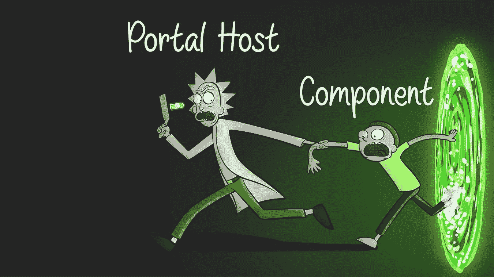
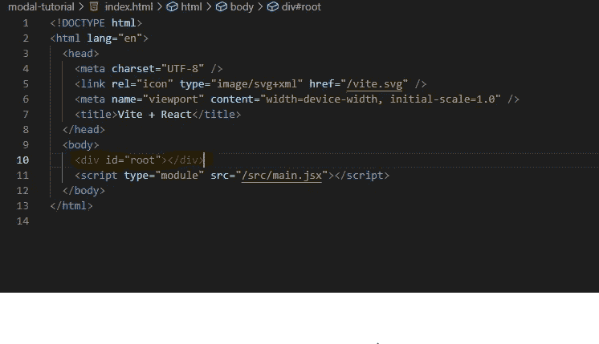
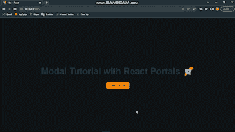
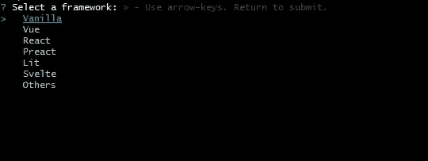
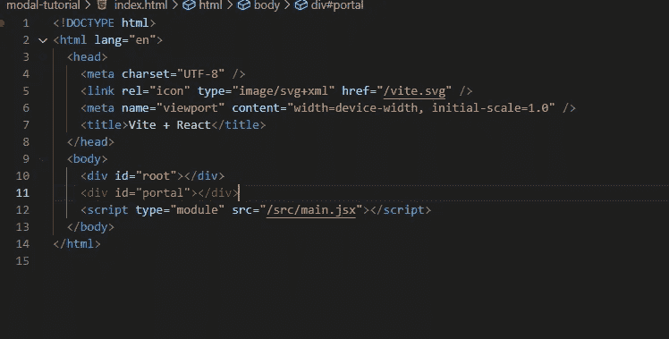

# 如何在 React 门户中创建模型

> 原文：<https://javascript.plainenglish.io/creating-modals-with-react-portal-40829c33a626?source=collection_archive---------1----------------------->



我猜你是一名 web 开发人员，在意识到使用 vanilla JS 中的传统方法后，你一直在寻求如何在 react 应用程序上创建模态，在 react 中，你只需切换模态的可见性属性以在屏幕上显示和删除它，这不是 100%有效的。

## 为什么？

这是因为 react 默认挂载其*index.html*文件的根元素中的每个元素。

你一定不可避免地在每个 react 项目的【index.html】文件中遇到过它，用黄色突出显示，如下所示:



因此很难在这个层次之外呈现子元素。

## 解决办法

react portal 的引入打破了这种层次结构，它允许在不在根元素下的 dom 节点上呈现组件，从而彻底改变了游戏规则。

## 它是如何工作的？

```
ReactDOM.createPortal(child, container) 
```

React 门户通过函数 *createPortal* 用 ReactDOM 创建，该函数有两个参数，其中:

*   child 表示要生成的元素(在本例中是我们的模态元素)
*   container 表示将在其中生成上述元素的容器

为了更好地理解它，让我们构建下面的简单模型:



Gif of what we’re going to build

## 应用

## 首先，让我们初始化我们的 react 应用程序:

要初始化我们的 react 应用程序，让我们在您的终端上使用以下命令:

```
npm create vite@latest
```

然后，使用箭头键按照提示进行操作，并选择 react:



Choosing the type of project with vite

你可能已经注意到了 vite 的用法，不熟悉也不用担心。它有助于更快地构建 react 应用程序，但这是另一个故事。

## 2)创建背景和模态组件

在你的项目的根目录 *src* 文件夹下，创建一个文件夹并给它命名为 *Components。*

我们将继续创建两个文件:

*   背景:我们模型后面的黑色透明背景。

复制并粘贴以下代码:

```
import React from 'react';
import ReactDOM from "react-dom";
import '../App.css'

export default function Backdrop({children, closeModal}) {
    return ReactDOM.createPortal(
        <div className='backdrop' onClick={closeModal}>
            {children}
        </div>,
        document.getElementById('portal')
      )
}
```

*   模态:模态本身。

```
import React from 'react'
import Backdrop from './Backdrop'
import '../App.css'

function modal({closeModal}) {
  return (
    <Backdrop closeModal={closeModal}>
        <div className='modal' onClick={(e) => e.stopPropagation()}>
            <h3>Modal</h3>
            <p>Lorem ipsum dolor sit amet, consectetur adipisicing elit. Nobis ullam inventore temporibus commodi sapiente, molestiae voluptates facere repellat nisi laudantium dolorum minima! Magnam corrupti soluta totam incidunt nesciunt quisquam libero.</p>
            <button style={{color: 'white', background: 'black', outline: 'none'}} onClick={closeModal}>Close</button>
        </div>
    </Backdrop>
  )
}

export default modal
```

## 3)创建 div，我们的模态将在其中生成

在你的文件夹的根目录下，找到*index.html*文件和下面的 html 标签:

```
<div id="portal"></div>
```

它应该如下所示:



Adding the div where our portal will spawn

## 4)把它全部带到 together✍️

最后，在我们的 *App.jsx* 文件中，复制并粘贴以下代码:

```
import { useState } from 'react'
import Modal from './Components/Modal'
import './App.css'

function App() {
  //State to open and close modal
  const [modalOpen, setModalOpen] = useState(false)

  //Function to toggle state for opening and closing modal
  const handleModal = () => {
    setModalOpen(!modalOpen)
  }

  return (
    <div className="App">
      <h1>Modal Tutorial with React Portals 🚀</h1>
      <button onClick={handleModal} style={{background: '#FF9300', fontWeight: '600', outline: 'none'}}>Open Modal</button>
      {modalOpen && <Modal closeModal={() => setModalOpen(false)}></Modal>}
    </div>
  )
}

export default App
```

请注意，样式完全取决于您，但是出于本教程的考虑，我们将使用下面的代码片段。

因此，将以下代码复制并粘贴到您的 App.css 文件中，以完成这项工作。

```
.App{
  width: 100vw;
  height: 100vh;
  display: flex;
  flex-direction: column;
  justify-content: center;
  align-items: center;
  background-color: #101315;
}

.backdrop{
  position: absolute;
  top: 0;
  left: 0;
  width: 100%;
  height: 100%;
  background: #000000e1;
  display: flex;
  justify-content: center;
  align-items: center;
}

.modal{
  width: clamp(50%, 700px, 90%);
  height: min(50%, 300px);
  display: flex;
  flex-direction: column;
  align-items: center;
  padding: 0 1.5rem;
  font-size: 1.2rem;
  border-radius: 1rem;
  background-color: #FF9300;
  margin: auto;
}
```

就是这样！我们已经按照承诺使用 **react portal** 构建了我们的模型。你现在可以在你的网站上添加这个功能，让它们看起来更真实。

如果你有任何问题，请随时查看我的推特。我很乐意消除任何疑问。

如果你玩得开心，别忘了留下掌声并分享这篇文章。；-)


*更多内容请看*[***plain English . io***](https://plainenglish.io/)*。报名参加我们的* [***免费周报***](http://newsletter.plainenglish.io/) *。关注我们关于*[***Twitter***](https://twitter.com/inPlainEngHQ)[***LinkedIn***](https://www.linkedin.com/company/inplainenglish/)*[***YouTube***](https://www.youtube.com/channel/UCtipWUghju290NWcn8jhyAw)*[***不和***](https://discord.gg/GtDtUAvyhW) ***。*****

*****对缩放您的软件启动感兴趣*** *？检查* [***电路***](https://circuit.ooo/?utm=publication-post-cta) *。***