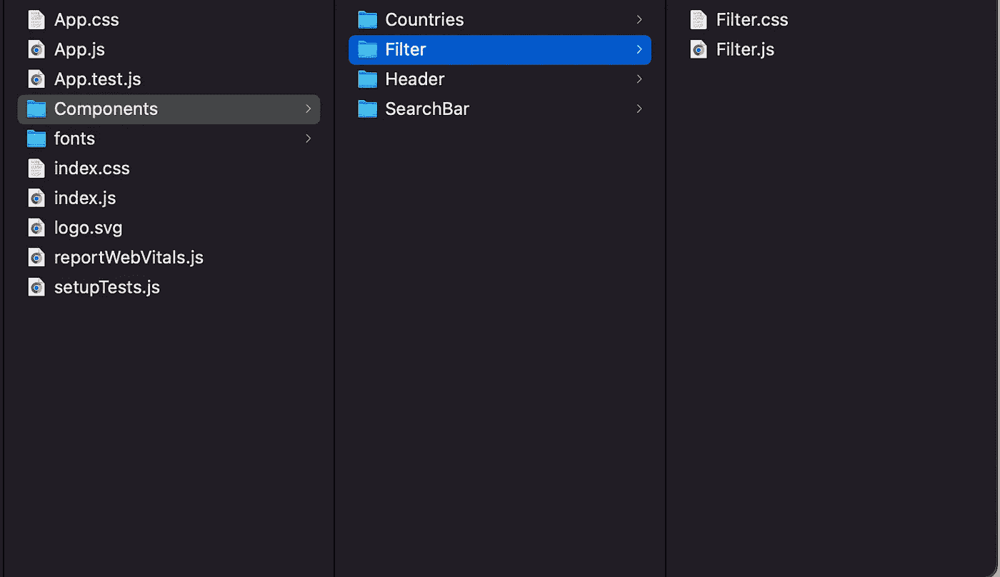

# 创建我的第一个 React 应用

> 原文：<https://javascript.plainenglish.io/creating-my-first-react-app-400d2ababc1d?source=collection_archive---------6----------------------->

## 使用 create-react-app 为一个项目一步一步制作我的第一个 React-app。


Photo by [Joan Gamell](https://unsplash.com/@gamell?utm_source=unsplash&utm_medium=referral&utm_content=creditCopyText) on [Unsplash](https://unsplash.com/s/photos/React-APp?utm_source=unsplash&utm_medium=referral&utm_content=creditCopyText)

大家好！在掌握了 HTML、CSS 和 JavaScript 的基础知识并掌握了 CSS 框架之后，我认为是时候开始学习我的第一个 Java script 框架了，下面是我是如何做的！

## 步骤 1 —安装 NPM 和 NPX

如果你想使用 create-react app 命令创建你的应用程序，那么你需要 NPM(**N**ode**P**ackage**M**anager)，默认情况下你可以通过安装 JS 库节点(它提供了后端 JavaScript 的工具，允许你在没有浏览器的情况下运行 JS 文件)，你可以从([https://nodejs.org/en/](https://nodejs.org/en/)下载节点。NPM 使开发者能够轻松地在本地和全球安装软件包，而 NPX 是一个 CLI 工具，使前者更容易。从 NPM 5.2.0 开始，NPX 是默认的。要检查它是否已安装，请运行:

```
$ which npx
```

如果它不运行

```
$ npm install -g npx
```

## 步骤 2-使用创建-反应-应用程序

要开始，请键入:

```
$ npx create-react-app
```

该命令允许您直接创建 React 应用程序工作所需的所有代码和文件，而不是让您手动创建它们，从而节省大量代码并允许您只关注代码。

文件夹结构如下

my-app/
readme . MD
node _ modules/
package . JSON
public/
index.html
favicon . ico
src/
app . CSS
app . js
app . test . js
index . CSS
index . js
logo . SVG

## 步骤 3-设置基本文件和字体

你想要设置的一些基本文件是 index.html(在这里只添加你的<link>到字体和其他框架，如 Bootstrap)，因为脚本会在运行应用程序时自动添加。如果您愿意，您可以设置一个 reset.css 文件，以便以后更快地使用 css。如果你愿意，你也应该设置 favicon。还有一些其他文件，如 manifest.json 和 logo.svg(很快会有一篇关于它们的文章，请保持警惕！)



My fold structure

## 步骤 4-创建组件并设置其样式

现在我建议你开始创建你的组件，不管是使用类还是函数。您还可以导入 CSS，以便您的组件已经使用您设置的样式呈现。我建议在 src/ one 中创建一个组件文件夹。每个组件都应该有自己独立的 JS 和 CSS 文件。还可以在 App.css 中添加全局样式。

## 步骤 5—实现功能

现在是时候开始编码了！在我的例子中，我的应用程序要求我从 REST Countries API 中获取数据，并将其显示在不同的国家框中。它还要求我过滤它们，制作一个搜索栏和一个亮/暗模式切换。这是我为<countries>组件编写的代码。</countries>

```
import React from "react";
import "./Countries.css";

export default class Countries extends React.Component {
  constructor(props) {
    super(props);
    this.state = { countries: [] };
  }

  async getDefaultCountries() {
    let array = [];
    let countries = await fetch("https://restcountries.com/v3.1/all").then(
      (response) => response.json()
    );
    for (let i = 0; i < 8; i++) {
      let index = Math.floor(Math.random() * 99);
      array.push(countries[index]);
    }
    return array;
  }
  render() {
    return (
      <article>
        {this.state.countries.map((country) => {
          return (
            <section>
              
              <h2>{country.name.common}</h2>
              <strong>Population: </strong> {country.population}
              <strong>Region: </strong> {country.region}
              <strong>Capital: </strong> {}
            </section>
          );
        })}
        hola
      </article>
    );
  }

  async componentDidMount() {
    this.setState({ countries: await this.getDefaultCountries() });
  }
}
```

**注意:**记住渲染并导入 App.js 中的组件，以便它们显示在实际的应用程序中，我通常使用导出默认设置。

## 步骤 6 —制作构建版本并发布它

写完代码后，是时候制作构建版本了。您可以运行未经优化的应用程序版本，只需转到其文件夹并键入:

```
$ npm start
```

如果您想要创建最终版本(您将要发布的版本)，请运行:

```
$ npm run build
```

在此之后，你可以使用任何你喜欢的 React 应用程序发布，一些例子是 Netlify 和 Surge。你可以在[https://github.com/Chabulsqu/country-finder](https://github.com/Chabulsqu/country-finder)上看到我的应用(WIP)。

**今天的文章就到这里，我希望你能像我写这篇文章一样喜欢😃。**

*更多内容看* [***说白了就是***](https://plainenglish.io/) *。报名参加我们的* [***免费周报***](http://newsletter.plainenglish.io/) *。关注我们关于* [***推特***](https://twitter.com/inPlainEngHQ) ， [***领英***](https://www.linkedin.com/company/inplainenglish/) *，*[***YouTube***](https://www.youtube.com/channel/UCtipWUghju290NWcn8jhyAw)*，以及* [***不和***](https://discord.gg/GtDtUAvyhW) *。对增长黑客感兴趣？检查* [***电路***](https://circuit.ooo/) *。*