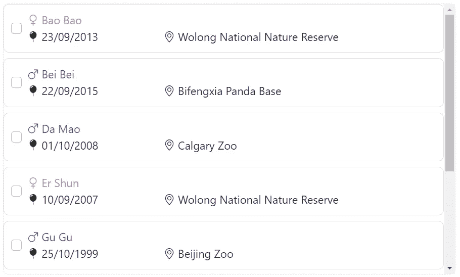
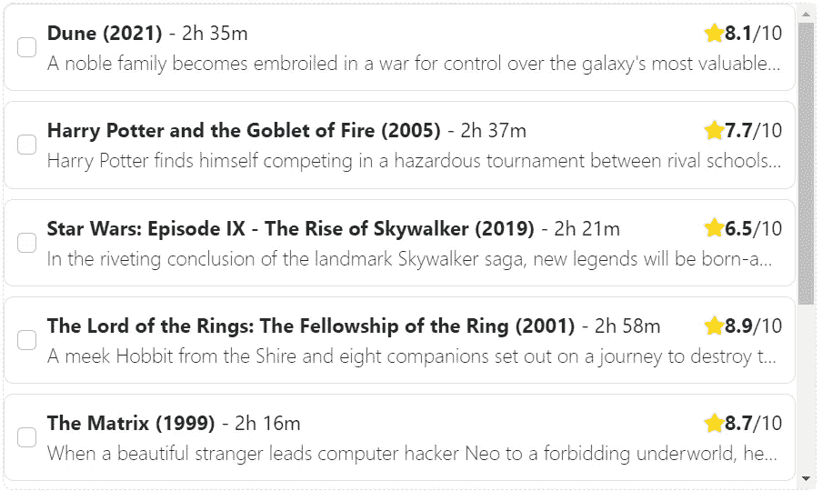

# 如何在 Angular 中创建可重用组件

> 原文：<https://javascript.plainenglish.io/creating-reusable-configurable-angular-components-b7fcba2f5f38?source=collection_archive---------2----------------------->

## 角形|可重复使用的组件

## 使用 NgTemplateOutlet 和 NgComponentOutlet 指令创建可重复使用的角度组件。

Photo by [Kwangmoozaa](https://www.istockphoto.com/portfolio/Kwangmoozaa)

我喜欢 Angular 的一点是它基于组件的特性。组件是可重用的结构块，用于构建可伸缩的 web 应用程序。然而，有时仅有组件是不够的。

在本文中，我们将探索在 Angular 中创建 ***可重用组件的两种方法，它们也是可配置的。***

所以，振作起来，让我们开始吧！

# 问题是

想象一下，我们已经为我们最喜欢的动物大熊猫建立了一个选择列表！

Selection list for our beloved pandas

该列表允许我们选择一只或多只熊猫来参观。它显示每只熊猫的信息，如名字、性别、出生日期和当前位置。

然后我们改变了主意，决定用这个列表来看我们最喜欢的电影。

Selection list for our favorite movies

该列表允许我们选择一部或多部电影稍后观看。它显示每部电影的几条信息，如电影名称、上映年份、持续时间、星级和简短描述。

现在，如果我们可以定制选择列表来包含前面的两种情况，不是很好吗？但是电影当然有和熊猫不一样的特点。那么，我们该怎么办？

**我们是否修改现有列表以涵盖不同的情况？**我们将最终得到一个不必要的复杂组件，它的代码看起来像一团乱麻。

**我们要创建一个新列表吗？复制粘贴选择列表的代码会导致代码重复，这肯定不是一个好主意。**

更糟糕的是，如果我们将来要将列表用于其他事情，该怎么办？上述解决方案都无法扩展。

真扫兴。现在怎么办？

# NgTemplateOutlet 方式

指令来救援了！

我们使用一个`ng-container`作为占位符，而不是有一个显式定义其项目组件的选择列表。占位符有一个接收模板引用的`ngTemplateOutlet`，`itemTemplateRef`。

我们使用`ngTemplateOutletContext`将上下文传递给这个模板。在我们的例子中，我们传递每一项的上下文，以便模板知道它每次显示哪个项。

接下来，我们定义将替换占位符的模板。在我们的例子中，模板只包含一个 panda 组件。我们将这个模板的引用命名为`itemTemplate`。我们从模板中提供`item`的上下文作为`PandaComponent`的输入。

最后，我们需要获取`itemTemplate`引用，将其传递给`ngTemplateOutlet`指令。我们通过使用`@ContentChild`装饰器来做到这一点。

就是这样！我们的选择列表准备好了！我们可以重用该组件来显示和选择熊猫、电影或任何我们喜欢的东西。

你可以在下面的 StackBlitz 找到一个工作演示。你可能也想[订阅我的时事通讯](https://vkagklis.medium.com/subscribe)来关注更多类似的内容！

# NgComponentOutlet 方式

实现相同结果的第二种方法是`ngComponentOutlet`指令。

**来自 Angular 的官方文档:“** *实例化一个* `[*Component*](https://angular.io/api/core/Component)` *类型，并将其宿主视图插入当前视图。* `[*NgComponentOutlet*](https://angular.io/api/common/NgComponentOutlet)` *为动态组件创建提供了一种声明式的方法*

像第一个解决方案一样，我们使用一个`ng-container`作为指令的占位符。`ngComponentOutlet`需要将要实例化的组件类型。

`ngComponentOutletInjector`需要一个作为依赖项传递给实例化组件的注入器。我们可以使用这个注入器将数据传递给那个组件。我们还使用两个[定制管道](/custom-pipes-in-angular-the-ultimate-guide-e54bb400e3ce) `itemComponent`和`itemInjector`将每一项转换成期望的输入。

`itemComponent`管道将项目转换成组件类型。它通过使用地图服务来实现这一点。

`ComponentMappingService`包含项目类型和组件类型之间的预定义映射。基于给定的项目类型，返回相应的组件类型用于实例化。

这里唯一的缺点是项目的类型必须包含在它的属性中。这是在运行时获取项目类型的最安全的方式。

在我们的例子中，我们使用一个枚举和一个接口来简化事情。使用`ModelType`,我们强类型化可用的项目类型。然后我们可以用我们希望拥有`type`属性的接口来扩展`TypeOwner`。

第二个管道`itemInjector`接收一个项目并返回一个注入器。注入器用作将项目注入实例化组件的手段。

最后，我们创建一个`DynamicComponent`，它有一个`item`变量，并接收注射器作为它的依赖项。在构造函数中，我们用通过注入器提供的项目来设置组件的项目。

我们想要映射到特定项目类型的组件必须扩展`DynamicComponent`。这样，我们就不必在每个组件中包含注射器依赖关系。此外，这个项目有一个`@Input`装饰器，以防我们想在这个实现的范围之外使用子组件。

然后按如下方式重构`PandaComponent`。

你可以在下面的 StackBlitz 找到一个工作演示。

# 比较实现

前面的两种实现并不完全等同。

在`ngTemplateOutlet`实现中，我们指定了哪个组件将用于列表中的所有项目。列表可以包含我们想要的任何类型的条目，但是显示组件对所有条目都是相同的类型。

在`ngComponentOutlet`实现中，我们在每个项目上使用了`itemComponent`管道，而不是传递静态组件类型。因此，每个项目可以使用基于预定义映射的不同类型的显示组件。

# 结论

在本文中，我们研究了创建可重用角度组件的两种方法。这两种解决方案都是可扩展的，并且消除了代码重复。然后，可以重用生成的组件来容纳我们想要的任何类型的项目。

感谢您的阅读。我希望你喜欢这篇文章，并且你学到了一些新的东西。如果有，请考虑通过我的推荐链接注册 Medium:

 [## 通过我的推荐链接加入 Medium—kakk lis Vasileios

### 阅读 Kagklis Vasileios(以及媒体上成千上万的其他作家)的每一个故事。您的会员费直接…

kagklis.medium.com](https://kagklis.medium.com/membership) 

*更多内容请看*[***plain English . io***](https://plainenglish.io/)*。报名参加我们的* [***免费周报***](http://newsletter.plainenglish.io/) *。关注我们关于*[***Twitter***](https://twitter.com/inPlainEngHQ)[***LinkedIn***](https://www.linkedin.com/company/inplainenglish/)*[***YouTube***](https://www.youtube.com/channel/UCtipWUghju290NWcn8jhyAw)***，以及****[***不和***](https://discord.gg/GtDtUAvyhW) *对成长黑客感兴趣？检查* [***电路***](https://circuit.ooo/) ***。*****