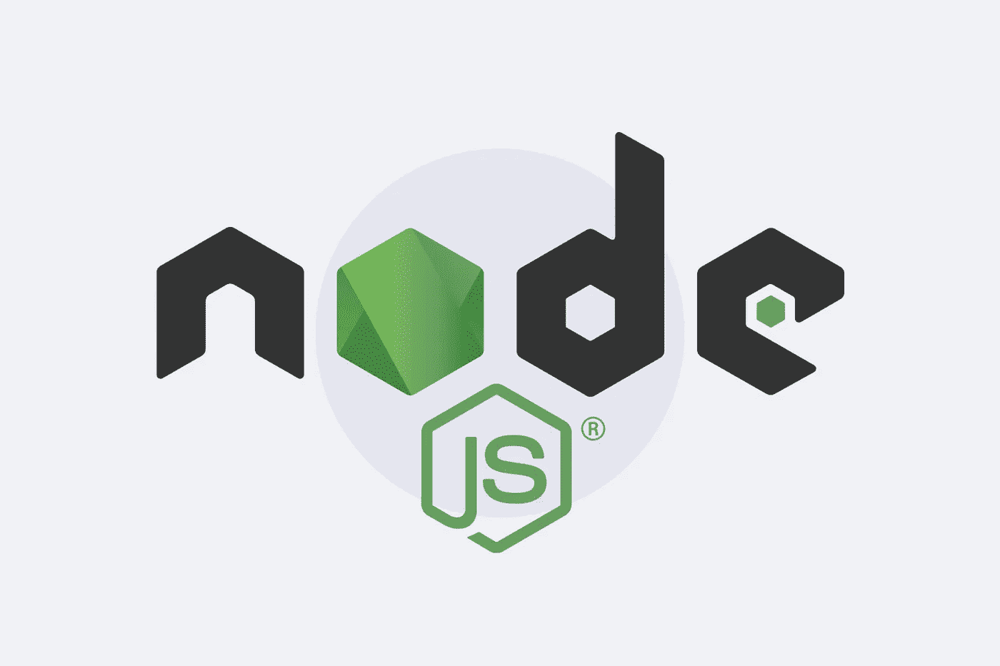
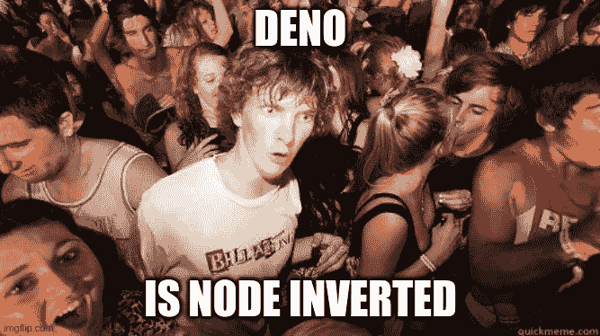

# 我不喜欢 Node.js 18 的地方

> 原文：<https://javascript.plainenglish.io/critic-on-node-18-3eda9e1a7644?source=collection_archive---------1----------------------->

## Node.js 18 让我想起了 Deno



Node.js 18 于 2022 年 4 月 19 日发布。与前两个版本不同，Node.js 18 提供了令人兴奋的创新，并展示了 Node.js 未来的发展方向。

# 获取 API

Node.js 18 的第一个重大变化是对 Fetch API 的原生支持。Node 因此接收到一个**标准化的 HTTP 客户端**，这是我们已经从浏览器中知道的。

你可能认为我们不再需要 Axios 或 Request 之类的外部模块了，但乍一看并非如此，因为 Fetch API 是基于 NPM 模块 [undici](https://www.npmjs.com/package/undici) 的。这个模块**既不支持 HTTP 2 也不支持 HTTP 3。而不是**，完全依赖 **HTTP 1.1 only** 。

考虑到 HTTP 2 如今的流行程度，这有点令人失望。然而，您现在已经可以使用 Fetch API 了。但是你必须没有 HTTP 2 和 HTTP 3 的支持。

# 网络流

任何与 Fetch API 打过交道的人都知道，从服务器收到的响应不仅可以作为 JSON 或文本处理，还可以作为流处理。流是众多用例中的一个基本特性，因为流使您能够解析和处理响应，即使响应还没有完全加载。

虽然 Node.js 一直都知道流，但是您可以认为流是开箱即用的。但是 Fetch API 不使用内置的流。他们使用为浏览器设计的网络流。这并不奇怪，因为 Fetch API 也来自浏览器。

Web 流与 Node.js 中的经典流做的一样，但是它们在技术上的结构不同。所以说，从技术角度来看，它们的工作方式有点不同。这意味着 Node.js 现在支持 web 流和我们已经知道的经典流。

我不确定我是否应该喜欢这样。实现经典流已经是在 Node.js 中正确实现流的第三次尝试。而网络流现在是第**次尝试**。

我们现在有两个根本不同的可读流，可写流和转换流。web 流中不再存在双工流，我能理解这一点，因为双工流在 Node.js 中没有意义。但是所有其他类型的流现在都是重复的。

这并不坏，但是它**促进了 Node.js 开发者之间的不一致性**，这是我经常批评的。这种促进的不一致性是我最近写了一篇关于为什么我更喜欢使用 TypeScript 或 Node.js 的文章的根本原因。

[](https://levelup.gitconnected.com/why-did-i-move-from-typescript-to-go-1d9f92ef882a) [## 为什么我从打字稿转向 Go

### 以及为什么我不会放弃使用 TypeScript

levelup.gitconnected.com](https://levelup.gitconnected.com/why-did-i-move-from-typescript-to-go-1d9f92ef882a) 

从这样的特性可以看出 Node.js 不再是新的了，但它仍在不断发展。进一步发展，向标准靠拢，首先是一件积极的事情。但是如果标准本身没有被成功实施，整个事情就会变得有问题。

因此，我们谈论的是一种不一定是好的进一步发展，而是一种从更坏的情况开始的改善。Fetch API 和 web 流就是最好的例子。


# 全局名称空间

这些新的 API 和特性将如何在 Node 中可用？在这种情况下，大概是出于与浏览器兼容的原因，我们决定采用我认为最糟糕的方法。这些新特性使**成为全局变量。**

这意味着你不需要使用关键字如"*要求"*或"*导入"*来导入它们，你可以像这样调用 Fetch API。

起初，**您可能认为这可能非常实用**，是的，这也是我最初的想法，但是这幅图的另一面是全局名称空间已经变得越来越杂乱。这在浏览器和 Node 中都不是一个好主意，尤其是因为它发生在 Node **而不需要任何**。

过去，除了全局名称空间之外，浏览器中几乎没有其他选择，因为导入模块需要很长时间才能出现。但这个问题或需求在 Node 中并不存在。所以我想知道为什么 Node 必须将这些特性作为全局变量，因此**保留了 24 个额外的变量名。**

有“ReadableStreamDefaultReader”等不常见的名称，也有“Request”、“Response”、“Headers”、“Blob”等日常用语。

底线是，我认为给这样的关键术语分配全局标识符是一个糟糕的想法，这已经在许多应用程序中使用了。在这个版本中，这些变量名被阻止，这意味着随着 Node.js 18 的升级，您将在多达 24 种不同的情况下出现**冲突。**

我不认为随机分配全局变量是个好主意。所有这些都归功于 Node 和 web 浏览器之间的兼容性，但 Node 不是 web 浏览器。为 Node 和 web 浏览器编写的 99%的代码从来不会在其他平台上执行。

在这方面，肯定会有更好的解决方案，特别是因为，正如我所说，在浏览器中这不是一个好主意，但当时没有替代方案，它是出于需要而产生的，Node 不是这种情况。

我的印象是**节点与这里的 Deno 非常接近**,因为 Deno 做了我刚刚批评过的事情。下一个特征也能观察到同样的效果。



# 测试框架

Node.js 18 的一个亮点是能够**编写开箱即用的测试**。首先，这是一个很好的特性，因为你摆脱了像 Jest 或 Mocha 这样的外部依赖。这个模块的名字叫做“测试”。这个 API 带来了许多有前途的创新。

您可以定义同步和异步测试。测试可以随意嵌套，可以跳过测试，可以并行运行测试，等等。

所以测试 API 附带了一些**有用的特性**，结合“assert”或者“assert/strict”模块，你真的**在大多数情况下不需要依赖 Jest** 。因此，我很好奇 Jest、Mocha 和其他人从长远来看将如何定位自己。

但是现在我们说到重点了**我不明白**。出于安全原因，Node 中有一条规则，规定节点模块总是在同名的 NPM 模块之上加载。这条规则非常有道理。毕竟，Node 一直受到 NPM 模块损坏的困扰。

作为 NPM 模块的开发人员，您应该避免像 Node 自带的模块那样命名您的模块，因为那样您就无法加载这些 NPM 模块。

当然，像“测试”这样的名字，它是预先编程的，在 NPM 上已经有一个同名的模块。快速浏览一下 NPM [可以确认](https://www.npmjs.com/package/test)这个模块已经存在，但是**已经将近十年没有收到更新了。**

因此，您可以假设这个模块没有得到很好的维护，并且您可能认为如果您创建一个同名的集成节点模块，您不会破坏太多，因为这个 NPM 模块**既没有广泛传播也没有得到很好的维护。**

但是，Node 在这里采用了不同的方法。为了不与此 NPM 模块发生冲突，您不能用“test”加载节点测试模块。而是需要用节点协议导入，比如“node:test”。

```
import * from 'node:test'
```

我不理解这种方式。通过获取 API 和 web 流，Node 创建了一个与 24 个变量名的**冲突，您将来会阻止它，但是对于一个**在 10 年**内没有收到更新的模块，Node 继续一个**不一致的方式**来创建不一致？**

是的，从长远来看，指定一个协议来加载节点模块是有意义的。如果导入是在其他环境中加载的，则不能保证特定于节点的实现。因此，总是必须指定一个协议是有意义的，我怀疑将来也会是这样。

但目前是不一致的，或者说这里故意打破了一致性。

# JSON 导入断言

Node.js 18 带来了所谓的 JSON 导入断言。这使得通过附加参数显式标记 JSON 文件导入成为可能。当加载文件时，Node 可以检查它是否是一个 JSON 文件，而不是一个可执行代码，这可能会导致损坏。

这弥补了潜在的安全漏洞。当考虑该版本的下一个功能(HTTPS 进口)时，该功能的重要性会增加。

# HTTPS 进口

以前，NPM 模块只能从本地文件系统加载。有了 Node.js 18，现在实验上有可能通过 HTTPS 在运行时**加载 NPM 模块。**

这是似乎受 Deno 启发的下一个功能，因为 **Deno 将该功能作为一项杰出的成就**出售，不依赖于 NPM 这样的中央注册中心。

实际上，这是否是个好主意还有待观察。试想一下检查导入模块的更新，这变得非常困难，最重要的是，如果没有来自中央注册中心的标准版本号，这将是不一致的。

当然，你可以争辩说 Github 标签可以用于此，但不是每个模块都在 Github 上。有些存储在 Gitlab 或 Bitbucket 等替代服务上。

# 摘要

我有点怀疑 Node 的发展方向。当然，乍一看，这些功能看起来很棒。但这些功能到底好不好，还有待观察。

因为这些功能很多都让人想起了 Deno，如果我想和 Deno 合作，我会和 Deno 合作。但是，我有意识地决定反对 Deno，支持 Node。我最不希望 Node 变成 Deno 的复制品。

Node.js 如何发展还有待观察，**不要误会。我认为 Node.js 不断发展而不是停滞不前，这很好。但是我不知道我是否像现在这样喜欢这个发展的方向。**

感谢您阅读我关于 Node.js 18 的文章。关注更多。

干杯！

# 接下来阅读

[](https://levelup.gitconnected.com/why-did-i-move-from-typescript-to-go-1d9f92ef882a) [## 为什么我从打字稿转向 Go

### 以及为什么我不会放弃使用 TypeScript

levelup.gitconnected.com](https://levelup.gitconnected.com/why-did-i-move-from-typescript-to-go-1d9f92ef882a) [](/why-javascript-is-weird-eff1b4953579) [## JavaScript 之所以怪异

### JavaScript 的历史

javascript.plainenglish.io](/why-javascript-is-weird-eff1b4953579) [](https://blog.bitsrc.io/node-js-event-loop-and-multi-threading-e42e5fd16a77) [## NodeJS &事件循环:不是单线程的

### Node.js、事件循环和多线程

blog.bitsrc.io](https://blog.bitsrc.io/node-js-event-loop-and-multi-threading-e42e5fd16a77) 

*更多内容看* [***说白了. io***](https://plainenglish.io/) *。报名参加我们的* [***免费周报***](http://newsletter.plainenglish.io/) *。关注我们关于*[***Twitter***](https://twitter.com/inPlainEngHQ)*和*[***LinkedIn***](https://www.linkedin.com/company/inplainenglish/)*。加入我们的* [***社区***](https://discord.gg/GtDtUAvyhW) *。*