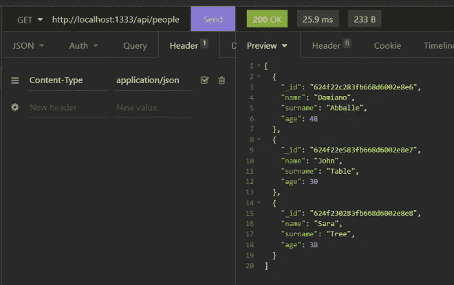

# Node.js 和 MongoDB 的 CRUD 操作

> 原文：<https://javascript.plainenglish.io/crud-operations-with-node-js-and-mongodb-97b733052376?source=collection_archive---------10----------------------->

Photo by [Arnold Francisca](https://unsplash.com/@clark_fransa?utm_source=medium&utm_medium=referral) on [Unsplash](https://unsplash.com?utm_source=medium&utm_medium=referral)

在本文中，我们将看到如何使用 Node.js 创建一个 web API，使用 MongoDB 作为数据库，为一个名为 Person 的实体运行所有 CRUD 操作。

我们使用命令`npm init`开始创建一个名为 MongoCRUD 的节点项目；它将创建如下所示的 package.json 文件:

然后，我们添加一个 docker-compose 文件，我们将在其中定义一个 MongoDb 服务器和一个 Mongo Express 实例:

docker-compose.yml

最后，我们使用以下命令安装三个库:

现在，我们可以开发节点应用程序，并开始定义实体 Person.js:

Person.js

然后，我们创建两个文件:一个名为 parameters.js，我们将在其中定义 MongoDB 参数；另一个名为 DbCore.js，我们将在其中定义 CRUD 操作的逻辑:

Parameters.js

DbCore.js

现在，我们创建一个名为 PersonController.js 的文件，它将成为 web API 的控制器:

PersonController.js

最后，我们创建一个 index.js 文件，我们将在其中定义 Web API:

现在，我们可以运行应用程序了(显然，我们之前必须运行 docker compose 文件！)然后，使用 API 客户端，我们可以检查所有方法是否工作正常:

**创造人**

**召集所有人**

**得到一个人**

**更新一个人**

**删除一个人**

*更多内容看* [***说白了。报名参加我们的***](https://plainenglish.io/) **[***免费周报***](http://newsletter.plainenglish.io/) *。关注我们关于*[***Twitter***](https://twitter.com/inPlainEngHQ)*和*[***LinkedIn***](https://www.linkedin.com/company/inplainenglish/)*。查看我们的* [***社区不和谐***](https://discord.gg/GtDtUAvyhW) *加入我们的* [***人才集体***](https://inplainenglish.pallet.com/talent/welcome) *。***