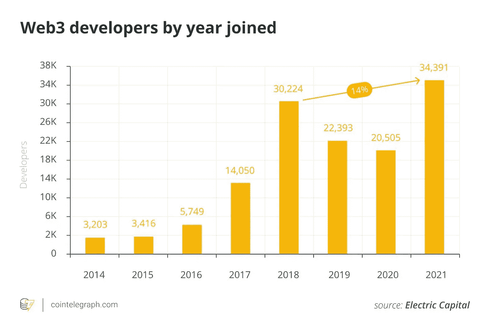
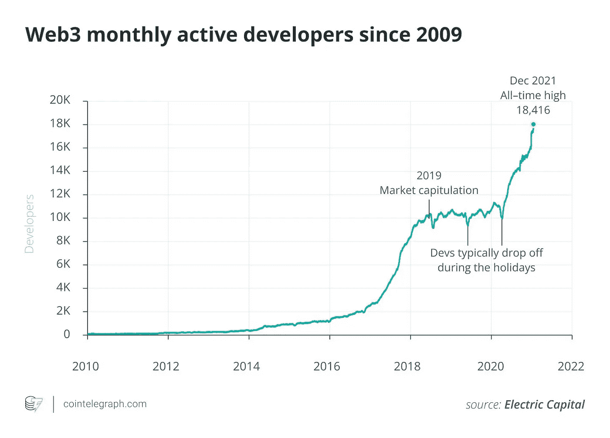

# 加密崩溃:对 Web3 开发者意味着什么？

> 原文：<https://javascript.plainenglish.io/crypto-crash-what-does-it-mean-for-web3-developers-c7037e693cff?source=collection_archive---------4----------------------->

## 让我们也试着了解一下就业市场的情况。

Photo by [Magnet.me](https://unsplash.com/@magnetme?utm_source=medium&utm_medium=referral) on [Unsplash](https://unsplash.com?utm_source=medium&utm_medium=referral)

如果几个月前有人与我打赌 100 万美元，认为比特币价格将跌至 2 万美元以下，我肯定会输。整个世界正在经历一场严重的经济危机。除非情况变得更糟(更多的战争),否则它可能会持续几个月。).

首先，加密货币不全是区块链的。区块链有更多的现实应用。但是你必须承认，大多数 web3 工作都是关于定义的。因此，加密货币影响了 web3 就业市场，因为 **Defi** 使用**加密货币**和智能合约来提供金融服务，而无需银行的参与。

再来说说最近一个币的大面积崩盘。

# Terra-Luna 制造了许多新的秘密非信徒。

那些参与加密交易或 web3 开发的人知道 Terra 生态系统最近 99%的崩溃。Luna 是市值最高的十大加密项目之一。一枚月神令牌的价格几乎是 120 美元，后来降到了 0.0001 美元以下。人们在几周内损失了数百万。

> 连我的 5000 美元都输给了卢娜。

当 Terra 土生土长的稳定硬币 UST 失去了它的挂钩时，崩盘发生了。我不会在本文中讨论技术术语。但是这次崩溃使得整个加密生态系统变得脆弱。

# 工作情况

许多开发者和创业公司基于 Terra 生态系统构建他们的产品。他们都陷入了一个巨大的问题。最关键的问题是人们的信任消失了。尽管 Terra 正在努力恢复自己的形象，但很难重新赢得信任。

情况不仅仅是关于露娜。比特币的价格也比其历史最高价格下降了 67%以上。

因此，来自 Defi 的创业公司面临着一个大问题。由于这种寒冷的经济形势，许多创业公司和公司正在解雇开发人员和员工。

最大的加密货币交易所之一，[比特币基地，自 5 月](https://www.wsws.org/en/articles/2022/06/18/edrq-j18.html)以来，在技术部门裁员 25，000 人后，解雇了 1，100 名员工。

另一方面，其他一些受欢迎的 Defi 创业公司、公司和交易所在这种情况下正在招聘更多的人。其中一个著名的名字是币安。但事实是雇佣/解雇比率很低。

# 一些统计数据

在最近来自 Electric Capital(2018 年以来投资 Web3 公司的风险投资公司)的[报告](https://medium.com/electric-capital/electric-capital-developer-report-2021-f37874efea6d)中，我们可以看到 2021 年有 3.4 万名新开发者向 Web3 项目提交了代码。这是历年来最高的。他们分析了近 50，000 个代码库中的数据。

Graph: Cointelegraph, Data: Electric Capital

关于 web3 开发还有一些更有趣的统计数据。

*   65%活跃的 web3 开发者开始从事 Web3 开发。
*   45%的全职开发者是从它开始的。
*   18，000 名活跃开发人员向开源加密和 web3 项目提交代码。
*   大多数开发者都在以太坊网络上构建。

Graph: Cointelegraph, Data: Electric Capital

现在想想为什么这么多开发人员正在学习并转向 web3？因为这个行业有很多工作机会，工资也很高。

# 我们正处于早期阶段

问题是 crypto 一个人面临这种情况吗？答案是否定的。所有的大股票都面临着同样的问题。世界各地的科技公司都在解雇员工，包括大牌特斯拉等。

但我仍然相信 Defi 和整个 web3 生态系统都处于非常早期的阶段。在早期阶段，我们会有一些困惑，但这是正常的。Defi 就是未来，比特币就是未来。

在互联网繁荣的早期，许多才华横溢的人对此表示怀疑。但在当今世界，一切都基于互联网。我知道沃伦·巴菲特和比尔·盖茨不相信密码，但许多更聪明的人相信它。

十年后我们可以看到谁是对的。但是无论谁下注，谁就是赢家。

# 总结:是时候成为一名 web3 开发者了

熟悉 MERN 堆栈或者已经从事 web 开发 2/3 年的人可以在很短的时间内成为 web3 开发人员。但是每个人都想要稳定。

一个 web3 开发人员的平均工资比一个普通开发人员高得多。但问题是工作的稳定性。web3 公司的解雇率远高于创业公司或其他公司。

但是从长远来看，技术的早期采用者总是会受益的。我认为 Defi 和 Crypto 已经生存下来，足以证明它们的可持续性。所以，朋友们，如果你有兴趣，就投入进去吧！

**参考文献** : [电报局](https://cointelegraph.com/news/web3-developer-growth-hits-an-all-time-high-as-ecosystem-matures)