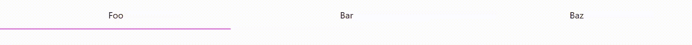
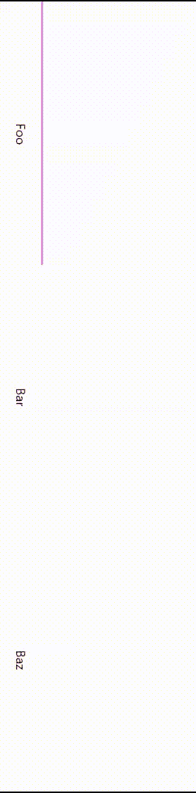

# CSS 动画下边框

> 原文：<https://javascript.plainenglish.io/css-animated-bottom-border-17bd012bfd53?source=collection_archive---------8----------------------->

*让我们使用 React 和 CSS 来制作标签和导航栏的动画。*


Photo by [John Schnobrich](https://unsplash.com/@johnschno?utm_source=medium&utm_medium=referral) on [Unsplash](https://unsplash.com?utm_source=medium&utm_medium=referral)

在这篇文章中，我想和你一起建立一个动画底部边框:



CSS Bottom Border animation

我将几乎只用 CSS 来构建它。我们将只需要 JS 来切换活动项目。我将使用 React 来制作 UI，这样我们将获得一个可重用的 React 组件。

完整的源代码可以在底部找到。在章节中，我将只分享重要的片段，并告诉你代码背后的想法。

## TabNav 组件

TabNav 组件负责呈现“底部边框”，这是一个 div。我把它命名为“滑块”，因为这是我们在这里播放的基本动画。

```
<div className={styles.slider} role="presentation" />
```

此外，关于 CSS，只有两件事值得关注。

```
transition: inset-inline-start var(--tab-nav-transition-timing);
```

是“左”的逻辑表达方式通常，您会转换一个转换，因为它更具性能。不幸的是，转换还没有确定方向的逻辑方法。关于这一点，在关于解决方案灵活性的章节中有更多的介绍。我也给了你一个使用变换的解决方案。要启用它，只需取消对该行的注释

```
*/* transform: translateX(calc(100% * var(--tab-nav-current-item))); */*
```

并将转换触发器从`inset-inline-start`改为`transform`。

另一个有趣的方面是 CSS 变量的使用:

```
:root {
  --tab-nav-items: 3;
  --tab-nav-slider-thickness: 2px;
  --tab-nav-slider-color: violet;
  --tab-nav-transition-timing: 0.25s;
  --tab-nav-current-item: 0;
}
```

`--tab-nav-items`取决于孩子传递给我们`TabNav`的分量。它是自动计算的。`--tab-nav-current-item`确定当前选择的项目。我们只需在点击一个项目时进行调整。在现实世界的应用程序中，你可以将它与你的路由器或你的状态(取决于你在使用什么)对齐。

CSS 和 JS 加在一起，我们的组件只有大约 50 行代码。我相信我们甚至可以找到一个更简单的解决方案。尽管简洁，但它是一个相对灵活的解决方案。

## 用法

下面是如何使用 TabNav 组件:

```
<TabNav className="tab-nav">
  <a
    href="#1"
    className={active === 0 ? "active" : ""}
    onClick={handleNavItemClick(0)}
  >
    First Tab
  </a>
  <a
    href="#2"
    className={active === 1 ? "active" : ""}
    onClick={handleNavItemClick(1)}
  >
    Second Tab
  </a>
  <a
    href="#3"
    className={active === 2 ? "active" : ""}
    onClick={handleNavItemClick(2)}
  >
    Third Tab
  </a>
</TabNav>
```

我附加了类`tab-nav`来从外部修改导航链接的样式。我们也可以通过给每个锚点提供一个类名来实现，但是这有点多余。

```
a {
  color: black;
  text-decoration: none;
}.tab-nav > a {
  padding: 1rem;
  text-align: center;
}
```

其他一切都可以开箱即用，非常棒！

如果我们想调整边框的颜色或粗细，我们只需调整这些变量:

```
--tab-nav-slider-thickness: 2px;
--tab-nav-slider-color: violet;
```

## 解决方案的灵活性

TabNav 非常灵活，可以用在链接到路由或选项卡容器的导航栏上。原因是我们只依赖于变量。只要你能调整变量，这个解决方案就能发挥作用。

因为我们使用了像`inline-size`这样的逻辑属性，所以我们可以改变文档的书写模式:

```
writing-mode: vertical-lr;
```

导航仍然可以使用它的动画。



Vertical tab navigation with animation

这在使用过渡变换时不起作用。根据书写模式，我们必须考虑方向并使用 translateX 或 translateY。

当然，它远非完美，需要一些调整。但是，作为一个橱窗，已经足够好了。

这个解决方案还有一个缺点:它不能处理不同大小的标签。所以每个标签应该占据相同的区域。

## 决赛成绩

就这些了，伙计们！非常感谢您的阅读！

我希望这是一个有趣的阅读给你。

*更多内容请看*[***plain English . io***](https://plainenglish.io/)*。报名参加我们的* [***免费周报***](http://newsletter.plainenglish.io/) *。关注我们关于*[***Twitter***](https://twitter.com/inPlainEngHQ)*和*[***LinkedIn***](https://www.linkedin.com/company/inplainenglish/)*。查看我们的* [***社区不和谐***](https://discord.gg/GtDtUAvyhW) *加入我们的* [***人才集体***](https://inplainenglish.pallet.com/talent/welcome) *。*