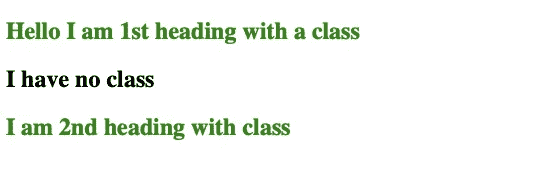
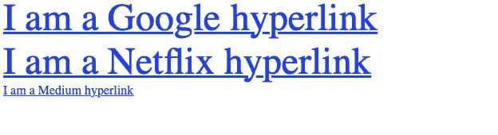
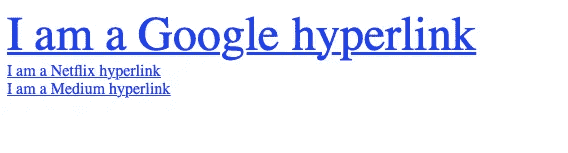
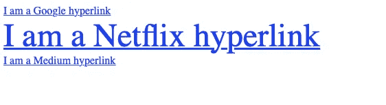
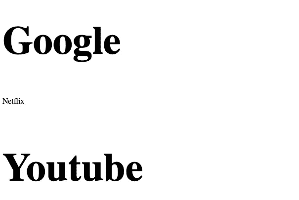

# CSS 属性选择器借助代码示例说明

> 原文：<https://javascript.plainenglish.io/css-attribute-selector-explained-with-the-help-of-code-examples-7dd8de26d92d?source=collection_archive---------17----------------------->

## 这将帮助你理解不同类型的 CSS 属性选择器


Photo by [Vitamina Poleznova](https://unsplash.com/@poleznova?utm_source=medium&utm_medium=referral) on [Unsplash](https://unsplash.com?utm_source=medium&utm_medium=referral)

CSS2 中首次引入了属性选择器。

CSS 属性选择器允许您基于属性和与任何属性关联的值来选择元素。

CSS 属性选择器主要有四种类型。

1.  简单的属性选择器。
2.  精确属性值选择器。
3.  部分匹配属性选择器。
4.  前导值属性选择器。

这里我们将讨论不同类型的属性选择器。

# 1.简单属性选择器

这些 CSS 属性选择器允许您选择具有任何指定属性的元素。

这些选择器不要求您指定属性的值。

您可以直接使用这些选择器，而无需提供任何与属性相关联的值。

```
[attribute]
```

## 简单属性选择器示例

假设您想要选择所有具有 class 属性的 h2 元素，并且您想要 h2 元素的文本颜色为绿色。

如果这些是您的需求，那么使用简单的属性选择器是有意义的。

为此，您需要编写以下 CSS:

如果您有以下 HTML 文档:

当你使用上面的 CSS。

这就是产生的结果。



Screenshot

## 您可以使用多个属性

如果您愿意，也可以使用多个属性。

基于一个以上属性的选择是绝对可能的。

为此，您需要一次将多个属性选择器链接在一起。

以下面的 HTML 为例:

如果您想增加包含 href 和标题的 HTML 超链接的字体大小。

你必须写下以下内容:

这将增加上面 HTML 文档中第一个和第二个链接的字体大小。

结果将如下所示:



Screenshot

# 2.严格根据属性值进行选择

当您必须选择具有固定属性值的元素时，可以使用这种类型的 CSS 属性选择器。

```
[attribute = "value"]
```

## 精确属性值选择器示例

假设您想要将任何 HTML 超链接的文本大小增加三倍。

唯一的要求是超链接的所需标题属性的值为“Google”。

你会写:

如果 HTML 文档是这样的:

如果有属性值的精确匹配。上面的 CSS 将文本的大小增加了三倍。

结果将如下所示:



Screenshot

# 3.基于部分属性值进行选择

这个 CSS 选择器允许您基于一部分属性值来选择元素。CSS 提供了多种选项来匹配一部分属性值。

```
[attr ~= “val”] — It selects any element with an attribute attr whose value contains the word val in a space-separated series of word.[attr *= “val”] — It selects any element with an attribute attr whose value contains the substring val.[attr ^= “val”] — It selects any element with an attribute attr whose value begins with val.[attr $= “val”] — It selects any element with an attribute attr whose value ends with val.
```

## 部分匹配属性选择器的示例

假设您想要将网飞网站的任何超链接的大小增加三倍。为此，您可以使用部分属性选择器[attr *= "val"]。

你会写:

如果 HTML 文档如下所示:

上面的 CSS 将基于元素属性值的一部分来选择元素。但是该值不能包含中间有空格的单词。

上面的 CSS 匹配任何链接到网飞网站的元素。

下面是应用上述 CSS 的结果:



Screenshot

类似地，您可以应用上面提到的另一个部分属性选择器。

# 4.前导值属性选择器

该选择器选择属性以特定值开头、后跟连字符或等于特定值的任何元素。

```
[attribute |= “value”]
```

## 前导值属性选择器示例

假设您想要选择 desc 为 go 或者等于 go 的任何元素。

你会写:

如果 HTML 文档是这样的:

使用上面的 CSS 属性选择器，它将选择任何 desc 属性等于 go 或以 go-开头的元素。

结果将如下所示:



# 你想快速进入程序员的职业生涯吗？

加入一群热爱编程和技术的人。

点击这里加入安静的程序员社区。

在我们社区的帮助下，我们将解决程序员生活中的最大问题，并讨论前端和后端工程。

我们将帮助你重新规划你对科技中各种事物的理解。

*更多内容看* [***说白了。报名参加我们的***](https://plainenglish.io/) **[***免费周报***](http://newsletter.plainenglish.io/) *。关注我们关于*[***Twitter***](https://twitter.com/inPlainEngHQ)*和*[***LinkedIn***](https://www.linkedin.com/company/inplainenglish/)*。查看我们的* [***社区不和谐***](https://discord.gg/GtDtUAvyhW) *，加入我们的* [***人才集体***](https://inplainenglish.pallet.com/talent/welcome) *。***