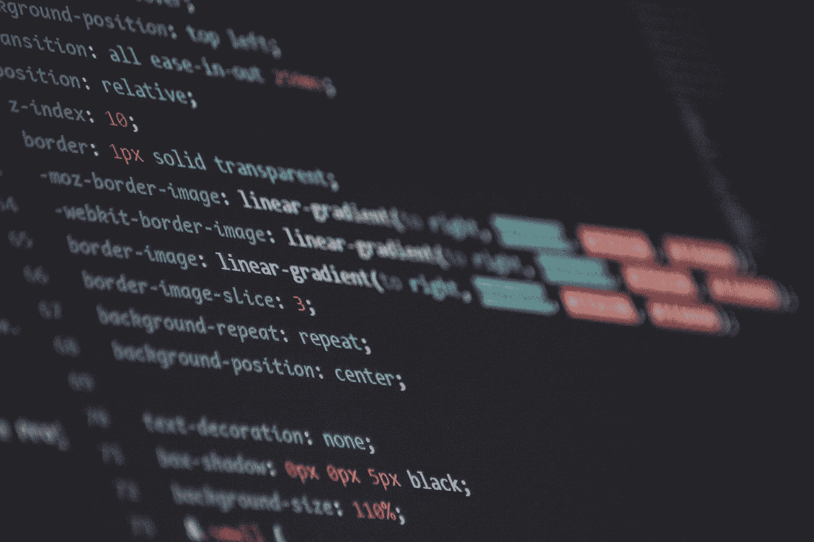
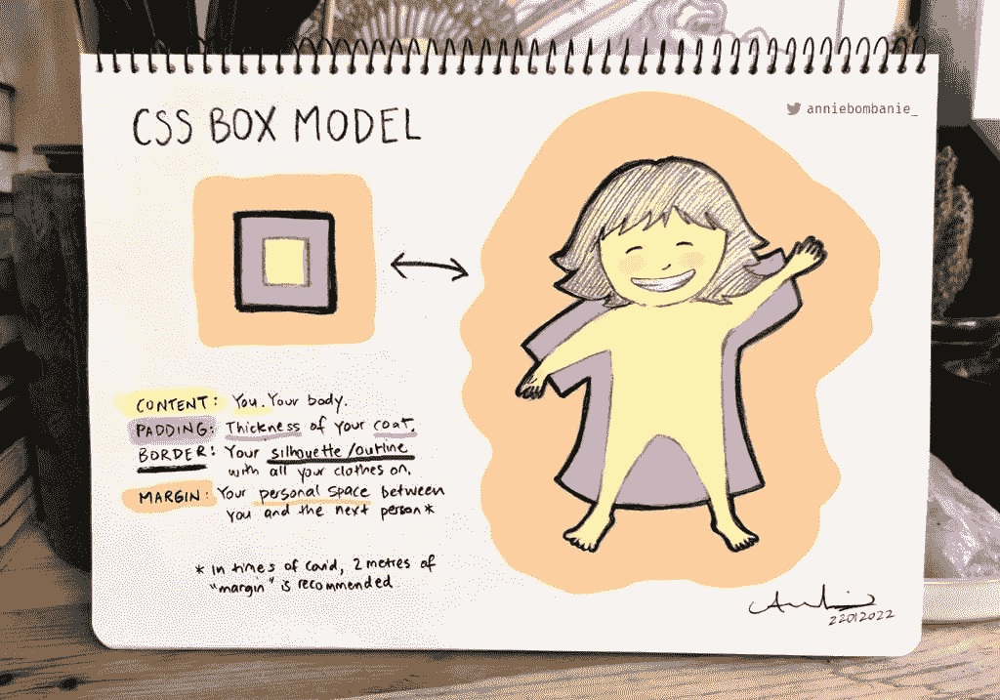
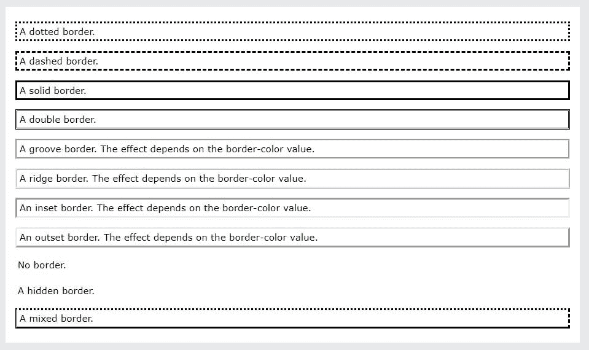

# 适合初学者的 CSS 盒子模型

> 原文：<https://javascript.plainenglish.io/css-box-model-for-beginners-ff3d6fd95910?source=collection_archive---------16----------------------->



Photo by [Maik Jonietz](https://unsplash.com/@der_maik_?utm_source=medium&utm_medium=referral) on [Unsplash](https://unsplash.com?utm_source=medium&utm_medium=referral)

# 概观

**CSS** 最重要的一个方面就是**盒子模型**。一个没有牢牢掌握盒子模型的开发者将会在设计中遇到困难。这是因为设计草图应该用盒子模型来完成，这是用来降低代码复杂度的。

CSS 中的*内容、填充、边框*和*边距*组成了盒子模型。



*   **内容** —内容可以是一个段落、一个 div 或任何其他 HTML 元素，可以包含文本、图像和项目中的任何输入。
*   **填充** —填充是您的内容及其相邻内容周围的空间。填充清除特定内容周围的区域。填充是透明的。
*   **边框** —环绕填充和内容的边框。
*   **边距** —边距是一个元素及其相邻元素周围的空间。它清除了边界外的区域。它也是透明的。

*研究上面的图片，以便更好地理解*

# 如何:填充和边距

知道一个事物的概念是一回事，但最重要的是要了解善用它的许多方法。这会让你更好地理解并提高使用效率。

`margin`和`padding`有相似的语法和在我们的代码中声明它们的方式，并且有许多方式可以使用语法规则。我将使用填充作为例子来解释下面的一切。

1.为特定边设置填充:

*   `padding-left: value ;` -设置内容左侧特定值的填充。
*   `padding-right: value ;` -设置内容右侧特定值的填充。
*   `padding-top: value ;` -将特定值的填充设置到内容的顶部。
*   `padding-bottom: value ;` -设置内容底部特定值的填充。

2.使用速记规则:

*   `padding: value1 value2 value3;` -将填充值 1 设置到内容的顶部，将填充值 2 设置到内容的左侧和右侧，将填充值 3 设置到内容的底部。
*   `padding: value1 value2 value3 value4;` -设置内容的顶部填充值 1，右侧填充值 2，底部填充值 3，左侧填充值 4。

> *以上说明中指定的值是测量值。我们有两种测量方法*

*   绝对:这被设置为一个特定的大小；像素，毫米，厘米，点…
*   流体:设定相对于周围元素的大小。

— %，vw(视口宽度)，vh(视口高度)。

— em(字体):`1em`为当前尺寸，`.75em`为当前尺寸的 75%

— rem(字体):`1rem`是根的当前大小。

> *以上关于填充的解释同样适用于* ***边距***

# 设置边框

边界有三个一般值，它们是:

1.  `border-width` -可使用任何测量规则指定。
2.  `border-style`——可以

*   `dotted` -定义虚线边框
*   `dashed` -定义虚线边框
*   `solid` -定义一个实心边框
*   `double` -定义双边框。
*   `groove` -定义一个三维凹槽边界。效果取决于边框颜色值。
*   `ridge` -定义一个 3D 脊状边界。效果取决于边框颜色值。
*   `insect` -定义一个 3D 嵌入边框。效果取决于边框颜色值。
*   `outset` -定义一个 3D 开始边界。效果取决于边框颜色值。
*   `none` -定义无边框。
*   `hidden` -定义隐藏边框。



3.`border-color` -可以是任何颜色。

您可以单独使用上面的规则，也可以使用下面的简写规则:

>边框:2px solid # fff

上面的代码在内容周围设置了一个 1px 厚的纯白边框。

> *使用* `*border-*: width style color;*` *在内容的特定一侧设置边框。星号代表你想要的边，可以是上、左、右或下。*

例如 border-bottom:2px dotted # 0000 ff；

上面在内容底部设置了一个蓝色的点状 2px 粗边框。

您也可以使用`border-*-*: value;`单独指定它，其中第一个星号代表边，第二个星号代表边框的样式、宽度或颜色。

例如边框-顶部-宽度:1px

上面在内容顶部设置了一个 1px 的边框。

# 实际长度和`box-sizing`

用 CSS 设置元素的宽度和高度属性时，只需设置内容区域的宽度和高度。要计算元素的完整大小，还必须添加填充、边框和边距。

所以一个元素的实际**宽度**是:

实际宽度=宽度+边距(左或右或两者:如果指定)+填充(左或右或两者:如果指定)+边框(左或右或两者:如果指定)

> *实际高度可以通过添加边距、填充和边框来计算。但在这种情况下，我们将顶部和底部相加。*

例如

```
div {
 width: 50px;
 height: 20px;
 margin: 10px;
 padding: 5px 3px;
 border: 2px solid #000;
 }
```

上面的`div`的实际宽度将是:50px + 10px(左边距)+ 10px(右边距)+ 3px(左边距)+ 3px(右边距)+ 2px(左边距)+ 2px(右边距)，加起来是 80px。

> ***计算身高以便更好的理解。***

这就是`box-sizing`属性的用武之地。

“盒子尺寸”有两个值:

1.  `content-box` -哪种是默认添加剂
2.  `border-box` -考虑内容、填充、边框和边距。当在元件上指定时，宽度是没有任何添加剂的宽度。

> *在代码的开头指定* `*box-sizing: border-box*` *内的通用选择器* `***` *为最佳实践。*

如果你觉得这很有帮助或者有一些见解可以帮助我提高，你可以联系我给我一些提示或者一些鼓励的话来写: [Twitter](https://twitter.com/devtoheeb) ， [Linkedln](https://www.linkedin.com/in/akande-olalekan-toheeb-2a69a0221/) ， [Email](mailto:akandeolalekantoheeb94@gmail.com) 。

感谢阅读！

*原载于*[*https://muhtoyyib . hashnode . dev*](https://muhtoyyib.hashnode.dev/css-box-model)*。*

*更多内容请看*[***plain English . io***](https://plainenglish.io/)*。报名参加我们的* [***免费周报***](http://newsletter.plainenglish.io/) *。关注我们关于*[***Twitter***](https://twitter.com/inPlainEngHQ)*和*[***LinkedIn***](https://www.linkedin.com/company/inplainenglish/)*。查看我们的* [***社区不和谐***](https://discord.gg/GtDtUAvyhW) *加入我们的* [***人才集体***](https://inplainenglish.pallet.com/talent/welcome) *。*