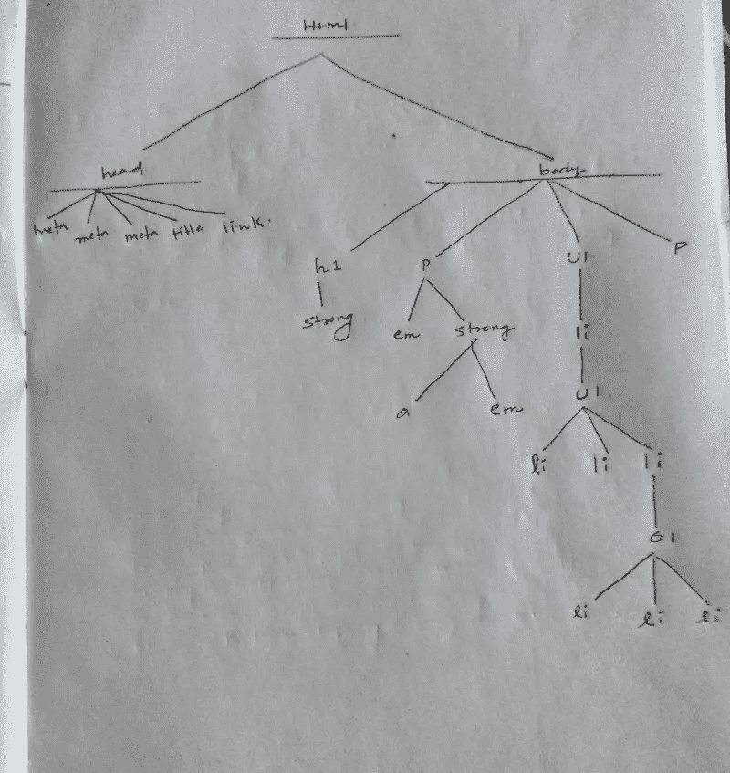
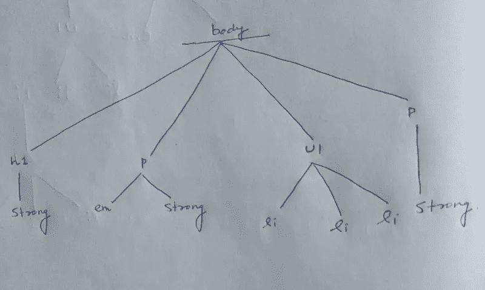
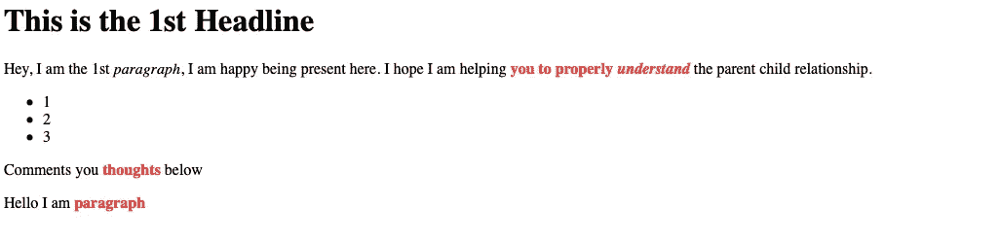

# CSS 子选择器，借助代码示例说明

> 原文：<https://javascript.plainenglish.io/css-child-selector-explained-with-the-help-of-code-examples-db669cffded3?source=collection_archive---------18----------------------->

## 本教程将帮助您详细了解 CSS 子选择器


Photo by [Kenny Eliason](https://unsplash.com/@neonbrand?utm_source=medium&utm_medium=referral) on [Unsplash](https://unsplash.com?utm_source=medium&utm_medium=referral)

在上一篇文章中，我们讨论了[类选择器](/css-class-selectors-explained-with-the-help-of-code-examples-4f653c95265c)、[多重类选择器](/css-multiple-class-selector-explained-with-the-help-of-code-examples-ecbd30f7ddf7)、 [id 选择器](/css-id-selector-explained-with-the-help-of-code-examples-a819e78f480c)和 [CSS 属性选择器](/css-attribute-selector-explained-with-the-help-of-code-examples-7dd8de26d92d)。

这里我们将讨论如何在 HTML 文档中选择一个元素的子元素。

# 什么是亲子关系

考虑下面的 HTML 文档:

如果你看上面的 HTML，你会发现整个 HTML 分为两个部分。

一部分是头部，另一部分是身体。

*   头部包含三个元元素，一个标题标签和一个链接标签。
*   主体包含一个 h1 元素、两个 p 元素以及一个无序列表和一个有序列表。强电磁元素也存在。

整个 HTML 文档的树形视图如下所示:



Photo from My Notebook

HTML 文档中的每个元素都是另一个元素的子元素或父元素。有几个元素是其他元素的父元素和子元素。

## 元素的父元素

如果在文档的树视图中，一个元素可以直接在另一个元素的上方看到，则该元素被称为另一个元素的父元素。

根据定义，h1 是强元素的父元素，因为它直接位于强元素之上。

第一个元素 p 是 em 和 strong 元素的父元素。

## 元素的子元素

如果在 HTML 文档的树视图中，一个元素可以直接在另一个元素的下面看到，则该元素被称为另一个元素的子元素。

根据定义，strong 是 h1 元素的子元素，因为它位于 h1 元素的正下方。

ul 元素是 body 的子元素，因为它位于 body 标签的正下方。

如果你在强元素的正下方放置一个标签(锚)。它不是 p 元素的子元素，因为它没有直接连接到 p 元素。

当您编写选择子元素的规则时，必须考虑不同元素的子元素。不要将子元素与任何元素的后代混淆。

子元素将是元素的后代，但后代可能是元素的子元素，也可能不是。

# 如何选择元素的子元素

在之前的一篇文章中，我讨论了如何选择一个后代元素。但是当你开始设计你的页面时，会出现不能使用后代选择器的情况。

在某些情况下，有必要在不使用后代选择器的情况下选择元素的子元素。

为此，我们使用由大于号(>)组合符表示的子选择器。

考虑下面的 HTML 文档:

HTML 的树形视图将会是:



Photo from My Notebook

如果你想把 p 元素的子元素强元素的颜色改成红色。

您可以编写以下规则:

```
p > strong {color: red;}
```

上面的规则将使 p 元素的所有子元素都变成红色。

结果如下:



Screenshot

# 如何读取子选择器

假设您有以下子选择器:

```
h2 > em {color : green;}
```

阅读上面的规则，你必须从右到左，而不是从左到右。

如果您尝试读取 h2 > em，它会转换为“选择任何 em 元素，该元素是任何 h2 元素的直接子元素”。

注意，子选择器(>)周围的空格是可选的。

您可以这样编写选择器:

```
h2>em, h2 >em and h2 > em 
```

如果您想跳过规则中出现的所有空格，您可以这样做。

# 你想快速进入程序员的职业生涯吗？

加入一群热爱编程和技术的人。

点击这里加入安静的程序员社区。

在我们社区的帮助下，我们将解决程序员生活中的最大问题，并讨论前端和后端工程。

我们将帮助你重新规划你对科技中各种事物的理解。

*更多内容看**[***说白了. io***](https://plainenglish.io/) *。报名参加我们的**[***免费周报***](http://newsletter.plainenglish.io/) *。关注我们关于*[***Twitter***](https://twitter.com/inPlainEngHQ)*和*[***LinkedIn***](https://www.linkedin.com/company/inplainenglish/)*。查看我们的* [***社区不和谐***](https://discord.gg/GtDtUAvyhW) *加入我们的* [***人才集体***](https://inplainenglish.pallet.com/talent/welcome) *。***