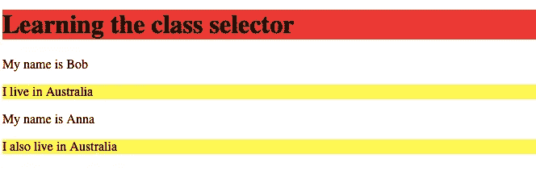

# CSS 类选择器，借助代码示例说明

> 原文：<https://javascript.plainenglish.io/css-class-selectors-explained-with-the-help-of-code-examples-4f653c95265c?source=collection_archive---------14----------------------->

## 在 5 分钟内增加你对 CSS 类选择器的了解。


Photo by [Mapbox](https://unsplash.com/@mapbox?utm_source=medium&utm_medium=referral) on [Unsplash](https://unsplash.com?utm_source=medium&utm_medium=referral)

借助元素选择器，您可以轻松选择不同的 HTML 元素。

假设您想要将与 h1 元素相关联的文本颜色设置为绿色。

你可以用一个元素选择器来完成。

您将编写以下内容:

```
h1 {color:green;}
```

HTML 文档中 h1 标签内的所有文本都将变成绿色。

# 元素选择器不会满足您所有的样式需求

元素选择器有几个限制。为网页编写 CSS 时，元素选择器可能无法满足您的所有需求。

你需要一些更专业的东西来处理不同类型的网页样式需求。

为了更好地理解这一点，我们来举个例子。

假设您想要对包含许多段落的 HTML 文档进行一些更改。

如果段落中包含单词“google ”,您需要将文本大小增加一倍。你不知道 google 这个词会出现在哪个段落里。

如果你写了以下内容:

```
p { font-size = 200%;}
```

所有段落的文本大小将加倍。但是你不希望所有段落的文本大小都加倍。您希望将包含“google”一词的段落中的文本大小增加一倍。

您希望更精确地选择 HTML 文档的元素。

为此，您需要对 HTML 文档的某些部分应用样式。

# CSS 类选择器用一个例子简化

当您使用类选择器时，您不需要担心在文档中使用哪种元素。

可以通过类选择器更具体地选择一个元素

假设您有以下 HTML 文档:

要使用 CSS 类选择器，您需要为类属性分配一个适当的值。

在上面的代码块中，mycountry 的类值被分配给两个段落元素。现在，您需要使用为该类指定的值，并适当地设置它的样式。

假设您想将类值为 mycountry 的段落元素的背景色改为蓝色。

为此，您必须在类名前面加一个点(。)以及元素选择器

类别值为 mycountry 的 p 元素的背景色变为蓝色。

结果是这样的:


Screenshot

点的存在(。)在选择任何具有特定值的类时非常重要。

如果你忘了提到 p 标签，把 CSS 写成这样:

```
.mycountry{background-color: blue;}
```

在这种情况下，CSS 类选择器将尝试将上述样式与 HTML 文档中存在的所有元素进行匹配。

而不是特定的段落元素。

如果其他元素的 class 属性的值为 mycountry。

上面的样式将背景颜色改为蓝色。

# 您可以通过两种方式使用类选择器

在上面的代码中，我们为 h1 标签分配了一个包含单词 mycountry 的 class 属性。

此时有两种方法可以使用类选择器。

## 特定于元素的类选择器

下面是第一种方法:

在上面的样式中，我们已经使用了 CSS 类选择器两次。一个用于 h1 标签，另一个用于 p 标签。

使用上面的 CSS，带有 mycountry class 属性的 h1 元素的背景被赋予红色，而带有 mycountry class 属性的段落的背景被赋予黄色。

结果是这样的:



Screenshot

## 通用类别选择器

第二种方法是，我们不用为 h1 和 p 编写单独的类选择器，而是使用一个通用的类选择器来覆盖这两个元素。

如果要使用通用类选择器，必须在类名前加一个句点。您不必使用任何元素名称。

在这种情况下，不需要使用通用选择器。

CSS 看起来是这样的:

使用上面的 CSS，h1 和 p 元素的背景将变成紫色。这两个标记都有一个值为 mycountry 的 class 属性。

结果是这样的:


Screenshot

# 通用和特定于元素的类选择器的组合

您可以结合使用通用和特定于元素的类选择器，使样式更令人满意。

以下是此类代码的一个示例:

在上述情况下，任何具有值为 mycountry 的 class 属性的元素都将具有紫色的背景色。

但是只有 h1 元素中具有 mycountry class 属性的文本具有蓝色背景。

您可以看到 h1 的特定元素选择器写在通用类选择器之后。

这意味着当两者都使用时，特定于元素的选择器优先于通用类选择器。在这种情况下，顺序并不重要。

结果是这样的:


Screenshot

# 你想快速进入程序员的职业生涯吗？

加入一群热爱编程和技术的人。

点击这里加入安静的程序员社区。

在我们社区的帮助下，我们将解决程序员生活中的最大问题，并讨论前端和后端工程。

我们将帮助你重新规划你对科技中各种事物的理解。

*更多内容请看*[***plain English . io***](https://plainenglish.io/)*。报名参加我们的* [***免费周报***](http://newsletter.plainenglish.io/) *。关注我们关于*[***Twitter***](https://twitter.com/inPlainEngHQ)*和*[***LinkedIn***](https://www.linkedin.com/company/inplainenglish/)*。查看我们的* [***社区不和谐***](https://discord.gg/GtDtUAvyhW) *加入我们的* [***人才集体***](https://inplainenglish.pallet.com/talent/welcome) *。*