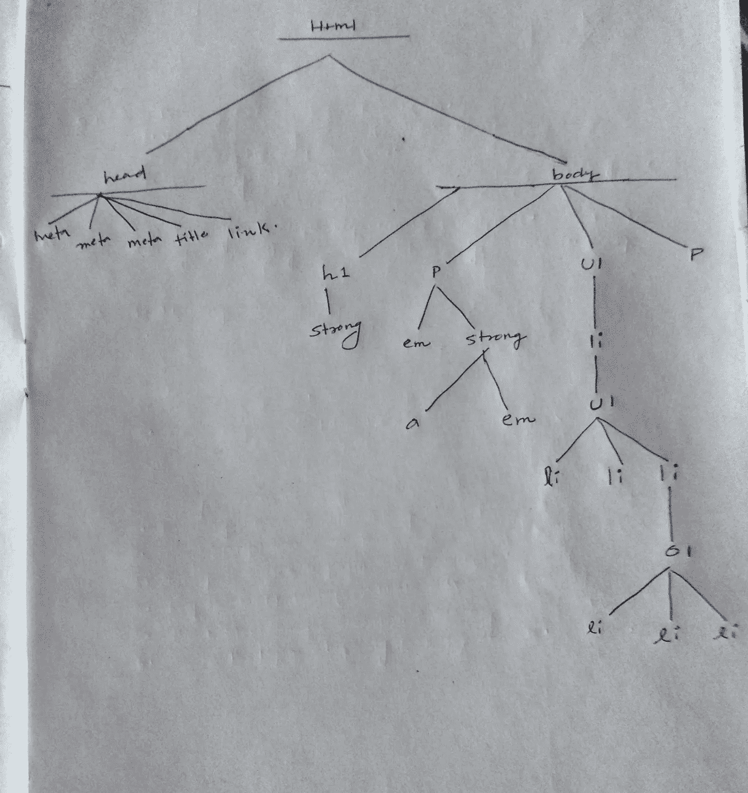
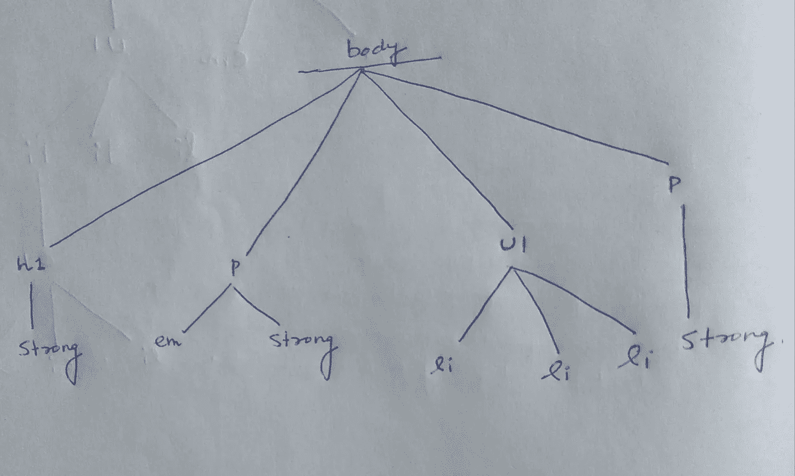
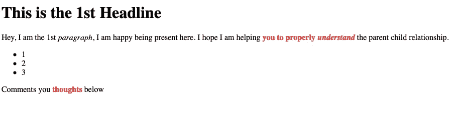
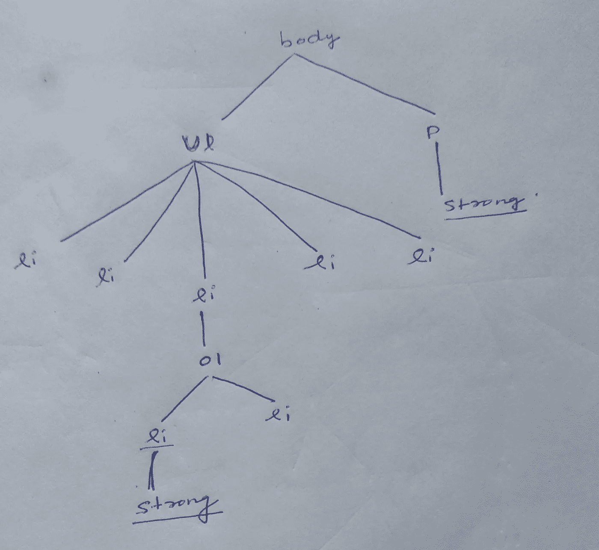
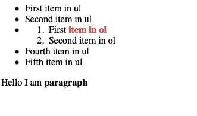

# CSS 后代选择器，借助代码示例说明

> 原文：<https://javascript.plainenglish.io/css-descendant-selector-explained-with-the-help-of-code-examples-534a368651c5?source=collection_archive---------15----------------------->

## 理解 CSS 后代选择器起着重要的作用。


Photo by [Brooke Cagle](https://unsplash.com/@brookecagle?utm_source=medium&utm_medium=referral) on [Unsplash](https://unsplash.com?utm_source=medium&utm_medium=referral)

我们讨论了 [CSS 类选择器](/css-class-selectors-explained-with-the-help-of-code-examples-4f653c95265c)、[多重类选择器](/css-multiple-class-selector-explained-with-the-help-of-code-examples-ecbd30f7ddf7)、 [id 选择器](/css-id-selector-explained-with-the-help-of-code-examples-a819e78f480c)和[属性选择器](/css-attribute-selector-explained-with-the-help-of-code-examples-7dd8de26d92d)。

这里我们将详细讨论 CSS 后代选择器。

在深入研究 CSS 后代选择器之前，您必须首先理解 HTML 中存在的元素的父子关系。

# 亲子关系解释

考虑下面的 HTML 文档:

整个 HTML 文档分为两个部分。

1.  头
2.  身体

*   Head 包含三个 meta 标签以及标题和链接。
*   主体包含许多 HTML 元素，如 h1、p、ul(无序列表)和 ol(有序列表)。它还包含强元素和 em 元素。

为了更好的解释，我对上面的 HTML 文档做了一个树形视图。



Photo from My Notebook

您会注意到 HTML 中的每个元素都是其他元素的子元素或父元素。

同样，许多元素同时是孩子和父母两个不同的元素。

## 元素的父元素

如果一个元素可以在树视图中的另一个元素的正上方看到，则该元素被称为另一个元素的父元素。

在上图中，您可以看到 h1 元素是 strong 元素的父元素。第一个 p 元素是 em 和 strong 元素的父元素。

Ul 是元素 li 的父元素。li 元素是 Ul 元素的父元素，而 Ul 元素是三个 li 元素的父元素。

## 元素的子元素

如果一个元素可以在树视图中的另一个元素的正下方看到，则该元素被称为另一个元素的子元素。

在上面的树视图中，您可以看到 strong 是 h1 元素的子元素。anchor 标记和 em 是 strong 元素的子元素。

您可以使用 HTML 文档的树视图找到不同的子文档。

## 祖先和后代关系

在 HTML 文档的任何树视图中，如果任何元素只比另一个元素高一级或低一级，那么它们就是父子关系。

但是，如果从一个元素到另一个元素的路径是在两个或更多级别的帮助下跟踪的，则该元素被称为处于祖先-后代关系中。

当路径被追踪并且元素之间的级别数是两个或更多时，它们不在父子关系中。

要记住的一点是，子元素总是后代，父元素总是任何给定元素的祖先。

## 正确理解的例子

在上面的树视图中，第一个 p 元素是 em 和 strong 元素的父元素。

第一个 p 元素是包括“a”和 em 元素的强元素的所有后代元素的祖先。

此外，第一个 ul 元素是 li 元素的父元素，也是从 li 元素开始作为树底部路径的所有元素的祖先。

第一个和第二个 ul 元素都是 ol 元素的祖先。

# 了解后代选择器

假设你没有任何关于后代选择器的知识。

在这种情况下，如果您想选择从 p 继承而来的强元素。

您应该为从 p 元素派生的所有强元素编写一个 class 属性。然后，您将使用 class 属性的值来完成所有的样式设置。

有了后代选择器的知识，事情就变得相当简单了。您不需要将类属性分配给所有强元素。

你只需要写下这个:

```
p strong {color:red;}
```

如果您考虑以下 HTML:

HTML 的树形视图将会是:



Photo from My Notebook

一旦编写了样式规则，所有出现在从 p 元素派生而来的 strong 元素中的文本都将变成红色。

另一个不是从 p 元素派生的强元素将不会使用上述规则被选择。

结果是这样的:



Screenshot

如您所见，使用上述规则，段落中被强元素包围的所有文本都被赋予红色。

# 如何读取后代选择器

让我们举一个不同的例子:

```
h2 em {color:green;}
```

如您所见，后代选择器由两个或更多选择器组成，选择器之间有空格。

你必须把它们之间的空间当作一种组合子。空间组合器可以读作“是的后代”，但是必须从右向左读选择器。

如果从右向左阅读，h2 em 选择器将翻译为“选择 h2 元素的后代的任何 em 元素”

但是，如果您尝试从左向右阅读选择器，h2 em 选择器将转换为“选择 em 元素的后代的任何 h2 元素”

当你从左向右阅读时，你得不到正确的翻译。

这就是为什么你不用从左到右读选择器。只能从右向左读取。

# 您可以使用两个以上的选择器

在上面的例子中，我只使用了两个选择器。

一个是 h2，一个是 em。但这并不意味着你只能使用两个选择器。如果你愿意，你可以选择两个以上的选择器。

如果您有以下 HTML:

上面 HTML 文档的树形视图是:



Photo from My Notebook

如果你想制造一个红色 ul 元素的后代。

你可以用多种方法来做这件事。

## 你可以使用的第一条规则

您可以编写以下规则:

```
ul li ol li strong{color: red;}
```

如果您从右向左阅读上面的选择器 ul li ol li strong。它将被翻译为:

“选择强元素是李的后代，这个李必须是 ol 的后代，ol 是李的后代，最后那个李必须是 ul 的后代。”

## 你可以使用的第二条规则

如果你不想写上面的规则，你也可以写下面的规则:

```
ul ol strong {color:red;}
```

如果从右向左阅读 ul ol strong 选择器。它将被翻译为:

"选择作为 ol 元素的后代的强元素，并且该 ol 元素必须是 ul 元素的后代。"

## 你可以使用的第三条规则

你也可以这样写:

```
ul strong {color:red;}
```

如果从右向左读 ul strong。它将被翻译为:

"选择作为 ul 元素后代的强元素."

使用此规则可以确保选择作为 ul 元素后代的所有强元素。

随着选择器数量的增加，它变得更加具体。

## 下面是以上三条规则的结果



Screenshot

# 你想快速进入程序员的职业生涯吗？

加入一群热爱编程和技术的人。

点击这里加入安静的程序员社区。

在我们社区的帮助下，我们将解决程序员生活中的最大问题，并讨论前端和后端工程。

我们将帮助你重新规划你对科技中各种事物的理解。

*更多内容看* [***说白了。报名参加我们的***](https://plainenglish.io/) **[***免费周报***](http://newsletter.plainenglish.io/) *。关注我们关于*[***Twitter***](https://twitter.com/inPlainEngHQ)*和*[***LinkedIn***](https://www.linkedin.com/company/inplainenglish/)*。查看我们的* [***社区不和谐***](https://discord.gg/GtDtUAvyhW) *，加入我们的* [***人才集体***](https://inplainenglish.pallet.com/talent/welcome) *。***