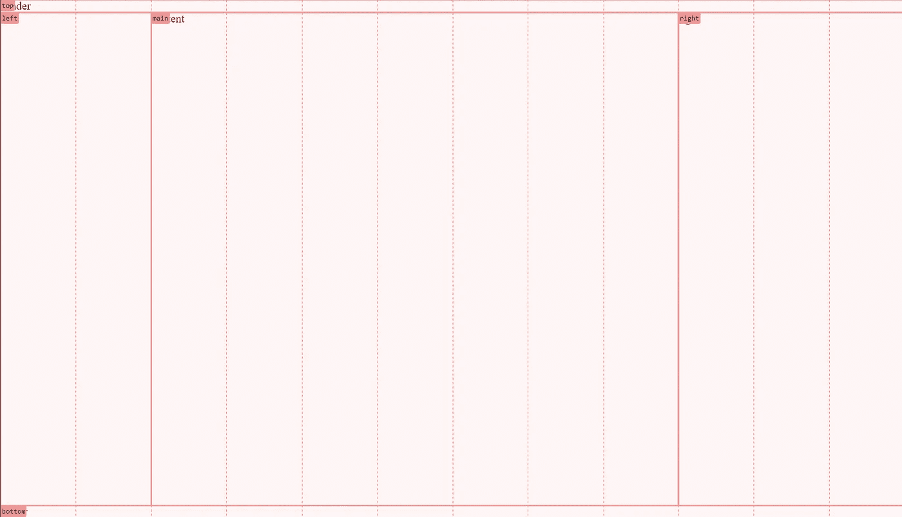
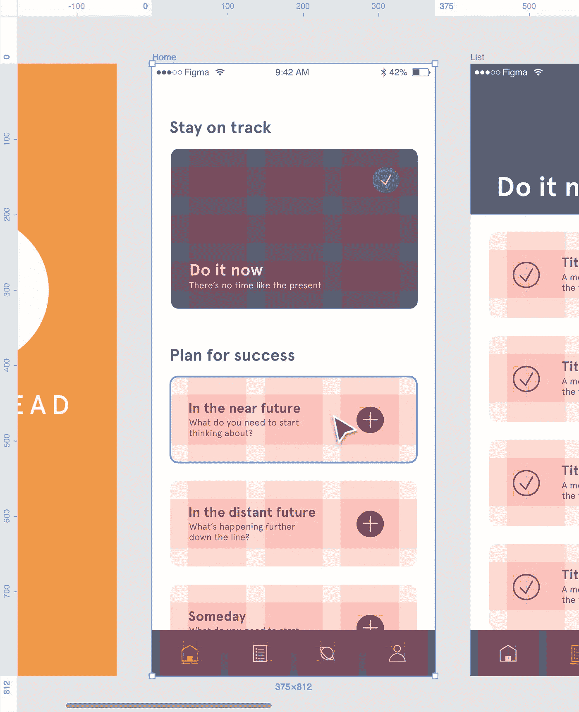
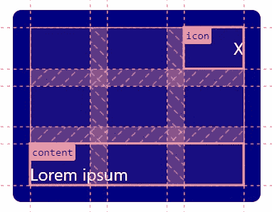

# CSS 网格布局

> 原文：<https://javascript.plainenglish.io/css-grid-layouts-101933ac9347?source=collection_archive---------1----------------------->

## 释放 CSS 网格布局的力量。


Photo by [Alessandro Rigobello](https://unsplash.com/@sndrgb?utm_source=medium&utm_medium=referral) on [Unsplash](https://unsplash.com?utm_source=medium&utm_medium=referral)

我经常看到开发人员纠结于 CSS 的布局部分。主要原因是他们不知道如何创建布局，因为他们没有接受过正式的 CSS 培训。他们大多依赖于过时的 CSS 教程，这些教程使用了 flexboxes 或者怪异过时的东西。我并不是说 flexboxes 不利于布局，它们有自己的用例，但是网格通常是完成工作的更好的工具。在本文中，我将举例说明我何时以及为什么使用网格而不是 flex 或其他替代技术。

## 页面级布局

页面级的布局是一个很好的例子，当网格是解决这个问题的更好的方法时，就使用了 flexboxes。看一下下面的例子:

```
<style>
* {
  margin: 0;
  padding: 0;
}

body {
  min-height: 100vh;
  display: flex;
  flex-direction: column;
}

main {
  flex-grow: 1;
}
</style>

<header>
  header
</header>
<main>
  content
</main>
<footer>
  footer
</footer>
```

它将创建一个全高的页面，在那里身体占据了自由空间(见这个小提琴:[https://jsfiddle.net/udtmavs6/2/](https://jsfiddle.net/udtmavs6/2/))。

这里有一个使用网格的例子。标记保持不变，只是 CSS 不同:

```
<style>
* {
  margin: 0;
  padding: 0;
}

body {
  min-height: 100vh;
  display: grid;
  grid-template-rows: auto 1fr auto;
}
</style>
```

我同意；几乎是一样的，但是网格解决方案要灵活得多。假设您想要一个在页面级别使用 12 个网格布局的 3 列页面。我们是这样做的:

```
<style>
* {
  padding: 0;
  margin: 0;
}

body {
  min-height: 100vh;
  display: grid;
  grid-template-areas:
    "top    top    top    top    top    top    top    top    top    top    top   top"
    "left   left   main   main   main   main   main   main   main   right  right right"
    "bottom bottom bottom bottom bottom bottom bottom bottom bottom bottom bottom bottom";
  grid-template-rows: auto 1fr auto;
  grid-template-columns: repeat(12, 1fr);
}

header {
  grid-area: top;
}

footer {
  grid-area: bottom;
}

div {
  grid-area: left;
}

main {
  grid-area: main;
}

aside {
  grid-area: right;
}
</style>

<header>header</header>
<div>left</div>
<main>content</main>
<aside>right</aside>
<footer>footer</footer>
```

注意:这只是一个例子；您将得到一个更好的标记和类名。

这在 Chrome Devtools 中将是这样的:



The view of a grid in Chrome Devtools

如您所见，我们的页眉和页脚跨越了所有 12 列，左侧、主区域和右侧区域分别跨越了 2、7 和 3 列。诀窍是使用`grid-template-areas`。您可以在那里阅读我是如何定义我的列的。有了这个定义和元素上的网格区域名称，很明显这在调试布局时会很有帮助——尤其是在 Devtools 的帮助下。Flexboxes 无法真正与 CSS 网格的调试能力相抗衡。我喜欢在 flexboxes 上使用网格，特别是对于复杂的布局，我必须在特定的位置放置元素。

此外，除了显式地编写`grid-template-areas`、`grid-templates-rows`和`grid-template-columns`之外，您还可以使用`grid`或`grid-template`速记(注意:到目前为止，repeat 函数在这里不起作用):

```
body {
  grid:
    "top    top    top    top    top    top    top    top    top    top    top   top" auto
    "left   left   main   main   main   main   main   main   main   right  right right" 1fr
    "bottom bottom bottom bottom bottom bottom bottom bottom bottom bottom bottom bottom" auto
    / 1fr 1fr 1fr 1fr 1fr 1fr 1fr 1fr 1fr 1fr 1fr 1fr;
}
```

**但是响应性呢？** 在 flex 布局中，您可能会更改`flex-direction`并结束一天的工作。我们可以对网格布局做类似的事情。

```
@media (max-width: 600px) {
  body {
    grid-template:
      "top    top    top    top    top    top    top    top    top    top    top    top" auto
      "left   left   left   left   left   left   left   left   left   left   left   left" auto
      "main   main   main   main   main   main   main   main   main   main   main   main" 1fr
      "right  right  right  right  right  right  right  right  right  right  right  right" auto
      "bottom bottom bottom bottom bottom bottom bottom bottom bottom bottom bottom bottom" auto;
  }
}
```

我同意这看起来很冗长。但是，如果没有复杂的布局可以受益于详细的网格，可以使用更简单的方法，比如我首先展示的方法。这里有一把小提琴供你演奏:[https://jsfiddle.net/ejmzho47/](https://jsfiddle.net/ejmzho47/)。

## Makro 组件布局

网格布局也有利于组件布局，如媒体卡。看看下面这个使用 flexboxes 的例子(这里有一个小提琴[https://jsfiddle.net/agjvre76/](https://jsfiddle.net/agjvre76/)):

```
<style>
* {
  margin: 0;
  padding: 0;
}

body {
  font-family: system-ui;
}

.card {
  max-width: 600px;
  display: flex;
  margin: 5rem auto;
  box-shadow: 2px 1px 3px #0004, 0 0 2px #0003;
}

.card > .content-container {
  padding: 1rem;
}

.card > .content-container h4 {
  font-size: 1.25rem;
}

.card > .content-container p {
  margin-top: 2px;
}
</style>

<div class="card">
  
  <div class="content-container">
    <h4>Lorem ipsum</h4>
    <p>Lorem ipsum dolor sit amet.</p>
  </div>
</div>
```

下面是使用网格的相同情况(仅 CSS，标记保持不变):

```
* {
  margin: 0;
  padding: 0;
}

body {
  font-family: system-ui;
}

.card {
  max-width: 600px;
  display: grid;
  grid: "card-media card-content" / auto 1fr;
  margin: 5rem auto;
  box-shadow: 2px 1px 3px #0004, 0 0 2px #0003;
}

.card > img {
  grid-area: card-media;
}

.card > .content-container {
  grid-area: card-content;
  padding: 1rem;
}

.card > .content-container h4 {
  font-size: 1.25rem;
}

.card > .content-container p {
  margin-top: 2px;
}
```

这里有一把小提琴:【https://jsfiddle.net/3w0u2cny/】T2。

我相信你已经注意到例子是不同的。例如，flexbox 示例中图像的默认行为是随其内容拉伸，而网格中的图像不会拉伸。我们也可以使用网格来实现这一点，但我想更多地关注总体布局部分——尤其是网格区域。如您所见，我为卡片定义了两个网格区域:“卡片媒体”和“卡片内容”

每当我们想对卡片的布局进行修改时，我们只需修改网格区域的分配，甚至是网格模板。

如果我们想把图像放在右边而不是左边，我们只需修改这行代码:

```
grid: "card-content card-media" / 1fr auto;
```

注意:当事情很重要的时候，不要真的那样做。使用 CSS 改变 DOM 元素的顺序是不好的做法。它可以对你的网站的可访问性做各种“有趣”的事情。这仅仅是一个展示 CSS 网格威力的例子。这里的事情是:有了命名的布局区域，我们就有了一个定义，我们期望我们的布局的特定部分在哪里。
我重复一遍:不要轻易打乱 DOM 元素的顺序。

在处理专业设计时，我们可以添加详细的网格来实现布局。看看 Figma 的这个例子。



Original article: [https://help.figma.com/hc/en-us/articles/360040450513-Create-layout-grids-with-grids-columns-and-rows](https://help.figma.com/hc/en-us/articles/360040450513-Create-layout-grids-with-grids-columns-and-rows)

专业艺术家通常使用网格。现在，我们可以用 CSS 来描述这个布局。标题为“保持正轨”的卡片是最有趣的一张。图标在第一行第三列的末尾对齐。最后一行可能跨越三列。该卡的 CSS 定义如下所示:

```
.figma-card {
  display: grid;
  grid: ". . icon" 1fr ". . ." 1fr "content content content" 1fr / 1fr 1fr 1fr;
  gap: 1rem;
}
```

注意:网格模板区域定义中的点表示该列不应该被占用。

这是结果:



A simple example of Figmas’ grid

正如你所看到的，Chromes 的 Devtools 帮助我们看到我们的网格确实大致遵循了 Figmas 的例子。

小提琴在这里:[https://jsfiddle.net/4p3ujo71/](https://jsfiddle.net/4p3ujo71/)

## 网络布局的未来

另外两个特性将很快出现在网络上，你应该密切关注。子网格和容器查询将极大地丰富我在本文中概述的技术。您可以在此阅读有关容器查询的更多信息:

[](/css-container-queries-3393fbeb6ea8) [## CSS 容器查询

### 什么是容器查询，它们解决了哪些问题？

javascript.plainenglish.io](/css-container-queries-3393fbeb6ea8) 

我迫不及待地想看看网页设计的未来会带来什么！

就这些了，伙计们。感谢您的阅读。

*更多内容请看*[***plain English . io***](https://plainenglish.io/)*。报名参加我们的* [***免费周报***](http://newsletter.plainenglish.io/) *。关注我们上*[***Twitter***](https://twitter.com/inPlainEngHQ)[***LinkedIn***](https://www.linkedin.com/company/inplainenglish/)*[***YouTube***](https://www.youtube.com/channel/UCtipWUghju290NWcn8jhyAw)**和* [***不和***](https://discord.gg/GtDtUAvyhW) *对成长黑客感兴趣？检查* [***电路***](https://circuit.ooo/) ***。*****