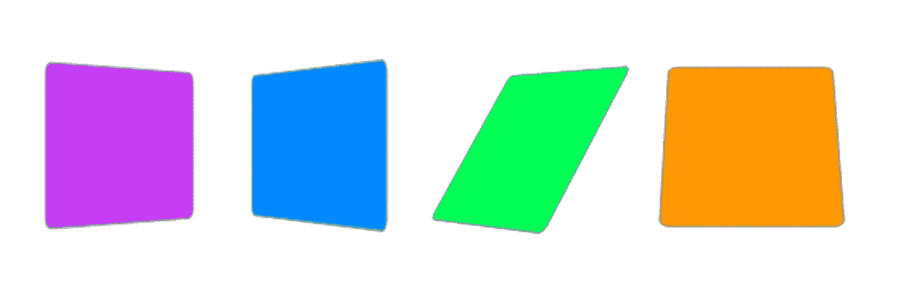

# 转换和过渡的 CSS 指南

> 原文：<https://javascript.plainenglish.io/css-guide-for-transforms-and-transitions-e65924474303?source=collection_archive---------26----------------------->

*这篇文章将深入探讨 CSS 的过渡和转换。当两者被恰当地结合使用时，它们允许我们创建很酷的动画，给我们的站点增加了时尚感，使它更加 UI 友好。*



CSS Transforms

什么是转换和过渡，它们之间有什么区别？基本上，**变换**移动或改变元素的外观，而**过渡**使元素平滑并逐渐将其行为从一种状态改变到另一种状态。

在上面的例子中，我们可以看到`transform`和`transition`之间的视觉差异，在我们回顾了我上一篇[文章](https://medium.com/@turnerran87/css-transitions-animations-358e9e5bea96)中的`transition`和`animation`能力之后，让我们开始探索 CSS 转换。CSS transform 属性允许开发人员旋转、移动、倾斜和缩放元素。这可以在 2D 或 3D 中完成。

就像我们看到的过渡一样，当一个元素改变状态时也会触发转换，比如在`hover`、`active`、`focus`或`target`上。

**让我们开始探索** `**transform**` **属性方法:**

1.  `scale`允许我们增加或减少一个元素的大小。因此，举例来说，如果我们给 scale 一个值`2`，它会将一个元素的大小转换为其原始大小的两倍。另一方面，值`0.5`会将大小转换为原始大小的一半。通过设置宽度(x 轴)或高度(y 轴)的参数，例如`transform: scaleX(2)`或`transform: scaleY(2)`，可以仅在一个轴上缩放元素。`scale()`值实际上是缩放两个轴的简写，因此`transform: scale(2)`将用相同的值 2 缩放两个轴(x 和 y ),但是`transform: scale(2, 4)`将用 2 变换 x，用 4 变换 y。

2.`rotate`允许我们通过设置度数来顺时针或逆时针旋转元素。正值，如`60deg`，将顺时针旋转元素，负值，如`-60deg`，将逆时针旋转元素。

如果我们只想在一个轴上旋转元素呢？嗯，在这种情况下，我们可以使用`rotateX`、`rotateY`和`rotateZ`方法。`rotateX`将元素绕其 X 轴旋转给定角度，`rotateY`将元素绕其 Y 轴旋转给定角度，`rotateZ`将元素绕其 Z 轴旋转给定角度(这实际上与仅使用`rotate` 相同，因为`rotateZ`表示“绕 Z 轴旋转”，Z 轴实际上从我们的屏幕指向外(:

3.`translate`向左、向右、向上或向下移动元素。这种移动基于水平轴(x)和垂直轴(y)的给定参数。正的`x`值将使元素向右移动，而负的`x`值将使元素向左移动。正的`y`值将向下移动元素，而负的`y`值将向上移动元素。

4.`skew`倾斜元素根据给定的 x 轴和 y 轴的值向一个方向或另一个方向倾斜。正的 x 值将使元素向左倾斜，而负的 x 值将使元素向右倾斜。正 y 值将向下倾斜元素，而负 y 值将向上倾斜元素。也可以使用简写来包含 x 轴和 y 轴的值，因此:

```
transform: skewX(45deg);
transform: skewY(60deg);
```

可以像这样写得更短:

```
transform: skew(45deg, 60deg);
```

只是澄清一个关于`skew`的注意事项。这也将影响子元素，这意味着它们也将在元素内部倾斜，因此如果您想要保持子元素的原始角度，您需要为该子元素设置相反的值`skew`。

5.`transform-origin`是一个独立的属性，但与`transform`属性一起使用。默认情况下，它允许您标记变换的原点位置，即元素的中心。因此，举例来说，如果我们将使用`transform: rotate`属性，但决定让它从右下角开始旋转，我们可以使用值`0% 100%`或只写 `right bottom`。如果想让原点从左上角开始，我们可以写`0% 0%`或`left top`。

这是对 transform 属性及其与 transition 属性一起的酷用法的介绍。我希望它对你有所帮助，如果你喜欢它，我将感谢下面的一些掌声(:

您也可以关注我，以获得一些关于 web 开发的未来酷文章。

您也可以关注我以获得更多类似的文章(:

*更多内容请看*[***plain English . io***](https://plainenglish.io/)*。报名参加我们的* [***免费周报***](http://newsletter.plainenglish.io/) *。关注我们关于*[***Twitter***](https://twitter.com/inPlainEngHQ)*和*[***LinkedIn***](https://www.linkedin.com/company/inplainenglish/)*。查看我们的* [***社区不和谐***](https://discord.gg/GtDtUAvyhW) *加入我们的* [***人才集体***](https://inplainenglish.pallet.com/talent/welcome) *。*