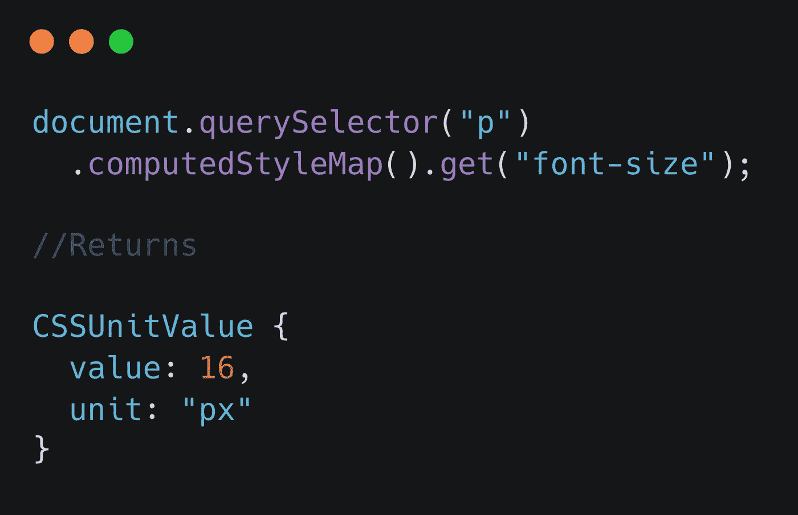

# CSS Houdini，一个为未来设计的 API

> 原文：<https://javascript.plainenglish.io/css-houdini-an-api-designed-for-the-future-402c8a45a921?source=collection_archive---------7----------------------->

## 深入 CSS 胡迪尼的世界。

Photo by [Jackson So](https://unsplash.com/@jacksonsophat?utm_source=medium&utm_medium=referral) on [Unsplash](https://unsplash.com?utm_source=medium&utm_medium=referral)

我们知道 HTML 和 JavaScript 在过去几年是如何发展的。然而，CSS 并没有以同样的方式发展。但谢天谢地，今天，我们有了胡迪尼 API。

让我们开始吧。但是等等。你对名字不感兴趣吗？
胡迪尼这个名字来自美国魔术师哈里·胡迪尼。

# CSS 胡迪尼是什么？

**CSS Houdini** 是一组暴露 CSS 引擎部分的 API。API 促进了 CSS 扩展的开发。您可以使用扩展来添加浏览器中没有的功能，探索新的布局方法，或者添加有创意的边框或其他效果。

# 胡迪尼是做什么的？

Houdini API 使开发人员能够通过挂钩浏览器呈现引擎的样式和布局过程来扩展 CSS 的功能。开发人员可以使用 Houdini 编写浏览器可以解析为 CSS 的代码，从而开发新的 CSS 功能，而无需等待浏览器中的本机实现。CSS_Object_Model(CSSOM)API 由 Houdini 提供，提供对 CSS _ Object _ Model 的直接访问。

# 让我们来看看它的神奇之处。

**自定义 CSS 属性的注册** 注册一个自定义属性可以告诉浏览器自定义属性应该如何表现。它讲述了允许的类型、自定义属性是否继承其值以及自定义属性的默认值。

有两种方法可以注册自定义属性:

1.通过 JS

2.通过 CSS

这允许属性类型检查、默认值以及继承或不继承其值的属性。同样，如果属性无效，它也不会给出无效值，而是会返回到初始值

**CSS 的使用— TOM(类型化对象模型)** [CSS 类型化对象模型 API](https://developer.mozilla.org/en-US/docs/Web/API/CSS_Typed_OM_API) 将 CSS 值公开为类型化 JavaScript 对象，以允许其执行操作。将 [CSS 对象模型](https://developer.mozilla.org/en-US/docs/Web/API/CSS_Object_Model)的值字符串转换成有意义类型的 JavaScript 表示并返回(通过`[HTMLElement.style](https://developer.mozilla.org/en-US/docs/Web/API/HTMLElement/style)`)会导致显著的性能开销。

CSS 类型化 OM 通过提供对象功能(而不是 CSSOM 字符串操作)，提供对 CSS 值的类型、方法和对象模型的访问，使 CSS 操作更具逻辑性和性能。

CSS 画图 API
CSS 画图 API 旨在使开发人员能够用类似画布的自定义画图函数以编程方式定义图像，然后可以在任何可以调用 CSS 图像的地方使用这些函数，如 CSS `[background-image](https://developer.mozilla.org/en-US/docs/Web/CSS/background-image)`、`[border-image](https://developer.mozilla.org/en-US/docs/Web/CSS/border-image-source)`、`[mask-image](https://developer.mozilla.org/en-US/docs/Web/CSS/mask-image)`等。

要以编程方式创建 CSS 样式表使用的图像，我们需要完成几个步骤:

1.  使用`[registerPaint()](https://developer.mozilla.org/en-US/docs/Web/API/PaintWorklet/registerPaint)`功能定义一个绘画小工具
2.  注册工作单
3.  包括`[paint()](https://developer.mozilla.org/en-US/docs/Web/CSS/image/paint())` CSS 函数

你可以参考这个伟大的例子

 [## Glitch:一个友好的社区，每个人都在这里建立网站

### 简单、强大、免费的工具来创建和使用数百万个应用程序。

glitch.com](https://glitch.com/~angled-corners) 

*上面的例子使用了具有不同参数的画图小工具来实现这个结果-*

这些是胡迪尼能提供的一些例子。CSS Houdini 是七个强大 API 的总括 API

CSS Houdini 包括以下 API，按支持顺序排列:

*   [类型化对象模型:](https://developer.mozilla.org/en-US/docs/Web/API/CSS_Typed_OM_API)这允许浏览器理解 CSS 和类型化 Javascript 对象，而不是字符串，这导致了更好的解析和语义操作。
*   [属性和值 API:](https://developer.mozilla.org/en-US/docs/Web/API/CSS_Properties_and_Values_API) 开发者可以通过语法检查、默认值和继承来定义自定义属性。
*   [Paint Worklet:](https://developer.mozilla.org/en-US/docs/Web/API/CSS_Painting_API) 为开发人员提供了定义类似画布的自定义绘画功能的能力，他们可以在 CSS 中直接使用这些功能作为背景、边框、遮罩等等。
*   [动画小工具:](https://developers.google.com/web/updates/2018/10/animation-worklet)这允许动画挂钩到 GPU，这样它们就不会阻塞主线程。动画工作件还支持滚动链接动画。
*   [布局小工具:](https://www.w3.org/TR/css-layout-api-1/)除了用户代理自带的原生算法之外，还为 web 开发者提供了编写布局算法的能力。
*   [字体度量 API:](https://drafts.css-houdini.org/font-metrics-api/) 为文档内和文档外的内容提供基本的字体度量。
*   [解析器 API:](https://github.com/WICG/css-parser-api) 允许开发者访问引擎的解析器(构建在类型化 OM 之上)

## 结论

尽管 Houdini 还处于初始阶段，需要时间来被浏览器采用。值得等待。此外，还有一个 [polyfill](https://github.com/GoogleChromeLabs/css-paint-polyfill) 可用于不受支持的浏览器。你可以找到更多关于 CSS 胡迪尼在

 [## 胡迪尼，怎么做

### CSS Houdini worklets 的社区驱动资源库。了解 CSS Houdini，它的 API，用法，多填充，和…

胡迪尼，怎么做](https://houdini.how/)  [## CSS:层叠样式表| MDN

### CSS Houdini 是一组公开 CSS 引擎部分的 API。这使得开发人员更容易创建…

developer.mozilla.org](https://developer.mozilla.org/en-US/docs/Web/CSS/CSS_Houdini) 

*感谢通读🙌🏼。如果您觉得这篇文章有用，请使用👏按钮，并通过您的圈子分享。*

*更多内容看* [***说白了。报名参加我们的***](https://plainenglish.io/) **[***免费周报***](http://newsletter.plainenglish.io/) *。关注我们*[***Twitter***](https://twitter.com/inPlainEngHQ)*和*[***LinkedIn***](https://www.linkedin.com/company/inplainenglish/)*。加入我们的* [***社区***](https://discord.gg/GtDtUAvyhW) *。***