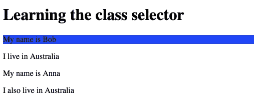

# CSS id 选择器借助代码示例进行说明

> 原文：<https://javascript.plainenglish.io/css-id-selector-explained-with-the-help-of-code-examples-a819e78f480c?source=collection_archive---------15----------------------->

## 知道何时选择 id 选择器


Photo by [Nubelson Fernandes](https://unsplash.com/@nublson?utm_source=medium&utm_medium=referral) on [Unsplash](https://unsplash.com?utm_source=medium&utm_medium=referral)

id 选择器在某些方面类似于类选择器。

我写过关于类选择器的文章。你会详细了解类选择器。

[](/css-class-selectors-explained-with-the-help-of-code-examples-4f653c95265c) [## CSS 类选择器，借助代码示例说明

### 在 5 分钟内增加你对 CSS 类选择器的了解。

javascript.plainenglish.io](/css-class-selectors-explained-with-the-help-of-code-examples-4f653c95265c) 

大多数程序员不把类和 id 选择器当作两件独立的事情。

在某种程度上这是真的。

你不会发现类和 id 选择器有太大的区别。但这两者并不完全相同。下面是 CSS 类选择器和 Id 选择器之间的一些区别。

*   id 选择器前面有一个星号(#)。这个标志也被称为哈希标志，哈希标记，甚至井字游戏板。
*   类选择器前面有一个句点(。).这个符号也称为点符号。
*   类选择器引用类属性的值。id 选择器引用 id 属性的值。

# 如何使用 CSS id 选择器

假设您有以下 HTML 文档:

如果您想要选择并制作具有 Bob id 值的 p 元素的背景色。

您将编写以下内容:

使用上面的样式，结果将如下所示:



Screenshot

使用类和 id 选择器，您可以独立于元素选择类和 id。

如果你知道某个 id 或类会出现在 HTML 文档中。您可以编写样式表，这样您就不需要依赖任何 HTML 元素来选择它。

假设您知道在 HTML 文档中会有一个 id 值“sibling”。

你不知道身份证会出现在哪里。它可以出现在一个段落中，一个有序列表中，甚至是一个标题中。您只知道它存在于 HTML 文档的某个地方。

尽管如此，您仍然可以使用 id 选择器并使用它。

这是你要写的:

```
#sibling{ background-color: Yellow;}
```

# class 和 id 选哪个

大多数程序员都搞不清楚什么时候应该分类，什么时候应该选择 Id。

这是我对这一部分的看法。

具有特定值的类，比如 mycountry，可以应用在 p 元素、header 标记或 span 元素中。它也可以应用于 n 个其他元素。

但有了 ID 就不是这样了。

一个 ID 只能使用一次。如果您将 id“my country”与 p 元素一起使用，则任何其他元素都不能具有 id“my country”。

此外，类选择器可以与其他类值结合使用。另一方面，id 选择器不能与其他 id 组合。

你应该记住 CSS 类选择器和 id 选择器都是区分大小写的。这意味着，如果您已经将 class 和 id 值大写，那么它们应该与文档中的值相匹配。

不然就不行了。

如果您有以下 HTML:

```
<p id = "Bob">My name is Bob</p>
```

如果你写了下面的风格:

```
#bob{background-color: blue;}
```

这是行不通的。

您将无法选择值为 Bob 的 id。因为在样式表中你没有大写字母 b。

# 你想快速进入程序员的职业生涯吗？

加入一群热爱编程和技术的人。

点击这里加入安静的程序员社区。

在我们社区的帮助下，我们将解决程序员生活中的最大问题，并讨论前端和后端工程。

我们将帮助你重新规划你对科技中各种事物的理解。

*更多内容看* [***说白了。报名参加我们的***](https://plainenglish.io/) **[***免费周报***](http://newsletter.plainenglish.io/) *。关注我们关于*[***Twitter***](https://twitter.com/inPlainEngHQ)*和*[***LinkedIn***](https://www.linkedin.com/company/inplainenglish/)*。查看我们的* [***社区不和谐***](https://discord.gg/GtDtUAvyhW) *，加入我们的* [***人才集体***](https://inplainenglish.pallet.com/talent/welcome) *。***