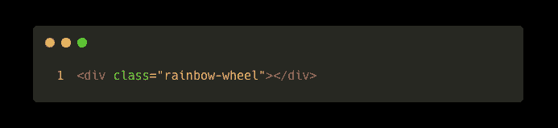

# CSS 加载动画很容易

> 原文：<https://javascript.plainenglish.io/css-loading-animations-are-easy-a0e785e3e9b6?source=collection_archive---------15----------------------->

## 用纯 CSS 创建一个加载动画比你想象的要容易。忘掉 JavaScript、gif 和第三方小部件吧。

当我第一次开始学习网络开发时，我总是使用 GIF 作为我的加载动画。后来，我决定开始使用 JavaScript 来创建非凡的自定义动画。不久之后，我意识到 CSS 对动画有多好。

gif 很棒，但不适合加载动画。gif 需要花费大量的时间来加载，而且它们是图像。我在一家使用 ICEfaces 作为前端的公司工作——这是一个非常过时的 UI 框架。他们使用 gif 来加载动画，它们非常难看。

gif 的另一个替代方法是使用 JavaScript 来操作 DOM 元素。你可以制作很酷的动画。唯一的问题是，高频 DOM 操作会降低页面的响应速度，占用 JavaScript 线程，并使设备过热。有时动画也可能跳过一些帧。

与其讨论使用 JavaScript 创建加载动画，或者讨论其优点和缺点，不如直接讨论如何创建 CSS 加载动画。

为了简洁起见，我将保持简短，只演示两种不同的加载动画:旋转的轮子和渐暗的圆圈。

Different styles of loading animations which we will be creating

在这里参考[我的 GitHub 存储库](https://github.com/TheSoggyWaffle/LoadingAnimations)来获取这些动画也是很有帮助的。不用担心；我保持我的代码非常简单。只有三个文件:`index.html`、`style.css`、[湿漉漉的华夫饼](https://medium.com/@thesoggywaffle)标志。

# 先决条件

在开始创建 CSS 动画之前，您首先需要学习基础知识。你应该知道`keyframes`和`animations`的概念。

# CSS 中的关键帧

任何动画都是由一系列帧组成的。大多数网络浏览器支持每秒 60 帧(FPS)的动画。60 FPS 意味着整个窗口每秒钟被重画 60 次。

您不想为动画的每一秒定义 60 个不同的帧。相反，您只需要描述一个叫做关键帧的东西。

关键帧是动画起点和终点的编程定义。你可以说这个动画应该在动画开始时修改*这个*样式。当动画结束时，应该看起来像*这个*。

在 CSS 中，关键帧动画如下所示:

Example keyframe animation

上面的 CSS 代码定义了一个名为`MyAnimation`的关键帧。它使动画以红色背景开始。动画进行到一半时，颜色应该是绿色。动画结束时，背景颜色变为绿色。

起初，您可能认为这个动画只是从一种颜色跳到另一种颜色，但事实并非如此。请记住，一个关键帧只定义一个起点和一个终点(在这种情况下，还有一个中间点)。浏览器知道哪些颜色位于 RGB 颜色空间中的红色、绿色和紫色色点之间。所以你会看到动画逐渐由红变绿变紫。

写入关键帧的另一种方法是使用`**from**`和`**to**`关键字。`**from**`关键字描述了动画的初始样式；`**to**`关键字描述动画中的最终样式。

Example keyframe animation using the “from” and “to” keywords

注意上面的 CSS 代码看起来不像普通的 CSS。没有选择器。这是因为您的关键帧定义只是定义了一个动画。它不指定在哪个元素上使用它，因此您可以重用关键帧来制作页面许多不同部分的动画。

在下一节中，您将学习如何应用关键帧来制作元素动画。

你可以在 Mozilla 开发者网络上了解更多关于 CSS 中的关键帧的信息。

# CSS 中的动画

现在您已经知道了什么是关键帧，是时候了解动画了。关键帧只是定义在整个动画的不同时间应用于元素的样式。

在一个元素(或几个元素)上定义动画时，至少需要三个 CSS 属性:

*   `**animation-name**` —动画的名字
*   `**animation-duration**` —动画应该运行的时间长度
*   `**animation-iteration-count**` —动画应该执行的次数

使用这三个 CSS 属性，您可以定义元素的动画效果。

让我们看看如何使用常规 CSS 定义动画:

Example animation definition in CSS

就这么简单。如果想让动画永远运行，也可以将`animation-iteration-count`设置为`infinite`。

你可以在 Mozilla 开发者网络上了解更多关于 [CSS 动画的内容。](https://developer.mozilla.org/en-US/docs/Web/CSS/animation)

# 彩虹轮动画

什么是彩虹轮动画？如果你曾经使用过 Mac，你会看到你的鼠标指针在等待什么的时候变成一个圆圈。这个圆圈是彩虹色的，会旋转。看起来是这样的:

Demo of the rainbow wheel animation

这应该是简单的基本样式。首先，创建一个圆:一个简单的宽度和高度相同的`div`。然后你应用一个`100%`的边界半径把正方形变成一个圆。

HTML 看起来像这样:

HTML for the rainbow wheel

基本的 CSS 看起来像这样:

CSS for creating a circular div

上面的代码创建了一个圆；现在，你需要应用造型，使圆圈看起来像彩虹。你可能以前和`linear-gradient`合作过，但是你想用一个`conic-gradient` 和这个合作。

`conic-gradient`将渐变应用于圆形。圆锥形渐变从 0 度开始，随着接近 360 度而改变颜色。

彩虹效果使用以下 CSS 代码:

CSS for setting a conic gradient background

我们没有在最后一种颜色处切断渐变，而是将它重新设置为红色，这样在 0 度和 360 度之间就不会有奇怪的切断。

The reason why we end a conic gradient with the starting color

现在是时候定义关键帧了。这个关键帧应该只是让轮子旋转。所以应该从 0 度转到 360 度。动画重启时会 360 度重启(本质上和 0 度一样)。所以它从停止的地方重新开始。

Keyframe animation for rotating an element 360 degrees per keyframe

现在是时候给彩虹轮添加动画了:

CSS styles for animating the rainbow wheel

上面的代码只是将动画名称设置为`rotate-wheel`关键帧。它还将动画设置为只需 1 秒钟。`animation-iteration-count`被分配给`infinite`。无限迭代意味着动画永远不会终止。

最后一个属性是计时函数。CSS 动画中有几个计时函数。默认计时功能是`ease-in-out`，它在动画开始和结束时减慢速度。我正在使用`linear`计时功能。线性动画使动画在整个动画过程中以相同的速度移动。

# 褪色点动画

Example fading dots loading animation

褪色点动画也很简单。我在这个动画中只使用了五个点，但是你可以使用任何你认为必要的点。

基本 HTML 代码如下所示:

HTML for the fading dots loader

`div.fading-dots`元素只是点的容器。里面是一堆其他的`div`和类名`dot`。每个`div`都将被设计成一个圆形。

CSS style to get the dots to be circular

上面的代码是用于亮和暗模式的通用代码。你应该给你的点添加一种背景色，使它成为你想要的颜色。对于黑暗模式，我将圆点涂成白色，对于明亮模式，我将圆点涂成黑色:

CSS styles for dot colors in light/dark mode

现在只有一个问题。因为这些元素都是 div，所以它们的默认`display`是`block`。因此每个`div`将出现在它自己的行上。我们希望它们出现在同一行。

我喜欢使用 flexbox，所以我将使用 flexbox 方法让每个点都在同一条线上。你可以使用任何你想要的过程，但是 flexboxes 是我的首选。

我们将在整个集装箱上使用 flexbox 样式:

Flex-box styles for the fading dots container

现在是开始写入关键帧的时候了:

Keyframe animation for fading an element in and out

CSS 代码将不透明度从 0(不可见)变为 1，然后又变回 0，以便动画可以重新开始；这创造了一种效果，其中点将淡入淡出。

现在，您可以将动画应用于所有的点:

CSS styles for making the dots fade in and out

当这个样式被应用的时候，所有的点将一起被激活。但这不是你想要的。您希望一个点淡入，然后下一个点淡入，以此类推。然后当最后一个点淡入时，您希望第一个点淡出，以此类推。

CSS 提供了一个`animation-delay`属性，该属性允许动画仅在特定的时间后才开始播放。我们将把`animation-delay`应用到每个点上。每个点都会在前一个点之后半秒钟出现。您可以随意设置延迟时间(延迟时间越短，意味着后续点褪色之间的时间越短)。

CSS code for delaying the animation for each dot incrementally

现在你有了制作加载动画所需要的一切！

如果你想访问我创建的演示页面，请点击这里查看 GitHub 库。

*更多内容看* [***说白了。报名参加我们的***](https://plainenglish.io/) **[***免费周报***](http://newsletter.plainenglish.io/) *。关注我们关于*[***Twitter***](https://twitter.com/inPlainEngHQ)*和*[***LinkedIn***](https://www.linkedin.com/company/inplainenglish/)*。查看我们的* [***社区不和谐***](https://discord.gg/GtDtUAvyhW) *加入我们的* [***人才集体***](https://inplainenglish.pallet.com/talent/welcome) *。***