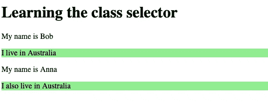
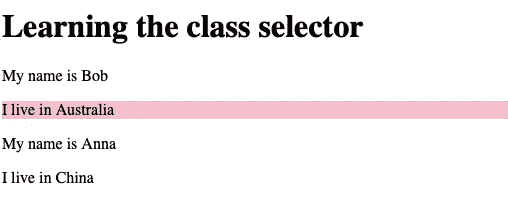

# CSS 多重类选择器，借助代码示例说明

> 原文：<https://javascript.plainenglish.io/css-multiple-class-selector-explained-with-the-help-of-code-examples-ecbd30f7ddf7?source=collection_archive---------5----------------------->

## 详细了解 CSS 多类选择器


Photo by [cottonbro](https://www.pexels.com/photo/woman-using-a-computer-5473298/) from [Pexels](https://www.pexels.com/photo/woman-using-a-computer-5473298/)

在 HTML 文档中，类值可以包含一个单词，也可以包含由空格分隔的多个单词。

使用只有一个单词的类值。您可以使用通用类选择器或特定于元素的类选择器。

我曾经写过如何使用只包含一个单词作为值的类选择器:

[](/css-class-selectors-explained-with-the-help-of-code-examples-4f653c95265c) [## CSS 类选择器，借助代码示例说明

### 在 5 分钟内增加你对 CSS 类选择器的了解。

javascript.plainenglish.io](/css-class-selectors-explained-with-the-help-of-code-examples-4f653c95265c) 

现在让我们来看看如何使用一个类选择器，这个类选择器有多个由空格分隔的单词。

假设您有下面的 HTML 文档。

选择值为“国家”的类别。你可以写下面的 CSS。

在上面的 HTML 中，两个段落元素都有一个包含单词“country”的 class 值。所以两个都选了。

您将获得以下结果:



## 同一类值内的第一个词呢？

除了使用单词“country ”,您还可以选择另一个单词“Bob”或“Anna”来选择段落。

没必要写第二个字来做整个文体。

下面的 CSS 说明了这一点。

第一个语句 p.Bob 将包含句子“我住在澳大利亚”的段落的背景色更改为蓝色。

但是当执行下一个 p.country 语句时，两个 p 元素的背景色都变成了棕色。以前，蓝色的句子“我住在澳大利亚”被替换为棕色。

现在执行下面的语句 p.Anna。执行时，句子“我也住在澳大利亚”的背景色变为红色。

结果是这样的:


Screenshot

## 提到元素的名称并不是强制性的

在上面的 CSS 中，我提到了元素的名称和类值。

如果您想忽略元素名称，它会工作得很好。

但是如果你想选择一个具有特定类值的特定元素。您必须提及元素名称。

下面是没有元素名称的 CSS:

没有观察到结果的变化。

结果如下:


Screenshot

# 链接两个类选择器

如果您为上面的 HTML 文档链接两个类选择器，您将只能选择一个元素。

对于上面的 HTML 文档。

假设您编写了以下 CSS 代码:

使用上面的代码，您将能够选择一个特定的元素。

它将选择类别值为“Bob Country”的段落元素。

您将获得以下结果:



Screenshot

我已经以. country.Bob 的形式编写了 CSS 选择器。

与段落元素相关联的 class 属性的值是“Bob country”。

这意味着单词的顺序并不重要。即使你写的 CSS 是这样的:

```
p.Bob.country{ background-color: pink;
}
```

这种风格会产生同样的结果。

所以当你使用多个类名的时候，你不用担心顺序问题。你可以用任何可能的方法做这件事。

# 总结以上几点

使用与前一个相同的 HTML 文档。

现在我们试着将以上两种 CSS 样式一气呵成。这是 CSS 样式的样子:

```
.country {background-color: lightgreen;}.country.Bob{background-color: pink;}
```

与。国家 CSS 选择器，两个段落在开头都被赋予浅绿色。

然后，. country.Bob 声明将类值为“Bob Country”的段落的背景设置为粉红色。

您将获得以下结果:


Screenshot

# 不属于空格分隔列表的名称

如果 CSS 选择器包含的名称不是空格分隔的 class 属性的一部分，会发生什么？

考虑下面的 HTML 文档:

任何开发人员都会编写以下 CSS:

您会注意到单词 city 不属于任何段落标记的值。

在这种情况下，由于单词不作为任何类属性的值出现，所以它不起作用。另一个单词 Bob 是否是类值的一部分并不重要。

必须完全匹配，否则就不行。

如果单词 city 是 class 属性值的一部分，p 标记的背景就会变成红色。

使用多类选择器时，您应该注意不要使用不属于空格分隔列表的单词。

结果是这样的:


# 你想快速进入程序员的职业生涯吗？

加入一群热爱编程和技术的人。

点击这里加入安静的程序员社区。

在我们社区的帮助下，我们将解决程序员生活中的最大问题，并讨论前端和后端工程。

我们将帮助你重新规划你对科技中各种事物的理解。

*更多内容看* [***说白了。报名参加我们的***](https://plainenglish.io/) **[***免费周报***](http://newsletter.plainenglish.io/) *。关注我们关于*[***Twitter***](https://twitter.com/inPlainEngHQ)*和*[***LinkedIn***](https://www.linkedin.com/company/inplainenglish/)*。查看我们的* [***社区不和谐***](https://discord.gg/GtDtUAvyhW) *，加入我们的* [***人才集体***](https://inplainenglish.pallet.com/talent/welcome) *。***