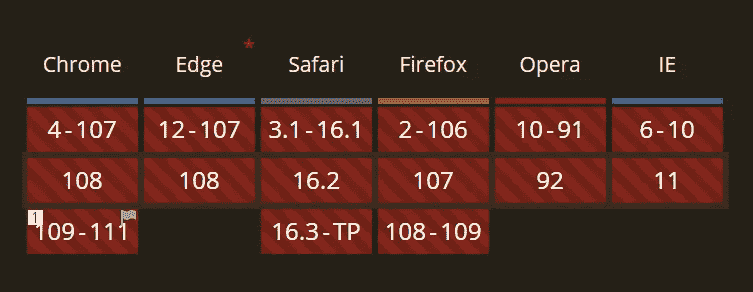
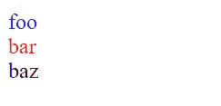

# CSS 嵌套要来 Chrome 了！

> 原文：<https://javascript.plainenglish.io/css-nesting-is-coming-to-chrome-f4b46184c592?source=collection_archive---------2----------------------->

## 完美的圣诞节？一项期待已久的功能即将上线。


Photo by [Harold Wijnholds](https://unsplash.com/fr/@harold?utm_source=medium&utm_medium=referral) on [Unsplash](https://unsplash.com?utm_source=medium&utm_medium=referral)

作为前端开发人员，我们已经等待 CSS 嵌套很久了。当然，预处理器在很久以前就使之成为可能。但是，唉，感觉不对。

当我开始开发网站时，你只需要一个编辑器和一个 HTML 文件。如今，你必须为你的发展建立一个完整的环境。例如，在一个简单的 React 应用程序中，您可能会使用 ESLint、appelliter、TypeScript、React、PostCSS、CSS 模块、Rollup 或 Webpack 之类的捆绑包以及您喜欢的其他 web 助手来配置 VSCode。给 PostCSS 添加额外的插件或者其他工具来预处理你的 CSS 可能不会再让你有任何感觉了——这让我很恼火。

当然，现在时代已经变了，我们已经习惯了设置所有的构建过程。但是，只要能去掉一个构建步骤，我就喜欢，我期待未来能有原生的现代 CSS 和 JavaScript。

## 筑巢不再是一件大事了

正如我在文章标题中所说的:嵌套是一个期待已久的特性。现在，在某些情况下，它可能会变成一种反模式。

随着我们以基于组件的方式开发，我们的风格也变成了模块。在我写的很多应用中，我都有一个 CSS 文件属于一个模板(某个部分 HTML)，这个 CSS 文件就是一个模块。这意味着在构建过程中，我的类获得了一个惟一的名称，因此它们不会与该模块外部声明的任何类名冲突。现在很明显，在这种情况下，嵌套可能不是一个好主意。组织大型模块可能会有所帮助，但话说回来，就架构而言，创建子模块可能是更好的解决方案，但这取决于您正在工作的团队或您的个人偏好。CSS 文件变得比以前更扁平了。

事实上，并不是所有的应用程序都是以这种方式开发的。我知道打开一个随机 WordPress 主题的 CSS 文件的感觉。因此，嵌套仍然是 CSS 的一个很好的补充。前端开发人员应该意识到，仅仅因为这个特性很棒就过度使用它可能不是一个好主意。

对于那些不熟悉 WordPress CSS 样式的人来说，最流行的主题之一(赫斯缇雅)有超过 6000 行的未混合 CSS(https://WP-themes . com/WP-content/themes/hestia/style . min . CSS？ver=3.0.24)。我的一些客户有超过 20，000 行 CSS 的单个文件。


Me when I open a random WordPress theme CSS file.

因此，嵌套是游戏规则的改变者还是仅仅是一个旁注取决于你当前正在编写的应用程序。

## 浏览器什么时候可以使用嵌套？

简而言之:短期内不会。它将从 v109 开始在 Chrome 中提供，并于 2023 年 1 月 10 日登陆 Chrome stable。据我所知，Safari 和 Firefox 并没有就实现这一功能的日期进行沟通。

如果你想玩这个功能，你可以得到谷歌 Chrome 的 v109+,激活“实验网络平台功能标志”Chrome://flags/# enable-Experimental-we b-Platform-Features

为了您的方便，这里是犬舍的网站:【https://caniuse.com/css-nesting



At the time of writing (12/2022), browser support for CSS nesting looks bleak.

## 原生 CSS 嵌套会是什么样子？

如果您已经在 SCSS 或 PostCSS 中使用了嵌套，那么您不需要学习任何新东西。最简单的形式是，CSS 中的嵌套如下所示:

```
<style>
.foo {
  color: blue;
  & > .bar { color: red; }
}
</style>

<div class="foo">
  foo
  <div class="bar">
    bar
  </div>
</div>
baz
```

为了方便起见，这里有一把小提琴:【https://jsfiddle.net/72ptgq4j/】T4

如果 CSS 嵌套在您的浏览器中可用，它应该如下所示:



HTML Result with CSS Nesting

## 新的@nest 规则

根据 CSS 规范，`@nest`规则应该用于更复杂的情况。例如，当嵌套类不是第一个简单选择器时:

```
.foo {
  color: red;
  @nest .parent & {
    color: blue;
  }
}
```

目前，Chrome 实现似乎缺乏对`@nest`规则的支持。新 At-Rule 的 WPT 测试也缺少测试用例(参见:[https://wpt.fyi/results/css/css-nesting?label=experimental&标签=主&对齐](https://wpt.fyi/results/css/css-nesting?label=experimental&label=master&aligned))。

至少对我来说，这在 Chrome 里行不通。你可以在这里找到这个例子的官方规格:[https://www.w3.org/TR/css-nesting-1/#at-nest](https://www.w3.org/TR/css-nesting-1/#at-nest)

如果对你有用，请随时在评论中更新我们的信息。

就这些了，伙计们！感谢您的阅读。

*更多内容请看*[***plain English . io***](https://plainenglish.io/)*。报名参加我们的* [***免费周报***](http://newsletter.plainenglish.io/) *。关注我们关于*[***Twitter***](https://twitter.com/inPlainEngHQ)[***LinkedIn***](https://www.linkedin.com/company/inplainenglish/)*[***YouTube***](https://www.youtube.com/channel/UCtipWUghju290NWcn8jhyAw)*[***不和***](https://discord.gg/GtDtUAvyhW) ***。*****

*****对缩放您的软件启动感兴趣*** *？检查* [***电路***](https://circuit.ooo?utm=publication-post-cta) *。***