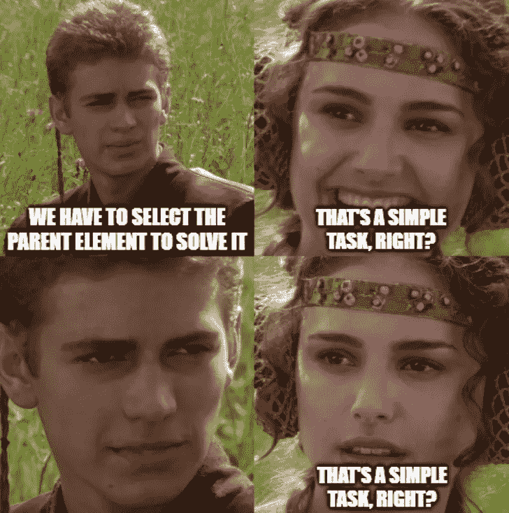

# CSS 家长选择器即将登陆！

> 原文：<https://javascript.plainenglish.io/css-parent-selector-is-about-to-land-9d9da95ca149?source=collection_archive---------3----------------------->

## 这个新的选择器将会改变你的 CSS 设计。


Photo by [Fauzan Saari](https://unsplash.com/@fznsr_?utm_source=medium&utm_medium=referral) on [Unsplash](https://unsplash.com?utm_source=medium&utm_medium=referral)

各位前端发烧友，你们好。喝杯茶或咖啡，让我们谈谈我们偶尔都会经历的一个巨大的痛点。

## 斗争:使用 CSS 选择一个父元素

我最近又遇到了这个问题。我们的一个用户界面设计师找到我说:

“我希望当这个输入字段被聚焦时，我们从父容器中移除悬停效果。应该是简单的修复，对吗？”



The team members depicted in this picture are purely fictional. The conversation is realistic, though.

天啊，又来了。

“我不确定这个任务是否值得。我们必须用 JavaScript 来解决这个问题。”

接下来的对话我就不跟你说了。如果你在整个职业生涯中都是一个独立开发者，你可能会更自在地告诉自己:“我不明白。这应该是个简单的任务。”

它*应该，*却不是。然而，就要改变了，朋友们。

## 圣杯:伪类:有()

使用即将推出的伪类:has()，您将能够对特定子元素的父元素进行样式化。

因此，如果父类有一个包含子类的子元素，这实际上会向父类添加一个样式:

```
.parent:has(.child) { }
```

看哪，

对你没用？这是因为，不幸的是，该功能尚未在 Chrome 中登陆。然而，如果你使用的是 Safari，那么它应该已经可以工作了。

它将很快登陆 Chrome。在此之前，您可以启用它供自己使用。

为了方便起见，这里有一个 has 伪类的 caniuse 页面的链接:

【https://caniuse.com/?search=%3Ahas 

## 在 Chrome 新功能正式登陆之前启用它们

要启用 has 伪类(和其他东西),请打开 Chrome flags 页面，搜索“实验性 Web 平台功能”,或者单击以下链接:

chrome://flags/#启用-实验-网络-平台-功能

就这些了，伙计们！

感谢您的阅读。如果你想跟上前端开发，一定要留下关注。

*更多内容请看*[***plain English . io***](https://plainenglish.io/)*。报名参加我们的* [***免费周报***](http://newsletter.plainenglish.io/) *。关注我们关于*[***Twitter***](https://twitter.com/inPlainEngHQ)**和*[***LinkedIn***](https://www.linkedin.com/company/inplainenglish/)*。查看我们的* [***社区不和谐***](https://discord.gg/GtDtUAvyhW) *加入我们的* [***人才集体***](https://inplainenglish.pallet.com/talent/welcome) *。**