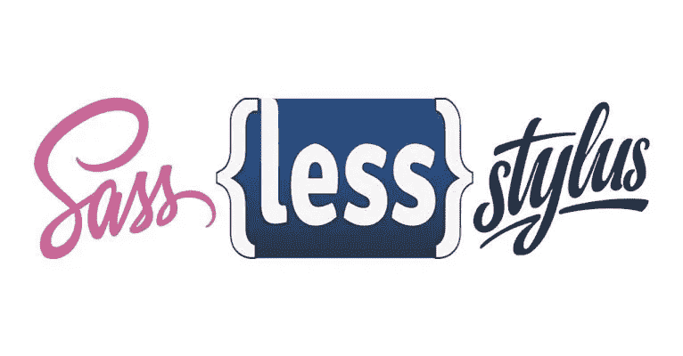
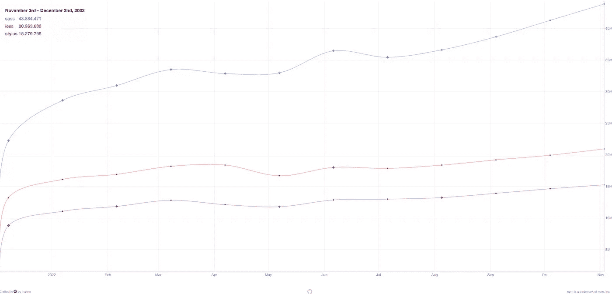

# CSS 预处理程序:包含示例的综合指南

> 原文：<https://javascript.plainenglish.io/css-preprocessors-a-comprehensive-guide-with-examples-16d1f9b93bf4?source=collection_archive---------16----------------------->



在前端开发人员的世界里，我们经常使用 CSS 预处理程序，比如 Sass、Less 或 Stylus。这是我们的日常工作，所以理解这个主题是最基本的。也许你已经学习了所有关于 CSS 的知识，并且想要更深入地了解预处理程序，或者也许你正在开发一个新的项目，并且试图弄清楚什么工具可能最适合它，以及你是否应该使用预处理程序或者仅仅是普通的 CSS。因此，不管你是初级开发人员还是有丰富经验的高级开发人员，这个完整的指南可能会帮助你更好地了解 CSS 预处理程序，它们是什么，它们是如何工作的，我们现在最流行的有详细的解释，当然使用它们有意义吗？

# 什么是 CSS 预处理程序？

根据 [MDN web documents](https://developer.mozilla.org/en-US/docs/Glossary/CSS_preprocessor) ，“*CSS 预处理器是一个让你从预处理器自己独特的语法生成 CSS 的程序。*”。现在，你可能会问，我们为什么要这么做？因为 CSS 预处理程序扩展了 CSS 的功能，它们允许我们在 CSS 代码中使用逻辑，比如变量、混合、函数等等。

如果我们使用普通的 CSS，我们可能会得到冗长、复杂、难以维护的样式表，所以这就是 CSS 预处理程序出现的原因。每个 CSS 预处理器都有自己的语法，它们编译成浏览器可以在客户端呈现的常规 CSS。

# CSS 预处理功能

所有 CSS 预处理程序都有相似的特性和功能。因此，让我们通过示例来看看他们带来了什么。

## 嵌套

这是一个非常简单的特性，它在增加可读性和减少冗余代码方面有很大的不同。这是像 HTML 一样嵌套选择器的可能性。所以让我们来看一个不太典型的例子:

```
a {
  color: blue;
  &:hover {
    color: green;
  }
}
```

上面的代码将在普通的 CSS 中转换成如下内容:

```
a {
  color: blue;
}

a:hover {
  color: green;
}
```

## 变量

这是 CSS 预处理程序被开发人员如此广泛采用的主要原因之一，像常规编程语言一样向样式表添加变量的可能性使代码更易于重用和维护。

让我们来看一个该功能的手写笔示例:

```
main-color = #006
color: main-color
```

## 混合蛋白

允许开发人员封装多组样式，然后在代码中的任何地方应用这些样式。

```
@mixin main-container {
  display: flex;
  justify-content: space-between;
  align-items: center;
  background: #000;
  color: #fff;
}

.card {
  @include main-container;
}

.modal {
  @include main-container;
}
```

语法可能因预处理程序而异，但主要思想在上面的代码中有所解释。mixin 定义及其样式和应用 mixin 样式的两个不同的选择器。这个特性防止了代码重复，并使代码更容易维护，因为你只需要做一次修改，它将应用于所有使用 mixin 的选择器。

## 条件样式

允许我们根据具体情况应用一些样式。根据 CSS 预处理器的不同，我们可能会有`if/else`、`if/else if/else`、`unless`语句，例如:

```
@if width(body) > 500px {
  margin-top: 100px;
} else {
  margin-top: 10px;
}
```

## 环

这是另一个有用的特性，是常规编程语言中的基本特性，由于 CSS 预处理程序，它也可以在我们的样式表中使用。它们使得应用样式或评估列表元素的代码变得更加容易，这对于重复的样式尤其有用，因为它们之间几乎没有变化。让我们来看看下面的 Sass 示例:

```
$sizes: 40px, 50px, 80px;

@each $size in $sizes {
  .icon-#{$size} {
    font-size: $size;
    height: $size;
    width: $size;
  }
}
```

在上面的代码中，我们使用了`@each`规则来遍历$ sizes 和相应的样式。因此，输出如下所示:

```
.icon-40px {
  font-size: 40px;
  height: 40px;
  width: 40px;
}

.icon-50px {
  font-size: 50px;
  height: 50px;
  width: 50px;
}

.icon-80px {
  font-size: 80px;
  height: 80px;
  width: 80px;
}
```

根据我们使用的 CSS 预处理器，对于像`@each`、`@for`和`@while`这样的循环会有不同的选项。

## **继承**

我们都有这样的情况，我们有两个或更多的选择器，它们的风格几乎相同，只是在一些小细节上有所不同。对于这些情况，CSS 预处理程序以`@extend`指令的形式带来继承。它允许一个选择器继承另一个选择器的规则集。让我们来看一个手写笔的例子:

```
.message {
  padding: 10px;
  border: 1px solid #eee;
}

.warning {
  @extend .message;
  color: #E2E21E;
}
```

在上面的例子中，选择器`.warning`将从选择器`.message`继承`padding`和`border`，并将添加自己的`color`。

## 更多…

除了我们刚刚分析的功能之外，还有更多功能，CSS 预处理程序也有一套完整的内置函数，您可以创建自定义函数，它们也有一个很大的操作符列表，以及其他有趣的东西，所有这些都构成了一个强大的样式表。

# 使用 CSS 预处理程序的优点

既然我们已经讨论了 CSS 预处理程序带来的特性，我认为使用它们的好处可能是显而易见的，但是让我们做一个列表来总结它们。

1.  **更容易维护:**如果你创建了混合、变量和函数，以后当你想做一个改变时，你只需要在一个地方进行更新，在声明部分，预处理器会自动改变那个元素的所有实例。
2.  **避免重复:**不要重复自己**。(** DRY)，是编程的主要原则之一，由于 CSS 预处理程序，我们可以将它应用到我们的样式表中，因为它们使重用样式变得容易，所以你不必一遍又一遍地编写相同的代码。
3.  更有组织性的代码: CSS 预处理程序允许你对代码进行分组，考虑到它也是干代码，它肯定会比普通的 CSS 更有组织性。

# 使用 CSS 预处理程序的缺点

1.  **调试:**在几个地方重用代码的问题是，可能更难找到给定问题的根源。
2.  **编译时间:**CSS 预处理程序将它们的语法编译成常规的 CSS，这是一个额外的步骤，可能需要一些时间。
3.  **大型 CSS 文件。**生成的 CSS 文件可能非常大，这可能会导致请求需要额外的时间才能完成。
4.  **学习曲线**:由于每个 CSS 预处理程序都有自己的语法，并且它们带来了常规 CSS 中不存在的新特性，开发人员在使用它之前可能需要一些时间来学习。

# 流行的 CSS 预处理程序

让我们更深入地研究最流行的 CSS 预处理器，但首先，让我们看看下面的图形，它是我们将在一点讨论的三个 CSS 预处理器的 npm 包的下载趋势比较。



[npmcharts.com](https://npmcharts.com/compare/sass,less,stylus?interval=30)

## [萨斯](https://sass-lang.com/)

正如我们在前面的图表中看到的，Sass 是下载最多的 CSS 预处理器，根据 [Slant rating](https://www.slant.co/topics/217/~best-css-preprocessors-postprocessors#6) 是最好的一个，我不会完全支持这种说法，但我可以肯定地说，它是成熟的，稳定的，它有很多功能，这并不奇怪，因为它是市场上最老的一个，超过 15 年。

Sass 代表语法上令人敬畏的样式表，有大量的特性，有一个大的社区，在 MIT 许可下可用，并且是开源的。围绕 Sass 也有一些有用的框架，比如 Compass 和 Bourbon。

**使用 Sass 的顶级公司:**

*   爱彼迎（美国短租平台）
*   堆叠共享
*   格洛沃
*   特里瓦格

## [少了](https://lesscss.org/#)

Less 是精简样式表的缩写。它于 2009 年发布，正如他们在官方文档中所说，它最初是受 Sass 的启发，语法与 CSS 非常匹配，而 Sass 当时没有 CSS。后来，萨斯受到 Less 的启发，创建了具有类似 CSS 语法的 SCSS。

因为它类似于 CSS 语法，所以 Less 有一个平滑的学习曲线。关于功能，Less 拥有与 Sass 相同的大部分特性。它是用 JavaScript 编写的，我们可以使用 Node.js 进行预编译，但它也可以在客户端使用，尽管这样做会影响性能。

**使用此功能的顶级公司:**

*   埃森哲
*   订阅模式
*   奥多奥
*   转移方式

## 唱针

Stylus 于 2010 年推出，正如我们在上面的图表中看到的那样，它的用户群比 Sass 小，但它仍然是一个非常重要的竞争者。Stylus 结合了 Sass 强大的逻辑能力和 LESS 简单的设置。

Stylus 是用 Node.js 构建的，它的语法非常灵活，这使得它在整个社区中非常受欢迎，例如，冒号、分号和逗号都是可选的，您不需要花括号来创建代码块，因为 Stylus 使用缩进而不是符号来创建代码块。

**使用此功能的顶级公司:**

*   不调和
*   Coursera
*   超发育
*   ReadMe.io

# 最后的想法

CSS 预处理程序对于软件开发来说是一个非常有用的工具，它们带来了强大的功能，否则我们就不能在我们的样式表中使用，但是当然，任何东西都有它的优点和缺点，所以我们必须考虑我们的项目中是否需要它们，在我看来，当我们有大量的样式时，它们是一个必须的，特别是如果我们在一个团队中工作，因为它肯定会使我们的 CSS 代码更干净，对每个人来说更可读。

关于用哪一个，我觉得要看具体情况，看问题项目的要求，当然也要看开发者的个人喜好，大家怎么看？

*报名参加我们的* [***免费周报***](http://newsletter.plainenglish.io/) *。关注我们关于*[***Twitter***](https://twitter.com/inPlainEngHQ)，[***LinkedIn***](https://www.linkedin.com/company/inplainenglish/)*，*[***YouTube***](https://www.youtube.com/channel/UCtipWUghju290NWcn8jhyAw)*，以及* [***不和***](https://discord.gg/GtDtUAvyhW) ***。***

***有兴趣缩放你的软件启动*** *？检查* [***电路***](https://circuit.ooo?utm=publication-post-cta) *。*