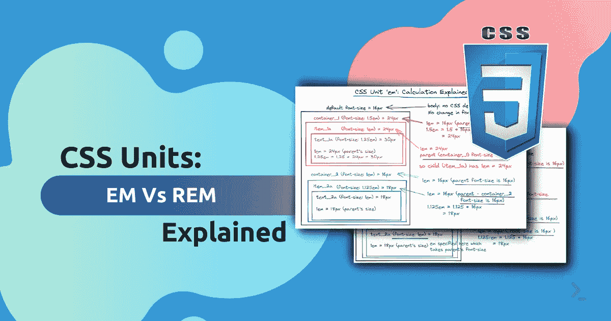
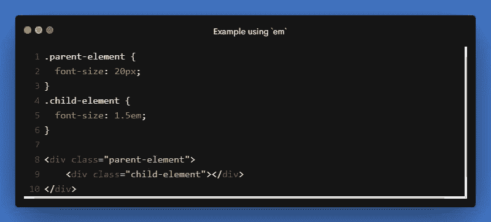
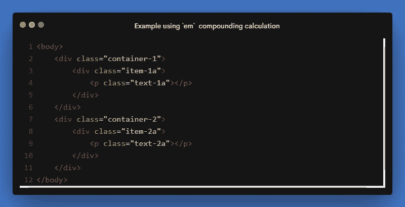
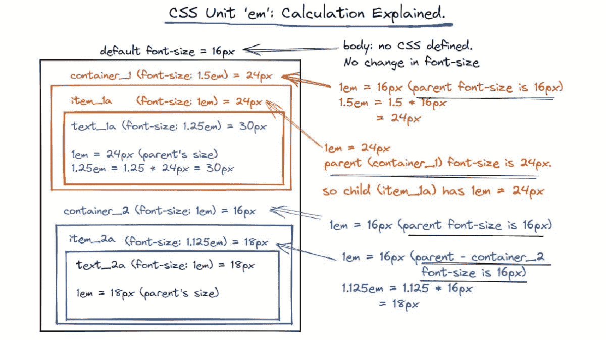
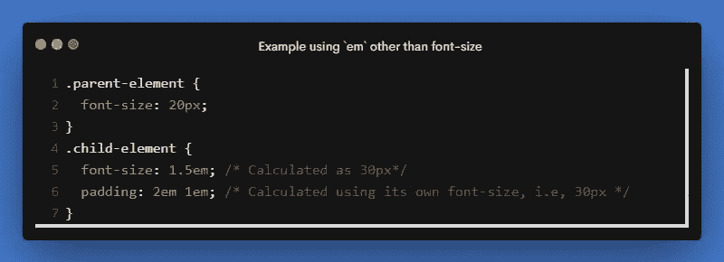
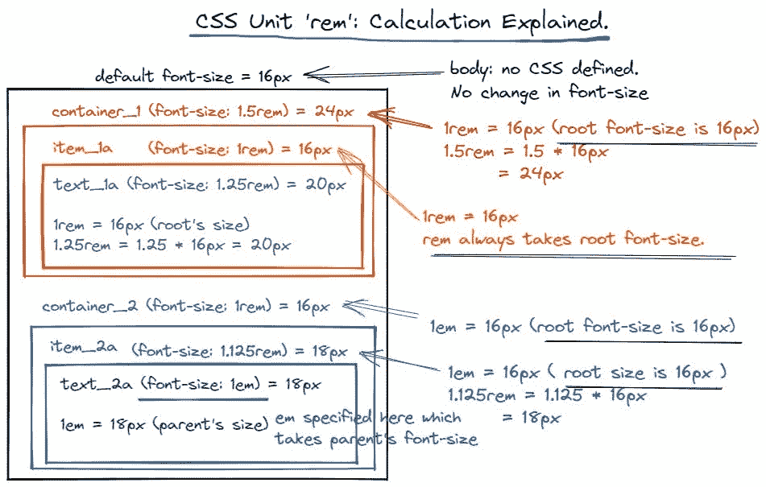

# CSS 单位解释:EM 与 REM

> 原文：<https://javascript.plainenglish.io/css-units-explained-em-vs-rem-f9a42a07beda?source=collection_archive---------14----------------------->

## CSS 单元“em”和“rem”之间有什么区别，它们如何满足我们的设计需求？

## 随着响应式设计无处不在，我们很多人在设计中使用 CSS 单位“em”和“rem”。你有没有想过它们有什么不同，适合我们的设计需求？

## 目录

*   [了解 CSS 单位 em](https://theintrovertcoder.hashnode.dev/#heading-understanding-css-unit-em)
*   [了解 CSS 单元 rem](https://theintrovertcoder.hashnode.dev/#heading-understanding-css-unit-rem)
*   [结论:EM 还是 REM？](https://theintrovertcoder.hashnode.dev/#heading-conclusion-em-or-rem)

在 CSS 中，数值`[<length>](https://developer.mozilla.org/en-US/docs/Web/CSS/length)`代表元素的大小。💻💻

这个 CSS 数据类型`<length>`表示距离值。许多 CSS 属性，如宽度、高度、边距、填充、边框宽度、字体大小、文本阴影、框阴影等。，用途`<length>`

CSS 给了我们不同的单位来表达`<length>`。

它们分为两类:*绝对单位* & *相对单位*。

**绝对单位**是物理测量值，并且总是相同的大小。例子有`px`、`pt`等。

**相对单元**是动态的，依赖于其他(主要是父)元素`<length>`。例如`em`、`rem`、`vh`、`vw`等。由于响应式设计无处不在，它们被用来创建完美的可扩展布局。

我们很多人已经在设计中使用了`em`和`rem`。你有没有想过它们有什么不同，是否符合我们的设计需求？🤔🤔

在这篇博文中，我们将研究`em`和`rem`之间的差异，并探索它们如何影响我们的设计。

## 了解 CSS 单元`em`

单位`em`总是相对于父元素的字体大小。

让我们举一个例子👇🏻👇🏻

在上例中，`.child-element`的`font-size`是`30px`

对于`.child-element`，字体大小是根据其父字体计算的，即`.parent-element`字体大小🤔🤔

**子元素字号计算:**

父元素 font-size = 20px

因此在子元素中，

1em = 20px

1.5em = 20 * 1.5 = 30px

因此，子元素的字体大小是`30px`。

如果没有指定父元素的字体大小，它将在 DOM 树中被查找到更高的位置。如果在根元素`<html>`之前没有指定字体大小，则使用浏览器默认的`16px`。

因此，`em`正在从一个级别复合到另一个级别。

让我们快速看一下下一个例子。

👇🏻👇🏻对于上面的 HTML，这里有一张从 DOM 向下计算的`em`的图片。

关于`em`还有一个有趣的事实是，当用于`font-size`以外的属性时，比如`padding`、`margin`等。，它是相对于元素本身的字体大小。

在上面的例子中，`padding`是根据它自己的`font-size: 30px`计算的。

因此，顶部和底部填充将为`60px` (2em * 30px)，而右侧和左侧填充将为`30px` (1em = 30px)。

一个关于`em`如何工作的活生生的例子。🎯🎯

`em`的这种复合性质会在我们的设计中导致意想不到的后果。`rem`解决了这个问题。

## 了解 CSS 单元`rem`

为了解决`em`的复合问题，引入了`rem`单元。`rem`代表*根元素的 em* 。

`rem`总是引用根元素(在我们的例子中，是 HTML 元素)的字体大小，不管它应用在哪里。它在整个文档和所有属性中保持一致。

下面是在与`em`相同的例子中，如何在 DOM 中计算`rem`。👇🏻👇🏻

使用`rem`单元可以避免`em`单元的复合效应。

对于`rem`，它总是基于根元素的字体大小，所以没有什么惊喜。

此外，还有其他值，如边距、填充等。，`rem`始终基于根元素的`font-size`。

`rem`的实例🎯🎯

## 结论:EM 还是 REM？

选择`em`还是`rem`总是取决于个人喜好。他们之间没有更好的选择。

如果你想要一个没有惊喜的一致设计，使用`rem`。如果你想实现一些受父元素影响的东西，那么就用`em`。但是在使用`em`时，应该对不同的设备和方向进行广泛的测试。

我个人的偏好是'`rem'`多于'`em'`。

最后，这里稍微对比一下`em`和`rem`。👇🏻

如果我错过了什么，请在评论中告诉我。

*更多内容看* [***说白了就是***](https://plainenglish.io/) *。报名参加我们的* [***免费周报***](http://newsletter.plainenglish.io/) *。关注我们* [***推特***](https://twitter.com/inPlainEngHQ) *和*[***LinkedIn***](https://www.linkedin.com/company/inplainenglish/)*。加入我们的* [***社区不和谐***](https://discord.gg/GtDtUAvyhW) *。*