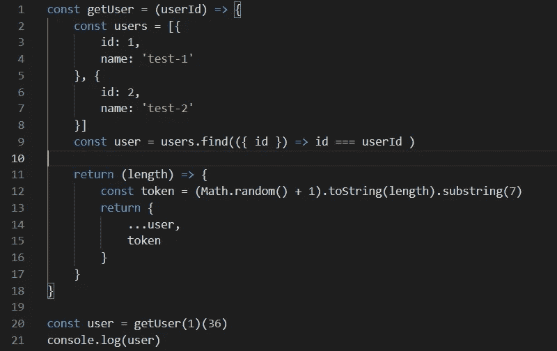
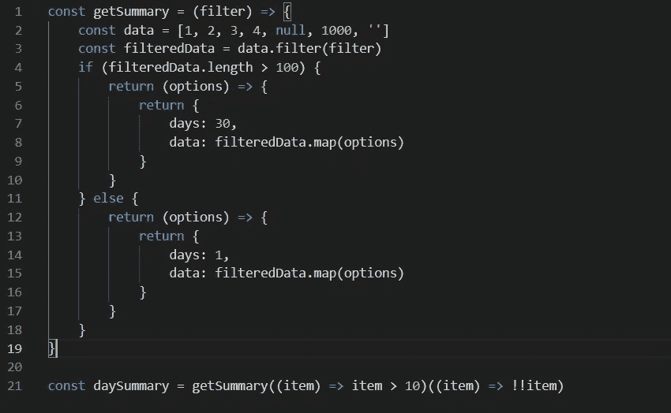

# JavaScript 中的 Currying 介绍

> 原文：<https://javascript.plainenglish.io/currying-in-javascript-15802dcde87c?source=collection_archive---------4----------------------->

## 如何在应用程序中利用 currying 技术。


Photo by [Pankaj Patel](https://unsplash.com/@pankajpatel?utm_source=medium&utm_medium=referral) on [Unsplash](https://unsplash.com?utm_source=medium&utm_medium=referral)

# JavaScript 简介中的 Currying

就像任何其他编程语言一样，JavaScript 也支持 currying 技术。今天我们将讨论如何在应用中利用它。

## 定义

Currying 是一种可以让你将任何方法转换成可调用的参数方法的技术，我的意思是在下面的例子中:

```
// a regular function
const user = getUser(id, token)// a curried version of same method
const user = getUser(id)(token)
```

在使用 currying 时，你可以在一个函数中重用参数的一部分，这就是 currying 在开发者中流行的原因

有时候，你可能更喜欢常规的实现而不是奉承，这完全没问题。这很大程度上取决于你想如何为你的方法创建一个途径

Currying 并没有给你的方法一个新的属性，只是改变了你的函数被调用的方式。

## 一般的例子

理论够了。让我们创建一个小例子，在这个例子中，您将理解如何创建一个具有良好用例的 curried 方法



example of currying

这里，你会看到在调用`getUser`方法时，我们使用了 2 个可调用实例，因为我们从`getUser`传递了一个新方法

## 让我们再举一个例子



example number 2

这里，我们采用不同类型的回调，并像前面的例子一样传递参数，但带有附加条件

## 结论

还有更多阿谀奉承的例子和用例，我在这里找到了非常酷的文章，其中包含了更多好的例子

就是这样。这是一篇适合快速学习者的小文章，我发现分享这个话题很有趣。

希望你有时会用到它，并能得到大部分。谢了。

*更多内容看* [***说白了就是***](http://plainenglish.io/) *。报名参加我们的* [***免费周报***](http://newsletter.plainenglish.io/) *。在我们的* [***社区获得独家访问写作机会和建议***](https://discord.gg/GtDtUAvyhW) *。*