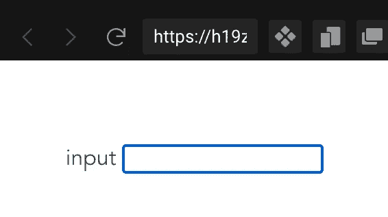
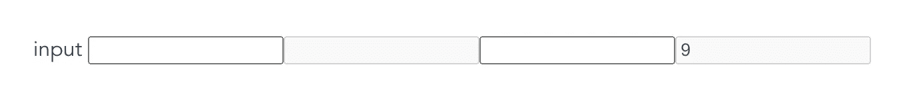

# Vue 3 中的自定义指令

> 原文：<https://javascript.plainenglish.io/custom-directives-in-vue-3-8ca51e7ba9d7?source=collection_archive---------4----------------------->

## 自定义 Vue.js 指令世界简介


Photo by [Chris Ried](https://unsplash.com/@cdr6934?utm_source=medium&utm_medium=referral) on [Unsplash](https://unsplash.com?utm_source=medium&utm_medium=referral)

与 React 相比，我真正喜欢 Vue.js 的一个不同之处是能够创建自己的自定义指令。另外，我能够在应用程序级别或组件范围内注册它们。

**注:如果你对 Vue.js 生命周期挂钩有基本的了解就好了*

**这些指令是什么？**
简单来说，它们是 Vue.js 提供的自定义标记，在附加到 DOM 元素时以某种方式做事情。该标记看起来更像 HMTL 属性，但以“v-”为前缀。
有的是 *v-if，v-else，v-show，v-for，还有* [*更有*](https://vuejs.org/api/built-in-directives.html) *。*

## 创建我们自己的自定义指令

它们是如何工作的？
在定义中，指令就是指令，我们可以使用生命周期挂钩来定义它们。传递给这些挂钩的参数可用于操作元素和添加所需的功能。
我们不能访问所有的挂钩，但是那些覆盖用例的挂钩，如官方[文档](https://vuejs.org/guide/reusability/custom-directives.html#directive-hooks)中所定义的:

```
const myDirective = {
  *// called before bound element's attributes
  // or event listeners are applied*
  created(el, binding, vnode, prevVnode) {
    *// see below for details on arguments*
  },
  *// called right before the element is inserted into the DOM.*
  beforeMount() {},
  *// called when the bound element's parent component*
  *// and all its children are mounted.*
  mounted() {},
  *// called before the parent component is updated*
  beforeUpdate() {},
  *// called after the parent component and*
  *// all of its children have updated*
  updated() {},
  *// called before the parent component is unmounted*
  beforeUnmount() {},
  *// called when the parent component is unmounted*
  unmounted() {}
}
```

我们将使用的主要论据是:

1.  el :添加指令的元素。
2.  **binding** :包含 *value* (赋值给指令)、 *oldValue* (仅在 ***beforeUpdate*** 和 ***Updated*** hook)、 *arg、*或随指令传递的参数(v-dir:arg-name)的对象。还有更多，但我们不会关注他们。请检查[正式文件](https://vuejs.org/guide/reusability/custom-directives.html#hook-arguments)。
3.  **vNode** :代表绑定元素的底层 vNode。
4.  **prevNode** :表示上一次渲染绑定元素的 vNode(仅在 ***更新前*** 和 ***更新后*** 钩子中可用)。

现在我们知道了它们是如何工作的，让我们构建两个来更好地理解它们。
仅供参考，对于组件范围的指令，我们在*脚本设置*和 *SFC* 中创建指令的方式是不同的。

## 垂直聚焦

这是一个基本的指令(组件范围的)，它提供了一个基本的用例，当一个元素挂载到 DOM 时，它关注于这个元素。

```
<template>
 <span> input </span>
 <input v-focus v-model="value" />
</template>
<script >
import { ref } from "vue";export default {
 setup() {
  const value = ref("");
  return { value };
 },
 directives: {
  focus: {
   mounted: (el) => {
   // initiate focus for the element 
   el.focus();
  },
 },
}};
</script><---------setup script--------->
<script setup>
import { ref } from "vue";const value = ref("");
const vFocus = {
  mounted: (el) => el.focus()
}
</script>
<template>
  <input v-focus />
</template>
```



focus on mounted

## **V-禁用**

让我们创建一个稍微复杂一点的例子。指令的预期行为是:

*   首先，应该在全球一级对其进行定义。
*   其次，如果 v-disable 为 true，则元素的 disabled 属性应该设置为 true。
*   第三，根据传递的参数(字符串或数字)执行检查，如果发现条件为真，则禁用该元素。

步骤 1，向应用实例添加指令定义，并添加您认为有帮助的挂钩:

```
const app = createApp(App);**app**.directive("**disable**", {
// to check if v-disabled is set to true from start
mounted(el, bindings){},
// to check argument value
updated(el,bindings)
});
```

现在让我们将定义添加到挂钩中:

```
app.directive("disable", {
 mounted(el, bindings) {
  const { value } = bindings;
  if (value === true) el.disabled = true;
 },
 updated(el, bindings) {
 const { arg } = bindings;
 switch (arg) {
  case "string":
   if (el.value.length > 6) el.disabled = true;
   break;
  case "number":
   if (bindings.value > 6) el.disabled = true;
   break;
  default:
   break;
 }
}});
```

使用模板中的指令:

```
<input v-disable="true" v-model="value" />
<input v-disable:string v-model="value" />
<-- binding the variable to custom directive-->
<input type="number" v-disable:number="num" v-model="num" />
```



output

自定义指令为我们提供了一种新的方式来模块化我们的代码，并在应用程序范围内创建可重用的逻辑，帮助我们减少导入并编写更干净的代码。我希望这能让您更好地理解自定义指令是如何工作的，以及如何在您的工作流程中使用它们。

你可以在这里找到例子[的代码。](https://codesandbox.io/s/vue3-custom-directives-h19zec?file=/src/App.vue:70-222)

*更多内容尽在* [***说白了. io***](https://plainenglish.io/) *。报名参加我们的* [***免费周报***](http://newsletter.plainenglish.io/) *。关注我们关于* [***推特***](https://twitter.com/inPlainEngHQ) *和*[***LinkedIn***](https://www.linkedin.com/company/inplainenglish/)*。加入我们的* [***社区***](https://discord.gg/GtDtUAvyhW) *。*